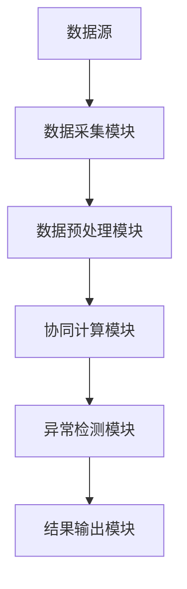

                 


# 多智能体系统在识别市场异常机会中的应用

> 关键词：多智能体系统，市场异常，机会识别，协同算法，分布式计算，异常检测

> 摘要：本文深入探讨了多智能体系统在识别市场异常机会中的应用。通过分析多智能体系统的定义、核心原理、算法实现以及系统架构，结合实际案例，详细阐述了如何利用多智能体系统的优势来识别市场中的异常机会。文章结构清晰，内容详实，适合技术从业者和研究人员参考。

---

# 第一部分：多智能体系统概述

## 第1章：多智能体系统的基本概念

### 1.1 智能体的定义与特点
- **智能体的定义**：智能体是具有感知、决策和行动能力的实体。
- **智能体的特点**：
  - 自主性：能够独立决策。
  - 反应性：能对外界环境变化做出实时反应。
  - 协作性：能够与其他智能体协作完成任务。

### 1.2 多智能体系统的定义与分类
- **多智能体系统的定义**：由多个智能体组成的分布式系统，通过协作完成复杂任务。
- **多智能体系统的分类**：
  - 基于任务的多智能体系统。
  - 基于平台的多智能体系统。
  - 基于网络的多智能体系统。

### 1.3 多智能体系统的应用领域
- **金融领域**：用于市场分析和交易决策。
- **物联网领域**：用于智能设备的协同控制。
- **其他领域**：如自动驾驶、智能城市等。

---

# 第二部分：市场异常机会的识别

## 第2章：市场异常机会的定义与识别

### 2.1 市场异常的定义
- **市场异常**：指市场中出现的非正常波动，可能带来投资机会或风险。

### 2.2 市场异常的类型
- **短期波动**：如突然的价格暴跌或暴涨。
- **长期趋势变化**：如市场结构的转变。
- **突发事件影响**：如自然灾害或政策变化。

### 2.3 市场异常识别的重要性
- **及时发现异常**：有助于投资者快速做出决策。
- **降低风险**：通过提前预警避免重大损失。

---

# 第三部分：多智能体系统在市场异常识别中的应用

## 第3章：多智能体系统的协同机制

### 3.1 协同决策的原理
- **分布式计算**：通过多个智能体协同完成复杂任务。
- **信息共享**：智能体之间共享数据以提高决策准确性。

### 3.2 协同算法的实现
- **基于规则的协同**：通过预定义规则进行决策。
- **基于学习的协同**：通过机器学习模型优化协同策略。

---

## 第4章：多智能体系统的异常检测算法

### 4.1 基于统计的异常检测
- **均值-方差法**：通过计算数据的均值和方差，判断数据点是否异常。

### 4.2 基于机器学习的异常检测
- **孤立森林算法**：用于检测数据中的异常点。
- **深度学习模型**：如LSTM网络，用于时间序列数据的异常检测。

---

## 第5章：多智能体系统的优化与应用

### 5.1 系统优化策略
- **分布式计算优化**：提高系统的计算效率。
- **智能体协作优化**：通过改进协同算法提高检测准确率。

### 5.2 实际案例分析
- **金融市场的异常检测**：通过多智能体系统实时监控市场波动，及时发现异常交易。

---

# 第四部分：系统架构与实现

## 第6章：系统架构设计

### 6.1 系统功能设计
- **数据采集模块**：从多个数据源获取市场数据。
- **协同计算模块**：智能体之间的协同计算和决策。
- **异常检测模块**：基于算法检测市场异常。

### 6.2 系统架构图


---

## 第7章：项目实战与代码实现

### 7.1 环境安装
- **Python环境**：安装Python和相关库（如numpy、pandas、scikit-learn）。

### 7.2 核心代码实现
```python
import numpy as np
from sklearn.ensemble import IsolationForest

# 示例数据
X = np.random.randn(100, 2)
outliers = np.random.randn(20, 2) + 5
X = np.concatenate((X, outliers))

# 异常检测模型
model = IsolationForest(contamination=0.1)
model.fit(X)

# 预测异常点
y_pred = model.predict(X)
print(y_pred)
```

---

## 第8章：系统测试与优化

### 8.1 系统测试
- **单元测试**：测试各个模块的功能是否正常。
- **集成测试**：测试系统整体的协同工作能力。

### 8.2 系统优化
- **算法优化**：改进协同算法，提高检测效率。
- **资源优化**：优化系统的资源分配，提高处理能力。

---

# 第五部分：总结与展望

## 第9章：总结与展望

### 9.1 本章总结
- 本文详细介绍了多智能体系统在识别市场异常机会中的应用，从理论到实践，全面探讨了系统的实现与优化。

### 9.2 未来展望
- **算法优化**：进一步研究更高效的协同算法。
- **应用场景扩展**：将多智能体系统应用于更多领域，如智能交通、医疗健康等。

---

# 作者：AI天才研究院 & 禅与计算机程序设计艺术

---

以上是一个详细的大纲，涵盖了从基本概念到实际应用的各个方面，结合了理论与实践，适合技术从业者和研究人员阅读。

