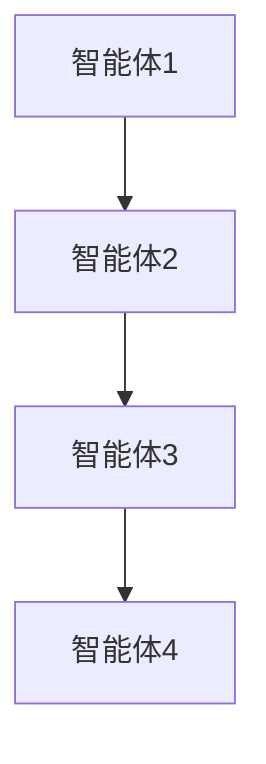

                 


---

# 多智能体系统在识别市场情绪拐点中的应用

> 关键词：多智能体系统、市场情绪、情绪拐点、协同学习、分布式计算

> 摘要：本文探讨了多智能体系统在识别市场情绪拐点中的应用。通过分析多智能体系统的组成、算法原理和系统架构，结合实际案例，展示了多智能体系统如何在金融市场中协同工作，高效识别市场情绪拐点。本文还总结了多智能体系统的优势与挑战，并展望了其未来的发展方向。

---

## 第1章: 多智能体系统与市场情绪拐点概述

### 1.1 多智能体系统的基本概念

#### 1.1.1 多智能体系统的定义
多智能体系统（Multi-Agent System, MAS）是由多个智能体（Agent）组成的分布式系统，这些智能体能够通过通信和协作完成复杂的任务。智能体是具有感知、决策、推理和行动能力的实体，可以是软件程序、机器人或其他智能设备。

#### 1.1.2 多智能体系统的特征
- **自主性**：智能体能够自主决策，无需外部干预。
- **反应性**：智能体能够实时感知环境变化并做出反应。
- **协作性**：多个智能体能够协同工作，完成共同目标。
- **分布性**：智能体之间通过分布式计算进行通信和协作。

#### 1.1.3 多智能体系统与单智能体系统的区别
| 特性                | 多智能体系统                              | 单智能体系统                              |
|---------------------|------------------------------------------|------------------------------------------|
| 系统结构            | 分布式结构，多个智能体协同工作           | 集中式结构，单个智能体完成任务           |
| 资源分配            | 资源分散，每个智能体负责部分任务         | 资源集中，单个智能体负责所有任务         |
| 灵活性              | 系统具有较高的灵活性，适应性强           | 系统灵活性较低，适应性较差               |

### 1.2 市场情绪拐点的定义与重要性

#### 1.2.1 市场情绪的定义
市场情绪是指市场参与者（如投资者、交易员等）对市场走势的心理预期和态度。市场情绪可以通过新闻、社交媒体、交易数据等多种途径进行分析。

#### 1.2.2 市场情绪拐点的定义
市场情绪拐点是指市场情绪从一个阶段转向另一个阶段的关键点。例如，从上涨趋势转向下跌趋势，或从下跌趋势转向上涨趋势。

#### 1.2.3 市场情绪拐点的重要性
- **投资决策**：识别市场情绪拐点可以帮助投资者做出更明智的投资决策。
- **风险管理**：及时识别市场情绪拐点可以有效管理投资风险。
- **市场预测**：市场情绪拐点是预测市场走势的重要参考。

### 1.3 多智能体系统在市场情绪分析中的应用前景

#### 1.3.1 多智能体系统的优势
- **分布式计算能力**：多智能体系统能够同时处理大量数据，提高计算效率。
- **协作能力**：多个智能体可以协同工作，从多个角度分析市场情绪。
- **鲁棒性**：多智能体系统的容错能力强，单个智能体故障不会导致整个系统崩溃。

#### 1.3.2 多智能体系统在金融领域的应用潜力
- **实时数据处理**：多智能体系统可以实时处理金融市场中的大量数据。
- **复杂决策支持**：多智能体系统能够提供复杂的市场分析和决策支持。
- **自适应能力**：多智能体系统能够根据市场变化自适应调整策略。

#### 1.3.3 多智能体系统面临的挑战
- **通信延迟**：智能体之间的通信可能会引入延迟，影响系统的实时性。
- **数据隐私**：多智能体系统需要处理大量的敏感数据，数据隐私问题需要重点关注。
- **系统复杂性**：多智能体系统的复杂性较高，管理和维护较为困难。

---

## 第2章: 多智能体系统的核心原理与算法

### 2.1 多智能体系统的核心原理

#### 2.1.1 多智能体系统的组成与结构


#### 2.1.2 多智能体系统的通信机制
```mermaid
sequenceDiagram
smart1 ->+> smart2: 发送数据
smart2 ->+> smart3: 发送数据
smart3 ->+> smart4: 发送数据
```

#### 2.1.3 多智能体系统的协作机制


### 2.2 多智能体系统的算法原理

#### 2.2.1 分布式计算的基本原理
分布式计算是指将计算任务分配给多个计算节点，通过协作完成任务。多智能体系统的分布式计算能力可以显著提高系统的处理效率。

#### 2.2.2 协同学习的基本原理
协同学习是指多个智能体通过协作共享信息，共同完成学习任务。多智能体系统中的协同学习可以提高系统的整体学习能力。

#### 2.2.3 多智能体系统的优化算法


### 2.3 多智能体系统的数学模型

#### 2.3.1 多智能体系统的概率模型
$$P(x) = \prod_{i=1}^{n} P(x_i)$$

#### 2.3.2 多智能体系统的优化模型
$$\min_{x} f(x) + \sum_{i=1}^{n} g_i(x)$$

#### 2.3.3 多智能体系统的协作模型
$$x_{i+1} = x_i + \alpha (x_j - x_i)$$

---

## 第3章: 多智能体系统在市场情绪分析中的算法实现

### 3.1 市场情绪分析的基本算法

#### 3.1.1 基于文本挖掘的情绪分析
文本挖掘是一种从文本数据中提取有用信息的技术。市场情绪分析可以通过对新闻、社交媒体等文本数据进行挖掘，提取市场参与者的情绪。

#### 3.1.2 基于自然语言处理的情绪分析
自然语言处理（NLP）是一种处理人类语言的技术。通过NLP技术，可以对文本数据进行情感分析，识别市场情绪。

#### 3.1.3 基于深度学习的情绪分析
深度学习是一种机器学习技术，通过训练深度神经网络模型，可以对市场情绪进行分类和预测。

### 3.2 多智能体系统在市场情绪分析中的算法实现

#### 3.2.1 多智能体系统的协同学习算法
协同学习是一种多智能体系统中的学习方法，通过智能体之间的协作，提高系统的整体学习能力。

#### 3.2.2 多智能体系统的分布式计算算法
分布式计算是一种多智能体系统中的计算方法，通过将任务分配给多个智能体，提高系统的计算效率。

#### 3.2.3 多智能体系统的优化算法
优化算法是一种多智能体系统中的优化方法，通过智能体之间的协作，优化系统的整体性能。

---

## 第4章: 多智能体系统在识别市场情绪拐点中的应用

### 4.1 市场情绪拐点识别的算法实现

#### 4.1.1 市场情绪拐点的定义
市场情绪拐点是指市场情绪从一个阶段转向另一个阶段的关键点。

#### 4.1.2 市场情绪拐点的识别方法
市场情绪拐点的识别方法包括基于统计的方法、基于机器学习的方法和基于多智能体系统的方法。

#### 4.1.3 市场情绪拐点的预测方法
市场情绪拐点的预测方法包括时间序列分析、回归分析和基于多智能体系统的预测方法。

### 4.2 多智能体系统在市场情绪拐点识别中的应用

#### 4.2.1 多智能体系统在市场情绪拐点识别中的优势
多智能体系统在市场情绪拐点识别中的优势包括高效率、高准确性和高鲁棒性。

#### 4.2.2 多智能体系统在市场情绪拐点识别中的实现
多智能体系统在市场情绪拐点识别中的实现包括数据采集、数据处理、数据分析和结果输出。

#### 4.2.3 多智能体系统在市场情绪拐点识别中的案例分析
以金融市场为例，通过多智能体系统对市场情绪进行实时监测和分析，识别市场情绪拐点。

---

## 第5章: 多智能体系统在识别市场情绪拐点中的应用总结

### 5.1 本章总结
本文通过分析多智能体系统的核心原理和算法，结合实际案例，展示了多智能体系统在识别市场情绪拐点中的应用。

### 5.2 多智能体系统的优势与挑战
多智能体系统的优势包括高效率、高准确性和高鲁棒性。多智能体系统的挑战包括通信延迟、数据隐私和系统复杂性。

### 5.3 多智能体系统的未来发展方向
多智能体系统的未来发展方向包括提高系统的实时性、增强系统的数据隐私保护和简化系统的复杂性。

---

## 作者

作者：AI天才研究院/AI Genius Institute & 禅与计算机程序设计艺术 /Zen And The Art of Computer Programming

--- 

感谢您的阅读！希望这篇文章能够为您提供有价值的信息和启发。

