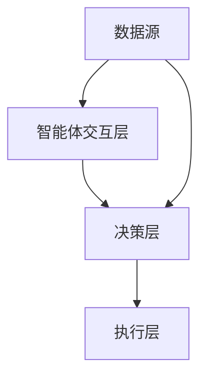
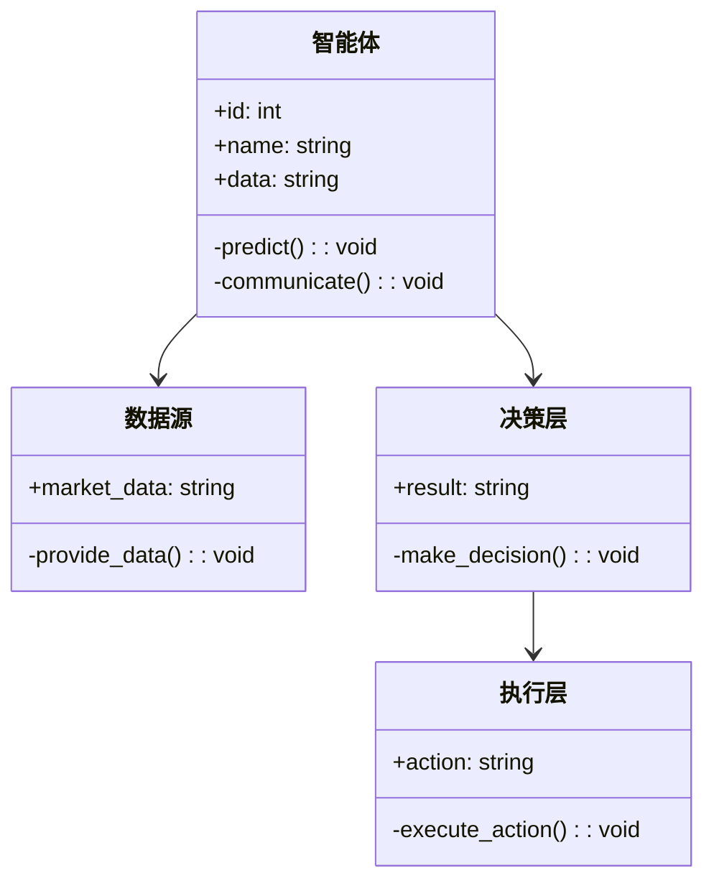
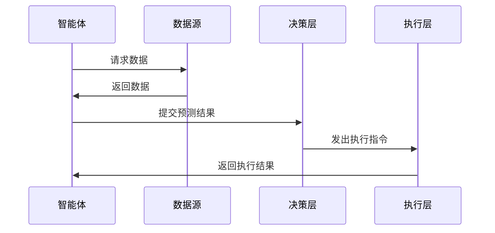

                 


# 多智能体系统在识别市场转折点中的应用

---

## 关键词：多智能体系统、市场转折点、协同学习、分布式计算、群体智慧、金融市场预测、人工智能

---

## 摘要

本文探讨了多智能体系统在金融市场转折点识别中的应用，详细分析了多智能体系统的定义、核心概念、算法原理、系统架构以及实际项目案例。通过结合协同学习和分布式计算，多智能体系统能够有效捕捉市场情绪和趋势变化，从而提高市场转折点的识别精度。文章还展示了如何通过群体智慧优化金融市场预测模型，并提出了实际应用中的最佳实践和注意事项。

---

## 第1章 多智能体系统与金融市场转折点概述

### 1.1 多智能体系统的定义与特点

#### 1.1.1 多智能体系统的定义

多智能体系统（Multi-Agent System, MAS）是由多个智能体（Agent）组成的分布式系统，这些智能体能够通过通信和协作完成复杂任务。与传统的人工智能系统不同，多智能体系统强调智能体之间的协同与互动。

#### 1.1.2 多智能体系统的特征

- **自主性**：智能体能够自主决策和行动。
- **反应性**：智能体能够实时感知环境并做出反应。
- **协作性**：智能体之间可以通过通信和协作完成共同目标。
- **分布性**：智能体是分布式的，不存在集中控制节点。

#### 1.1.3 多智能体系统与传统AI的区别

| 特性 | 多智能体系统 | 传统AI系统 |
|------|--------------|------------|
| 结构 | 分布式、去中心化 | 集中式、单点控制 |
| 智能体 | 多个独立智能体 | 单一智能体或模型 |
| 交互 | 智能体之间可以通信和协作 | 智能体之间无交互 |
| 应用场景 | 分布式任务、协作决策 | 单点任务、简单预测 |

### 1.2 金融市场中的转折点识别

#### 1.2.1 什么是市场转折点

市场转折点是指市场趋势发生显著变化的临界点，通常表现为价格的突然上涨或下跌。转折点的识别对投资者来说至关重要，因为它可以帮助投资者在市场变化前做出决策。

#### 1.2.2 转折点识别的重要性

- **投资决策**：及时识别转折点可以避免重大损失或抓住获利机会。
- **风险管理**：通过提前预警市场变化，降低投资风险。
- **策略优化**：转折点识别有助于优化投资策略。

#### 1.2.3 多智能体系统在转折点识别中的优势

多智能体系统能够通过以下方式提高转折点识别的准确性：
- **分布式计算**：多个智能体可以同时分析不同数据源。
- **协同学习**：多个智能体可以通过协作提高预测精度。
- **群体智慧**：通过多个智能体的协同，可以捕捉到单个智能体无法察觉的市场信号。

---

## 第2章 多智能体系统的组成与机制

### 2.1 多智能体系统的组成

#### 2.1.1 智能体的定义与分类

- **智能体的定义**：智能体是一个能够感知环境、做出决策并采取行动的实体。
- **智能体的分类**：
  - **反应式智能体**：基于当前环境信息做出反应。
  - **认知式智能体**：具有复杂推理和规划能力。
  - **学习式智能体**：能够通过经验改进性能。

#### 2.1.2 智能体之间的通信机制

- **直接通信**：智能体之间通过消息传递进行直接通信。
- **间接通信**：通过共享数据库或中间件进行间接通信。

#### 2.1.3 智能体的协作与协调

- **协作机制**：智能体之间通过协作完成共同目标。
- **协调机制**：通过协调算法确保智能体之间的行动一致。

### 2.2 多智能体系统的协同机制

#### 2.2.1 协同学习的基本原理

协同学习是一种分布式学习方法，多个智能体通过协作共享信息，提高整体学习效果。

#### 2.2.2 分布式计算与决策

分布式计算通过将任务分解到多个智能体上，提高计算效率和决策能力。

#### 2.2.3 联合推理与预测

多个智能体通过联合推理，结合各自的信息，提高预测的准确性和鲁棒性。

---

## 第3章 多智能体系统在金融市场的应用

### 3.1 金融市场数据的多智能体分析

#### 3.1.1 市场数据的多维度分析

金融市场数据包括价格、成交量、市场情绪等多种维度，多智能体系统可以通过分析这些数据捕捉市场变化。

#### 3.1.2 多智能体对市场情绪的捕捉

通过分析社交媒体、新闻和交易数据，多智能体系统可以实时捕捉市场情绪，为转折点识别提供依据。

#### 3.1.3 基于多智能体的市场预测模型

多智能体系统可以构建复杂的预测模型，通过分布式计算和协同学习，提高预测精度。

### 3.2 转折点识别的多智能体算法

#### 3.2.1 基于投票机制的转折点检测

- 每个智能体独立预测市场变化，通过投票机制确定转折点。
- 算法流程：
  1. 每个智能体独立预测市场变化。
  2. 智能体之间通过投票机制确定转折点。
  3. 统计投票结果，确定最终的转折点。

#### 3.2.2 基于共识算法的转折点确认

- 使用共识算法（如区块链中的共识机制）确保智能体之间的预测结果一致。
- 算法流程：
  1. 每个智能体提交预测结果。
  2. 通过共识算法确定最终的转折点。
  3. 输出预测结果。

#### 3.2.3 基于群体智慧的市场趋势预测

- 通过多个智能体的协同，捕捉市场趋势的变化。
- 算法流程：
  1. 智能体之间共享市场数据。
  2. 通过群体智慧算法（如粒子群优化）优化预测模型。
  3. 输出预测结果。

---

## 第4章 多智能体系统的算法原理

### 4.1 协同学习算法

#### 4.1.1 分布式协同学习的流程

1. 初始化：多个智能体分布在网络中，每个智能体具有初始参数。
2. 通信：智能体之间通过通信共享数据。
3. 协同学习：通过协同学习算法优化模型参数。
4. 输出：智能体输出预测结果。

#### 4.1.2 联合推理模型的构建

- **联合推理模型**：通过多个智能体的推理结果，构建整体预测模型。
- **数学模型**：设智能体的数量为N，每个智能体的预测结果为$y_i$，则最终预测结果为：
  $$ y = \frac{1}{N} \sum_{i=1}^{N} y_i $$

#### 4.1.3 协同学习的数学模型

- **投票机制**：每个智能体对市场变化进行投票，最终结果为投票数最高的选项。
- **共识算法**：通过某种共识机制（如PBFT）确保所有智能体的预测结果一致。

### 4.2 分布式计算与决策

#### 4.2.1 分布式计算的基本原理

- 将任务分解到多个节点，每个节点独立完成部分任务。
- 通过通信机制将结果汇总，得到最终结果。

#### 4.2.2 基于分布式计算的决策机制

- **任务分解**：将复杂任务分解为多个子任务，分配给不同的智能体。
- **结果汇总**：通过通信机制汇总子任务结果，得到最终决策。

#### 4.2.3 分布式计算的优缺点分析

| 优点 | 缺点 |
|------|------|
| 高并行性 | 复杂性高 |
| 高容错性 | 资源消耗大 |
| 高扩展性 | 需要高效的通信机制 |

---

## 第5章 多智能体系统的系统架构

### 5.1 系统架构设计

#### 5.1.1 系统架构概述

多智能体系统在金融市场中的架构通常包括以下部分：
- 数据源：包括市场数据、新闻、社交媒体等。
- 智能体交互层：智能体之间通过通信机制进行交互。
- 决策层：通过协同学习和分布式计算，做出预测和决策。
- 执行层：根据决策结果执行交易或其他操作。

#### 5.1.2 系统架构的mermaid图



### 5.2 系统功能设计

#### 5.2.1 系统功能概述

- 数据采集：从多个数据源采集市场数据。
- 数据分析：通过多智能体系统分析数据，识别市场转折点。
- 预测与决策：基于分析结果，做出预测和决策。
- 执行与反馈：根据决策结果执行操作，并根据反馈优化系统。

#### 5.2.2 系统功能的mermaid类图



### 5.3 系统接口设计

#### 5.3.1 系统接口概述

- 数据接口：与数据源对接，获取市场数据。
- 智能体接口：智能体之间的通信接口。
- 决策接口：与决策层对接，输出预测结果。

#### 5.3.2 系统接口的mermaid序列图



---

## 第6章 项目实战：基于多智能体系统的市场转折点识别

### 6.1 项目介绍

#### 6.1.1 项目背景

本项目旨在通过多智能体系统识别金融市场中的转折点，帮助投资者做出更明智的决策。

#### 6.1.2 项目目标

- 实现多智能体系统的市场数据分析。
- 提出基于多智能体的转折点识别算法。
- 验证算法的有效性和准确性。

### 6.2 系统核心实现

#### 6.2.1 环境安装

- **Python 3.8+**
- **NumPy**
- **Matplotlib**
- **networkx**
- **pymqtt**

安装命令：
```bash
pip install numpy matplotlib networkx pymqtt
```

#### 6.2.2 核心代码实现

##### 数据采集模块

```python
import paho.mqtt.client as mqtt

# 数据源连接
def on_message(client, userdata, message):
    data = message.payload.decode()
    print(f"接收到数据：{data}")

client = mqtt.Client()
client.connect("mqttBroker", 1883)
client.subscribe("market_data")
client.on_message = on_message
client.loop_forever()
```

##### 协同学习模块

```python
import numpy as np

def majority_vote(votes):
    # 统计投票结果
    vote_counts = {}
    for vote in votes:
        vote_counts[vote] = vote_counts.get(vote, 0) + 1
    # 返回投票最多的选项
    max_vote = max(vote_counts.values())
    for key, value in vote_counts.items():
        if value == max_vote:
            return key

# 模拟投票
votes = ['up', 'down', 'up', 'down', 'up']
result = majority_vote(votes)
print(f"投票结果：{result}")
```

##### 转折点识别模块

```python
import numpy as np
import matplotlib.pyplot as plt

# 模拟市场数据
data = np.random.randn(100, 1)
plt.plot(data)
plt.title("Market Data")
plt.show()
```

#### 6.2.3 算法实现与分析

##### 投票机制的实现

```python
def majority_vote(votes):
    vote_counts = {}
    for vote in votes:
        vote_counts[vote] = vote_counts.get(vote, 0) + 1
    max_vote = max(vote_counts.values())
    for key, value in vote_counts.items():
        if value == max_vote:
            return key

# 示例投票
votes = ['up', 'down', 'up', 'down', 'up']
result = majority_vote(votes)
print(f"投票结果：{result}")
```

##### 转折点识别的分析

通过投票机制，智能体可以达成一致的预测结果。投票机制的优点是简单高效，缺点是可能无法捕捉到复杂的市场信号。

---

## 第7章 总结与展望

### 7.1 总结

多智能体系统通过协同学习和分布式计算，能够有效识别金融市场中的转折点。本文详细探讨了多智能体系统的定义、核心概念、算法原理和系统架构，并通过实际案例展示了其在金融市场中的应用。

### 7.2 展望

未来，随着人工智能技术的发展，多智能体系统在金融市场中的应用将更加广泛。我们可以期待更多基于群体智慧的创新算法，以及更高效的多智能体系统架构。

---

## 参考文献

（此处可以列出相关的书籍、论文或技术文档）

---

## 作者

作者：AI天才研究院/AI Genius Institute & 禅与计算机程序设计艺术/Zen And The Art of Computer Programming

---

感谢您的阅读！希望这篇文章对您理解多智能体系统在识别市场转折点中的应用有所帮助！

