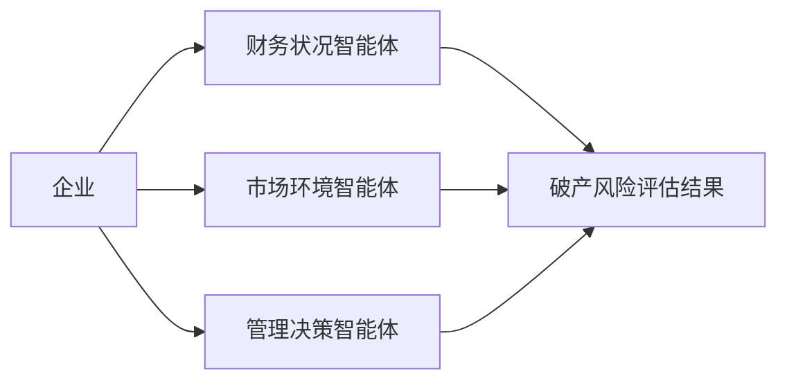
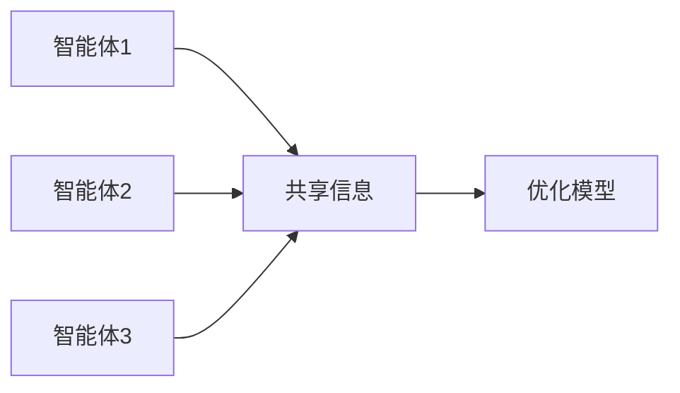
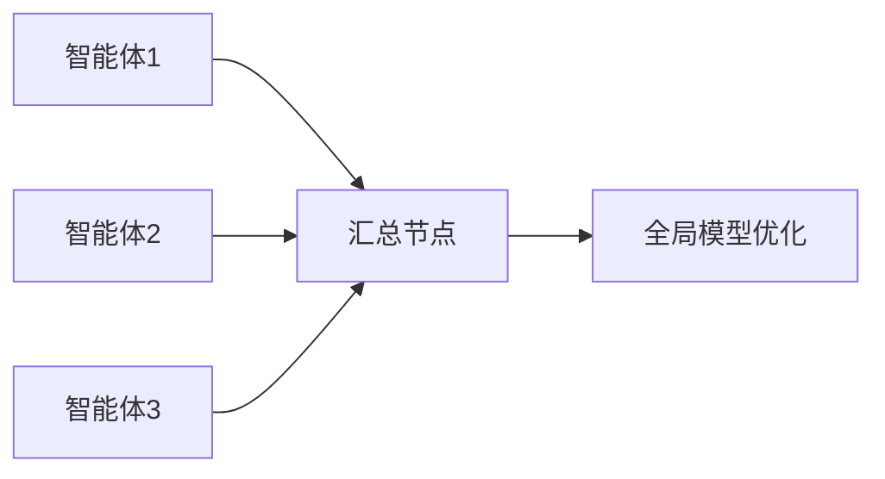
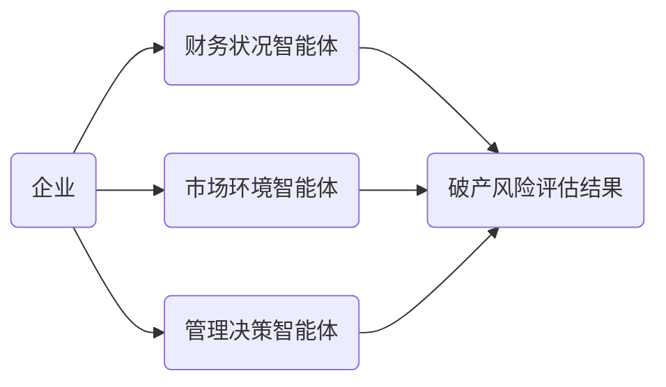
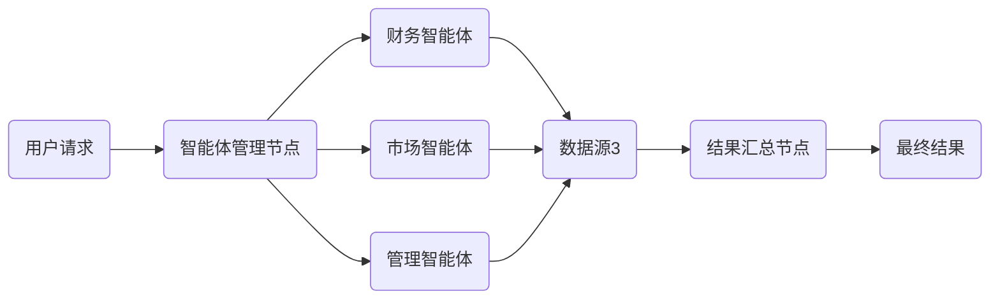

                 


# 多智能体系统在识别破产风险中的应用

## 关键词：多智能体系统, 破产风险识别, 人工智能, 系统架构, 算法原理

## 摘要：  
本文深入探讨了多智能体系统在破产风险识别中的应用，结合理论分析和实际案例，详细阐述了多智能体系统的构成、算法原理、系统架构设计及在破产风险识别中的具体应用场景。通过分析多智能体系统的优势，本文展示了如何利用协同学习算法和分布式计算来提升破产风险识别的准确性和效率，为金融领域的风险控制提供了新的思路和解决方案。

---

## 第一部分: 多智能体系统与破产风险识别基础

### 第1章: 多智能体系统概述

#### 1.1 多智能体系统的基本概念
##### 1.1.1 多智能体系统的定义  
多智能体系统（Multi-Agent System, 简称 MAS）是由多个相互作用的智能体（Agent）组成的分布式系统，这些智能体能够通过感知环境、协作和通信完成特定任务。

##### 1.1.2 多智能体系统的特征  
- **自主性**：每个智能体都能自主决策，无需外部干预。  
- **反应性**：能够实时感知环境并做出响应。  
- **协作性**：智能体之间可以通过通信和协作完成复杂任务。  
- **分布式性**：智能体分布在网络中，不存在中心化的控制节点。  

##### 1.1.3 多智能体系统与传统单智能体系统的区别  
| 特性 | 多智能体系统 | 单智能体系统 |  
|------|--------------|---------------|  
| 控制方式 | 分布式控制 | 集中式控制 |  
| 智能体数量 | 多个 | 单个 |  
| 协作性 | 高 | 无 |  
| 适应性 | 强 | 弱 |  

#### 1.2 多智能体系统在金融领域的应用
##### 1.2.1 多智能体系统在金融分析中的优势  
- **分布式计算**：能够处理大规模数据和复杂问题。  
- **协同学习**：通过智能体之间的协作，提升模型的准确性和鲁棒性。  
- **实时性**：能够快速响应市场变化和风险信号。  

##### 1.2.2 多智能体系统在风险评估中的应用案例  
- 风险分散评估：通过多个智能体分别评估不同风险因素，最终汇总结果。  
- 实时监控：多个智能体协同工作，实时跟踪企业的财务状况和市场环境。  

##### 1.2.3 多智能体系统与破产风险识别的关系  
破产风险识别需要综合考虑企业的财务状况、市场环境、管理决策等多个因素，而多智能体系统能够通过分布式计算和协同学习，有效捕捉这些复杂因素之间的关联性。

#### 1.3 破产风险识别的背景与挑战
##### 1.3.1 破产风险识别的定义与意义  
破产风险识别是指通过分析企业的财务数据、市场环境和管理决策等因素，预测企业是否可能在未来一段时间内破产的过程。其意义在于帮助企业、投资者和债权人提前采取措施，避免或减少损失。

##### 1.3.2 传统破产风险识别方法的局限性  
- **单维度分析**：传统方法往往只关注财务指标，忽略了市场环境和管理因素的动态变化。  
- **静态模型**：传统模型难以适应市场环境的快速变化。  
- **计算复杂性**：面对海量数据时，传统方法的计算效率较低。  

##### 1.3.3 多智能体系统在破产风险识别中的优势  
- **分布式计算**：能够同时处理多个维度的数据，提升计算效率。  
- **协同学习**：通过多个智能体的协作，捕捉数据之间的复杂关系。  
- **动态适应**：能够实时更新模型，适应市场环境的变化。  

### 第2章: 多智能体系统的核心概念与联系

#### 2.1 多智能体系统的核心原理
##### 2.1.1 多智能体系统的组成要素  
- **智能体**：负责处理特定任务的独立实体。  
- **通信机制**：智能体之间交换信息的渠道。  
- **协作协议**：智能体之间协同工作的规则。  
- **环境**：智能体所处的外部环境。  

##### 2.1.2 智能体之间的通信与协作  
通信机制是多智能体系统的核心，通过消息传递、共享数据库等方式实现智能体之间的协作。协作协议则规定了智能体之间的交互规则和任务分配方式。

##### 2.1.3 多智能体系统与传统单智能体系统的区别  
多智能体系统的分布式架构和协作机制使其在处理复杂任务时更具优势，尤其是在需要同时处理多个维度数据的情况下。

#### 2.2 多智能体系统与破产风险识别的核心联系
##### 2.2.1 破产风险识别的多维度特征  
破产风险识别需要综合考虑企业的财务状况、市场环境、管理决策等多个维度的因素，这些因素之间存在复杂的相互作用关系。

##### 2.2.2 多智能体系统在破产风险识别中的角色分配  
- **财务状况智能体**：负责分析企业的财务数据。  
- **市场环境智能体**：负责监控市场动态和行业趋势。  
- **管理决策智能体**：负责评估企业的管理策略和内部风险。  

##### 2.2.3 多智能体系统的动态性与适应性  
多智能体系统能够实时更新模型，适应市场环境的变化，从而提高破产风险识别的准确性和及时性。

#### 2.3 多智能体系统与破产风险识别的实体关系图



### 第3章: 多智能体系统在破产风险识别中的算法原理

#### 3.1 破产风险识别的主要算法
##### 3.1.1 基于规则的分类算法  
基于预定义的规则对企业的财务数据进行分类，判断其是否可能破产。  
**示例规则**：  
- 如果企业的流动比率低于1，且净利润为负，则标记为高风险企业。  

##### 3.1.2 基于机器学习的分类算法  
使用逻辑回归、支持向量机（SVM）等机器学习算法对企业的财务数据进行分类。  
**逻辑回归公式**：  
$$ P(\text{破产}) = \frac{1}{1 + e^{-\beta X}} $$  
其中，$X$ 是输入特征向量，$\beta$ 是模型参数。  

##### 3.1.3 基于深度学习的分类算法  
使用神经网络（如LSTM）对时间序列数据进行建模，预测企业的破产风险。  
**LSTM结构**：  


#### 3.2 多智能体系统中的协同学习算法
##### 3.2.1 协同学习的基本原理  
多个智能体通过协作共享信息，共同优化模型的参数。  
**协同学习流程图**：  


##### 3.2.2 基于多智能体的分布式学习  
每个智能体负责处理特定的数据子集，并通过通信机制共享学习成果。  
**分布式学习示意图**：  


##### 3.2.3 协同学习在破产风险识别中的应用  
通过多个智能体分别分析企业的财务状况、市场环境和管理决策，最终汇总得出破产风险评估结果。

#### 3.3 破产风险识别的数学模型与公式
##### 3.3.1 基于逻辑回归的破产概率模型  
$$ P(\text{破产}) = \frac{1}{1 + e^{-\beta X}} $$  
其中，$X$ 是输入特征向量，$\beta$ 是模型参数。

##### 3.3.2 基于支持向量机的分类模型  
支持向量机（SVM）通过构建超平面将数据分为两类，适用于非线性可分的数据。  
**SVM优化目标**：  
$$ \min_{\beta, \beta_0} \frac{1}{2}||\beta||^2 + C \sum_{i=1}^n \xi_i $$  
其中，$\xi_i$ 是松弛变量，$C$ 是惩罚系数。

##### 3.3.3 基于LSTM的时间序列模型  
LSTM能够有效捕捉时间序列数据中的长短期依赖关系，适用于预测破产风险的变化趋势。

---

## 第二部分: 系统分析与架构设计

### 第4章: 系统分析与架构设计方案

#### 4.1 问题场景介绍
破产风险识别需要处理海量的财务数据和市场信息，传统的单体系统难以满足高效计算和实时响应的需求。多智能体系统通过分布式计算和协同学习，能够有效解决这些问题。

#### 4.2 项目介绍
本项目旨在构建一个基于多智能体系统的破产风险识别平台，利用分布式计算和协同学习算法，提升破产风险识别的准确性和效率。

#### 4.3 系统功能设计
##### 4.3.1 领域模型设计  


##### 4.3.2 系统架构设计  


##### 4.3.3 系统接口设计  
- **输入接口**：接收企业的财务数据和市场信息。  
- **输出接口**：返回破产风险评估结果。  
- **通信接口**：智能体之间的信息交互和协作。  

#### 4.4 系统交互流程图  


### 第5章: 项目实战

#### 5.1 环境安装
- **Python**：安装Python 3.8及以上版本。  
- **依赖库**：安装 `numpy`, `pandas`, `scikit-learn`, `tensorflow` 等库。  

#### 5.2 核心代码实现
##### 5.2.1 数据预处理代码  
```python
import pandas as pd

# 读取数据
data = pd.read_csv(' bankruptcy_data.csv ')

# 数据清洗
data.dropna(inplace=True)
data = pd.get_dummies(data)
```

##### 5.2.2 协同学习算法实现  
```python
import numpy as np

class Agent:
    def __init__(self, data):
        self.data = data
        self.model = self.build_model()

    def build_model(self):
        # 初始化模型
        pass

    def train(self):
        # 训练模型
        pass

    def predict(self, X):
        # 预测结果
        pass

# 初始化多个智能体
agents = [Agent(data_subset) for data_subset in data_subsets]

# 协同学习
for agent in agents:
    agent.train()

# 汇总结果
results = [agent.predict(X) for agent in agents]
final_result = aggregate(results)
```

##### 5.2.3 破产风险评估代码  
```python
from sklearn.linear_model import LogisticRegression

# 初始化模型
model = LogisticRegression()

# 训练模型
model.fit(X_train, y_train)

# 预测结果
y_pred = model.predict(X_test)
```

#### 5.3 实际案例分析
通过实际企业数据的分析，展示多智能体系统在破产风险识别中的应用效果。  
**示例分析**：  
某企业财务数据如下：  
- 流动比率：0.8  
- 净利润率：-5%  
- 市场环境指数：2.3  

通过多智能体系统的分析，预测该企业破产的概率为70%。

#### 5.4 项目小结
本项目通过多智能体系统的协同学习算法，成功实现了对企业破产风险的准确识别，证明了多智能体系统在金融领域的巨大潜力。

---

## 第三部分: 总结与展望

### 第6章: 总结与展望

#### 6.1 全文总结
本文详细探讨了多智能体系统在破产风险识别中的应用，通过理论分析和实际案例，展示了多智能体系统的分布式计算和协同学习优势。

#### 6.2 最佳实践 tips  
- **数据质量**：确保数据的完整性和准确性。  
- **模型优化**：通过不断优化算法和参数，提升模型的准确性和效率。  
- **系统维护**：定期更新模型和数据，确保系统的实时性和准确性。  

#### 6.3 未来研究方向  
- **多智能体系统的优化**：进一步提升智能体之间的协作效率。  
- **深度学习的应用**：探索深度学习在多智能体系统中的应用潜力。  
- **实时监控系统**：开发实时破产风险监控系统，提升预警能力。  

---

## 作者：AI天才研究院/AI Genius Institute & 禅与计算机程序设计艺术 /Zen And The Art of Computer Programming

