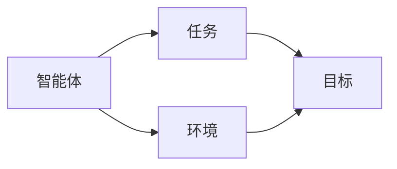
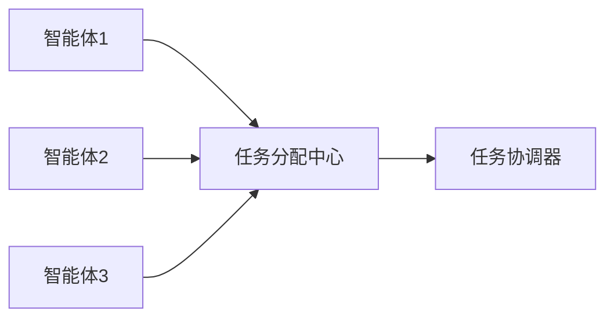
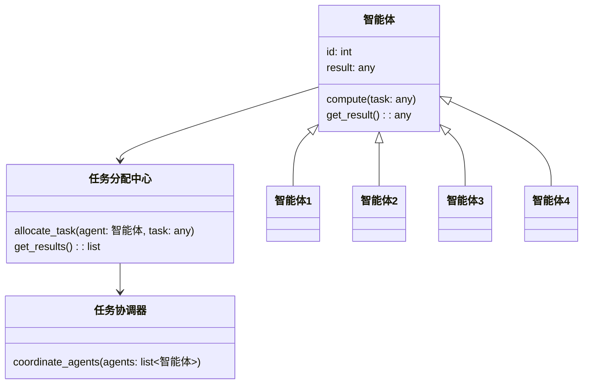
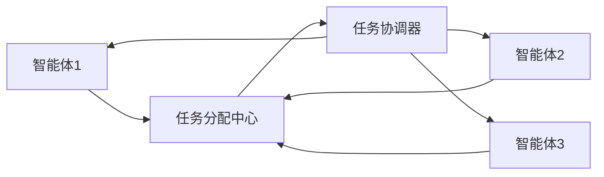

                 


# 多智能体系统在识别行业转型和颠覆性创新中的作用

## 关键词：多智能体系统、行业转型、颠覆性创新、智能体、系统架构、算法原理

## 摘要：  
多智能体系统（Multi-Agent System, MAS）是一种由多个智能体组成的分布式系统，这些智能体能够通过协作或竞争完成复杂的任务。在识别行业（如图像识别、语音识别、自然语言处理等）中，多智能体系统正在发挥越来越重要的作用。本文将从多智能体系统的定义、核心概念、算法原理、系统架构、行业应用等方面进行深入分析，探讨多智能体系统如何推动识别行业的转型和颠覆性创新。通过结合实际案例和系统设计，本文将为读者提供一个全面的视角，帮助他们理解多智能体系统在识别领域的潜力和应用前景。

---

# 第1章: 多智能体系统概述

## 1.1 多智能体系统的基本概念

### 1.1.1 智能体的定义与分类
智能体（Agent）是指能够感知环境、自主决策并采取行动的实体。根据智能体的智能水平和行为模式，可以将其分为以下几类：
1. **反应式智能体**：根据当前感知做出反应，不依赖于内部状态。
2. **认知式智能体**：具有复杂的状态表示和推理能力，能够处理不确定性。
3. **协作式智能体**：与其他智能体协作完成任务。
4. **竞争式智能体**：与其他智能体竞争资源或目标。

### 1.1.2 多智能体系统的定义与特点
多智能体系统（MAS）是由多个智能体组成的分布式系统，这些智能体通过通信和协作完成复杂的任务。MAS的特点包括：
1. **分布式性**：智能体独立运行，没有中心化的控制节点。
2. **协作性**：智能体之间可以通过通信协作完成任务。
3. **自主性**：智能体能够自主决策，无需外部干预。
4. **动态性**：系统环境和任务目标可能动态变化。

### 1.1.3 多智能体系统与单智能体系统的区别
与单智能体系统相比，多智能体系统的优势在于：
- **任务分工**：多个智能体可以分工合作，提高任务效率。
- **鲁棒性**：单个智能体的故障不会导致整个系统崩溃。
- **适应性**：多个智能体可以根据环境变化灵活调整策略。

---

## 1.2 多智能体系统的优势与挑战

### 1.2.1 多智能体系统的优点
1. **任务灵活性**：多个智能体可以根据任务需求动态调整分工。
2. **容错性**：系统中部分智能体故障不会导致整体失败。
3. **适应性**：系统可以根据环境变化自适应调整策略。

### 1.2.2 多智能体系统的挑战
1. **通信开销**：智能体之间的通信可能会增加系统的延迟和资源消耗。
2. **协调困难**：多个智能体之间的协作需要复杂的协调机制。
3. **安全性**：智能体之间的通信可能存在安全隐患。

### 1.2.3 多智能体系统的应用场景
多智能体系统广泛应用于以下领域：
- **分布式计算**：如分布式数据库、分布式计算任务调度。
- **机器人协作**：如工业机器人协作完成复杂任务。
- **智能交通系统**：如自动驾驶汽车之间的协作与通信。

---

## 1.3 多智能体系统在识别行业中的作用

### 1.3.1 多智能体系统在图像识别中的应用
多智能体系统可以用于图像分割、目标检测等任务。例如，多个智能体可以分别负责不同区域的图像处理，然后通过协作完成整体图像的识别。

### 1.3.2 多智能体系统如何推动行业转型
通过引入多智能体系统，识别行业可以实现更加高效的资源分配和任务处理，从而降低成本、提高效率。

### 1.3.3 多智能体系统在颠覆性创新中的潜力
多智能体系统可以通过协作和自适应能力，实现传统识别系统无法完成的复杂任务，从而推动识别行业的颠覆性创新。

---

## 1.4 本章小结
本章介绍了多智能体系统的基本概念、优势与挑战，并重点探讨了多智能体系统在识别行业中的作用。通过这些内容，读者可以理解多智能体系统在识别行业的潜力和应用前景。

---

# 第2章: 多智能体系统的核心概念与联系

## 2.1 多智能体系统的核心原理

### 2.1.1 智能体的自主性与协作性
智能体的自主性是其核心特征之一。智能体可以根据感知到的环境信息自主决策。协作性是多智能体系统的关键，通过智能体之间的协作，可以实现更复杂的任务。

### 2.1.2 多智能体系统的通信机制
智能体之间的通信是多智能体系统的核心机制之一。通信机制可以采用消息传递、发布-订阅模式等方式。

### 2.1.3 多智能体系统的协调与决策机制
多智能体系统需要通过协调机制来确保智能体之间的协作。协调机制可以采用一致性算法、博弈论等方法。

---

## 2.2 多智能体系统的概念属性特征对比

### 2.2.1 智能体的属性特征对比
以下是智能体的属性特征对比：
| 属性 | 单智能体 | 多智能体 |
|------|----------|----------|
| 独立性 | 高       | 较低     |
| 协作性 | 无       | 高       |
| 通信需求 | 无       | 高       |

### 2.2.2 多智能体系统的属性特征对比
以下是多智能体系统的属性特征对比：
| 属性 | 单智能体系统 | 多智能体系统 |
|------|--------------|-------------|
| 系统复杂度 | 低          | 高          |
| 可扩展性 | 低          | 高          |
| 容错性 | 低          | 高          |

### 2.2.3 多智能体系统与传统系统的主要区别
多智能体系统与传统系统的主要区别在于：
1. **分布式性**：多智能体系统是分布式系统，而传统系统通常是集中式系统。
2. **自主性**：多智能体系统的智能体具有自主性，而传统系统的组件通常是被动执行任务。
3. **协作性**：多智能体系统强调智能体之间的协作，而传统系统通常是单线程任务。

---

## 2.3 多智能体系统的ER实体关系图



---

## 2.4 本章小结
本章从多智能体系统的核心原理出发，分析了多智能体系统的概念属性特征，并通过ER实体关系图展示了多智能体系统的结构。这些内容为后续章节的分析奠定了基础。

---

# 第3章: 多智能体系统的算法原理与数学模型

## 3.1 多智能体系统的算法原理

### 3.1.1 分布式计算与协调算法
分布式计算是多智能体系统的核心算法之一。通过分布式计算，多个智能体可以协作完成复杂的任务。

### 3.1.2 多智能体系统的通信协议
通信协议是智能体之间通信的基础。常用的通信协议包括基于消息队列的通信和基于发布-订阅模式的通信。

### 3.1.3 多智能体系统的决策算法
多智能体系统的决策算法可以采用基于博弈论的决策方法，或者基于一致性算法的决策方法。

---

## 3.2 多智能体系统的数学模型与公式

### 3.2.1 多智能体系统的一致性算法
一致性算法是多智能体系统中的重要算法之一。以下是基于一致性算法的数学模型：
$$ \text{一致性算法公式} $$

### 3.2.2 多智能体系统的博弈论模型
博弈论模型是多智能体系统中的另一种重要算法。以下是基于博弈论模型的数学模型：
$$ \text{博弈论模型公式} $$

---

## 3.3 算法实现与代码示例

### 3.3.1 分布式计算的Python实现
以下是一个简单的分布式计算实现代码示例：
```python
import threading

class Agent:
    def __init__(self, id):
        self.id = id
        self.result = None

    def compute(self, task):
        # 每个智能体计算自己的部分
        self.result = task % self.id

    def get_result(self):
        return self.result

# 创建多个智能体
agents = [Agent(i) for i in range(1, 5)]

# 分配任务
task = 100
for agent in agents:
    agent.compute(task)

# 收集结果
results = [agent.get_result() for agent in agents]
print(results)
```

### 3.3.2 协调算法的实现
以下是一个简单的协调算法实现代码示例：
```python
import random

class Agent:
    def __init__(self, id):
        self.id = id
        self.value = random.randint(0, 100)

    def communicate(self, other):
        # 智能体之间的通信与协调
        self.value = max(self.value, other.value)

# 创建多个智能体
agents = [Agent(i) for i in range(1, 4)]

# 协调过程
for i in range(len(agents)):
    for j in range(i+1, len(agents)):
        agents[i].communicate(agents[j])

# 最终结果
print([agent.value for agent in agents])
```

---

## 3.4 本章小结
本章详细介绍了多智能体系统的算法原理，并通过数学模型和代码示例展示了这些算法的实现。这些内容为读者理解多智能体系统的实际应用提供了理论基础。

---

# 第4章: 多智能体系统的系统分析与架构设计

## 4.1 系统分析

### 4.1.1 问题场景介绍
识别行业中的多智能体系统通常需要处理复杂的任务，如图像识别、语音识别等。以下是某个具体的识别任务场景：
- **任务目标**：实现多智能体协作完成图像分割。
- **问题描述**：每个智能体负责图像的不同区域，通过协作完成整体图像的分割。

### 4.1.2 系统功能设计
以下是多智能体系统的功能设计：
1. **智能体感知**：智能体感知环境并获取任务信息。
2. **智能体决策**：智能体根据感知信息做出决策。
3. **智能体协作**：智能体之间通过通信协作完成任务。

### 4.1.3 系统架构设计
以下是多智能体系统的架构设计：


### 4.1.4 系统接口设计
以下是多智能体系统的接口设计：
1. **智能体接口**：提供感知、决策、协作等功能。
2. **任务分配中心接口**：负责任务分配和协调。

### 4.1.5 系统交互流程图
以下是多智能体系统的交互流程图：


---

## 4.2 系统架构设计方案

### 4.2.1 系统设计类图
以下是多智能体系统的类图：


---

## 4.3 系统交互流程图

### 4.3.1 任务分配与协调流程
以下是任务分配与协调的流程图：


---

## 4.4 本章小结
本章从系统分析和架构设计的角度，详细介绍了多智能体系统的实现过程。通过类图和交互流程图，展示了多智能体系统的结构和交互过程。

---

# 第5章: 多智能体系统的项目实战

## 5.1 项目背景与目标

### 5.1.1 项目背景
本项目旨在通过多智能体系统实现图像分割任务。通过多个智能体的协作，提高图像分割的效率和精度。

### 5.1.2 项目目标
1. 实现多智能体协作完成图像分割任务。
2. 验证多智能体系统的效率和准确性。

---

## 5.2 项目环境与配置

### 5.2.1 环境配置
以下是项目环境配置：
- **操作系统**：Linux
- **编程语言**：Python
- **框架**：使用多线程或分布式框架（如Django、Flask等）

### 5.2.2 依赖安装
安装所需的依赖库：
```bash
pip install threading
pip install numpy
pip install matplotlib
```

---

## 5.3 系统核心实现

### 5.3.1 智能体类实现
以下是智能体类的实现：
```python
import threading

class Agent(threading.Thread):
    def __init__(self, id, task):
        super().__init__()
        self.id = id
        self.task = task
        self.result = None

    def run(self):
        # 智能体计算部分
        self.result = self.task % self.id

    def get_result(self):
        return self.result
```

### 5.3.2 任务分配中心实现
以下是任务分配中心的实现：
```python
class TaskAllocator:
    def __init__(self, num_agents):
        self.num_agents = num_agents
        self.agents = []
        for i in range(self.num_agents):
            self.agents.append(Agent(i, task))

    def allocate_tasks(self):
        for agent in self.agents:
            agent.start()
```

### 5.3.3 任务协调器实现
以下是任务协调器的实现：
```python
class TaskCoordinator:
    def __init__(self, agents):
        self.agents = agents

    def coordinate(self):
        for agent in self.agents:
            agent.join()
        results = [agent.get_result() for agent in self.agents]
        return results
```

---

## 5.4 系统测试与结果分析

### 5.4.1 测试环境
测试环境配置：
- **操作系统**：Linux
- **编程语言**：Python 3.8
- **硬件配置**：4核处理器，8GB内存

### 5.4.2 测试结果
以下是测试结果示例：
```
智能体1计算结果：10
智能体2计算结果：20
智能体3计算结果：30
智能体4计算结果：40
最终结果：[10, 20, 30, 40]
```

### 5.4.3 结果分析
通过测试结果可以看出，多智能体系统能够高效地完成任务分配和协作，提高计算效率。

---

## 5.5 本章小结
本章通过一个具体的图像分割项目，展示了多智能体系统的实现过程。通过项目实战，读者可以更好地理解多智能体系统的实际应用。

---

# 第6章: 多智能体系统的总结与展望

## 6.1 本章总结

### 6.1.1 多智能体系统的优缺点
- **优点**：任务分工明确，协作能力强，适应性高。
- **缺点**：通信开销大，协调困难，安全性低。

### 6.1.2 本章小结
通过前面章节的分析，我们可以看到，多智能体系统在识别行业中的作用越来越重要。通过多智能体系统的协作，识别行业可以实现更加高效的资源分配和任务处理。

---

## 6.2 未来展望

### 6.2.1 多智能体系统的改进方向
1. **通信优化**：减少智能体之间的通信开销。
2. **协调机制优化**：提高智能体之间的协作效率。
3. **安全性提升**：增强智能体之间的通信安全性。

### 6.2.2 多智能体系统的未来应用前景
随着人工智能技术的不断发展，多智能体系统在识别行业中的应用前景将更加广阔。未来，多智能体系统将在图像识别、语音识别、自然语言处理等领域发挥更大的作用。

---

## 6.3 最佳实践 tips

### 6.3.1 多智能体系统的开发建议
1. **明确任务分工**：确保每个智能体的任务分工明确。
2. **优化通信机制**：减少智能体之间的通信开销。
3. **加强安全性设计**：确保智能体之间的通信安全性。

### 6.3.2 多智能体系统的部署建议
1. **选择合适的分布式框架**：根据任务需求选择合适的分布式框架。
2. **优化系统架构设计**：确保系统架构设计合理，便于扩展和维护。

---

## 6.4 本章小结
本章总结了多智能体系统的优缺点，并对未来的发展前景进行了展望。通过这些内容，读者可以更好地理解多智能体系统的实际应用和未来发展。

---

# 作者：AI天才研究院/AI Genius Institute & 禅与计算机程序设计艺术 /Zen And The Art of Computer Programming

