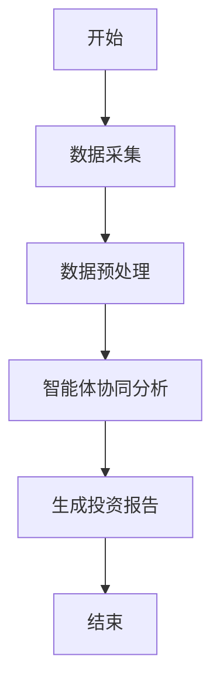
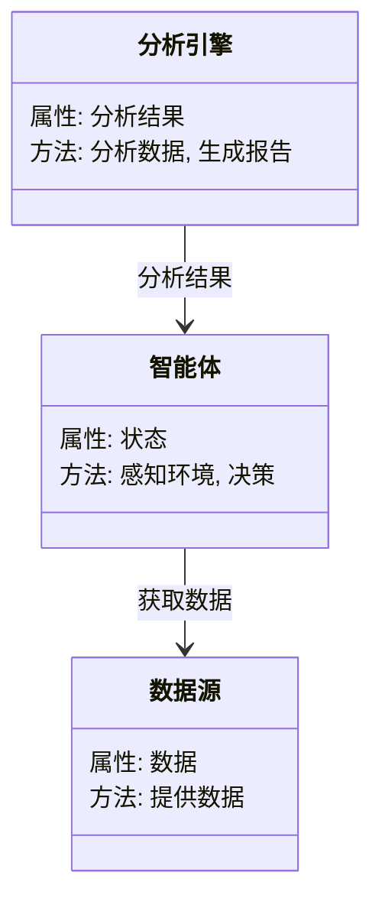
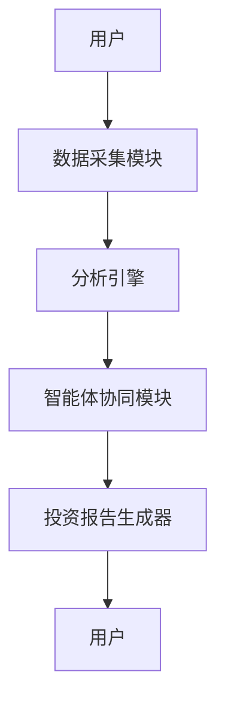

                 


# 多智能体系统在跨境价值比较中的应用：发现全球投资机会

> 关键词：多智能体系统，跨境价值比较，全球投资机会，分布式计算，金融数据分析，人工智能

> 摘要：本文深入探讨了多智能体系统（MAS）在跨境价值比较中的应用，通过分析多智能体系统的原理、算法、架构设计，结合实际案例，展示了如何利用MAS发现全球投资机会。文章内容涵盖背景介绍、核心概念、算法原理、系统设计、项目实战及总结，旨在为金融专业人士和技术爱好者提供全面的技术见解。

---

# 第1章: 多智能体系统与跨境价值比较概述

## 1.1 多智能体系统的基本概念

### 1.1.1 多智能体系统的定义
多智能体系统（Multi-Agent Systems, MAS）由多个智能体（Agent）组成，每个智能体能够感知环境、自主决策并与其他智能体协同工作。MAS的特点在于分布式计算和任务分配，能够处理复杂问题。

### 1.1.2 多智能体系统的特点
- **分布式**：多个智能体协同工作，避免单点故障。
- **自主性**：每个智能体独立决策。
- **反应性**：能够实时感知环境变化并做出反应。
- **社会性**：智能体之间通过通信和协商实现任务协同。

### 1.1.3 多智能体系统与单智能体系统的区别
| 特性 | 多智能体系统（MAS） | 单智能体系统 |
|------|---------------------|---------------|
| 决策 | 分布式决策         | 集中式决策   |
| 效率 | 高                  | 可能较低      |
| 可扩展性 | 高                  | 低            |
| 容错性 | 高                  | 低            |

## 1.2 跨境价值比较的基本概念

### 1.2.1 跨境价值比较的定义
跨境价值比较是指在不同国家或地区之间，对比经济指标、市场趋势、政策环境等因素，评估投资价值的过程。

### 1.2.2 跨境价值比较的核心要素
- **经济指标**：GDP、通胀率、失业率等。
- **市场趋势**：股市指数、汇率波动。
- **政策环境**：税收政策、贸易壁垒。

### 1.2.3 跨境价值比较的应用场景
- **投资决策**：帮助投资者选择最有潜力的市场。
- **风险管理**：评估不同市场的风险因素。
- **资产配置**：优化投资组合的资产分布。

## 1.3 多智能体系统在跨境价值比较中的应用前景

### 1.3.1 多智能体系统在金融领域的优势
- **数据处理能力强**：能够同时处理多个市场的数据。
- **分布式计算**：提高数据处理效率。
- **智能协同**：多个智能体协同分析，提升准确性。

### 1.3.2 跨境投资机会的发现
通过MAS分析不同市场的数据，发现潜在的投资机会，帮助投资者做出更明智的决策。

### 1.3.3 多智能体系统的未来发展趋势
随着人工智能和大数据技术的发展，MAS在金融领域的应用将更加广泛，尤其是在跨境投资领域。

---

# 第2章: 多智能体系统的核心概念与联系

## 2.1 多智能体系统的原理

### 2.1.1 多智能体系统的组成结构
- **智能体**：独立的决策单元。
- **通信机制**：智能体之间的信息交换。
- **协同行为**：智能体通过协同完成复杂任务。

### 2.1.2 多智能体系统的特点
- **分布式**：任务分解到各个智能体。
- **动态性**：环境变化时智能体能够适应。
- **复杂性**：多个智能体协同工作，处理复杂问题。

### 2.1.3 多智能体系统与其他系统的关系
- **对比单智能体系统**：MAS在扩展性和容错性上有优势。
- **对比分布式系统**：MAS强调智能体的自主性和协同性。

## 2.2 跨境价值比较的核心要素

### 2.2.1 经济指标的选取
- **GDP增长率**：反映国家经济活力。
- **通胀率**：影响货币政策和投资决策。
- **失业率**：反映就业市场状况。

### 2.2.2 风险因素的分析
- **市场风险**：股市波动、汇率波动。
- **政策风险**：税收政策、贸易政策变化。
- **地缘政治风险**：国际关系紧张。

### 2.2.3 投资回报的评估
- **资产回报率**：投资收益与本金的比率。
- **风险调整后收益**：考虑风险因素后的净收益。

## 2.3 多智能体系统与跨境价值比较的关联

### 2.3.1 多智能体系统在价值评估中的作用
- **数据采集**：MAS能够同时采集多个市场的数据。
- **数据分析**：智能体协同分析数据，发现投资机会。
- **决策支持**：MAS提供多维度的分析结果，辅助决策。

### 2.3.2 跨境比较中的数据处理
- **数据清洗**：处理缺失值和异常值。
- **数据融合**：整合不同来源的数据。
- **数据建模**：构建数学模型进行预测。

### 2.3.3 多智能体系统的决策支持
- **实时监控**：MAS能够实时监控市场变化。
- **风险评估**：智能体协同评估投资风险。
- **投资策略优化**：MAS帮助制定最优投资策略。

---

# 第3章: 多智能体系统的算法原理

## 3.1 多智能体系统的算法流程

### 3.1.1 算法流程图



### 3.1.2 算法步骤
1. **数据采集**：从不同市场获取数据。
2. **数据预处理**：清洗和融合数据。
3. **智能体协同分析**：多个智能体协同分析数据。
4. **生成投资报告**：输出分析结果。

## 3.2 多智能体系统的数学模型

### 3.2.1 评估函数
$$
f(x) = \sum_{i=1}^{n} w_i x_i
$$
其中，$w_i$ 是权重，$x_i$ 是各个因素的值。

### 3.2.2 优化模型
$$
\text{最大化 } f(x) \text{，在约束条件下 }
g(x) \leq 0
$$

---

# 第4章: 系统分析与架构设计

## 4.1 系统功能设计

### 4.1.1 领域模型


### 4.1.2 系统架构设计


### 4.1.3 系统接口设计
- **数据接口**：智能体与数据源之间的接口。
- **分析接口**：分析引擎与智能体之间的接口。
- **用户接口**：用户与投资报告生成器之间的接口。

---

# 第5章: 项目实战

## 5.1 环境安装
- **工具**：Python、Mermaid、Latex。
- **库**：Pandas、NumPy、Scikit-learn。

## 5.2 系统核心实现源代码

### 5.2.1 数据采集模块
```python
import pandas as pd
import requests

def get_data(country):
    url = f"https://api.example.com/{country}"
    response = requests.get(url)
    data = response.json()
    return pd.DataFrame(data)
```

### 5.2.2 分析引擎模块
```python
from sklearn import linear_model

def analyze_data(data):
    model = linear_model.LinearRegression()
    model.fit(data[['GDP', 'inflation']], data['return'])
    return model.predict(data[['GDP', 'inflation']])
```

## 5.3 代码应用解读与分析
- **数据采集模块**：从不同国家获取经济数据。
- **分析引擎模块**：使用线性回归模型预测投资回报。

## 5.4 实际案例分析
- **案例背景**：比较中美两国的投资价值。
- **分析过程**：使用MAS分析两国的GDP、通胀率等指标。
- **结果解读**：预测两国的投资回报率。

---

# 第6章: 总结与展望

## 6.1 总结
- 多智能体系统在跨境价值比较中的应用前景广阔。
- MAS能够提高数据处理效率，辅助投资者做出更明智的决策。

## 6.2 注意事项
- 数据质量对分析结果影响重大，需谨慎处理。
- 智能体协同分析需要考虑通信延迟和数据同步问题。

## 6.3 小结
多智能体系统通过分布式计算和协同分析，为跨境投资提供了新的可能性。未来，随着技术的发展，MAS在金融领域的应用将更加广泛。

---

作者：AI天才研究院 & 禅与计算机程序设计艺术

