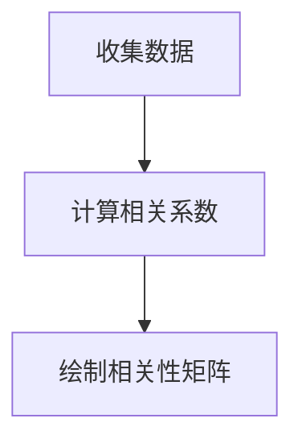
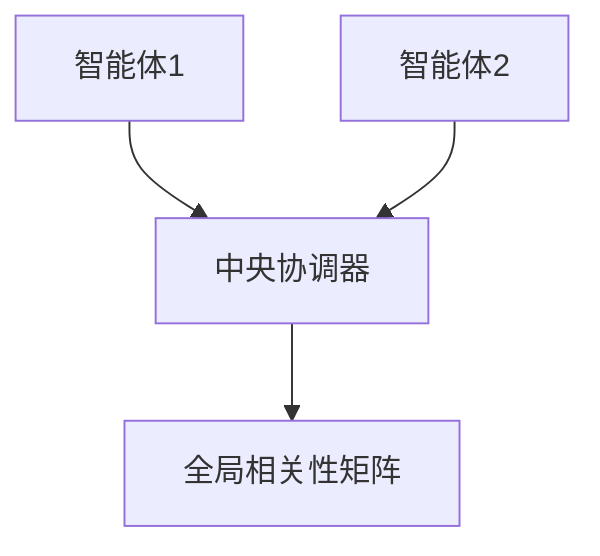
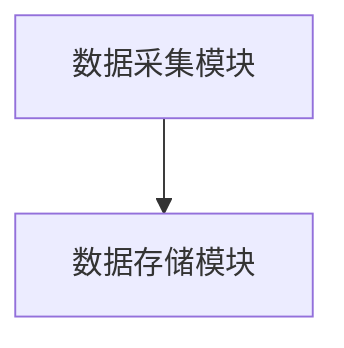
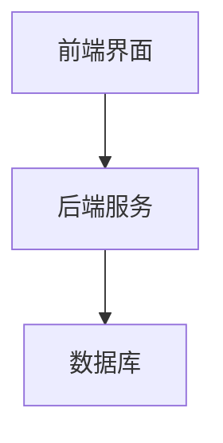

                 

# 多智能体系统在跨市场相关性分析中的应用

---

## 关键词：多智能体系统（MAS）、跨市场相关性分析、金融市场、算法设计、系统架构

---

## 摘要：  
本文探讨多智能体系统（MAS）在跨市场相关性分析中的应用，通过分析MAS的优势，结合相关性分析的数学模型，提出一种基于MAS的跨市场相关性分析框架。文章详细介绍了MAS的基本概念、相关性分析的核心原理，以及如何通过MAS实现多市场的协同分析。通过实际案例和系统架构设计，展示了MAS在金融市场的实际应用价值，并为后续研究提供了理论和实践参考。

---

# 第1章：多智能体系统概述

## 1.1 多智能体系统的基本概念

### 1.1.1 多智能体系统的定义  
多智能体系统（Multi-Agent System，MAS）是由多个智能体（Agent）组成的分布式系统，每个智能体能够自主决策、感知环境并与其他智能体协作。MAS的特点包括自主性、反应性、社会性和分布性。

### 1.1.2 多智能体系统的特征  
- **自主性**：智能体能够独立决策，无需外部干预。  
- **反应性**：智能体能够实时感知环境变化并做出响应。  
- **社会性**：智能体之间可以通过通信协作完成复杂任务。  
- **分布性**：系统由多个智能体组成，任务分布在不同智能体之间。

### 1.1.3 多智能体系统的分类  
MAS可以分为集中式和分布式两类：  
- **集中式MAS**：由一个中央协调器管理所有智能体。  
- **分布式MAS**：智能体之间通过协议直接通信，无中央协调器。

---

## 1.2 跨市場相關性分析的基本概念

### 1.2.1 跨市場相關性分析的定义  
跨市场相关性分析是指研究不同金融市场之间的相关性，例如股票市场、外汇市场和商品市场的联动关系。

### 1.2.2 跨市場相關性分析的重要性  
理解市场之间的相关性有助于投资者进行风险管理和资产配置，避免过度依赖单一市场带来的风险。

### 1.2.3 跨市場相關性分析的应用场景  
- **风险管理**：识别市场间的相互影响，降低投资组合的整体风险。  
- **资产配置**：根据市场间的相关性优化资产分配，提高收益。  
- **交易策略**：利用市场间相关性设计套利策略。

---

## 1.3 多智能体系统在跨市場相關性分析中的应用前景

### 1.3.1 多智能体系统的优势  
- **分布式计算能力**：MAS能够处理大规模数据，适合跨市场的多维度分析。  
- **自主决策能力**：智能体可以实时响应市场变化，提高分析效率。  

### 1.3.2 跨市場相關性分析的挑战  
- **数据复杂性**：金融市场数据具有高度的不确定性和波动性。  
- **计算复杂性**：跨市场分析涉及大量数据和复杂模型。  

### 1.3.3 多智能体系统在其中的作用  
MAS可以分解复杂的跨市场分析任务，通过多个智能体协同工作，提高分析的准确性和效率。

---

## 1.4 本章小结  
本章介绍了多智能体系统的基本概念及其在跨市场相关性分析中的应用前景。MAS的分布式特性和自主决策能力为跨市场分析提供了新的思路，但同时也面临数据和计算的双重挑战。

---

# 第2章：跨市场相关性分析的核心概念

## 2.1 跨市場相關性分析的数学模型

### 2.1.1 相關性系数的定义  
相关系数是用来度量两个变量之间线性相关程度的统计量，常用皮尔逊相关系数（Pearson correlation coefficient）表示：

$$ r = \frac{\sum (x_i - \bar{x})(y_i - \bar{y})}{\sqrt{\sum (x_i - \bar{x})^2 \sum (y_i - \bar{y})^2}} $$

其中，$\bar{x}$和$\bar{y}$分别是变量$x$和$y$的均值。

### 2.1.2 多元相关性分析的基本原理  
多元相关性分析（Multiple Correlation Analysis）用于研究多个变量之间的相关性关系，通常使用回归分析来评估变量之间的相互影响。

### 2.1.3 跨市場相關性分析的数学公式  
假设我们有$n$个市场，每个市场的数据为$X_i$，则相关性矩阵$R$的元素$r_{i,j}$表示市场$i$和市场$j$之间的相关系数。

$$ R = [r_{i,j}]_{n \times n} $$

---

## 2.2 多智能体系统的相关性分析

### 2.2.1 多智能体系统中的信息共享  
智能体之间通过通信协议共享市场数据，例如价格、成交量等。

### 2.2.2 多智能体系统中的協作机制  
智能体之间通过协商和协作完成相关性分析任务，例如分工计算不同市场的相关系数。

### 2.2.3 多智能体系统中的相关性计算  
智能体可以将本地计算的相关系数汇总到中央协调器，形成全局的相关性矩阵。

---

## 2.3 本章小结  
本章详细介绍了跨市场相关性分析的数学模型及其在多智能体系统中的应用，为后续的算法设计奠定了基础。

---

# 第3章：多智能体系统在跨市场相关性分析中的算法原理

## 3.1 跨市場相關性分析的算法

### 3.1.1 基于相关系数的算法  
使用皮尔逊相关系数计算市场之间的相关性，流程如下：

1. 收集各市场的数据。
2. 计算每对市场的相关系数。
3. 绘制相关性矩阵。

### 3.1.2 基于聚类分析的算法  
将相关性矩阵用于市场聚类，识别具有相似行为的市场。

---

## 3.2 多智能体系统中的相关性计算

### 3.2.1 分布式计算流程  
智能体将本地计算的相关系数汇总到中央协调器，形成全局相关性矩阵。

---

## 3.3 本章小结  
本章详细介绍了跨市场相关性分析的算法及其在多智能体系统中的实现流程。

---

# 第4章：数学模型与公式推导

## 4.1 跨市場相關性分析的数学模型

### 4.1.1 相關性系数的计算  
使用皮尔逊相关系数计算市场$i$和市场$j$的相关性：

$$ r_{i,j} = \frac{\sum_{k=1}^{n}(x_{i,k} - \bar{x_i})(y_{j,k} - \bar{y_j})}{\sqrt{\sum_{k=1}^{n}(x_{i,k} - \bar{x_i})^2} \sqrt{\sum_{k=1}^{n}(y_{j,k} - \bar{y_j})^2}}} $$

### 4.1.2 相关性矩阵的构建  
构建$n \times n$的相关性矩阵$R$，其中$r_{i,j}$表示市场$i$和市场$j$之间的相关性。

---

## 4.2 多智能体系统的数学模型

### 4.2.1 智能体之间的通信模型  
智能体通过消息传递协议进行通信，消息格式如下：

$$ \text{Message} = \{ \text{Source}, \text{Destination}, \text{Data} \} $$

### 4.2.2 相关性计算模型  
每个智能体计算本地市场的相关系数并汇总到中央协调器。

---

## 4.3 本章小结  
本章通过数学公式详细推导了跨市场相关性分析的模型及其在多智能体系统中的实现方法。

---

# 第5章：系统分析与架构设计

## 5.1 项目背景介绍  
本项目旨在利用多智能体系统实现跨市场的相关性分析，帮助投资者进行风险管理。

---

## 5.2 系统功能设计

### 5.2.1 数据采集模块  
负责采集各市场的实时数据，如股票价格、汇率等。

### 5.2.2 数据处理模块  
对采集到的数据进行清洗和预处理，确保数据质量。

### 5.2.3 相关性分析模块  
计算各市场之间的相关系数，形成相关性矩阵。

---

## 5.3 系统架构设计

### 5.3.1 总体架构  
系统由前端界面、后端服务和数据库组成。

### 5.3.2 接口设计  
系统提供RESTful API，供用户调用相关性分析结果。

---

## 5.4 本章小结  
本章详细设计了系统的功能模块和架构，为后续的实现提供了指导。

---

# 第6章：项目实战

## 6.1 环境安装  
安装Python、Pandas、NumPy等工具。

## 6.2 核心实现

### 6.2.1 数据采集  
使用API获取股票数据。

### 6.2.2 相关性计算  
计算相关系数矩阵。

## 6.3 实际案例分析  
分析实际市场数据，展示MAS在相关性分析中的优势。

---

## 6.4 项目小结  
本章通过实际案例展示了MAS在跨市场相关性分析中的应用价值。

---

# 第7章：总结、注意事项与拓展阅读

## 7.1 总结  
本文详细探讨了多智能体系统在跨市场相关性分析中的应用，提出了基于MAS的分析框架。

## 7.2 注意事项  
在实际应用中，需注意数据质量和模型选择，确保系统的准确性和稳定性。

## 7.3 拓展阅读  
推荐相关书籍和论文，供读者进一步学习。

---

## 作者：AI天才研究院 & 禅与计算机程序设计艺术

---

感谢您的阅读！希望这篇文章能为您提供有价值的信息和启发。

