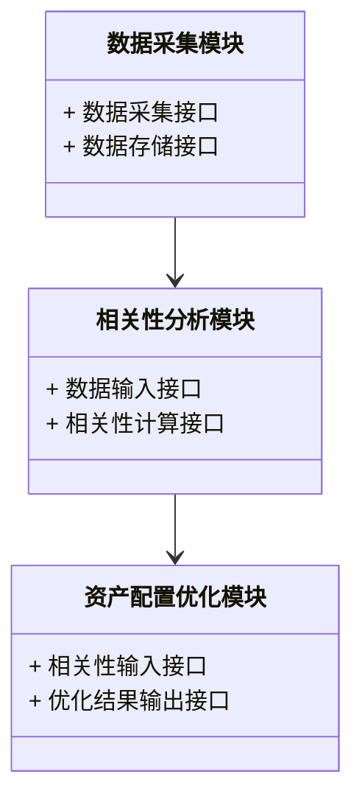
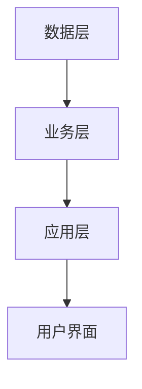
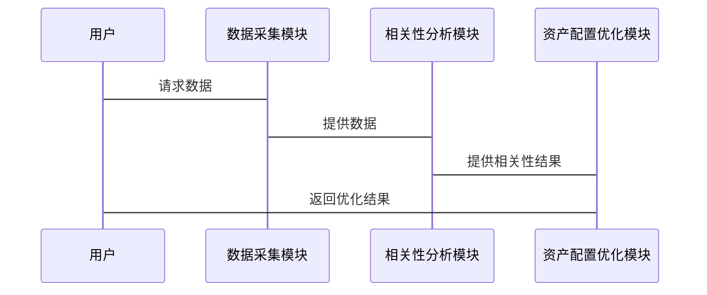

                 


# 多智能体系统在跨资产类别相关性分析中的应用：优化配置

关键词：多智能体系统，跨资产相关性分析，资产配置优化，分布式计算，协同优化，机器学习

摘要：本文探讨了多智能体系统在跨资产类别相关性分析中的应用，通过优化配置算法，解决传统方法在数据量大、复杂性高的金融环境下的局限性。文章详细分析了多智能体系统的定义、特点，跨资产相关性分析的数学模型，以及如何通过多智能体协同优化算法实现资产配置的优化。

---

## 第1章：多智能体系统与跨资产相关性分析概述

### 1.1 多智能体系统的定义与特点

#### 1.1.1 多智能体系统的定义
多智能体系统（Multi-Agent System, MAS）是由多个相互作用的智能体组成的系统，这些智能体能够感知环境、协作完成任务，并通过通信实现目标。

#### 1.1.2 多智能体系统的核心特点
- **分布式计算**：智能体独立运行，通过通信协作完成任务。
- **自主性**：每个智能体都有自己的决策机制。
- **协同性**：智能体之间通过通信和协调实现共同目标。
- **动态性**：系统能够适应环境变化。

#### 1.1.3 多智能体系统的应用场景
- 金融领域：资产配置、风险控制。
- 工业自动化：生产流程优化。
- 交通系统：路径规划、交通流量管理。

### 1.2 跨资产类别相关性分析的背景

#### 1.2.1 资产类别与相关性的定义
资产类别是指不同类型的金融资产，如股票、债券、商品等。相关性分析研究不同资产之间收益变化的关系。

#### 1.2.2 跨资产相关性分析的重要性
- 优化投资组合：通过降低相关性分散风险。
- 风险管理：识别资产之间的相互影响。
- 市场趋势预测：利用相关性分析预测市场变化。

#### 1.2.3 传统相关性分析的局限性
- 数据量大：传统方法处理大规模数据效率低。
- 复杂性高：跨资产相关性分析涉及多个变量，传统方法难以处理。
- 动态性：市场环境变化快，传统方法难以实时更新。

### 1.3 多智能体系统在跨资产相关性分析中的优势

#### 1.3.1 多智能体系统的分布式计算能力
- 多智能体系统能够同时处理大量数据，提高计算效率。
- 分布式计算能够降低单点故障风险，提高系统的稳定性。

#### 1.3.2 多智能体系统的协同优化能力
- 智能体之间通过协作优化资产配置，提高投资收益。
- 协同优化能够降低相关性风险，实现资产配置的最优解。

#### 1.3.3 多智能体系统的自适应性
- 系统能够实时适应市场变化，快速调整资产配置。
- 自适应性使得多智能体系统在动态环境中表现更优。

## 1.4 本章小结
本章介绍了多智能体系统的基本概念和特点，分析了跨资产相关性分析的重要性及其传统方法的局限性。同时，探讨了多智能体系统在跨资产相关性分析中的优势，为后续章节的分析奠定了基础。

---

## 第2章：多智能体系统与跨资产相关性分析的核心概念

### 2.1 多智能体系统的组成与功能

#### 2.1.1 多智能体系统的组成
- **智能体**：独立的决策单元，负责处理特定任务。
- **通信机制**：智能体之间的信息交互方式。
- **协同机制**：智能体之间协作完成任务的规则。

#### 2.1.2 多智能体系统的核心功能
- 数据采集与处理：智能体收集和处理数据。
- 协同计算：智能体之间协作完成复杂计算。
- 自适应调整：根据环境变化调整系统行为。

### 2.2 跨资产类别相关性分析的数学模型

#### 2.2.1 相关性分析的基本公式
相关性分析通常使用协方差或相关系数来衡量资产之间的相关性。相关系数的计算公式如下：

$$ r_{ij} = \frac{\sum_{t=1}^{n}(x_i - \bar{x})(x_j - \bar{x})}{\sqrt{\sum_{t=1}^{n}(x_i - \bar{x})^2} \sqrt{\sum_{t=1}^{n}(x_j - \bar{x})^2}} $$

其中，$x_i$ 和 $x_j$ 分别是资产 $i$ 和 $j$ 的收益，$\bar{x}$ 是平均收益。

#### 2.2.2 资产类别相关性的度量方法
- **协方差矩阵**：衡量资产之间收益的协同变化。
- **相关系数矩阵**：标准化后的相关性度量。
- **资产分类**：基于相关性将资产分为不同的类别。

### 2.3 多智能体系统与跨资产相关性分析的联系

#### 2.3.1 多智能体系统的协同机制
- 智能体之间的通信与协作是实现跨资产相关性分析的关键。
- 协同机制确保智能体能够高效地完成任务。

#### 2.3.2 跨资产相关性分析的分布式计算
- 多智能体系统能够将复杂任务分解为多个子任务，由不同的智能体完成。
- 分布式计算能够提高计算效率，降低单点故障风险。

## 2.4 本章小结
本章详细讲解了多智能体系统的组成与功能，分析了跨资产相关性分析的数学模型，探讨了多智能体系统与跨资产相关性分析的联系，为后续章节的算法实现奠定了理论基础。

---

## 第3章：多智能体系统与跨资产相关性分析的算法原理

### 3.1 多智能体协同算法

#### 3.1.1 分布式协同算法
- 智能体之间通过通信完成任务分配。
- 分布式协同算法能够提高系统的并行计算能力。

#### 3.1.2 基于智能体的优化算法
- 智能体通过局部优化实现全局最优。
- 优化算法通常采用分布式计算方式。

#### 3.1.3 多智能体系统的通信机制
- 智能体之间的通信是通过消息传递完成的。
- 通信机制需要设计高效的通信协议。

### 3.2 跨资产相关性分析算法

#### 3.2.1 基于协方差的相关性分析
- 协方差矩阵用于衡量资产之间的协同变化。
- 协方差矩阵的计算公式如下：

$$ \text{协方差矩阵} = \frac{1}{n-1} \sum_{i=1}^{n} (x_i - \bar{x})(x_i - \bar{x})^T $$

其中，$x_i$ 是数据向量，$\bar{x}$ 是数据均值。

#### 3.2.2 基于相关系数的资产分类
- 相关系数矩阵用于资产分类。
- 相关系数的计算公式如下：

$$ r_{ij} = \frac{\text{协方差}(x_i, x_j)}{\sigma_i \sigma_j} $$

其中，$\sigma_i$ 和 $\sigma_j$ 分别是资产 $i$ 和 $j$ 的标准差。

#### 3.2.3 资产组合优化的数学模型
- 资产组合优化的目标是在风险和收益之间找到最佳平衡点。
- 优化模型通常采用二次规划问题，公式如下：

$$ \min_{w} w^T \Sigma w $$
$$ \text{s.t.} \quad w^T \mu = r $$
$$ \quad \sum_{i=1}^{n} w_i = 1 $$

其中，$w$ 是权重向量，$\Sigma$ 是协方差矩阵，$\mu$ 是收益向量，$r$ 是目标收益。

### 3.3 多智能体协同优化算法

#### 3.3.1 分布式优化算法
- 多智能体系统通过分布式优化算法实现全局最优。
- 分布式优化算法通常采用交替方向乘子法（ADMM）或分布式梯度下降法。

#### 3.3.2 资产组合优化的具体实现
- 智能体之间通过通信共享优化结果。
- 分布式优化算法能够提高系统的计算效率。

#### 3.3.3 多智能体系统的自适应优化
- 系统能够根据市场变化动态调整优化策略。
- 自适应优化算法能够提高系统的鲁棒性和适应性。

## 3.4 本章小结
本章详细讲解了多智能体协同算法和资产组合优化算法，分析了相关性分析的数学模型，探讨了多智能体系统在资产配置优化中的应用，为后续章节的系统设计奠定了算法基础。

---

## 第4章：多智能体系统与跨资产相关性分析的系统分析与架构设计

### 4.1 问题场景介绍

#### 4.1.1 资产配置问题
- 资产配置问题是指如何将资金分配到不同的资产类别中，以实现收益最大化和风险最小化。
- 多智能体系统能够通过协同优化实现资产配置的最优解。

#### 4.1.2 跨资产相关性分析的复杂性
- 跨资产相关性分析涉及大量数据和复杂算法。
- 系统需要能够高效地处理大规模数据和复杂算法。

### 4.2 系统功能设计

#### 4.2.1 数据采集模块
- 数据采集模块负责收集不同资产类别的数据。
- 数据来源包括股票、债券、商品等。

#### 4.2.2 相关性分析模块
- 相关性分析模块负责计算资产之间的相关性。
- 模块采用协方差矩阵和相关系数矩阵进行分析。

#### 4.2.3 资产配置优化模块
- 资产配置优化模块负责根据相关性分析结果优化资产配置。
- 模块采用分布式优化算法实现全局最优。

### 4.3 系统架构设计

#### 4.3.1 领域模型设计
- 领域模型采用Mermaid类图表示，展示系统各模块之间的关系。
- 类图如下：



#### 4.3.2 系统架构设计
- 系统架构采用分层设计，包括数据层、业务层和应用层。
- 架构图如下：



#### 4.3.3 系统接口设计
- 系统接口包括数据接口、算法接口和优化接口。
- 接口设计需要考虑系统的可扩展性和可维护性。

#### 4.3.4 系统交互设计
- 系统交互采用Mermaid序列图表示，展示系统各模块之间的交互过程。
- 序列图如下：



### 4.4 本章小结
本章详细介绍了问题场景，设计了系统的功能模块和架构，展示了系统各部分之间的关系和交互过程，为后续章节的项目实施奠定了基础。

---

## 第5章：多智能体系统与跨资产相关性分析的项目实战

### 5.1 环境安装

#### 5.1.1 安装Python环境
- 安装Python 3.8及以上版本。
- 安装必要的Python库，如NumPy、Pandas、Matplotlib等。

#### 5.1.2 安装多智能体系统框架
- 使用分布式计算框架，如Dask或Ray。
- 安装相关依赖库。

#### 5.1.3 数据源获取
- 数据源可以是金融数据API，如Yahoo Finance或Alpha Vantage。
- 数据格式通常为CSV或JSON。

### 5.2 系统核心实现

#### 5.2.1 数据预处理代码
- 数据预处理包括数据清洗和标准化。
- 代码示例如下：

```python
import pandas as pd
import numpy as np

# 读取数据
data = pd.read_csv('assets.csv')

# 数据清洗
data = data.dropna()

# 标准化处理
data = (data - data.mean()) / data.std()
```

#### 5.2.2 相关性分析代码
- 相关性分析代码实现协方差矩阵和相关系数矩阵的计算。
- 代码示例如下：

```python
import numpy as np

def calculate_covariance(data):
    return np.cov(data.T)

def calculate_correlation(data):
    return np.corrcoef(data.T)
```

#### 5.2.3 资产配置优化代码
- 资产配置优化代码采用分布式优化算法实现全局最优。
- 代码示例如下：

```python
import dask.distributed as dd

def optimize_portfolio(data):
    # 定义目标函数
    def objective(w):
        return (w.T @ data @ w).item()

    # 定义约束条件
    constraints = [
        ('sum', w >= 0),
        ('sum', w.sum() == 1)
    ]

    # 使用Dask进行分布式优化
    with dd.Client() as client:
        result = client.submit(optimize, data, constraints)
        return result

# 运行优化
result = optimize_portfolio(data)
print(result)
```

### 5.3 实际案例分析

#### 5.3.1 数据准备
- 数据来源：假设我们有三只股票的数据，分别来自科技、金融和消费行业。

#### 5.3.2 相关性分析
- 计算三只股票的相关性矩阵，分析它们之间的相关性。

#### 5.3.3 资产配置优化
- 根据相关性分析结果优化资产配置，实现风险最小化和收益最大化。

### 5.4 代码应用解读与分析

#### 5.4.1 数据预处理
- 数据预处理包括数据清洗和标准化，确保数据的准确性和一致性。

#### 5.4.2 相关性分析
- 协方差矩阵和相关系数矩阵的计算是相关性分析的核心步骤。
- 相关系数矩阵能够更直观地反映资产之间的相关性。

#### 5.4.3 资产配置优化
- 分布式优化算法能够高效地处理大规模数据和复杂算法。
- 优化结果能够帮助投资者做出科学的决策。

### 5.5 项目小结
本章通过实际案例分析，展示了多智能体系统在跨资产相关性分析中的应用，验证了算法的有效性和可行性。

---

## 第6章：多智能体系统与跨资产相关性分析的总结与展望

### 6.1 本章总结
- 本文详细探讨了多智能体系统在跨资产相关性分析中的应用，通过优化配置算法，解决了传统方法在数据量大、复杂性高的金融环境下的局限性。

### 6.2 未来展望
- 多智能体系统在跨资产相关性分析中的应用前景广阔。
- 未来研究可以进一步探索多智能体系统的自适应性和智能化。

### 6.3 最佳实践 tips
- 在实际应用中，建议根据具体需求选择合适的多智能体系统框架。
- 数据预处理和特征工程是影响系统性能的关键因素。

### 6.4 注意事项
- 系统设计需要考虑数据隐私和安全问题。
- 系统实现需要考虑计算资源的分配和管理。

### 6.5 拓展阅读
- 推荐阅读相关领域的书籍和论文，如《分布式计算》、《多智能体系统》等。

## 作者：AI天才研究院/AI Genius Institute & 禅与计算机程序设计艺术 /Zen And The Art of Computer Programming

---

以上是文章的详细大纲，您可以根据需要进一步扩展每个部分的内容。

