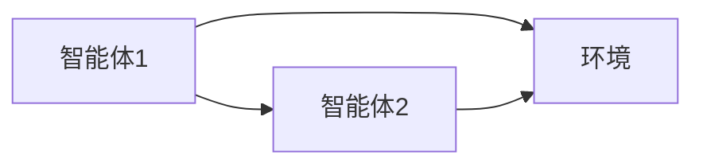
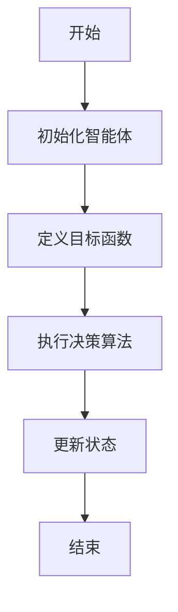
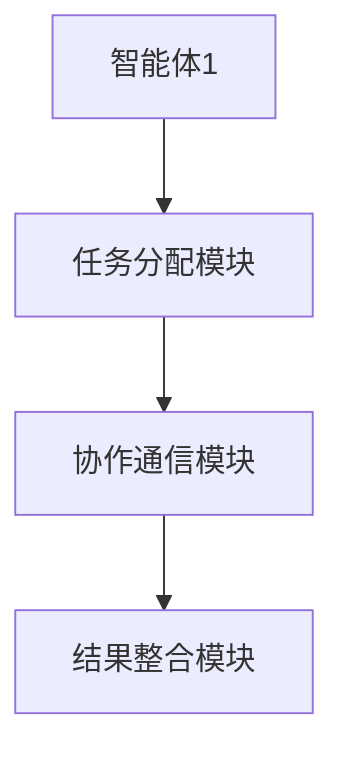
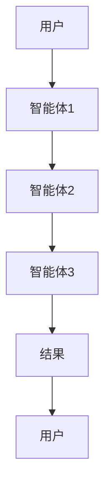

                 


# 多智能体系统在长期价值创造分析中的应用

## 关键词：多智能体系统、长期价值创造、分布式计算、博弈论模型、系统架构设计、项目实战、价值分析

## 摘要：本文深入探讨了多智能体系统在长期价值创造分析中的应用，从背景介绍到系统设计，再到项目实战，全面解析了多智能体系统的原理、算法、架构及其在实际场景中的应用。通过详细的案例分析和代码实现，展示了如何利用多智能体系统实现长期价值创造。

---

# 第一部分: 多智能体系统与长期价值创造分析的背景介绍

## 第1章: 多智能体系统的定义与特点

### 1.1 多智能体系统的定义

#### 1.1.1 多智能体系统的定义
多智能体系统（Multi-Agent System, MAS）是由多个智能体组成的系统，这些智能体能够通过协作完成复杂的任务。智能体是具有感知、决策和执行能力的实体，可以是软件程序或物理设备。

#### 1.1.2 多智能体系统的核心特点
- **自主性**：每个智能体都具有自主决策的能力。
- **协作性**：智能体之间通过协作完成任务。
- **分布性**：智能体分布在网络中，不依赖于中心节点。
- **动态性**：系统环境和智能体状态动态变化。

#### 1.1.3 多智能体系统与相关概念的对比
| 概念 | 定义 | 特点 |
|------|------|------|
| 智能体 | 具有感知、决策和执行能力的实体 | 独立性、主动性、反应性 |
| 分布式系统 | 由多个节点组成的系统 | 分布式计算、无中心节点 |
| 博弈论模型 | 描述多个参与者之间的策略互动 | 竞争与合作、纳什均衡 |

### 1.2 长期价值创造分析的定义

#### 1.2.1 长期价值创造的定义
长期价值创造是指通过持续优化和改进，为组织或系统创造持久的经济和社会价值。

#### 1.2.2 长期价值创造的分析框架
长期价值创造的分析框架包括目标设定、资源配置、协作优化和效果评估四个部分。

#### 1.2.3 长期价值创造与多智能体系统的联系
多智能体系统通过分布式计算和协作机制，能够有效优化资源配置，实现长期价值创造。

## 第2章: 多智能体系统在长期价值创造中的应用背景

### 2.1 问题背景

#### 2.1.1 当前价值创造分析的挑战
传统价值创造分析方法难以应对复杂系统的动态性和不确定性。

#### 2.1.2 多智能体系统的优势
多智能体系统具有分布式计算和协作能力，能够应对复杂系统的挑战。

#### 2.1.3 应用场景的多样性
多智能体系统广泛应用于经济、社会、环境等多个领域。

### 2.2 问题描述

#### 2.2.1 长期价值创造的复杂性
长期价值创造需要考虑多个因素的动态变化。

#### 2.2.2 多智能体系统的适用性
多智能体系统能够通过分布式计算和协作优化，实现长期价值创造。

#### 2.2.3 应用中的边界与外延
多智能体系统的应用边界包括系统的动态性和智能体的自主性，外延包括系统的扩展性和适应性。

## 第3章: 多智能体系统的核心概念与联系

### 3.1 多智能体系统的核心原理

#### 3.1.1 分布式计算与协作机制
分布式计算通过多个智能体协作完成任务，避免了单点故障。

#### 3.1.2 博弈论与决策模型
博弈论模型描述智能体之间的策略互动，帮助优化决策。

#### 3.1.3 自适应与学习能力
智能体通过学习和自适应，能够更好地应对环境变化。

### 3.2 实体关系图



### 3.3 算法流程图



---

# 第二部分: 多智能体系统的算法原理

## 第4章: 分布式计算与协作算法

### 4.1 分布式计算的基本原理

#### 4.1.1 分布式计算的定义
分布式计算是指通过多台计算机协作完成任务的计算方式。

#### 4.1.2 分布式计算的核心算法
分布式计算的核心算法包括一致性算法、分布式锁和分布式事务。

#### 4.1.3 分布式计算的应用场景
分布式计算广泛应用于分布式系统、云计算和大数据处理。

### 4.2 协作算法的设计

#### 4.2.1 协作算法的定义
协作算法是指多个智能体通过协作完成任务的算法。

#### 4.2.2 协作算法的核心步骤
协作算法的核心步骤包括任务分配、协作通信和结果整合。

#### 4.2.3 协作算法的实现案例
```python
# 分布式协作算法实现
def distribute_task(tasks):
    agents = [agent1, agent2, agent3]
    for task in tasks:
        agent = random.choice(agents)
        agent.execute_task(task)
```

---

## 第5章: 博弈论与决策模型

### 5.1 博弈论的基本原理

#### 5.1.1 博弈论的定义
博弈论是研究多个参与者之间策略互动的数学理论。

#### 5.1.2 博弈论的核心模型
博弈论的核心模型包括完全信息博弈和不完全信息博弈。

#### 5.1.3 博弈论的应用场景
博弈论广泛应用于经济、社会和环境等领域。

### 5.2 决策模型的设计

#### 5.2.1 决策模型的定义
决策模型是指智能体在面对选择时的决策规则。

#### 5.2.2 决策模型的核心步骤
决策模型的核心步骤包括状态感知、策略选择和行动执行。

#### 5.2.3 决策模型的实现案例
```python
# 决策模型实现
def decision_model(state):
    if state == 'good':
        return 'cooperate'
    else:
        return 'defect'
```

---

## 第6章: 多智能体系统的数学模型与公式

### 6.1 多智能体系统的数学模型

#### 6.1.1 系统模型的定义
系统模型是描述多智能体系统行为的数学框架。

#### 6.1.2 系统模型的核心公式
$$V(a,b) = \max_{a} \min_{b} V(a,b)$$

#### 6.1.3 系统模型的应用场景
系统模型广泛应用于经济、社会和环境等领域。

### 6.2 博弈论模型的数学公式

#### 6.2.1 博弈论模型的定义
博弈论模型是描述多个参与者之间策略互动的数学框架。

#### 6.2.2 博弈论模型的核心公式
$$\max_{a} \min_{b} V(a,b)$$

#### 6.2.3 博弈论模型的应用场景
博弈论模型广泛应用于经济、社会和环境等领域。

---

# 第三部分: 多智能体系统的系统架构设计

## 第7章: 系统分析与架构设计方案

### 7.1 系统分析

#### 7.1.1 系统分析的定义
系统分析是指对系统的需求、功能和结构进行分析的过程。

#### 7.1.2 系统分析的核心步骤
系统分析的核心步骤包括需求分析、功能分析和结构分析。

#### 7.1.3 系统分析的应用场景
系统分析广泛应用于软件开发、经济和社会等领域。

### 7.2 系统架构设计

#### 7.2.1 系统架构设计的定义
系统架构设计是指设计系统的整体结构和组成部分。

#### 7.2.2 系统架构设计的核心步骤
系统架构设计的核心步骤包括功能分解、模块设计和接口设计。

#### 7.2.3 系统架构设计的应用案例


---

## 第8章: 系统接口设计与交互流程

### 8.1 系统接口设计

#### 8.1.1 系统接口设计的定义
系统接口设计是指设计系统之间的接口和交互方式。

#### 8.1.2 系统接口设计的核心步骤
系统接口设计的核心步骤包括需求分析、接口定义和测试验证。

#### 8.1.3 系统接口设计的应用场景
系统接口设计广泛应用于软件开发、网络通信和分布式系统等领域。

### 8.2 系统交互流程

#### 8.2.1 系统交互流程的定义
系统交互流程是指系统之间的交互过程。

#### 8.2.2 系统交互流程的核心步骤
系统交互流程的核心步骤包括发起请求、处理请求和返回结果。

#### 8.2.3 系统交互流程的应用案例


---

# 第四部分: 多智能体系统的项目实战

## 第9章: 项目实战

### 9.1 环境安装

#### 9.1.1 环境安装的定义
环境安装是指为项目配置所需的软件和硬件环境。

#### 9.1.2 环境安装的核心步骤
环境安装的核心步骤包括安装操作系统、安装开发工具和配置网络环境。

#### 9.1.3 环境安装的应用场景
环境安装广泛应用于软件开发、网络通信和分布式系统等领域。

### 9.2 系统核心实现

#### 9.2.1 系统核心实现的定义
系统核心实现是指实现系统的核心功能。

#### 9.2.2 系统核心实现的核心步骤
系统核心实现的核心步骤包括需求分析、功能设计和代码实现。

#### 9.2.3 系统核心实现的应用案例
```python
# 系统核心实现代码
class Agent:
    def __init__(self, id):
        self.id = id
        self.state = 'idle'

    def execute_task(self, task):
        print(f"Agent {self.id} is executing task {task}")
```

### 9.3 案例分析与代码实现

#### 9.3.1 案例分析的定义
案例分析是指通过具体案例分析系统的功能和性能。

#### 9.3.2 案例分析的核心步骤
案例分析的核心步骤包括案例选择、案例分析和案例总结。

#### 9.3.3 案例分析的应用场景
案例分析广泛应用于软件开发、经济和社会等领域。

### 9.4 项目小结

#### 9.4.1 项目小结的定义
项目小结是指对项目的整体情况进行总结。

#### 9.4.2 项目小结的核心内容
项目小结的核心内容包括项目目标、项目过程和项目结果。

#### 9.4.3 项目小结的应用场景
项目小结广泛应用于软件开发、经济和社会等领域。

---

# 第五部分: 总结与展望

## 第10章: 总结与展望

### 10.1 最佳实践 tips

#### 10.1.1 系统设计中的注意事项
系统设计中需要注意模块化和可扩展性。

#### 10.1.2 系统实现中的注意事项
系统实现中需要注意代码质量和测试覆盖率。

#### 10.1.3 系统优化中的注意事项
系统优化中需要注意性能和可维护性。

### 10.2 小结

#### 10.2.1 小结的定义
小结是指对文章的总体情况进行总结。

#### 10.2.2 小结的核心内容
小结的核心内容包括文章的主要内容和文章的主要观点。

#### 10.2.3 小结的应用场景
小结广泛应用于学术论文、技术报告和工作总结等领域。

### 10.3 注意事项

#### 10.3.1 系统设计中的注意事项
系统设计中需要注意模块化和可扩展性。

#### 10.3.2 系统实现中的注意事项
系统实现中需要注意代码质量和测试覆盖率。

#### 10.3.3 系统优化中的注意事项
系统优化中需要注意性能和可维护性。

### 10.4 拓展阅读

#### 10.4.1 拓展阅读的定义
拓展阅读是指阅读与主题相关的其他资料。

#### 10.4.2 拓展阅读的核心内容
拓展阅读的核心内容包括相关领域的最新研究和相关领域的实践案例。

#### 10.4.3 拓展阅读的应用场景
拓展阅读广泛应用于学术研究、技术开发和知识更新等领域。

---

# 作者：AI天才研究院/AI Genius Institute & 禅与计算机程序设计艺术 /Zen And The Art of Computer Programming

