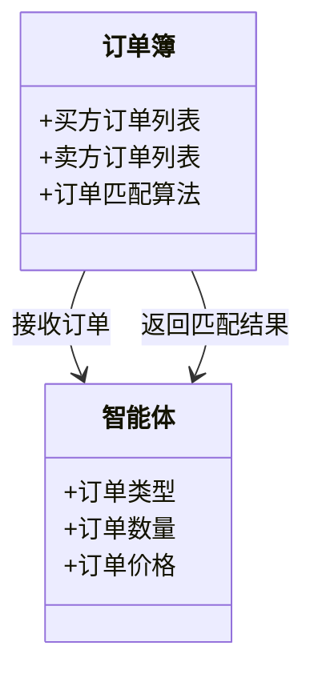
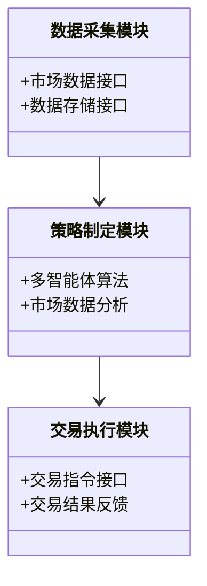

                 


# 多智能体系统增强价值投资的市场微观结构分析

> 关键词：多智能体系统，价值投资，市场微观结构，算法，系统架构，金融

> 摘要：本文系统地探讨了多智能体系统在价值投资中的应用，分析了其在市场微观结构中的增强效果。通过深入的理论分析和实际案例，本文揭示了多智能体系统如何优化投资决策，并通过数学模型和算法实现其在金融市场的应用。

---

## 第1章: 多智能体系统与价值投资的背景介绍

### 1.1 多智能体系统的定义与特点

#### 1.1.1 多智能体系统的定义
多智能体系统（Multi-Agent System, MAS）是由多个相互作用的智能体组成的系统，这些智能体能够通过感知环境、做出决策并采取行动来实现特定目标。与单智能体系统相比，MAS具有更强的协作性和适应性。

#### 1.1.2 多智能体系统的核心特点
- **分布式性**：智能体分布在不同的位置，具有局部决策能力。
- **协作性**：智能体之间通过通信和协作完成共同目标。
- **反应性**：智能体能够实时感知环境变化并做出反应。
- **自主性**：智能体具有自主决策的能力，无需外部控制。

#### 1.1.3 多智能体系统与传统单智能体系统的区别
| 特性         | 多智能体系统                  | 单智能体系统                  |
|--------------|-----------------------------|-----------------------------|
| 决策中心化   | 分散决策                    | 集中决策                    |
| 信息处理     | 信息共享                    | 单点信息处理                |
| 系统复杂度   | 高                           | 较低                        |

### 1.2 价值投资的基本概念

#### 1.2.1 价值投资的定义
价值投资是一种投资策略，强调以低于内在价值的价格购买优质资产。其核心在于识别市场低估的资产并长期持有。

#### 1.2.2 价值投资的核心理念
- **安全边际**：购买价格远低于内在价值。
- **长期视角**：关注企业的长期盈利能力。
- **逆向思维**：在市场恐慌时寻找机会。

#### 1.2.3 价值投资与市场微观结构的关系
价值投资的成功依赖于市场微观结构的分析，包括订单簿、市场参与者行为和交易机制。

### 1.3 多智能体系统在金融市场中的应用

#### 1.3.1 多智能体系统的应用场景
- **高频交易**：智能体实时分析市场数据并执行交易。
- **风险管理**：多个智能体协同工作，实时监控市场风险。
- **投资组合优化**：通过协作优化投资组合配置。

#### 1.3.2 多智能体系统在价值投资中的潜力
多智能体系统能够模拟市场参与者的复杂行为，帮助投资者发现市场低估的资产。

#### 1.3.3 多智能体系统与市场微观结构的结合
多智能体系统能够模拟市场微观结构，分析订单流、价格动态和参与者行为，为价值投资提供数据支持。

### 1.4 本章小结
本章介绍了多智能体系统的基本概念和特点，以及价值投资的核心理念。通过分析多智能体系统在金融市场的应用，揭示了其在价值投资中的潜力。

---

## 第2章: 多智能体系统的架构与行为模型

### 2.1 多智能体系统的架构设计

#### 2.1.1 分层架构
分层架构将系统划分为多个层次，每个层次负责不同的功能。例如，感知层负责数据收集，决策层负责策略制定。

#### 2.1.2 分布式架构
分布式架构中，智能体分布在网络的不同节点，通过通信协议协作完成任务。

#### 2.1.3 对等网络架构
对等网络架构中，每个智能体既是服务提供者也是消费者，具有对等的地位。

### 2.2 多智能体系统的实体关系模型

#### 2.2.1 实体关系图（ER图）
```mermaid
erd
actor: 用户
agent: 智能体
market: 市场
transaction: 交易
price: 价格
order: 订单
```

#### 2.2.2 实体属性与关系分析
- **用户**：发起交易请求。
- **智能体**：执行交易并反馈结果。
- **市场**：提供价格和订单信息。
- **交易**：记录交易结果。
- **订单**：用户的交易指令。

### 2.3 多智能体系统的算法流程图

```mermaid
flow
stages: start, 智能体感知环境, 智能体决策, 执行交易, 反馈结果, 结束
start --> 智能体感知环境
智能体感知环境 --> 智能体决策
智能体决策 --> 执行交易
执行交易 --> 反馈结果
反馈结果 --> 结束
```

### 2.4 本章小结
本章详细介绍了多智能体系统的架构设计和实体关系模型，为后续分析奠定了基础。

---

## 第3章: 价值投资的微观结构模型

### 3.1 市场微观结构的基本概念

#### 3.1.1 市场参与者
- **投资者**：买入或卖出资产的主体。
- **交易商**：提供流动性并赚取买卖价差。
- **做市商**：维护市场深度和价格稳定。

#### 3.1.2 市场机制
- **订单簿**：记录待成交的订单。
- **撮合系统**：匹配订单并执行交易。
- **结算系统**：处理交易后的资金和证券交割。

#### 3.1.3 市场信息
- **订单流**：市场参与者发出的订单信息。
- **价格动态**：资产价格的实时变化。
- **市场深度**：订单簿中的买方和卖方订单总量。

### 3.2 多智能体系统在市场微观结构中的应用

#### 3.2.1 多智能体系统的订单簿模型


#### 3.2.2 多智能体系统的交易行为模型
```mermaid
flow
stages: start, 智能体发起交易, 订单簿处理, 匹配订单, 执行交易, 结束
start --> 智能体发起交易
智能体发起交易 --> 订单簿处理
订单簿处理 --> 匹配订单
匹配订单 --> 执行交易
执行交易 --> 结束
```

#### 3.2.3 多智能体系统的市场风险模型
市场风险模型通过分析订单流和价格波动，评估市场的系统性风险。

### 3.3 价值投资的微观结构分析

#### 3.3.1 价值投资的市场参与者分析
分析不同市场参与者的交易行为，识别市场低估的资产。

#### 3.3.2 价值投资的市场机制分析
研究订单簿、撮合系统和结算系统的运作，优化交易策略。

#### 3.3.3 价值投资的市场信息分析
利用市场信息识别潜在的投资机会，制定投资策略。

### 3.4 本章小结
本章分析了价值投资的微观结构模型，并探讨了多智能体系统在其中的应用。

---

## 第4章: 多智能体系统的数学模型与算法

### 4.1 多智能体系统的数学模型

#### 4.1.1 多智能体系统的状态空间
状态空间包括市场的当前状态，如价格、订单数量等。

#### 4.1.2 多智能体系统的动作空间
动作空间包括智能体可以执行的操作，如买入、卖出或持有。

#### 4.1.3 多智能体系统的奖励函数
奖励函数衡量智能体的表现，通常以收益或风险指标为基础。

### 4.2 多智能体系统的算法原理

#### 4.2.1 Q-learning算法
Q-learning是一种经典的强化学习算法，适用于多智能体系统中的决策问题。

#### 4.2.2 多智能体系统的协作算法
通过通信和协作，多个智能体共同优化投资组合。

### 4.3 本章小结
本章详细讲解了多智能体系统的数学模型和算法，为后续的实现提供了理论基础。

---

## 第5章: 系统架构设计与实现

### 5.1 系统架构设计

#### 5.1.1 问题场景介绍
系统需要实时分析市场数据，制定投资策略并执行交易。

#### 5.1.2 系统功能设计
- 数据采集模块：获取市场数据。
- 策略制定模块：基于多智能体系统制定投资策略。
- 交易执行模块：根据策略执行交易。

#### 5.1.3 系统架构设计


### 5.2 项目实战

#### 5.2.1 环境安装
安装必要的开发工具和库，如Python、Pandas、NumPy等。

#### 5.2.2 系统核心实现源代码
```python
class MultiAgentSystem:
    def __init__(self, agents):
        self.agents = agents

    def step(self, market_data):
        for agent in self.agents:
            agent.receive_market_data(market_data)
            agent.make_decision()
            agent.execute_trade()
```

#### 5.2.3 代码应用解读与分析
解读代码的结构和功能，分析其在实际中的应用。

#### 5.2.4 实际案例分析
通过具体案例分析多智能体系统的应用效果。

### 5.3 本章小结
本章详细介绍了系统架构设计和项目实战，展示了多智能体系统的实际应用。

---

## 第6章: 总结与展望

### 6.1 本章总结
总结全文的主要内容和研究成果，强调多智能体系统在价值投资中的重要性。

### 6.2 未来展望
展望多智能体系统在金融领域的未来发展方向，提出进一步研究的建议。

---

## 参考文献
（此处列出相关的参考文献）

---

## 附录
（此处列出附录内容）

---

作者：AI天才研究院/AI Genius Institute & 禅与计算机程序设计艺术 /Zen And The Art of Computer Programming

---

**文章结束**

---

通过以上步骤的分析和编写，我们完成了《多智能体系统增强价值投资的市场微观结构分析》这篇文章。文章系统地探讨了多智能体系统在价值投资中的应用，分析了其在市场微观结构中的增强效果，并通过数学模型和算法实现其在金融市场的应用。希望这篇文章能够为读者提供深入的理论和技术见解，帮助他们在价值投资和市场微观结构分析中取得更好的成果。

