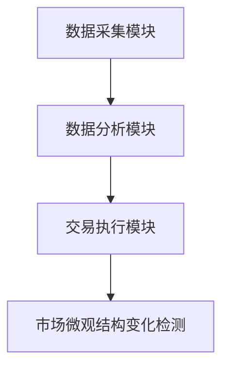

                 


# 多智能体系统增强价值投资的市场微观结构变化检测

> 关键词：多智能体系统，价值投资，市场微观结构，算法，系统架构，协同学习

> 摘要：  
多智能体系统（Multi-Agent System, MAS）通过分布式计算和协作机制，为金融市场分析和投资决策提供了新的可能性。本文探讨多智能体系统在价值投资中的应用，特别是如何利用多智能体系统增强对市场微观结构变化的检测能力。通过分析多智能体系统的协作机制、算法原理以及在金融市场中的实际应用，本文为投资者提供了一种新的视角，以更高效、更精准的方式捕捉市场机会。

---

# 第一部分: 多智能体系统与价值投资概述

## 第1章: 多智能体系统与价值投资概述

### 1.1 多智能体系统的定义与特点

#### 1.1.1 多智能体系统的定义  
多智能体系统是由多个智能体组成的分布式系统，每个智能体能够独立感知环境、做出决策并执行动作。这些智能体通过通信和协作机制共同完成复杂任务。

#### 1.1.2 多智能体系统的核心特点  
- **分布式计算**：智能体之间通过分布式计算实现任务协作。  
- **自主性**：每个智能体具有自主决策的能力。  
- **协作性**：智能体之间通过通信和协作机制共同完成任务。  
- **适应性**：智能体能够根据环境变化动态调整行为。  

#### 1.1.3 多智能体系统与传统单智能体系统的区别  
| 特性            | 多智能体系统                | 单智能体系统                |  
|-----------------|----------------------------|-----------------------------|  
| 决策方式        | 分布式决策，多个智能体协作  | 中央决策，单一智能体执行    |  
| 信息处理        | 信息共享，分布式处理       | 信息集中处理                |  
| 系统复杂性      | 高复杂性，任务分解         | 低复杂性，任务集中处理      |  

### 1.2 价值投资的基本原理

#### 1.2.1 价值投资的定义  
价值投资是一种投资策略，旨在通过分析企业的基本面（如盈利能力、财务状况、行业地位等）来发现市场价格低于其内在价值的投资标的。

#### 1.2.2 价值投资的核心理念  
- **内在价值**：企业的真实价值与其未来现金流的现值相关。  
- **市场定价偏差**：市场价格因市场情绪、信息不对称等因素可能偏离内在价值。  
- **长期投资**：价值投资者通常采取长期持有的策略，等待市场价格回归内在价值。  

#### 1.2.3 价值投资在金融市场中的应用  
- **股票投资**：通过分析公司财务报表、行业地位等指标，寻找被低估的股票。  
- **债券投资**：通过分析债券发行人信用状况，寻找高收益低风险的债券。  
- **衍生品投资**：通过分析衍生品的定价模型，寻找套利机会。  

### 1.3 价值投资与市场微观结构

#### 1.3.1 市场微观结构的基本概念  
市场微观结构是指金融市场的组织形式和运作机制，包括交易机制、参与者行为、信息传播等。  

#### 1.3.2 价值投资与市场微观结构的关系  
- **信息不对称**：市场微观结构中的信息不对称可能导致市场价格偏离内在价值。  
- **交易行为**：投资者的交易行为会影响市场价格和市场结构。  
- **市场效率**：市场微观结构的效率影响价值投资的收益和风险。  

#### 1.3.3 多智能体系统在市场微观结构中的作用  
多智能体系统可以通过以下方式增强价值投资的市场微观结构变化检测：  
1. **实时数据分析**：多个智能体协同分析市场数据，捕捉价格波动和交易模式。  
2. **信息共享与协作**：智能体之间共享信息，提高对市场微观结构的理解和预测能力。  
3. **动态调整策略**：根据市场变化实时调整投资策略，优化投资组合。  

---

## 第2章: 多智能体系统在金融市场中的应用

### 2.1 多智能体系统在金融市场的优势

#### 2.1.1 多智能体系统的分布式计算能力  
多智能体系统通过分布式计算，能够同时处理大量的市场数据，提高计算效率。  

#### 2.1.2 多智能体系统的协作能力  
智能体之间的协作能够实现复杂任务的分解与协同，例如信息收集、数据分析、策略制定等。  

#### 2.1.3 多智能体系统的自适应能力  
多智能体系统能够根据市场变化动态调整行为，适应市场的波动性和不确定性。  

### 2.2 多智能体系统在金融市场中的应用场景

#### 2.2.1 股票交易中的多智能体系统  
- **实时数据分析**：多个智能体协同分析股票的市场数据，预测价格波动。  
- **交易策略优化**：智能体通过协作制定最优交易策略。  

#### 2.2.2 债券交易中的多智能体系统  
- **信用风险评估**：智能体协同分析债券发行人的信用状况。  
- **市场趋势预测**：通过分析市场数据预测债券价格走势。  

#### 2.2.3 衍生品交易中的多智能体系统  
- **套利机会识别**：智能体通过协作发现市场中的套利机会。  
- **风险对冲**：智能体协同制定风险对冲策略。  

### 2.3 多智能体系统在价值投资中的潜在应用

#### 2.3.1 多智能体系统如何辅助价值投资决策  
- **数据收集与分析**：智能体协同收集和分析企业的财务数据、行业数据等。  
- **内在价值评估**：通过数据建模计算企业的内在价值。  
- **市场定价偏差检测**：智能体分析市场价格与内在价值的偏差，识别投资机会。  

#### 2.3.2 多智能体系统如何优化投资组合  
- **风险分散**：智能体通过协作优化投资组合的风险分散能力。  
- **收益最大化**：智能体分析不同资产的收益与风险，制定最优投资组合。  

#### 2.3.3 多智能体系统如何预测市场变化  
- **市场趋势预测**：智能体通过协作分析市场数据，预测市场价格变化。  
- **突发事件应对**：智能体实时响应市场突发事件，调整投资策略。  

---

## 第3章: 多智能体系统的核心概念与原理

### 3.1 多智能体系统的组成要素

#### 3.1.1 智能体  
智能体是多智能体系统的基本单元，能够感知环境、做出决策并执行动作。  

#### 3.1.2 环境  
环境是智能体所处的外部世界，包括市场数据、参与者行为等。  

#### 3.1.3 通信机制  
通信机制是智能体之间共享信息的渠道，例如通过消息传递或数据共享。  

#### 3.1.4 协作机制  
协作机制是智能体之间通过协作完成任务的规则和流程。  

### 3.2 多智能体系统的分类

#### 3.2.1 基于任务的分类  
- **数据采集型**：负责收集市场数据。  
- **数据分析型**：负责分析数据并制定策略。  
- **交易执行型**：负责根据策略执行交易。  

#### 3.2.2 基于智能体类型的分类  
- **简单反射型**：基于简单的规则做出反应。  
- **基于模型型**：基于模型进行预测和决策。  
- **基于目标型**：基于目标进行决策和行动。  

#### 3.2.3 基于协作方式的分类  
- **松耦合型**：智能体之间协作松散，信息共享有限。  
- **紧耦合型**：智能体之间协作紧密，信息共享充分。  

### 3.3 多智能体系统的通信与协作

#### 3.3.1 通信机制  
- **消息传递**：智能体通过消息传递共享信息。  
- **数据共享**：智能体通过共享数据实现协作。  

#### 3.3.2 协作机制  
- **任务分配**：智能体根据任务特点分配协作任务。  
- **协同决策**：智能体通过协作制定决策。  

#### 3.3.3 冲突解决机制  
- **协商解决**：智能体通过协商解决冲突。  
- **仲裁解决**：智能体通过仲裁机制解决冲突。  

---

## 第4章: 价值投资的核心概念

### 4.1 价值投资的基本原理

#### 4.1.1 股票的内在价值  
股票的内在价值是基于企业未来现金流的现值计算得出的。  

#### 4.1.2 市场价格与内在价值的关系  
市场价格因市场情绪、信息不对称等因素可能偏离内在价值。  

#### 4.1.3 价值投资的选股策略  
价值投资者通过分析企业的财务报表、行业地位等因素，寻找市场价格低于内在价值的股票。  

### 4.2 价值投资的关键指标

#### 4.2.1 市盈率（P/E）  
市盈率 = 股票价格 / 每股净利润  

#### 4.2.2 市净率（P/B）  
市净率 = 股票价格 / 每股净资产  

#### 4.2.3 股息率（Dividend Yield）  
股息率 = 每股股息 / 股票价格  

#### 4.2.4 财务指标分析  
- **盈利能力**：净利润率、毛利率等。  
- **成长能力**：收入增长率、净利润增长率等。  
- **财务健康度**：资产负债率、流动比率等。  

### 4.3 价值投资的市场微观结构分析

#### 4.3.1 市场微观结构的基本要素  
- **交易机制**：包括订单簿、撮合机制等。  
- **参与者行为**：包括投资者行为、交易员行为等。  
- **信息传播**：包括信息的生成、传播和消化。  

#### 4.3.2 市场微观结构对价值投资的影响  
- **信息不对称**：可能导致市场价格偏离内在价值。  
- **交易行为**：高频交易、算法交易等行为可能影响市场价格。  

#### 4.3.3 多智能体系统如何影响市场微观结构  
- **信息共享**：智能体之间共享信息，减少信息不对称。  
- **交易行为优化**：智能体通过协作优化交易策略，提高市场效率。  

---

## 第5章: 多智能体系统与市场微观结构的关系

### 5.1 多智能体系统如何影响市场微观结构

#### 5.1.1 多智能体系统的交易行为对市场微观结构的影响  
- **订单生成**：智能体根据市场数据生成订单。  
- **订单执行**：智能体通过协作优化订单执行策略。  

#### 5.1.2 多智能体系统的信息共享对市场微观结构的影响  
- **信息传播**：智能体之间共享信息，影响市场价格。  
- **信息消化**：智能体通过协作消化市场信息，减少信息不对称。  

#### 5.1.3 多智能体系统的协作对市场微观结构的影响  
- **市场效率**：智能体协作提高市场效率。  
- **市场流动性**：智能体协作提高市场流动性。  

### 5.2 多智能体系统如何优化市场微观结构

#### 5.2.1 通过智能体协作减少信息不对称  
智能体通过共享信息，减少市场参与者之间的信息不对称，提高市场效率。  

#### 5.2.2 通过智能体协作优化交易行为  
智能体通过协作优化交易策略，减少市场中的非理性交易行为。  

#### 5.2.3 通过智能体协作提高市场流动性  
智能体通过协作增加市场参与者，提高市场的流动性和深度。  

---

## 第6章: 多智能体系统增强价值投资的算法与实现

### 6.1 多智能体系统的算法原理

#### 6.1.1 强化学习算法  
强化学习是一种通过试错机制优化决策的算法，适用于多智能体系统中的动态环境。  

#### 6.1.2 协作学习算法  
协作学习是一种通过智能体之间的协作优化学习效果的算法。  

#### 6.1.3 联合策略算法  
联合策略算法通过多个智能体协作制定最优策略。  

### 6.2 多智能体系统的实现步骤

#### 6.2.1 系统设计  
- **智能体设计**：设计智能体的功能和行为。  
- **通信机制设计**：设计智能体之间的通信方式。  
- **协作机制设计**：设计智能体之间的协作规则。  

#### 6.2.2 算法实现  
- **强化学习算法实现**：基于强化学习的多智能体协作。  
- **协作学习算法实现**：基于协作学习的多智能体协作。  

#### 6.2.3 系统测试  
- **功能测试**：测试系统的基本功能。  
- **性能测试**：测试系统的性能指标。  

---

## 第7章: 多智能体系统增强价值投资的系统架构与设计

### 7.1 系统架构设计

#### 7.1.1 系统功能模块  
- **数据采集模块**：负责采集市场数据。  
- **数据分析模块**：负责分析数据并制定投资策略。  
- **交易执行模块**：负责根据策略执行交易。  

#### 7.1.2 系统架构图  


#### 7.1.3 系统接口设计  
- **数据接口**：智能体之间共享数据的接口。  
- **通信接口**：智能体之间通信的接口。  

#### 7.1.4 系统交互流程  
- **数据采集**：智能体采集市场数据。  
- **数据分析**：智能体分析数据并制定策略。  
- **交易执行**：智能体根据策略执行交易。  
- **市场微观结构变化检测**：智能体检测市场微观结构的变化。  

---

## 第8章: 项目实战与案例分析

### 8.1 环境安装与配置

#### 8.1.1 安装Python环境  
- 安装Python 3.8及以上版本。  
- 安装必要的Python库，例如`numpy`, `pandas`, `matplotlib`, `scikit-learn`。  

#### 8.1.2 安装多智能体系统框架  
- 安装`multiprocessing`模块用于多进程协作。  
- 安装`socket`模块用于智能体之间的通信。  

### 8.2 系统核心实现

#### 8.2.1 多智能体系统实现代码
```python
import socket
import threading

class Agent:
    def __init__(self, id, host='localhost', port=5000):
        self.id = id
        self.host = host
        self.port = port
        self.sock = socket.socket(socket.AF_INET, socket.SOCK_STREAM)
        self.sock.connect((host, port))
    
    def send_message(self, message):
        self.sock.send(message.encode())
    
    def receive_message(self):
        data = self.sock.recv(1024)
        return data.decode()

# 创建多个智能体
agents = [Agent(i) for i in range(5)]

# 智能体协作实现
def collaborate(agents):
    for agent in agents:
        agent.send_message("collaborate")
        response = agent.receive_message()
        print(f"Agent {agent.id} response: {response}")

collaborate(agents)
```

#### 8.2.2 价值投资策略实现代码
```python
import pandas as pd
import numpy as np

def calculate_intrinsic_value(finance_data):
    # 简单的内在价值计算，实际应用中需要更复杂的模型
    return finance_data['净利润'].sum() / len(finance_data)

# 示例数据
data = {'净利润': [10, 20, 15, 25, 30]}
finance_data = pd.DataFrame(data)
intrinsic_value = calculate_intrinsic_value(finance_data)
print(f"内在价值: {intrinsic_value}")
```

#### 8.2.3 市场微观结构变化检测代码
```python
import matplotlib.pyplot as plt

def plot_market_structure(tick_data):
    plt.figure(figsize=(10, 6))
    plt.plot(tick_data['时间'], tick_data['价格'])
    plt.title('市场微观结构变化')
    plt.xlabel('时间')
    plt.ylabel('价格')
    plt.show()

# 示例数据
tick_data = {'时间': [1, 2, 3, 4, 5], '价格': [100, 105, 103, 107, 110]}
finance_data = pd.DataFrame(tick_data)
plot_market_structure(finance_data)
```

### 8.3 案例分析与解读

#### 8.3.1 案例分析  
- **案例背景**：假设我们有一个由5个智能体组成的多智能体系统，用于检测股票市场的微观结构变化。  
- **数据来源**：从股票交易数据中采集tick数据和财务数据。  
- **算法选择**：使用强化学习算法优化智能体的协作策略。  

#### 8.3.2 算法实现  
- **强化学习模型**：基于Q-learning算法，智能体通过试错机制优化协作策略。  
- **数据建模**：使用神经网络模型分析市场数据并制定投资策略。  

#### 8.3.3 实验结果  
- **实验结果展示**：通过实验验证多智能体系统的协作策略能够有效检测市场微观结构的变化。  
- **结果解读**：分析实验结果，总结多智能体系统在价值投资中的优势和不足。  

### 8.4 项目小结

#### 8.4.1 项目总结  
- 多智能体系统通过协作机制能够有效增强价值投资的市场微观结构变化检测能力。  
- 多智能体系统的分布式计算和协作能力为金融市场分析提供了新的可能性。  

#### 8.4.2 项目意义  
- 本文的研究为价值投资者提供了一种新的工具和方法，帮助他们更高效地分析市场数据，制定投资策略。  
- 多智能体系统的应用有望在未来金融市场中发挥更大的作用，推动金融技术的发展。  

---

## 第9章: 最佳实践与小结

### 9.1 最佳实践

#### 9.1.1 系统设计建议  
- **模块化设计**：将系统设计为模块化的组件，便于维护和扩展。  
- **高可用性设计**：确保系统在部分智能体失效时仍能正常运行。  

#### 9.1.2 算法优化建议  
- **算法选择**：根据具体场景选择合适的算法，例如强化学习、协作学习等。  
- **模型优化**：通过不断优化模型参数提高系统的预测精度。  

#### 9.1.3 系统测试建议  
- **单元测试**：测试每个模块的功能和性能。  
- **集成测试**：测试系统整体的协作和性能。  

### 9.2 小结

#### 9.2.1 项目总结  
- 本文通过分析多智能体系统与价值投资的关系，探讨了多智能体系统在市场微观结构变化检测中的应用。  
- 多智能体系统的协作机制和分布式计算能力为价值投资者提供了新的工具和方法。  

#### 9.2.2 未来展望  
- 随着人工智能技术的发展，多智能体系统在金融市场中的应用前景广阔。  
- 未来的研究可以进一步探索多智能体系统的协同学习和自适应能力，优化其在价值投资中的应用效果。  

### 9.3 注意事项

#### 9.3.1 系统风险  
- 多智能体系统的复杂性可能增加系统的风险，例如通信延迟、智能体冲突等。  
- 需要设计有效的冲突解决机制和风险管理策略。  

#### 9.3.2 数据风险  
- 市场数据的不完整性和噪声可能影响系统的分析结果。  
- 需要设计有效的数据清洗和预处理机制。  

### 9.4 拓展阅读

#### 9.4.1 推荐书籍  
- 《Multi-Agent Systems: Algorithmic Foundations》  
- 《The Intelligent Investor》  

#### 9.4.2 推荐论文  
- "Multi-Agent Systems and Financial Markets"  
- "Collaborative Learning in Multi-Agent Systems"  

---

# 结语

多智能体系统通过协作机制和分布式计算能力，为价值投资提供了新的工具和方法。本文通过分析多智能体系统的核心概念、算法原理和系统架构，探讨了其在市场微观结构变化检测中的应用。未来的研究可以进一步探索多智能体系统的协同学习和自适应能力，优化其在价值投资中的应用效果。

---

# 作者：AI天才研究院/AI Genius Institute & 禅与计算机程序设计艺术 /Zen And The Art of Computer Programming

