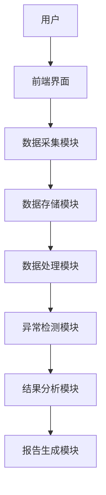

                 


# 多智能体系统增强价值投资的市场微观结构异常检测

## 关键词：
多智能体系统, 价值投资, 市场微观结构, 异常检测, 金融数据分析

## 摘要：
本文探讨了多智能体系统在价值投资中的应用，特别是如何利用多智能体系统增强市场微观结构异常检测的能力。通过分析市场数据，多智能体系统能够识别传统方法难以发现的异常模式，从而帮助投资者做出更明智的决策。文章详细介绍了多智能体系统的原理、市场微观结构的分析方法、异常检测算法的设计与实现，以及系统架构的设计。通过实际案例分析，展示了如何利用多智能体系统优化投资策略。

---

## 第1章：多智能体系统概述

### 1.1 多智能体系统的定义与特点

多智能体系统（Multi-Agent System, MAS）是由多个智能体（Agent）组成的系统，这些智能体能够通过交互和协作完成复杂的任务。与单一智能体相比，多智能体系统具有以下特点：

1. **分布式智能**：多个智能体协同工作，每个智能体负责特定的任务。
2. **自主性**：智能体能够自主决策，无需外部干预。
3. **反应性**：智能体能够实时感知环境变化并做出反应。
4. **协作性**：智能体之间通过通信和协调完成共同目标。

### 1.2 价值投资概述

价值投资是一种以企业基本面分析为基础的投资策略，强调以低于内在价值的价格买入优质股票。其核心理念是寻找市场中的低估资产，长期持有，等待价格回归内在价值。价值投资的关键在于对企业财务状况、行业地位、管理团队等进行深入分析。

### 1.3 多智能体系统与价值投资的结合

多智能体系统在价值投资中的应用主要体现在以下几个方面：

1. **数据收集与分析**：多个智能体分别负责收集和分析不同的市场数据，如财务报表、行业趋势等。
2. **协同决策**：通过智能体之间的协作，综合多个维度的信息，生成更准确的投资决策。
3. **动态调整**：根据市场变化，智能体能够实时调整投资策略，优化投资组合。

---

## 第2章：市场微观结构分析

### 2.1 市场微观结构的基本概念

市场微观结构（Market Microstructure）是指金融市场的组织形式和运作机制，包括订单簿、交易规则、市场参与者行为等。理解市场微观结构对于分析市场异常行为至关重要。

### 2.2 市场微观结构的分析方法

分析市场微观结构通常包括以下步骤：

1. **订单簿分析**：研究订单的分布、深度和匹配情况。
2. **交易行为分析**：识别市场参与者的行为模式，如高频交易、大额交易等。
3. **价格波动分析**：分析价格的短期波动，识别异常波动的模式。

### 2.3 市场微观结构异常的类型与特征

常见的市场微观结构异常包括：

1. **流动性不足**：市场中买卖订单深度不足，导致买卖价差扩大。
2. **价格操纵**：某些市场参与者通过操纵价格影响市场走势。
3. **闪崩**：短时间内价格急剧下跌，通常由市场参与者的集体行为引发。

---

## 第3章：异常检测的基本原理

### 3.1 异常检测的定义与分类

异常检测（Anomaly Detection）是指识别数据中与预期模式不一致的点或行为。常见的异常检测方法包括统计方法、机器学习方法等。

### 3.2 常见的异常检测方法

1. **基于统计的异常检测**：通过设定阈值，识别偏离均值的观测值。
2. **基于机器学习的异常检测**：使用无监督学习算法（如聚类、神经网络）识别异常。
3. **基于时间序列的异常检测**：分析时间序列数据，识别突变点。

### 3.3 异常检测的评估指标

常用的异常检测评估指标包括准确率、召回率、F1分数等。准确率 = 正确预测的正常样本数 / 总样本数；召回率 = 正确预测的异常样本数 / 总异常样本数；F1分数 = 调和平均数（准确率和召回率）。

---

## 第4章：多智能体系统与市场微观结构异常检测的结合

### 4.1 多智能体系统在市场微观结构分析中的作用

多智能体系统在市场微观结构分析中的作用主要体现在：

1. **分布式数据处理**：多个智能体分别处理不同的数据源，提高数据处理效率。
2. **协同分析**：智能体之间协同分析市场微观结构，识别潜在的异常行为。
3. **动态调整**：根据市场变化，智能体能够实时调整分析策略。

### 4.2 多智能体系统与异常检测

多智能体系统在异常检测中的优势包括：

1. **分布式计算**：通过分布式计算提高异常检测的效率。
2. **协同分析**：多个智能体协同分析，提高异常检测的准确率。
3. **动态适应**：根据市场变化动态调整异常检测模型。

---

## 第5章：基于多智能体系统的异常检测算法

### 5.1 算法原理

基于多智能体系统的异常检测算法通常包括以下步骤：

1. **数据收集**：智能体从不同数据源收集市场数据。
2. **数据预处理**：对收集的数据进行清洗和转换。
3. **异常检测**：使用机器学习算法识别异常。
4. **结果分析**：分析异常行为，生成报告。

### 5.2 算法实现

以下是一个基于K-Means的异常检测算法的Python实现示例：

```python
from sklearn.cluster import KMeans
from sklearn.preprocessing import StandardScaler

# 假设X为数据集
scaler = StandardScaler()
X_scaled = scaler.fit_transform(X)

kmeans = KMeans(n_clusters=2)
kmeans.fit(X_scaled)

# 预测簇标签
clusters = kmeans.predict(X_scaled)

# 确定异常簇
# 假设簇0为正常样本，簇1为异常样本
anomalies = X_scaled[clusters == 1]

print("异常样本数：", len(anomalies))
```

### 5.3 算法优化

1. **参数优化**：通过网格搜索优化模型参数。
2. **模型融合**：结合多种异常检测方法，提高检测准确率。
3. **动态调整**：根据市场变化动态调整模型参数。

---

## 第6章：系统架构设计

### 6.1 系统功能设计

系统功能模块包括：

1. **数据采集模块**：从多个数据源采集市场数据。
2. **数据处理模块**：对数据进行清洗和预处理。
3. **异常检测模块**：使用多智能体系统进行异常检测。
4. **结果分析模块**：生成异常检测报告。

### 6.2 系统架构设计

系统架构设计如下：



### 6.3 系统接口设计

系统接口设计包括：

1. 数据采集接口：从外部数据源获取市场数据。
2. 数据处理接口：对数据进行清洗和转换。
3. 异常检测接口：调用异常检测算法进行检测。
4. 报告生成接口：生成异常检测报告。

---

## 第7章：项目实战

### 7.1 环境安装

安装所需环境：

1. Python 3.8+
2. scikit-learn
3. pandas
4. matplotlib

### 7.2 核心代码实现

以下是异常检测模块的核心代码：

```python
import numpy as np
from sklearn.covariance import EllipticEnvelope

def detect_anomalies(X):
    # 标准化数据
    X_scaled = StandardScaler().fit_transform(X)
    
    # 初始化模型
    model = EllipticEnvelope(contamination=0.01)
    model.fit(X_scaled)
    
    # 预测异常
    y_pred = model.predict(X_scaled)
    
    # 确定异常样本
    anomalies = X[y_pred == -1]
    return anomalies

# 示例数据
X = np.random.randn(100, 2) * 0.5
X[10] = [10, 10]
X[20] = [10, 10]

# 检测异常
anomalies = detect_anomalies(X)
print("异常样本数：", len(anomalies))
```

### 7.3 案例分析

以下是一个实际案例分析：

假设我们有某股票的交易数据，通过多智能体系统检测到某一天的交易行为异常，可能发现该股票存在价格操纵行为。

---

## 第8章：总结与展望

### 8.1 总结

本文详细探讨了多智能体系统在价值投资中的应用，特别是在市场微观结构异常检测方面。通过多智能体系统的协同工作，能够更高效地识别市场异常，优化投资策略。

### 8.2 展望

未来，随着人工智能技术的发展，多智能体系统在金融领域的应用将更加广泛。可以通过以下方式进一步优化：

1. **模型优化**：进一步优化异常检测算法，提高检测准确率。
2. **系统扩展**：扩展系统功能，支持更多类型的市场数据。
3. **实时监控**：实现实时监控，提高异常检测的及时性。

---

## 作者信息

作者：AI天才研究院（AI Genius Institute） & 禅与计算机程序设计艺术（Zen And The Art of Computer Programming）

---

通过本文的详细阐述，读者可以深入了解多智能体系统在价值投资中的应用，以及如何利用多智能体系统优化市场微观结构异常检测的能力。

