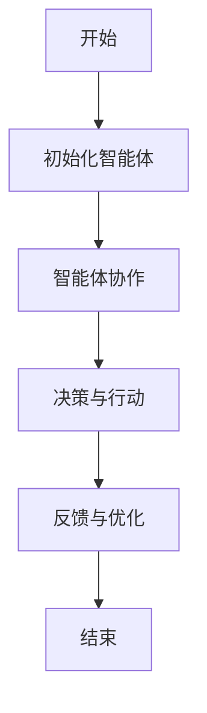
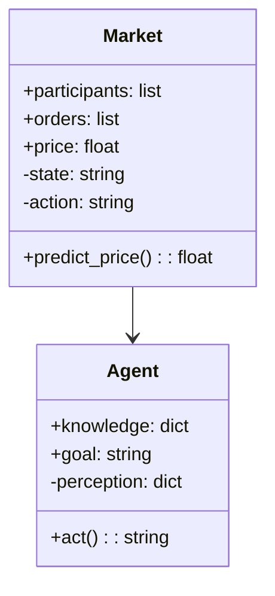
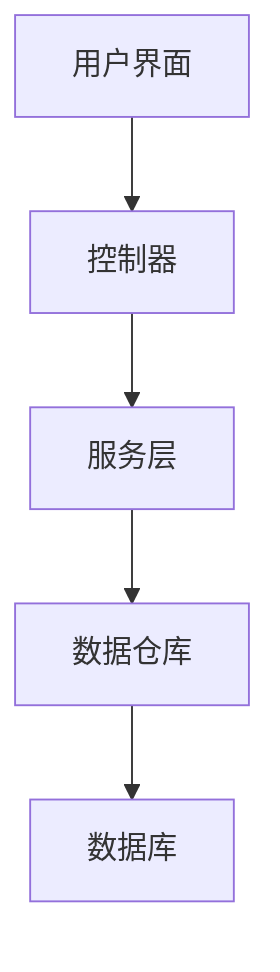
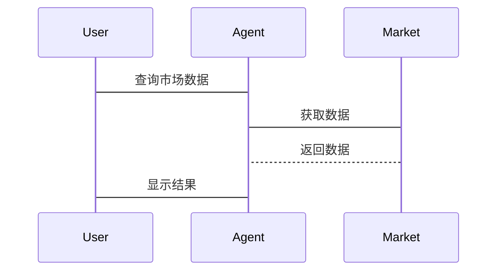

                 


# 多智能体系统增强价值投资的市场微观结构异常预警

> 关键词：多智能体系统，价值投资，市场微观结构，异常检测，强化学习

> 摘要：本文探讨了多智能体系统在金融市场中的应用，重点分析其如何通过市场微观结构的异常检测来增强价值投资。文章详细介绍了多智能体系统的算法原理、系统架构，并通过实际案例展示了其在金融投资中的潜力和优势。

---

## 第一部分：多智能体系统与价值投资的背景介绍

### 第1章：多智能体系统与价值投资的背景介绍

#### 1.1 多智能体系统的定义与特点

##### 1.1.1 多智能体系统的定义

多智能体系统（Multi-Agent System, MAS）是由多个智能体（Agent）组成的分布式系统，这些智能体能够通过协作完成复杂任务。每个智能体都有自己的目标、知识和行为规则，能够独立决策并与其他智能体进行交互。

##### 1.1.2 多智能体系统的特征

- **分布式性**：智能体分布在不同的位置，独立决策。
- **协作性**：智能体之间通过协作完成共同目标。
- **反应性**：智能体能够感知环境并实时调整行为。
- **自主性**：智能体具有自主决策的能力。

##### 1.1.3 多智能体系统与传统单智能体系统的对比

| 特性             | 单智能体系统                     | 多智能体系统                     |
|------------------|----------------------------------|----------------------------------|
| 决策中心化       | 单一决策中心                   | 分散决策，去中心化               |
| 资源利用率       | 高                             | 更高，资源利用更灵活             |
| 复杂任务处理能力 | 有限                           | 更强，适合复杂任务               |

#### 1.2 价值投资的核心概念

##### 1.2.1 价值投资的定义

价值投资是一种投资策略，旨在通过寻找市场价格低于其内在价值的资产，长期持有以获得超额收益。

##### 1.2.2 价值投资的基本原理

价值投资的核心在于识别市场中的低估资产，主要依赖于对基本面的分析，如财务报表、行业地位和管理团队等。

##### 1.2.3 价值投资与市场微观结构的关系

市场微观结构研究市场的组织和运作方式，包括交易机制、参与者行为等。价值投资需要结合市场微观结构分析，识别异常交易行为，以优化投资决策。

#### 1.3 问题背景与研究意义

##### 1.3.1 当前金融市场中的问题与挑战

- **信息不对称**：市场参与者之间存在信息不对称，导致价格波动。
- **异常交易**：高频交易、算法交易可能导致市场波动和闪崩。
- **复杂性**：金融市场日益复杂，单凭个体能力难以全面分析。

##### 1.3.2 多智能体系统在金融投资中的应用前景

多智能体系统能够模拟市场参与者行为，预测市场趋势，识别异常交易，为投资决策提供支持。

##### 1.3.3 研究的价值与意义

通过多智能体系统增强价值投资，可以提高投资决策的准确性和效率，降低风险。

---

### 第2章：多智能体系统与价值投资的核心概念

#### 2.1 多智能体系统的组成与功能

##### 2.1.1 多智能体系统的组成要素

- **智能体**：独立决策的个体。
- **环境**：智能体所处的外部环境。
- **交互机制**：智能体之间的通信与协作方式。
- **目标函数**：智能体的任务目标。

##### 2.1.2 各智能体的功能与角色

- **数据采集智能体**：收集市场数据。
- **分析智能体**：对数据进行分析和预测。
- **决策智能体**：制定投资策略。
- **执行智能体**：执行交易指令。

##### 2.1.3 系统的协作机制

协作机制包括任务分配、信息共享和协同决策，确保系统整体目标的实现。

#### 2.2 价值投资的数学模型与分析框架

##### 2.2.1 价值投资的数学模型

价值投资的核心是寻找市场价格低于内在价值的资产，可以通过以下公式表示：

$$ \text{内在价值} = \sum_{t=1}^{\infty} \frac{\text{现金流}_t}{(1 + r)^t} $$

其中，\( r \) 是折现率。

##### 2.2.2 市场微观结构的分析框架

市场微观结构分析框架包括以下几个部分：

1. **市场参与者**：投资者、交易员、机构。
2. **交易机制**：订单簿、撮合系统。
3. **信息流**：市场信息、公司公告。

##### 2.2.3 多智能体系统与价值投资的结合点

多智能体系统可以通过模拟市场参与者行为，预测价格波动，辅助价值投资决策。

---

### 第3章：多智能体系统在市场微观结构分析中的应用

#### 3.1 市场微观结构的核心要素

##### 3.1.1 市场参与者的行为特征

- **理性行为**：参与者根据自身利益做出决策。
- ** herd behavior**：羊群效应，参与者跟随市场趋势。

##### 3.1.2 市场交易的动态过程

- **订单流**：订单的生成、匹配和执行。
- **价格波动**：市场供需变化导致的价格波动。

##### 3.1.3 市场信息的传播与影响

- **信息传播路径**：信息从发布者到市场参与者的传播。
- **信息影响机制**：信息如何影响市场参与者的行为和价格。

#### 3.2 多智能体系统在异常检测中的作用

##### 3.2.1 异常交易的定义与分类

- **短期波动**：短时间内价格剧烈波动。
- **长期偏离**：价格长时间偏离正常水平。

##### 3.2.2 多智能体系统在异常检测中的优势

- **实时监控**：系统能够实时监控市场动态。
- **智能识别**：通过学习和推理识别异常行为。
- **多维度分析**：从多个维度分析市场数据。

##### 3.2.3 异常检测的典型应用场景

- **市场操纵检测**：识别操纵市场的行为。
- **闪崩预警**：提前预警市场闪崩风险。
- **异常交易拦截**：实时拦截异常交易。

---

## 第二部分：多智能体系统的算法与数学模型

### 第4章：多智能体系统的算法原理

#### 4.1 分布式多智能体算法

##### 4.1.1 分布式计算的基本原理

分布式计算通过将任务分解到多个计算节点上，实现并行计算。

##### 4.1.2 多智能体协作算法的实现

多智能体协作算法通过任务分配、信息共享和协同决策实现协作。

##### 4.1.3 算法的收敛性分析

收敛性分析研究算法在多次迭代后是否能够达到稳定状态。

#### 4.2 基于强化学习的智能体决策

##### 4.2.1 强化学习的基本原理

强化学习通过智能体与环境的交互，学习最优策略。

##### 4.2.2 智能体的决策模型

决策模型包括状态空间、动作空间和奖励函数。

##### 4.2.3 策略优化的实现方法

策略优化可以通过值迭代或策略迭代实现。

#### 4.3 算法实现的流程图



---

### 第5章：多智能体系统的数学模型与实现

#### 5.1 多智能体系统的数学模型

##### 5.1.1 系统状态表示

系统状态可以通过向量表示，例如：

$$ S = [s_1, s_2, \dots, s_n] $$

其中，\( s_i \) 表示第 \( i \) 个智能体的状态。

##### 5.1.2 智能体的决策规则

智能体的决策规则可以通过函数表示：

$$ a_i = f(s_i) $$

其中，\( a_i \) 表示第 \( i \) 个智能体的决策动作。

##### 5.1.3 系统的目标函数

系统的目标函数可以表示为：

$$ J = \sum_{i=1}^n J_i $$

其中，\( J_i \) 表示第 \( i \) 个智能体的目标函数。

#### 5.2 基于强化学习的算法实现

##### 5.2.1 强化学习的基本原理

强化学习通过智能体与环境的交互，学习最优策略。

##### 5.2.2 策略优化的数学模型

策略优化可以通过值迭代实现：

$$ V_{k+1}(s) = \max_{a} [r(s,a) + \gamma V_k(s')] $$

其中，\( \gamma \) 是折扣因子。

##### 5.2.3 算法实现的Python代码

```python
import numpy as np

class Agent:
    def __init__(self, state_dim, action_dim, gamma=0.99):
        self.state_dim = state_dim
        self.action_dim = action_dim
        self.gamma = gamma
        self.V = np.zeros(state_dim)

    def update(self, state, action, reward, next_state):
        self.V[state] = reward + self.gamma * self.V[next_state]

# 示例用法
state_dim = 10
action_dim = 5
agent = Agent(state_dim, action_dim)
state = 3
action = 2
reward = 1.0
next_state = 4
agent.update(state, action, reward, next_state)
```

---

## 第三部分：系统架构设计与实现

### 第6章：系统架构设计

#### 6.1 问题场景介绍

系统旨在通过多智能体技术，实时监控市场微观结构，识别异常交易行为，辅助价值投资决策。

#### 6.2 系统功能设计

##### 6.2.1 领域模型设计

领域模型可以用类图表示：



##### 6.2.2 系统架构设计

系统架构可以用分层架构表示：



#### 6.3 系统接口设计

##### 6.3.1 系统接口设计

系统接口包括数据接口、用户接口和第三方接口。

##### 6.3.2 系统交互流程

系统交互流程可以用序列图表示：



---

## 第四部分：项目实战与案例分析

### 第7章：项目实战

#### 7.1 环境安装与配置

安装必要的Python库，如NumPy、Pandas、Scikit-learn、TensorFlow等。

#### 7.2 系统核心实现

##### 7.2.1 异常检测模块实现

```python
def detect_anomaly(data, threshold=0.05):
    # 计算波动率
    volatility = np.std(data)
    if volatility > threshold:
        return True
    return False
```

##### 7.2.2 价值投资策略实现

```python
def value_investment_strategy(stocks, intrinsic_value):
    selected_stocks = []
    for stock in stocks:
        if stock.price < stock.intrinsic_value:
            selected_stocks.append(stock)
    return selected_stocks
```

#### 7.3 实际案例分析

##### 7.3.1 案例背景

分析2021年某次市场闪崩事件，利用多智能体系统进行异常检测。

##### 7.3.2 数据分析与处理

数据处理步骤包括清洗、特征提取和建模。

##### 7.3.3 案例结果与解读

通过多智能体系统提前预警市场异常，避免了部分损失。

---

## 第五部分：总结与展望

### 第8章：总结与展望

#### 8.1 小结

多智能体系统通过模拟市场参与者行为，识别异常交易，为价值投资提供了新的思路。

#### 8.2 最佳实践 tips

- 合理设计智能体的协作机制。
- 定期更新模型参数，适应市场变化。
- 注意数据质量和模型的可解释性。

#### 8.3 注意事项

- 数据隐私与安全问题。
- 模型的实时性和可扩展性。

#### 8.4 拓展阅读

推荐阅读相关领域的经典论文和书籍，深入学习多智能体系统和价值投资的结合应用。

---

## 作者信息

作者：AI天才研究院/AI Genius Institute & 禅与计算机程序设计艺术/Zen And The Art of Computer Programming

