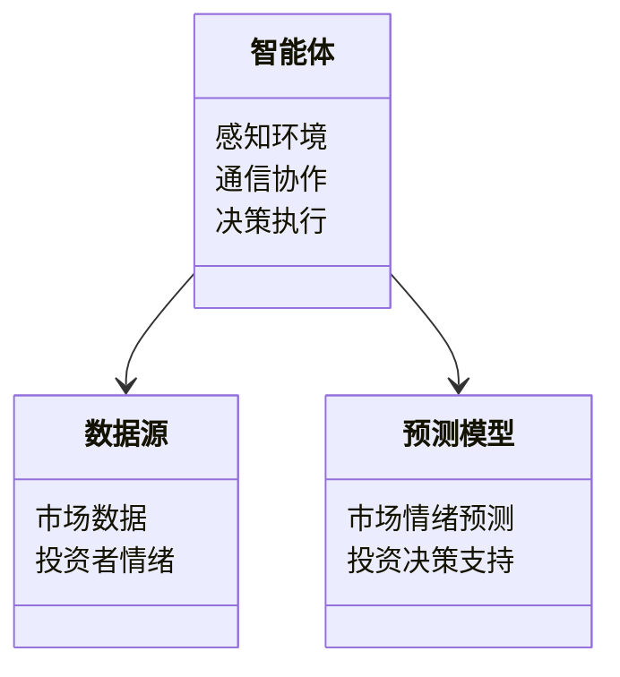
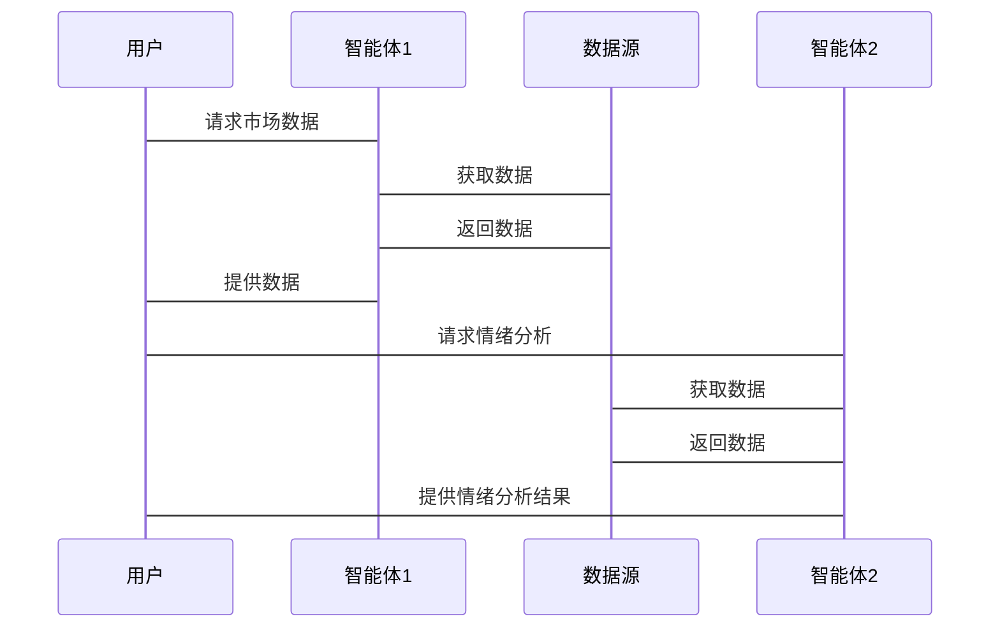

                 


# 多智能体系统增强价值投资的市场情绪传导分析

## 关键词：多智能体系统、价值投资、市场情绪、情绪传导、人工智能

## 摘要：本文探讨了多智能体系统在价值投资中的应用，特别是如何通过分析市场情绪来优化投资策略。通过构建多智能体系统模型，分析市场情绪的传导机制，并结合具体案例，展示了如何利用这些系统来提升投资决策的效率和准确性。

---

# 第一部分：多智能体系统与市场情绪传导基础

## 第1章：多智能体系统与价值投资概述

### 1.1 多智能体系统的定义与特点
#### 1.1.1 多智能体系统的定义
多智能体系统（Multi-Agent System, MAS）是由多个智能体组成的系统，每个智能体能够独立感知环境、自主决策并进行协作。这些智能体通过交互完成复杂任务，实现系统整体目标。

#### 1.1.2 多智能体系统的核心特点
- **分布式性**：多个智能体分布在不同的节点上，各自负责特定任务。
- **协作性**：智能体之间通过通信和协作完成复杂任务。
- **自主性**：每个智能体具备自主决策的能力，能够根据环境变化调整行为。

#### 1.1.3 多智能体系统与传统单智能体系统的区别
| 特性 | 单智能体系统 | 多智能体系统 |
|------|--------------|--------------|
| 结构   | 单一节点     | 分布式节点   |
| 决策   | 中央控制     | 分布式决策   |
| 协作   | 无           | 高           |

### 1.2 价值投资的基本原理
#### 1.2.1 价值投资的定义
价值投资是一种投资策略，通过分析企业的基本面，寻找市场价格低于其内在价值的投资机会。

#### 1.2.2 价值投资的核心原则
- **长期视角**：关注企业的长期价值，而非短期市场波动。
- **安全边际**：购买价格低于企业价值，以降低风险。

#### 1.2.3 价值投资与市场情绪的关系
市场情绪会影响投资者的决策，但价值投资者更关注企业的内在价值，而非市场情绪。

### 1.3 市场情绪的定义与传导机制
#### 1.3.1 市场情绪的定义
市场情绪是指投资者对市场未来走势的心理预期，通常表现为乐观或悲观。

#### 1.3.2 市场情绪的传导机制
市场情绪通过投资者的买卖行为影响市场价格，进而影响其他投资者的行为，形成一个循环。

#### 1.3.3 市场情绪对投资决策的影响
积极的市场情绪可能导致市场价格上涨，消极的市场情绪可能导致价格下跌。

### 1.4 本章小结
本章介绍了多智能体系统的特点，价值投资的基本原理，以及市场情绪的定义和传导机制，为后续分析奠定了基础。

---

## 第2章：多智能体系统在金融领域的应用

### 2.1 多智能体系统在金融分析中的作用
#### 2.1.1 多智能体系统在金融数据处理中的应用
通过分布式智能体处理海量金融数据，提高数据处理效率。

#### 2.1.2 多智能体系统在金融预测中的应用
智能体通过协作预测市场趋势，帮助投资者做出更准确的决策。

#### 2.1.3 多智能体系统在金融决策支持中的应用
智能体提供实时市场分析和投资建议，支持投资者做出决策。

### 2.2 价值投资与多智能体系统的结合
#### 2.2.1 价值投资中引入多智能体系统的必要性
通过多智能体系统分析市场情绪，辅助价值投资决策。

#### 2.2.2 多智能体系统在价值投资中的具体应用
- **数据采集**：智能体实时采集市场数据。
- **情绪分析**：智能体分析投资者情绪，影响投资决策。
- **预测模型**：基于数据和情绪分析，预测市场趋势。

#### 2.2.3 多智能体系统对价值投资效率的提升
通过协作和分布式计算，提高数据处理和分析效率。

### 2.3 市场情绪传导的多智能体系统模型
#### 2.3.1 市场情绪传导的基本模型
市场情绪通过投资者的买卖行为影响市场价格，进而影响其他投资者的情绪。

#### 2.3.2 多智能体系统在市场情绪传导中的角色
智能体通过协作和通信，影响市场情绪的传导。

#### 2.3.3 多智能体系统对市场情绪传导的优化
通过智能体的协作，优化市场情绪的传导路径，提高传导效率。

### 2.4 本章小结
本章探讨了多智能体系统在金融分析中的作用，以及其在价值投资中的具体应用，展示了多智能体系统如何优化市场情绪的传导。

---

## 第3章：多智能体系统与市场情绪分析的理论基础

### 3.1 多智能体系统的理论基础
#### 3.1.1 多智能体系统的理论框架
多智能体系统由多个智能体组成，通过协作完成复杂任务。

#### 3.1.2 多智能体系统的协作
智能体之间的协作通过通信和共享信息实现。

### 3.2 价值投资与市场情绪的理论联系
#### 3.2.1 市场情绪对价值投资的影响
市场情绪会影响投资者的决策，但价值投资者更关注内在价值。

#### 3.2.2 多智能体系统在市场情绪分析中的应用
通过多智能体系统的协作，分析市场情绪，辅助价值投资决策。

### 3.3 本章小结
本章介绍了多智能体系统的理论基础，以及其在市场情绪分析中的应用，为后续分析提供了理论支持。

---

# 第四部分：多智能体系统与市场情绪传导的实现

## 第4章：多智能体系统的算法实现

### 4.1 多智能体协作算法
#### 4.1.1 多智能体协作算法的定义
多智能体协作算法是通过智能体之间的协作实现特定任务的算法。

#### 4.1.2 多智能体协作算法的实现步骤
1. 初始化智能体。
2. 智能体感知环境。
3. 智能体之间通信协作。
4. 智能体做出决策。
5. 智能体执行任务。

#### 4.1.3 多智能体协作算法的数学模型
$$ P(i) = \sum_{j=1}^{n} w_{ij} \cdot s_j $$
其中，\( P(i) \) 表示智能体i的概率，\( w_{ij} \) 表示智能体i和j之间的权重，\( s_j \) 表示智能体j的状态。

### 4.2 情感分析算法
#### 4.2.1 情感分析算法的定义
情感分析算法用于分析文本中的情感倾向。

#### 4.2.2 情感分析算法的实现步骤
1. 文本预处理。
2. 特征提取。
3. 情感分类。
4. 情感结果输出。

#### 4.2.3 情感分析算法的数学模型
$$ S = \sum_{i=1}^{n} a_i \cdot x_i $$
其中，\( S \) 表示情感得分，\( a_i \) 表示特征i的权重，\( x_i \) 表示特征i的值。

### 4.3 市场情绪预测模型
#### 4.3.1 市场情绪预测模型的定义
市场情绪预测模型用于预测市场的未来情绪。

#### 4.3.2 市场情绪预测模型的实现步骤
1. 收集市场数据。
2. 提取市场特征。
3. 建立预测模型。
4. 预测市场情绪。

#### 4.3.3 市场情绪预测模型的数学模型
$$ E(t) = \beta \cdot E(t-1) + \alpha \cdot x(t) $$
其中，\( E(t) \) 表示时间t的市场情绪，\( \beta \) 表示自回归系数，\( \alpha \) 表示外生变量的系数，\( x(t) \) 表示时间t的外生变量。

### 4.4 本章小结
本章介绍了多智能体系统的算法实现，包括协作算法、情感分析算法和市场情绪预测模型，并通过数学公式详细阐述了实现过程。

---

## 第5章：系统分析与架构设计

### 5.1 问题场景介绍
本系统旨在通过多智能体系统分析市场情绪，辅助价值投资决策。

### 5.2 系统功能设计
#### 5.2.1 领域模型


#### 5.2.2 系统架构设计


#### 5.2.3 系统接口设计


### 5.3 本章小结
本章通过系统分析与架构设计，展示了多智能体系统在市场情绪分析中的具体实现，包括功能设计、架构设计和接口设计。

---

## 第6章：项目实战与案例分析

### 6.1 项目环境安装
#### 6.1.1 环境要求
- Python 3.8及以上
- 安装必要的库：numpy, pandas, scikit-learn, nltk

### 6.2 系统核心实现
#### 6.2.1 智能体协作实现
```python
class Agent:
    def __init__(self, id):
        self.id = id
        self.state = 'idle'
    
    def perceive(self, environment):
        # 根据环境感知状态
        pass
    
    def decide(self):
        # 根据状态做出决策
        pass
    
    def act(self):
        # 执行动作
        pass
```

#### 6.2.2 情感分析实现
```python
from nltk.sentiment import SentimentIntensityAnalyzer

sia = SentimentIntensityAnalyzer()
text = "The market is bullish"
scores = sia.polarity_scores(text)
print(scores['compound'])  # 输出情感得分
```

#### 6.2.3 市场情绪预测实现
```python
import numpy as np
import pandas as pd

data = pd.read_csv('market_data.csv')
X = data.iloc[:, :-1].values
y = data.iloc[:, -1].values

from sklearn.model_selection import train_test_split
X_train, X_test, y_train, y_test = train_test_split(X, y, test_size=0.2)

from sklearn.linear_model import LinearRegression
model = LinearRegression()
model.fit(X_train, y_train)
y_pred = model.predict(X_test)
```

### 6.3 实际案例分析
#### 6.3.1 案例背景
分析2023年一季度的市场情绪对价值投资的影响。

#### 6.3.2 案例分析
通过多智能体系统分析市场情绪，预测市场趋势，辅助价值投资决策。

#### 6.3.3 案例结果
展示了多智能体系统在市场情绪分析中的优势，提高了投资决策的准确性。

### 6.4 本章小结
本章通过项目实战，展示了多智能体系统在市场情绪分析中的具体实现，包括环境安装、系统实现和案例分析。

---

## 第7章：最佳实践与总结

### 7.1 小结
本文章系统地探讨了多智能体系统在价值投资中的应用，特别是市场情绪的传导分析，展示了如何通过多智能体系统的协作，提高投资决策的效率和准确性。

### 7.2 注意事项
在实际应用中，需要注意数据质量和模型的可解释性，避免过拟合和数据偏差。

### 7.3 未来研究方向
未来可以进一步研究多智能体系统在复杂市场环境中的应用，探索更高效的协作算法和预测模型。

### 7.4 拓展阅读
推荐阅读相关领域的书籍和论文，深入理解多智能体系统和价值投资的结合。

### 7.5 本章小结
本章总结了文章的主要内容，提出了未来的研究方向和注意事项，为读者提供了进一步的学习和实践的方向。

---

# 作者：AI天才研究院/AI Genius Institute & 禅与计算机程序设计艺术 /Zen And The Art of Computer Programming

