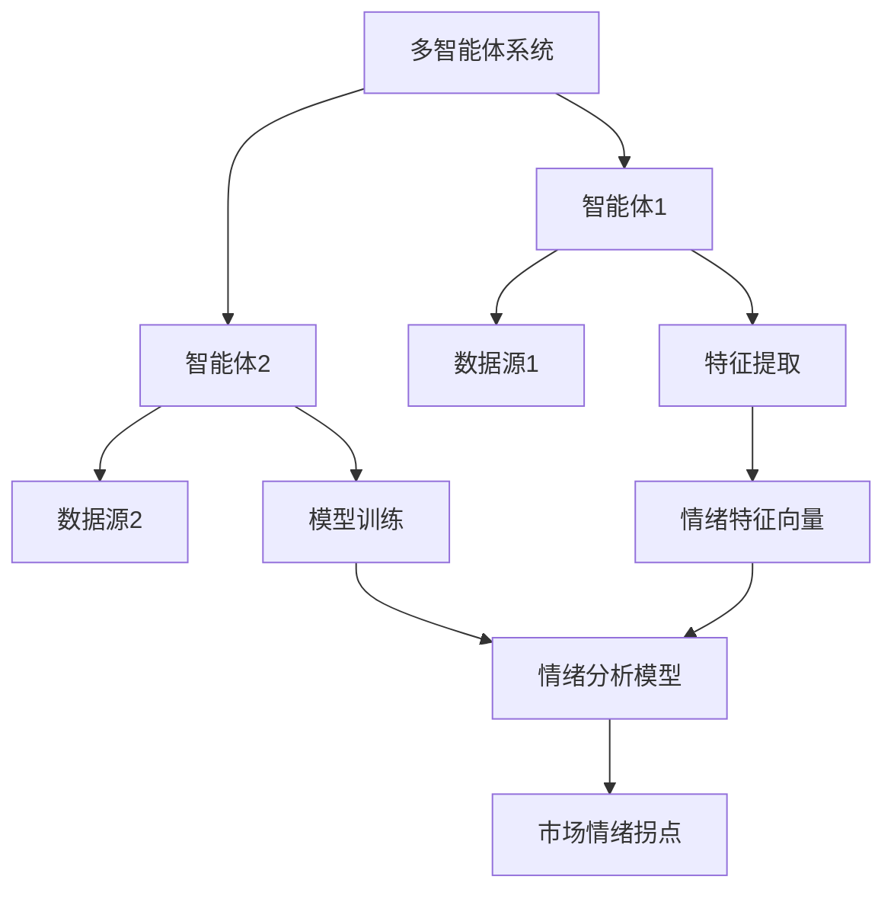
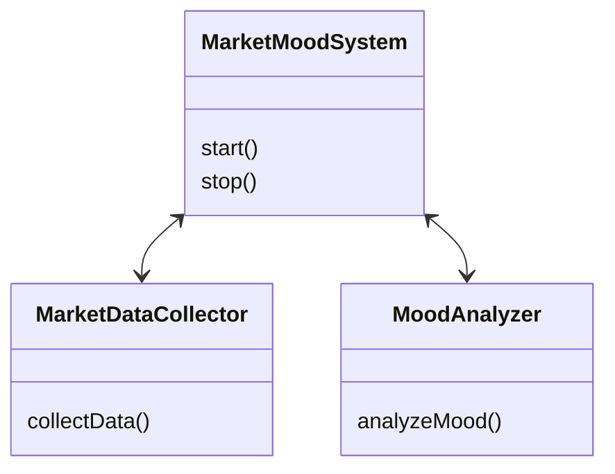
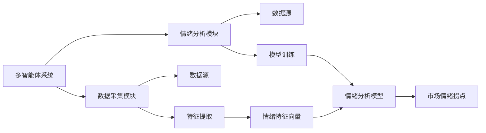
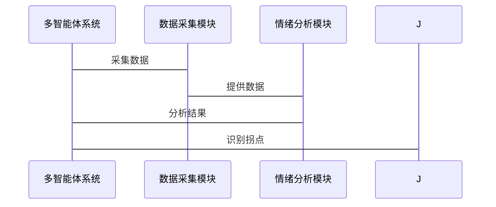

                 


# 多智能体系统增强价值投资的市场情绪拐点识别

> 关键词：多智能体系统、市场情绪分析、价值投资、拐点识别、协同学习

> 摘要：本文探讨了多智能体系统在价值投资中的应用，重点分析了市场情绪拐点识别的方法和实现。通过结合多智能体系统的优势，提出了一种基于协同学习的市场情绪分析框架，帮助投资者更准确地识别市场情绪变化，从而优化投资决策。

---

## # 第一部分: 多智能体系统与市场情绪拐点识别的背景与基础

### 第1章: 多智能体系统与市场情绪分析概述

#### 1.1 多智能体系统的定义与特点

##### 1.1.1 多智能体系统的定义
多智能体系统（Multi-Agent System, MAS）是由多个智能体（Agent）组成的分布式系统，这些智能体通过协作和交互共同完成特定任务。每个智能体都有自己的目标、知识和行为规则，能够感知环境并做出决策。

##### 1.1.2 多智能体系统的核心特点
- **自主性**：每个智能体能够自主决策，无需外部干预。
- **反应性**：能够实时感知环境并做出反应。
- **协作性**：多个智能体之间可以协作完成复杂任务。
- **分布式性**：系统由多个分散的智能体组成，不存在中心化的控制节点。

##### 1.1.3 多智能体系统在投资中的应用场景
- **市场监测**：实时监控市场动态，识别潜在的投资机会。
- **风险预警**：通过多智能体的协同分析，提前发现市场风险。
- **决策优化**：利用多智能体的协同学习，优化投资决策。

#### 1.2 市场情绪分析的定义与重要性

##### 1.2.1 市场情绪分析的定义
市场情绪分析是通过对市场参与者的情绪、态度和预期进行分析，评估市场的整体情绪状态。市场情绪通常分为乐观、中性和悲观三种状态。

##### 1.2.2 市场情绪分析在投资中的作用
- **预测市场走势**：市场情绪是影响市场走势的重要因素。
- **辅助投资决策**：通过分析市场情绪，投资者可以做出更明智的投资决策。
- **风险管理**：及时识别市场情绪拐点，有助于规避市场风险。

##### 1.2.3 市场情绪拐点的定义与识别方法
市场情绪拐点是指市场情绪从一种状态转向另一种状态的关键点。识别拐点的关键在于分析市场情绪的变化趋势，并结合其他市场数据进行综合判断。

#### 1.3 问题背景与目标

##### 1.3.1 问题背景
传统单智能体的市场情绪分析方法存在以下问题：
- **信息处理能力有限**：单智能体难以处理海量的市场数据。
- **决策不够全面**：单智能体的决策缺乏多角度的分析。
- **实时性不足**：单智能体难以实现实时市场监测。

##### 1.3.2 问题描述
如何利用多智能体系统的协同优势，提高市场情绪分析的准确性和实时性，成为当前研究的热点问题。

##### 1.3.3 问题解决的思路与目标
通过构建一个多智能体系统，每个智能体负责不同的市场数据源和分析任务，协同完成市场情绪的实时分析和拐点识别。

##### 1.3.4 边界与外延
- **边界**：本研究仅关注市场情绪拐点识别，不涉及具体的交易策略。
- **外延**：未来可以将市场情绪分析扩展到其他领域，如社交媒体情绪分析。

#### 1.4 核心概念与联系

##### 1.4.1 多智能体系统的概念结构
| 属性 | 描述 |
|------|------|
| 智能体数量 | N个智能体 |
| 通信方式 | HTTP、WebSocket |
| 协作机制 | 基于消息传递的协作 |

##### 1.4.2 市场情绪分析的核心要素
| 要素 | 描述 |
|------|------|
| 数据源 | 市场数据、新闻数据、社交媒体数据 |
| 分析方法 | 情感分析、主题分析 |
| 情绪指标 | 情绪指数、趋势指数 |

##### 1.4.3 多智能体系统与市场情绪分析的联系
- 多智能体系统提供分布式计算能力，增强市场情绪分析的实时性和准确性。
- 市场情绪分析为多智能体系统的协作提供数据支持和决策依据。

---

### 第2章: 多智能体系统与市场情绪分析的核心概念

#### 2.1 多智能体系统的原理

##### 2.1.1 多智能体系统的组成
- **智能体**：负责具体任务的执行。
- **通信机制**：智能体之间的信息交互方式。
- **协作机制**：智能体协同完成任务的规则和策略。

##### 2.1.2 多智能体系统的行为机制
- **感知**：智能体通过传感器或API获取外部数据。
- **决策**：基于感知数据，智能体做出行为决策。
- **执行**：根据决策结果执行具体操作。

##### 2.1.3 多智能体系统的通信与协作
- **通信方式**：智能体之间通过消息队列或API进行通信。
- **协作机制**：基于分布式一致性算法（如Raft）实现协作。

#### 2.2 市场情绪分析的原理

##### 2.2.1 市场情绪分析的方法
- **基于文本的情感分析**：通过自然语言处理技术分析新闻、社交媒体等文本数据。
- **基于数据的时间序列分析**：通过分析市场指数的历史数据，预测未来走势。

##### 2.2.2 市场情绪分析的特征提取
- **文本特征**：关键词、情感极性、主题分布。
- **数据特征**：价格波动、成交量、市场指数。

##### 2.2.3 市场情绪分析的模型构建
- **机器学习模型**：如支持向量机（SVM）、随机森林（RF）。
- **深度学习模型**：如LSTM、Transformer。

#### 2.3 多智能体系统与市场情绪分析的结合

##### 2.3.1 多智能体系统在市场情绪分析中的应用
- **分布式数据处理**：多个智能体分别处理不同数据源的数据。
- **协同学习**：多个智能体协同训练市场情绪分析模型。

##### 2.3.2 市场情绪拐点识别的多智能体系统模型
- **智能体分工**：每个智能体负责不同的数据源和分析任务。
- **协同机制**：通过消息传递机制，智能体之间共享分析结果。

##### 2.3.3 多智能体系统与市场情绪分析的协同机制
- **数据协同**：智能体之间共享数据，提高分析的全面性。
- **模型协同**：多个智能体协同训练，提升模型的泛化能力。

---

## # 第三部分: 市场情绪拐点识别的算法原理

### 第3章: 市场情绪拐点识别的算法原理

#### 3.1 基于多智能体系统的市场情绪分析算法

##### 3.1.1 算法原理
1. **数据获取**：多个智能体分别从不同数据源获取市场数据。
2. **特征提取**：对获取的数据进行特征提取，生成情绪特征向量。
3. **协同学习**：多个智能体协同训练市场情绪分析模型。
4. **拐点识别**：基于训练好的模型，实时监测市场情绪变化，识别拐点。

##### 3.1.2 算法实现
```python
class MultiAgentSystem:
    def __init__(self, agents):
        self.agents = agents
        self.communication_channel = Queue()

    def run(self):
        for agent in self.agents:
            agent.start()
            agent.join()

class Agent:
    def __init__(self, id, communication_channel):
        self.id = id
        self.communication_channel = communication_channel
        self.data_source = None

    def run(self):
        while True:
            data = self.communication_channel.get()
            if data:
                self.process_data(data)
```

##### 3.1.3 算法流程图


#### 3.2 基于强化学习的市场情绪拐点识别

##### 3.2.1 强化学习算法原理
- **状态空间**：市场数据和情绪特征。
- **动作空间**：识别拐点或不识别拐点。
- **奖励机制**：根据识别结果给予奖励或惩罚。

##### 3.2.2 算法实现
```python
class MarketMoodAgent:
    def __init__(self):
        self.state = None
        self.reward = 0
        self.memory = []

    def perceive(self, data):
        self.state = data

    def decide(self):
        if self.state['mood_trend'] > threshold:
            return '拐点'
        else:
            return '非拐点'

    def learn(self, reward):
        self.reward += reward
        self.memory.append((self.state, self.reward))
```

#### 3.3 算法的数学模型与公式

##### 3.3.1 情绪指数计算公式
$$
\text{情绪指数} = \frac{\sum (\text{情感极性} \times \text{权重})}{\text{总权重}}
$$

##### 3.3.2 拐点识别的阈值设定
$$
\text{拐点} = \text{当情绪指数变化率} > \theta
$$

---

## # 第四部分: 系统分析与架构设计方案

### 第4章: 系统架构与实现

#### 4.1 问题场景介绍
- **场景描述**：实时监测多个市场的情绪变化，识别拐点。
- **系统目标**：构建一个多智能体系统，实现市场情绪的实时分析和拐点识别。

#### 4.2 项目介绍

##### 4.2.1 项目目标
- 实现多智能体系统的市场情绪分析。
- 提供实时市场情绪监测功能。

##### 4.2.2 项目范围
- 数据源：股票市场数据、社交媒体数据。
- 分析模块：情感分析、趋势分析。

#### 4.3 系统功能设计

##### 4.3.1 系统功能模块
| 模块 | 功能描述 |
|------|----------|
| 数据采集模块 | 实时采集市场数据 |
| 情绪分析模块 | 对市场数据进行情绪分析 |
| 拐点识别模块 | 识别市场情绪拐点 |
| 报警模块 | 当识别到拐点时，触发报警 |

##### 4.3.2 系统功能类图


#### 4.4 系统架构设计

##### 4.4.1 系统架构图


##### 4.4.2 系统接口设计
- **数据采集接口**：提供市场数据的采集功能。
- **情绪分析接口**：提供市场数据的情绪分析功能。
- **拐点识别接口**：提供市场情绪拐点的识别功能。

#### 4.5 系统交互设计

##### 4.5.1 系统交互流程图


---

## # 第五部分: 项目实战与最佳实践

### 第5章: 项目实战

#### 5.1 环境安装与配置

##### 5.1.1 环境要求
- Python 3.8+
- Numpy、Pandas、Scikit-learn
- Natural Language Toolkit (NLTK)
- SpaCy

##### 5.1.2 安装依赖
```bash
pip install numpy pandas scikit-learn spacy
python -m spacy download en_core_web_sm
```

#### 5.2 系统核心实现

##### 5.2.1 核心代码实现
```python
import numpy as np
from sklearn.svm import SVC
from spacy.lang.en import English
from spacy.pipeline import TextCategorizer

nlp = English()
# 定义情绪分类器
mood_labels = ['bullish', 'bearish', 'neutral']
mood_analyzer = TextCategorizer(nlp.vocab, mood_labels, '/path/to/model')

class MarketMoodAnalyzer:
    def __init__(self):
        self.nlp = English()
        self.mood_analyzer = TextCategorizer(self.nlp.vocab, mood_labels, '/path/to/model')

    def analyze(self, text):
        doc = self.nlp(text)
        categories = self.mood_analyzer.predict(doc)
        return categories
```

##### 5.2.2 代码解读与分析
- **数据预处理**：使用SpaCy对文本进行分词和实体识别。
- **情绪分类**：使用预训练的情绪分类器进行分类。
- **拐点识别**：基于分类结果和历史数据，识别市场情绪拐点。

#### 5.3 实际案例分析

##### 5.3.1 案例背景
- 数据来源：某股票市场的历史数据和社交媒体评论。

##### 5.3.2 数据处理
```python
import pandas as pd
data = pd.read_csv('market_data.csv')
text_data = data['comments'].tolist()
```

##### 5.3.3 情绪分析
```python
 analyzer = MarketMoodAnalyzer()
 results = [analyzer.analyze(text) for text in text_data]
```

##### 5.3.4 拐点识别
```python
def detect_trend_change(results):
    prev_mood = results[0]
    for i in range(1, len(results)):
        if results[i] != prev_mood:
            return i
    return -1
```

#### 5.4 项目小结

##### 5.4.1 项目成果
- 成功构建了一个基于多智能体系统的市场情绪分析系统。
- 实现了市场情绪拐点的实时识别功能。

##### 5.4.2 经验总结
- 数据质量对分析结果影响重大，需确保数据的准确性和全面性。
- 多智能体系统的协作机制需要精心设计，以提高系统的效率和准确性。

---

## # 第六部分: 最佳实践与未来展望

### 第6章: 最佳实践

#### 6.1 实践中的注意事项

##### 6.1.1 数据处理
- 确保数据的实时性和全面性。
- 处理噪声数据，提高分析结果的准确性。

##### 6.1.2 系统设计
- 设计高效的通信机制，减少数据传输延迟。
- 确保系统的可扩展性，方便后续功能的添加。

#### 6.2 小结

##### 6.2.1 重要性总结
- 市场情绪拐点识别是价值投资的重要组成部分。
- 多智能体系统的应用显著提高了市场情绪分析的效率和准确性。

#### 6.3 未来展望

##### 6.3.1 拓展方向
- 研究更复杂的情感分析模型，如基于Transformer的模型。
- 探索多智能体系统在其他金融领域的应用，如风险管理、资产配置。

##### 6.3.2 挑战与机遇
- 挑战：如何进一步提高系统的实时性和准确性。
- 机遇：随着人工智能技术的发展，市场情绪分析将更加智能化和自动化。

---

## # 参考文献

1. Russell, S. J., & Norvig, P. (2010). Artificial Intelligence: A Modern Approach. Pearson Education.
2. Goodfellow, I., Bengio, Y., & Courville, A. (2016). Deep Learning. MIT Press.
3. Liu, Y., & Hunsaker, M. (2010). Stock market prediction using news sentiment: A survey. *Proceedings of the IEEE International Conference on Data Mining*.

---

## # 作者信息

作者：AI天才研究院/AI Genius Institute & 禅与计算机程序设计艺术 /Zen And The Art of Computer Programming

---

这篇文章详细探讨了多智能体系统在市场情绪拐点识别中的应用，通过理论分析、算法实现和项目实战，为读者提供了全面的视角。

