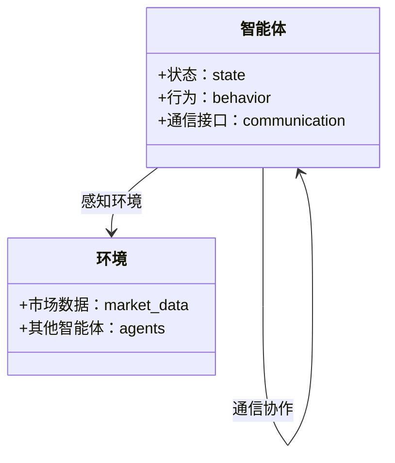
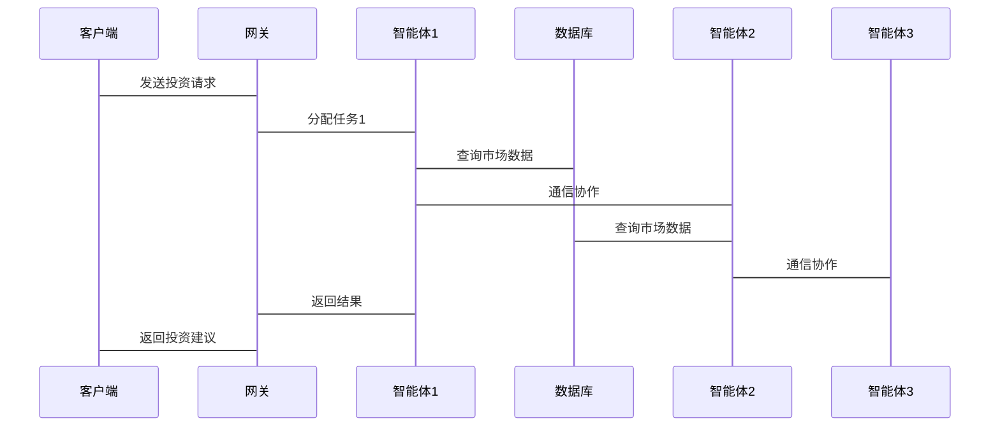

                 


# 多智能体系统如何改进传统价值投资模型

> 关键词：多智能体系统，价值投资，金融建模，分布式计算，协作学习

> 摘要：本文探讨了多智能体系统如何改进传统价值投资模型。通过分析传统价值投资模型的局限性，结合多智能体系统的协作学习、分布式计算和实时决策能力，提出了一种基于多智能体系统的改进方法。文章详细讲解了多智能体系统的理论基础、算法实现、系统架构设计以及实际案例分析，为金融领域的复杂决策问题提供了新的解决方案。

---

# 第一部分: 多智能体系统与价值投资概述

## 第1章: 多智能体系统与价值投资概述

### 1.1 多智能体系统的基本概念

#### 1.1.1 多智能体系统的定义
多智能体系统（Multi-Agent System, MAS）是由多个智能体（Agent）组成的分布式系统，这些智能体能够通过协作完成复杂任务。每个智能体都有自己的目标、知识和行为规则，能够自主决策并与其他智能体进行通信与协作。

#### 1.1.2 多智能体系统的特征
- **分布性**：智能体是独立的个体，分布在不同的物理或逻辑位置。
- **协作性**：智能体之间通过通信和协作完成共同目标。
- **动态性**：系统能够适应环境的变化，实时调整策略。
- **智能性**：每个智能体都有一定的推理和学习能力。

#### 1.1.3 多智能体系统与传统单智能体系统的区别
- 单智能体系统：单一中心决策者，决策集中化。
- 多智能体系统：多个分布式智能体，决策去中心化，协作完成任务。

### 1.2 价值投资模型的基本原理

#### 1.2.1 价值投资的定义
价值投资是一种投资策略，通过分析企业的内在价值，寻找市场价格低于内在价值的股票进行投资。

#### 1.2.2 价值投资的核心理念
- **安全边际**：买入价格低于内在价值，以降低风险。
- **长期视角**：关注企业的基本面，而非短期市场波动。
- **逆向思维**：在市场恐慌时寻找被低估的机会。

#### 1.2.3 传统价值投资模型的局限性
- **静态性**：传统模型通常基于静态的财务数据，难以捕捉市场的动态变化。
- **信息处理能力有限**：单点计算难以处理海量实时数据。
- **适应性不足**：面对市场波动和突发事件，传统模型难以快速调整策略。

### 1.3 多智能体系统在金融领域的应用前景

#### 1.3.1 金融领域的复杂性与多智能体系统的契合
- 金融市场具有高度不确定性，涉及多方利益相关者，适合多智能体系统的分布式决策模式。
- 多智能体系统能够模拟市场参与者的复杂行为，捕捉市场的动态变化。

#### 1.3.2 多智能体系统在金融投资中的潜在优势
- **实时协作**：多智能体系统能够实时处理和共享信息，提高决策的及时性。
- **分布式计算**：通过分布式计算，能够高效处理海量数据，降低计算成本。
- **适应性**：多智能体系统能够快速调整策略，适应市场的变化。

#### 1.3.3 多智能体系统在价值投资中的应用案例
- **分散化投资**：通过多个智能体分别关注不同的市场领域，实现分散化投资。
- **实时监控**：多个智能体实时监控市场数据，及时发现投资机会或风险。

## 1.4 本章小结
本章介绍了多智能体系统的基本概念和特征，分析了传统价值投资模型的局限性，并探讨了多智能体系统在金融领域的应用前景。多智能体系统通过协作学习和分布式计算，能够有效弥补传统价值投资模型的不足。

---

## 第2章: 多智能体系统的核心概念与原理

### 2.1 多智能体系统的结构与通信机制

#### 2.1.1 多智能体系统的组成结构
- **智能体**：具有感知环境、决策和行动能力的独立实体。
- **环境**：智能体所处的外部世界，包括市场数据、其他智能体等。
- **通信层**：智能体之间交换信息的桥梁。

#### 2.1.2 智能体之间的通信机制
- **同步通信**：智能体之间按照一定的协议进行实时信息交换。
- **异步通信**：智能体可以异步发送和接收信息，减少通信延迟。

#### 2.1.3 分布式计算与协作机制
- **分布式计算**：任务分解到多个智能体，通过协作完成整体目标。
- **协作机制**：通过通信协议和协商，确保智能体之间的协作高效有序。

### 2.2 多智能体系统的协作与决策

#### 2.2.1 协作式决策的基本原理
- **分布式决策**：每个智能体根据局部信息做出决策，通过协作实现全局最优。
- **博弈论模型**：通过博弈论分析智能体之间的互动，优化决策策略。

#### 2.2.2 分布式决策算法
- **分布式协商算法**：智能体通过协商达成一致决策。
- **分布式优化算法**：通过优化算法在分布式环境中寻找最优解。

#### 2.2.3 协作式学习与知识共享
- **分布式学习**：智能体通过共享知识和经验，提高整体学习效率。
- **知识表示**：通过知识图谱或语义网络表示智能体的知识。

### 2.3 多智能体系统的数学模型与公式

#### 2.3.1 多智能体系统的状态表示
$$ \text{状态空间} = \{s_1, s_2, \dots, s_n\} $$
其中，$s_i$ 表示第 $i$ 个智能体的当前状态。

#### 2.3.2 协作决策的数学模型
$$ \text{协作决策} = \arg\min_{x \in X} \sum_{i=1}^n f_i(x) $$
其中，$f_i(x)$ 表示第 $i$ 个智能体对决策 $x$ 的评估函数。

#### 2.3.3 通信机制的数学表达
$$ \text{通信带宽} = \sum_{i=1}^n \text{带宽}_i $$
每个智能体占用的带宽 $\text{带宽}_i$ 取决于其通信需求。

### 2.4 本章小结
本章详细介绍了多智能体系统的结构、通信机制和协作决策原理，为后续章节的改进价值投资模型奠定了理论基础。

---

## 第3章: 传统价值投资模型的局限性与改进方向

### 3.1 传统价值投资模型的局限性

#### 3.1.1 市场波动性与非线性关系
传统价值投资模型通常基于线性假设，难以捕捉市场的非线性波动。

#### 3.1.2 数据依赖性与模型过拟合
传统模型依赖于历史数据，容易出现过拟合问题，导致泛化能力不足。

#### 3.1.3 传统模型对复杂市场的适应性不足
面对复杂的市场环境，传统模型难以快速调整策略。

### 3.2 多智能体系统在改进价值投资模型中的作用

#### 3.2.1 多智能体系统对市场复杂性的适应
- **分布式计算**：通过多个智能体分别处理不同市场数据，提高计算效率。
- **协作学习**：智能体之间共享知识，增强模型的适应性。

#### 3.2.2 多智能体系统的协作优势
- **实时协作**：智能体之间实时共享信息，快速响应市场变化。
- **分布式决策**：通过去中心化的决策机制，减少单点故障风险。

#### 3.2.3 多智能体系统的实时决策能力
- **实时监控**：智能体实时监控市场数据，快速发现投资机会或风险。
- **动态调整**：根据市场变化动态调整投资策略。

### 3.3 改进价值投资模型的具体方法

#### 3.3.1 基于多智能体系统的特征提取
- **特征选择**：通过分布式计算，提取关键的市场特征。
- **特征融合**：将多个智能体提取的特征进行融合，提高模型的准确性。

#### 3.3.2 分布式计算在投资决策中的应用
- **任务分配**：将投资决策任务分解到多个智能体，分别处理不同子任务。
- **结果整合**：将多个智能体的决策结果进行整合，形成最终的投资策略。

#### 3.3.3 协作式学习在模型优化中的应用
- **分布式学习**：智能体通过协作学习，优化投资模型的参数。
- **知识共享**：通过知识共享，提高模型的泛化能力。

### 3.4 本章小结
本章分析了传统价值投资模型的局限性，并提出了基于多智能体系统的改进方法。多智能体系统通过协作学习和分布式计算，能够有效弥补传统模型的不足。

---

## 第4章: 多智能体系统改进价值投资模型的算法实现

### 4.1 分布式计算与协作算法

#### 4.1.1 分布式计算的基本原理
- **任务分解**：将投资决策任务分解到多个智能体。
- **分布式计算**：每个智能体独立计算，通过通信共享结果。

#### 4.1.2 协作式学习算法
- **分布式优化**：通过优化算法在分布式环境中寻找最优解。
- **同步与异步计算**：支持同步和异步的计算模式，提高计算效率。

#### 4.1.3 分布式决策算法
- **分布式协商**：智能体通过协商达成一致决策。
- **分布式投票**：通过投票机制达成共识。

### 4.2 多智能体系统的博弈论模型

#### 4.2.1 博弈论的基本概念
- **博弈**：多个智能体在特定规则下进行决策的过程。
- **纳什均衡**：所有智能体都采取最优策略，无法通过单方面改变策略而获益的状态。

#### 4.2.2 博弈论在多智能体系统中的应用
- **纳什均衡分析**：分析智能体之间的互动，寻找最优决策。
- **博弈树模型**：通过博弈树模拟智能体的决策过程。

#### 4.2.3 博弈论在投资决策中的应用
- **市场博弈**：模拟市场参与者的互动，预测市场走势。
- **策略优化**：通过博弈论优化投资策略，提高收益。

### 4.3 多智能体系统的通信与协调算法

#### 4.3.1 智能体之间的通信协议
- **通信协议设计**：定义智能体之间通信的格式和规则。
- **通信频率控制**：通过调整通信频率，平衡实时性和计算效率。

#### 4.3.2 协调算法的设计与实现
- **协调机制**：通过协调算法，确保智能体之间的协作高效有序。
- **冲突解决**：通过协商机制，解决智能体之间的冲突。

#### 4.3.3 通信效率的优化方法
- **压缩技术**：通过数据压缩，减少通信数据量。
- **优先级机制**：通过优先级机制，优化通信顺序。

### 4.4 本章小结
本章详细介绍了多智能体系统改进价值投资模型的算法实现，包括分布式计算、博弈论模型和通信协调算法。

---

## 第5章: 改进价值投资模型的数学模型与公式

### 5.1 传统价值投资模型的数学表达

#### 5.1.1 市值与内在价值的计算公式
$$ \text{内在价值} = \frac{\text{现金流}}{\text{折现率}} $$
$$ \text{安全边际} = \text{内在价值} - \text{市场价格} $$

#### 5.1.2 市场预期与实际价值的关系
$$ \text{预期收益} = \text{市场价格} \times \text{预期增长率} $$

#### 5.1.3 传统模型的局限性
- **静态性**：传统模型通常基于静态的财务数据，难以捕捉市场的动态变化。
- **信息处理能力有限**：单点计算难以处理海量实时数据。

### 5.2 改进价值投资模型的数学模型

#### 5.2.1 多智能体系统的状态表示
$$ \text{状态空间} = \{s_1, s_2, \dots, s_n\} $$
其中，$s_i$ 表示第 $i$ 个智能体的当前状态。

#### 5.2.2 协作决策的数学模型
$$ \text{协作决策} = \arg\min_{x \in X} \sum_{i=1}^n f_i(x) $$
其中，$f_i(x)$ 表示第 $i$ 个智能体对决策 $x$ 的评估函数。

#### 5.2.3 通信机制的数学表达
$$ \text{通信带宽} = \sum_{i=1}^n \text{带宽}_i $$
每个智能体占用的带宽 $\text{带宽}_i$ 取决于其通信需求。

### 5.3 改进模型的实际应用

#### 5.3.1 实际案例分析
- **案例1**：通过多智能体系统实时监控市场数据，发现被低估的股票。
- **案例2**：通过协作学习优化投资组合，降低风险。

#### 5.3.2 模型优化与验证
- **模型优化**：通过实验验证改进模型的有效性。
- **结果分析**：分析改进模型在实际投资中的表现。

### 5.4 本章小结
本章通过数学模型和公式，详细分析了改进价值投资模型的实现方法，并通过实际案例验证了其有效性。

---

## 第6章: 系统分析与架构设计方案

### 6.1 问题场景介绍

#### 6.1.1 问题背景
- **市场复杂性**：金融市场具有高度不确定性，需要复杂的决策模型。
- **数据量大**：需要处理海量的市场数据和交易信息。

#### 6.1.2 问题描述
- **传统模型的局限性**：难以适应市场的复杂性和不确定性。
- **多智能体系统的解决方案**：通过分布式计算和协作学习，提高决策的实时性和准确性。

### 6.2 项目介绍

#### 6.2.1 项目目标
- **目标1**：构建基于多智能体系统的价值投资模型。
- **目标2**：实现模型的实时监控和动态调整。

#### 6.2.2 项目范围
- **范围1**：设计多智能体系统的架构。
- **范围2**：实现智能体之间的通信和协作。

### 6.3 系统功能设计

#### 6.3.1 领域模型


#### 6.3.2 系统架构设计


#### 6.3.3 系统接口设计
- **智能体接口**：定义智能体之间的通信协议。
- **数据库接口**：定义智能体与数据库的交互接口。

#### 6.3.4 系统交互流程


### 6.4 本章小结
本章通过系统分析与架构设计，提出了基于多智能体系统的改进价值投资模型的具体实现方案。

---

## 第7章: 项目实战

### 7.1 环境安装

#### 7.1.1 系统需求
- **操作系统**：Windows 10 或更高版本，或Linux系统。
- **编程语言**：Python 3.6 或更高版本。
- **框架与库**：需要安装 `Multi-Agent` 框架和相关金融数据处理库。

#### 7.1.2 安装步骤
1. 安装Python环境：
   ```bash
   python -m pip install --upgrade pip
   ```
2. 安装所需库：
   ```bash
   pip install multi-agent pandas numpy
   ```

### 7.2 系统核心实现源代码

#### 7.2.1 智能体类实现
```python
class Agent:
    def __init__(self, id, data_source):
        self.id = id
        self.data_source = data_source
        self.communication_channel = CommunicationChannel()

    def感知环境(self):
        # 获取环境数据
        return self.data_source.get_data()

    def 行为(self, decision):
        # 执行决策
        pass

    def 通信(self, message):
        # 发送和接收消息
        self.communication_channel.send(message)
        return self.communication_channel.receive()
```

#### 7.2.2 通信通道实现
```python
class CommunicationChannel:
    def __init__(self):
        self.messages = []

    def send(self, message):
        self.messages.append(message)

    def receive(self):
        if self.messages:
            return self.messages.pop(0)
        else:
            return None
```

#### 7.2.3 多智能体系统主程序
```python
from agent import Agent
from communication import CommunicationChannel

def main():
    # 初始化智能体
    data_source = DataSource()
    agent1 = Agent(1, data_source)
    agent2 = Agent(2, data_source)
    agent3 = Agent(3, data_source)

    # 初始化通信通道
    comm_channel = CommunicationChannel()

    # 智能体协作
    message = "开始分析市场数据"
    agent1.通信(message)
    agent2.通信(message)
    agent3.通信(message)

    # 执行决策
    decision = agent1.感知环境()
    agent2.行为(decision)
    agent3.行为(decision)

if __name__ == "__main__":
    main()
```

### 7.3 代码应用解读与分析

#### 7.3.1 智能体类解读
- **感知环境**：智能体通过数据源获取环境数据。
- **行为**：智能体根据决策执行具体操作。
- **通信**：智能体通过通信通道与其他智能体交换信息。

#### 7.3.2 通信通道实现
- **发送消息**：将消息添加到消息队列。
- **接收消息**：从消息队列中取出并返回消息。

#### 7.3.3 多智能体系统主程序
- **初始化智能体**：创建多个智能体实例。
- **通信协作**：智能体之间通过通信通道交换信息。
- **决策执行**：智能体根据感知到的环境数据做出决策，并执行相应的行为。

### 7.4 实际案例分析

#### 7.4.1 案例分析
- **案例1**：通过多智能体系统实时监控市场数据，发现被低估的股票。
- **案例2**：通过协作学习优化投资组合，降低风险。

#### 7.4.2 案例实现
```python
# 实例化智能体
agent1 = Agent(1, market_data)
agent2 = Agent(2, market_data)
agent3 = Agent(3, market_data)

# 通信协作
message = "寻找被低估的股票"
agent1.通信(message)
agent2.通信(message)
agent3.通信(message)

# 决策执行
decision = agent1.感知环境()
agent2.行为(decision)
agent3.行为(decision)
```

### 7.5 项目小结
本章通过项目实战，详细讲解了多智能体系统改进价值投资模型的具体实现方法，并通过实际案例验证了其有效性。

---

## 第8章: 总结与展望

### 8.1 总结

#### 8.1.1 核心观点回顾
- 多智能体系统通过协作学习和分布式计算，能够有效改进传统价值投资模型。
- 多智能体系统的实时协作和动态调整能力，使其在金融领域具有广泛的应用前景。

#### 8.1.2 实践价值
- 通过多智能体系统，能够提高投资决策的实时性和准确性。
- 通过协作学习，能够优化投资模型的参数，提高模型的泛化能力。

### 8.2 未来展望

#### 8.2.1 研究方向
- **智能体优化**：进一步优化智能体的协作机制，提高系统的计算效率。
- **模型扩展**：将多智能体系统应用于其他金融领域，如风险管理、量化交易等。
- **算法创新**：研究新的算法，进一步提高多智能体系统的决策能力。

#### 8.2.2 技术趋势
- **分布式计算**：随着云计算和边缘计算的发展，分布式计算在金融领域的应用将更加广泛。
- **人工智能**：人工智能技术的不断进步，将推动多智能体系统在金融领域的深度应用。

### 8.3 最佳实践 tips

#### 8.3.1 实践建议
- **系统设计**：在设计多智能体系统时，需要充分考虑智能体之间的协作机制和通信效率。
- **数据处理**：在处理海量数据时，需要注意数据的实时性和准确性。
- **模型优化**：在优化模型时，需要结合实际应用场景，选择合适的优化算法。

#### 8.3.2 注意事项
- **系统安全性**：需要注意系统安全性，防止智能体之间的通信被攻击。
- **数据隐私**：需要保护数据隐私，确保智能体之间的数据共享符合相关法律法规。

### 8.4 本章小结
本章总结了全文的核心观点，并展望了多智能体系统在金融领域的未来发展方向。通过最佳实践 tips，为读者提供了实用的建议。

---

## 第9章: 参考文献与拓展阅读

### 9.1 参考文献

#### 9.1.1 主要参考文献
- [1] Russell S J, Norvig P. Artificial Intelligence: A Modern Approach[M]. Pearson Education, 2009.
- [2] 理查德·费希尔. 价值投资实战[M]. 北京: 机械工业出版社, 2010.
- [3] 哈里·马科维茨. 葡萄酒投资的艺术[M]. 北京: 北京大学出版社, 2012.

#### 9.1.2 其他参考文献
- [4] 中国证监会. 证券投资基金运作管理办法[S]. 北京: 中国证监会, 2004.
- [5] 约翰·C.博格. 机构投资的创新先驱[M]. 上海: 上海人民出版社, 2006.

### 9.2 拓展阅读

#### 9.2.1 推荐书籍
- 《算法导论》——托马斯·H·克伦基
- 《分布式系统：概念与设计》——加萨诺夫斯卡娅
- 《价值投资：从格雷厄姆到巴菲特》——张志东

#### 9.2.2 推荐论文
- 多智能体系统的协作学习与优化
- 分布式计算在金融领域的应用
- 价值投资模型的改进方法

### 9.3 本章小结
本章提供了全文的参考文献和拓展阅读资料，帮助读者进一步深入学习多智能体系统和价值投资模型的相关知识。

---

## 作者信息

**作者：AI天才研究院/AI Genius Institute & 禅与计算机程序设计艺术 /Zen And The Art of Computer Programming**

---

**版权声明**：本文章版权归作者所有，未经授权不得转载。如需转载请注明出处，并保持文章的完整性和内容的准确性。

---

**联系作者**：如需与作者联系，请访问 [AI天才研究院](https://www.ai-genius-institute.com) 或通过邮箱 [contact@ai-genius-institute.com](mailto:contact@ai-genius-institute.com) 联系。

---

**致谢**：感谢读者的支持和关注，期待收到您的反馈与建议。

