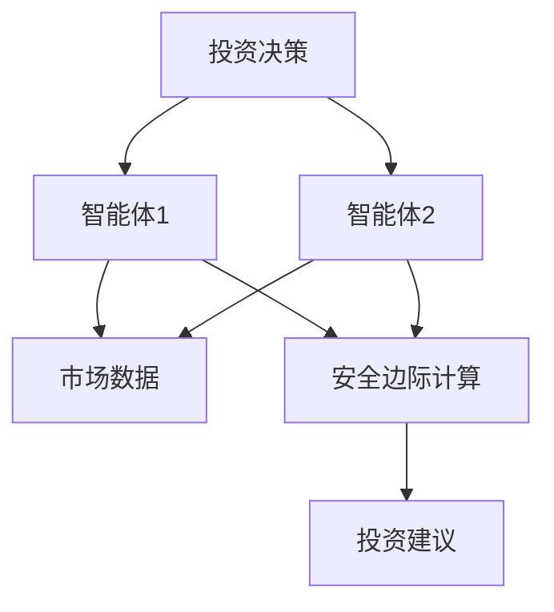
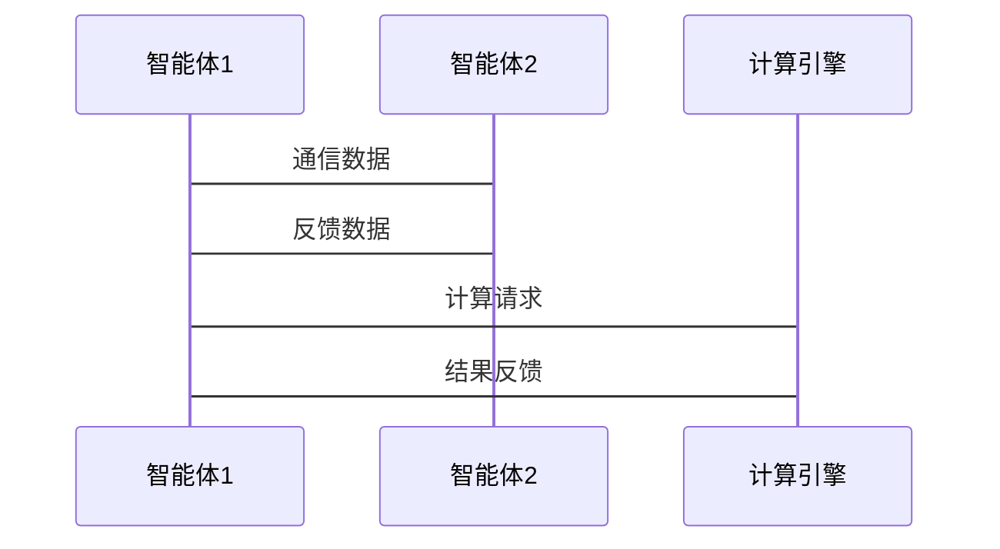

                 


# 多智能体系统如何改进格雷厄姆的安全边际理论

## 关键词：多智能体系统, 安全边际理论, 分布式计算, 协作学习, 投资决策

## 摘要：本文探讨了多智能体系统在改进格雷厄姆安全边际理论中的应用，通过分布式计算和协作学习，优化安全边际分析，提升投资决策的准确性和鲁棒性。

---

## 第一部分：背景介绍

### 第1章：多智能体系统与安全边际理论概述

#### 1.1 多智能体系统的定义与特点
多智能体系统（Multi-Agent Systems, MAS）是由多个智能体组成的系统，每个智能体具备自主性、反应性、协作性和学习性。其特点包括：
- 分布式计算能力：每个智能体独立运行，通过通信协作解决问题。
- 协作性：智能体之间通过交互共同完成目标。
- 动态性：系统状态随环境变化而调整。

#### 1.2 格雷厄姆的安全边际理论
安全边际由本杰明·格雷厄姆提出，指股票内在价值与市场价格之间的差异，用于衡量投资的安全性。核心在于通过安全边际降低投资风险，寻找被市场低估的资产。

#### 1.3 多智能体系统在安全边际理论中的应用前景
多智能体系统能够通过分布式计算和协作学习，优化安全边际的计算和分析，提升投资决策的效率和准确性。

---

## 第二部分：核心概念与联系

### 第2章：多智能体系统的核心概念

#### 2.1 多智能体系统的组成与结构
- **智能体**：具备感知和行动能力的实体，能独立决策。
- **环境**：智能体与之交互的外部世界。
- **通信机制**：智能体间交换信息的方式。

#### 2.2 安全边际理论的数学模型
- **安全边际公式**：安全边际 = 内在价值 - 市场价格。
- **动态调整模型**：根据市场变化动态计算内在价值。

### 第3章：多智能体系统与安全边际理论的联系

#### 3.1 原理分析
- 分布式计算：多智能体系统通过协作优化安全边际计算。
- 协作学习：智能体共享信息，提升安全边际分析的准确性。

#### 3.2 对比表格
| 概念       | 安全边际理论                | 多智能体系统                  |
|------------|-----------------------------|-----------------------------|
| 核心目标    | 确定投资的安全性            | 分布式问题求解              |
| 实现方式    | 估值与比较                | 协作与分布式计算            |

#### 3.3 Mermaid实体关系图


---

## 第三部分：算法原理讲解

### 第3章：多智能体系统的算法原理

#### 3.1 分布式计算算法
- **算法步骤**：
  1. 每个智能体收集数据。
  2. 分布式计算，每个智能体计算部分结果。
  3. 结果汇总，得出最终结论。

- **Mermaid流程图**：
  ```mermaid
  graph TD
      Start --> SmartAgent1
      SmartAgent1 --> Compute1
      SmartAgent1 --> SmartAgent2
      SmartAgent2 --> Compute2
      Compute1 --> Merge
      Compute2 --> Merge
      Merge --> Result
      Result --> End
  ```

- **Python代码实现**：
  ```python
  def distributed_compute(data):
      # 分布式计算逻辑
      pass

  def main():
      agents = [Agent1, Agent2]
      results = [agent.compute(data) for agent in agents]
      merged_result = merge(results)
      return merged_result

  if __name__ == "__main__":
      main()
  ```

#### 3.2 协作学习算法
- **算法步骤**：
  1. 智能体初始化。
  2. 交互信息，更新模型。
  3. 汇总结果，优化安全边际计算。

- **数学模型**：
  $$ 安全边际 = \sum_{i=1}^{n} w_i \times v_i $$
  其中，$w_i$ 是权重，$v_i$ 是内在价值。

---

## 第四部分：系统分析与架构设计

### 第4章：多智能体系统的架构设计

#### 4.1 系统功能设计
- **功能模块**：数据采集、计算引擎、协作模块。
- **交互流程**：数据采集→分布式计算→协作优化→输出结果。

#### 4.2 系统架构设计
- **分层架构**：数据层、计算层、应用层。
- **接口设计**：REST API，用于智能体间通信。

#### 4.3 交互流程图


---

## 第五部分：项目实战

### 第5章：多智能体系统在安全边际理论中的应用案例

#### 5.1 环境安装与配置
- 安装Python、库（如NumPy、scikit-learn）。
- 配置多智能体框架（如MABS）。

#### 5.2 核心代码实现
```python
class Agent:
    def __init__(self, id):
        self.id = id

    def compute(self, data):
        # 计算逻辑
        return result

def main():
    agents = [Agent(1), Agent(2)]
    data = collect_data()
    results = []
    for agent in agents:
        result = agent.compute(data)
        results.append(result)
    # 合并结果
    final_result = merge(results)
    return final_result

if __name__ == "__main__":
    main()
```

#### 5.3 案例分析与解读
通过具体案例，展示多智能体系统如何优化安全边际计算，提升投资决策的准确性。

---

## 第六部分：最佳实践

### 第6章：总结与展望

#### 6.1 小结
多智能体系统通过协作学习和分布式计算，显著提升了安全边际分析的效率和准确性。

#### 6.2 注意事项
- 数据质量：确保数据准确。
- 系统设计：合理设计通信机制。
- 安全性：防止信息泄露。

#### 6.3 拓展阅读
推荐相关书籍和论文，深入学习多智能体系统和投资理论。

---

## 结语

多智能体系统为安全边际理论的改进提供了新思路，通过技术手段提升投资决策的质量和效率。

---

## 作者

作者：AI天才研究院/AI Genius Institute & 禅与计算机程序设计艺术 /Zen And The Art of Computer Programming

---

这篇文章通过详细的结构和内容安排，系统地探讨了多智能体系统如何改进格雷厄姆的安全边际理论，从理论到实践，全面分析了其应用价值和实现方法。

