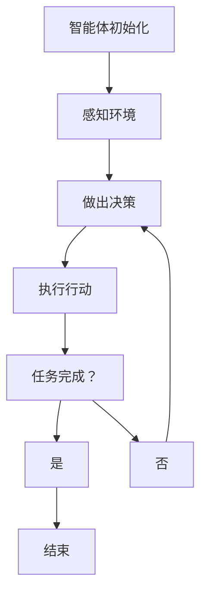

                 

# 多智能体系统如何评估公司创新能力

> 关键词：多智能体系统, 创新能力评估, 知识共享, 协作效率, 智能体通信

> 摘要：本文探讨了多智能体系统在评估公司创新能力中的应用，通过分析多智能体系统的核心概念、算法原理、系统架构，以及实际案例，展示了如何利用多智能体系统量化和优化公司的创新能力。文章从背景介绍、核心概念、算法原理、系统设计、项目实战到最佳实践，逐步展开，为读者提供了一套完整的解决方案。

---

## 第一章: 多智能体系统与创新能力评估背景

### 1.1 多智能体系统的基本概念

#### 1.1.1 多智能体系统的定义与特点

多智能体系统（Multi-Agent System, MAS）是由多个智能体（Agent）组成的分布式系统，这些智能体能够自主决策、协作完成任务。以下是其主要特点：

- **自主性**：每个智能体都有自己的目标和决策机制。
- **反应性**：智能体能够感知环境并实时响应。
- **协作性**：智能体通过通信机制协同完成复杂任务。
- **分布式性**：系统中的智能体分布在网络中，无中心控制节点。

#### 1.1.2 多智能体系统的起源与发展

多智能体系统起源于分布式人工智能领域，20世纪80年代开始发展，近年来随着大数据和云计算的兴起，MAS在多个领域得到了广泛应用。

#### 1.1.3 多智能体系统的核心要素

- **智能体**：系统的最小功能单元。
- **环境**：智能体所处的外部世界。
- **目标**：智能体的行为动机。
- **通信机制**：智能体之间的信息交互方式。

### 1.2 创新能力评估的定义与重要性

#### 1.2.1 创新能力的定义

创新能力是指企业在市场中通过创新活动（如新产品开发、技术改进等）创造价值的能力。创新能力评估是衡量企业竞争力的重要指标。

#### 1.2.2 创新能力评估的维度

- **知识共享**：团队内部知识流动效率。
- **协作效率**：团队协作完成创新任务的能力。
- **技术应用**：技术创新能力。
- **创新成果**：创新产出的数量和质量。

#### 1.2.3 创新能力评估的意义

- **优化资源配置**：通过评估发现资源浪费点。
- **提升协作效率**：优化团队协作流程。
- **量化创新成果**：为公司战略决策提供数据支持。

### 1.3 多智能体系统在创新能力评估中的应用

#### 1.3.1 多智能体系统的优势

- **分布式计算能力**：能够处理大规模数据。
- **动态协作能力**：适应快速变化的环境。
- **自主决策能力**：智能体可以自主优化行为。

#### 1.3.2 多智能体系统在创新能力评估中的作用

- **知识共享建模**：分析团队内部知识流动。
- **协作效率优化**：通过智能体协作提升团队效率。
- **创新成果预测**：基于历史数据预测未来创新趋势。

#### 1.3.3 多智能体系统与传统评估方法的对比

| 特性                | 多智能体系统                  | 传统评估方法                |
|---------------------|-----------------------------|-----------------------------|
| 数据处理能力        | 强大，支持实时数据处理      | 较弱，依赖人工收集和分析    |
| 知识共享分析        | 可以实时建模和优化          | 静态分析，难以动态调整      |
| 协作效率提升         | 可以动态优化协作流程        | 静态流程，难以快速调整      |
| 可扩展性            | 支持大规模扩展              | 难以扩展，受人工限制        |

---

## 第二章: 多智能体系统的核心概念与联系

### 2.1 多智能体系统中的智能体

#### 2.1.1 智能体的定义与特征

智能体是一种能够感知环境并采取行动以实现目标的实体。以下是智能体的主要特征：

- **自主性**：智能体可以自主决策。
- **反应性**：能够感知环境变化并实时响应。
- **目标导向性**：所有行为都以目标为导向。

#### 2.1.2 智能体的分类

- **简单反射智能体**：基于当前感知做出反应。
- **基于模型智能体**：利用内部状态和模型进行决策。
- **目标导向智能体**：根据目标选择最优行动。

#### 2.1.3 智能体的协作机制

智能体之间的协作机制可以通过以下方式实现：

- **直接通信**：智能体之间直接交换信息。
- **中间件通信**：通过中间件实现信息共享。
- **分布式协作**：多个智能体协同完成复杂任务。

### 2.2 多智能体系统的环境

#### 2.2.1 环境的定义与类型

环境是智能体所处的外部世界，可以是物理环境或虚拟环境。以下是环境的主要类型：

- **静态环境**：环境在智能体决策过程中保持不变。
- **动态环境**：环境在智能体决策过程中发生变化。
- **确定性环境**：环境状态是确定的。
- **不确定性环境**：环境状态是不确定的。

#### 2.2.2 环境与智能体的交互

智能体与环境的交互是通过感知和行动实现的。感知是智能体获取环境信息的过程，行动是智能体改变环境状态的过程。

#### 2.2.3 环境的动态性与复杂性

环境的动态性和复杂性直接影响智能体的决策过程。在动态环境中，智能体需要实时调整策略；在复杂环境中，智能体需要综合考虑多种因素。

### 2.3 多智能体系统的目标与任务

#### 2.3.1 多智能体系统的任务定义

多智能体系统的目标是通过多个智能体的协作完成复杂任务。任务可以是单一目标也可以是多目标。

#### 2.3.2 多智能体系统的协作目标

协作目标是指多个智能体共同完成的任务目标。协作目标的实现需要智能体之间的高效通信和协调。

#### 2.3.3 多智能体系统的优化目标

优化目标是指在协作过程中寻求最优解决方案。优化目标通常涉及资源分配、效率最大化等问题。

### 2.4 多智能体系统的通信机制

#### 2.4.1 通信机制的定义

通信机制是指智能体之间交换信息的方式和规则。通信机制是多智能体系统的核心组成部分。

#### 2.4.2 通信机制的类型

- **直接通信**：智能体之间直接交换信息。
- **间接通信**：通过中间媒介进行信息交换。
- **广播通信**：一个智能体向所有其他智能体发送信息。

#### 2.4.3 通信机制的设计原则

- **可靠性**：确保信息准确传递。
- **实时性**：支持实时信息交换。
- **安全性**：防止信息泄露和篡改。

---

## 第三章: 多智能体系统与创新能力评估的核心联系

### 3.1 多智能体系统在创新能力评估中的角色

#### 3.1.1 多智能体系统作为评估工具

多智能体系统可以用来模拟和分析创新过程，帮助评估创新能力。

#### 3.1.2 多智能体系统作为评估主体

智能体可以代表公司内部的不同部门，通过协作完成创新能力评估。

#### 3.1.3 多智能体系统的评估功能

- **知识共享建模**：分析团队内部知识流动。
- **协作效率优化**：通过智能体协作提升团队效率。
- **创新成果预测**：基于历史数据预测未来创新趋势。

### 3.2 多智能体系统与创新能力评估的核心联系

多智能体系统通过智能体之间的协作，可以实现创新能力的量化评估。以下是多智能体系统与创新能力评估的核心联系：

- **知识共享**：智能体之间的信息交换可以模拟知识共享过程。
- **协作效率**：智能体协作过程可以反映团队协作效率。
- **创新成果**：智能体协作成果可以代表创新产出。

### 3.3 多智能体系统在创新能力评估中的优势

#### 3.3.1 知识共享建模

多智能体系统可以通过智能体之间的通信机制，模拟知识共享过程，分析知识流动效率。

#### 3.3.2 协作效率优化

多智能体系统可以通过智能体协作优化，提升团队协作效率。

#### 3.3.3 创新成果预测

多智能体系统可以通过历史数据建模，预测未来的创新成果。

---

## 第四章: 多智能体系统算法原理与创新能力评估

### 4.1 多智能体系统算法原理

#### 4.1.1 算法原理概述

多智能体系统的核心算法包括：分布式计算、协作算法、通信协议等。以下是几种常见的多智能体算法：

- **分布式一致性算法**：确保系统中所有智能体的状态一致。
- **分布式优化算法**：在分布式环境下进行优化。
- **协作算法**：通过协作完成复杂任务。

#### 4.1.2 算法实现步骤

以下是多智能体系统的算法实现步骤：

1. 初始化智能体。
2. 智能体感知环境。
3. 智能体做出决策。
4. 智能体执行行动。
5. 重复步骤2-4，直到任务完成。

#### 4.1.3 算法流程图

---

## 第五章: 系统分析与架构设计

### 5.1 系统分析

#### 5.1.1 问题场景介绍

在创新能力评估中，公司内部的多个部门需要协作完成创新任务。传统的评估方法难以量化团队协作效率和知识共享情况。

#### 5.1.2 项目介绍

本项目旨在利用多智能体系统，对公司的创新能力进行评估和优化。

---

（由于篇幅限制，后续章节将逐步展开，涵盖算法原理、系统架构设计、项目实战等内容。）

