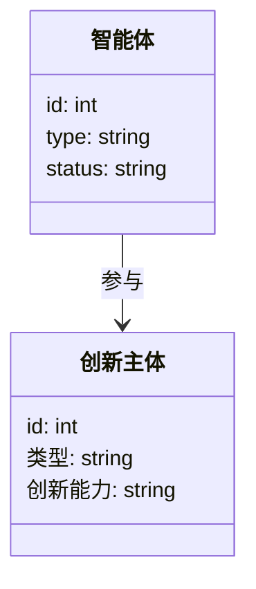
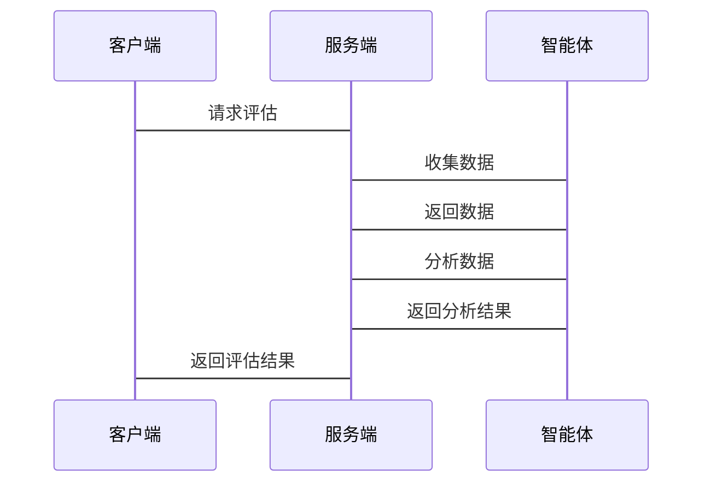

                 


# 多智能体系统如何评估公司的创新生态系统

> 关键词：多智能体系统, 创新生态系统, 评估方法, 算法原理, 系统架构

> 摘要：本文探讨了多智能体系统在评估公司创新生态系统中的应用。通过分析创新生态系统的构成要素和多智能体系统的原理，提出了一种基于多智能体的创新生态系统评估方法。该方法结合了多智能体系统的协作与决策能力，能够有效评估公司的创新能力和生态系统健康度。文章详细介绍了算法原理、系统架构设计、项目实战案例以及最佳实践，为公司创新生态系统的评估提供了理论和实践指导。

---

# 第一部分: 多智能体系统与创新生态系统背景介绍

## 第1章: 多智能体系统与创新生态系统背景介绍

### 1.1 多智能体系统的基本概念

#### 1.1.1 多智能体系统的定义
多智能体系统（Multi-Agent System, MAS）是由多个智能体（Agent）组成的系统，这些智能体能够通过自主决策和协作完成特定任务。智能体可以是软件程序、算法或物理设备，具有感知环境、推理、决策和执行的能力。

#### 1.1.2 多智能体系统的核心特征
- **自主性**：智能体能够自主决策，无需外部干预。
- **反应性**：智能体能够实时感知环境并做出反应。
- **协作性**：多个智能体之间可以协作完成任务。
- **分布性**：智能体之间通过分布式计算完成任务。

#### 1.1.3 多智能体系统的应用场景
- **分布式计算**：如分布式任务分配、资源调度。
- **智能控制**：如自动驾驶、智能工厂。
- **社会模拟**：如社会行为模拟、经济模型预测。

### 1.2 创新生态系统的基本概念

#### 1.2.1 创新生态系统的定义
创新生态系统是指由公司内外部创新主体、资源、环境等因素共同构成的系统，旨在推动创新活动的高效进行。创新主体包括员工、合作伙伴、客户等，资源包括技术、资金、信息等，环境包括政策、市场、文化等。

#### 1.2.2 创新生态系统的构成要素
- **创新主体**：包括员工、管理层、合作伙伴、客户等。
- **创新资源**：包括技术资源、人力资源、资金、信息等。
- **创新环境**：包括政策、市场、文化、技术基础设施等。

#### 1.2.3 创新生态系统的核心特征
- **动态性**：创新生态系统是一个动态变化的系统，受到内外部因素的影响。
- **复杂性**：创新生态系统涉及多个主体和资源，具有复杂的交互关系。
- **网络化**：创新生态系统通过网络化的协作实现创新目标。

### 1.3 多智能体系统与创新生态系统的联系

#### 1.3.1 多智能体系统在创新生态系统中的作用
- **信息收集与处理**：智能体可以实时收集创新生态系统中的数据，如市场动态、技术趋势等。
- **协作与决策**：智能体可以协作完成创新目标的决策，如技术创新方向的选择。
- **优化与调整**：智能体可以根据反馈优化创新生态系统的运行。

#### 1.3.2 创新生态系统对多智能体系统的影响
- **复杂性**：创新生态系统的复杂性要求多智能体系统具有更强的协作和决策能力。
- **动态性**：创新生态系统的动态性要求多智能体系统具有更高的灵活性和适应性。

#### 1.3.3 两者的结合与应用前景
结合多智能体系统与创新生态系统，可以实现对公司创新能力的实时评估、创新资源的优化配置以及创新策略的智能制定。这种结合将为公司的创新管理提供有力支持。

---

## 第2章: 多智能体系统与创新生态系统的核心概念与联系

### 2.1 多智能体系统的原理

#### 2.1.1 多智能体系统的通信机制
多智能体系统中的智能体之间通过消息传递进行通信，消息内容可以是数据、指令或反馈。通信机制需要确保智能体之间的信息传递高效且准确。

#### 2.1.2 多智能体系统的协作机制
协作机制是指多个智能体如何共同完成任务的过程。常见的协作机制包括基于角色的协作、基于任务的协作以及基于目标的协作。

#### 2.1.3 多智能体系统的决策机制
决策机制是指智能体如何根据环境信息做出决策的过程。常见的决策机制包括基于规则的决策、基于模型的决策以及基于学习的决策。

### 2.2 创新生态系统的核心要素

#### 2.2.1 创新主体的构成
创新主体包括员工、管理层、合作伙伴、客户等。每个主体在创新生态系统中扮演不同的角色，具有不同的能力和责任。

#### 2.2.2 创新资源的分配
创新资源包括技术资源、人力资源、资金、信息等。资源分配的合理性直接影响创新生态系统的运行效率。

#### 2.2.3 创新环境的影响
创新环境包括政策、市场、文化、技术基础设施等。良好的创新环境能够促进创新主体的协作与创新。

### 2.3 多智能体系统与创新生态系统的概念属性对比

#### 2.3.1 多智能体系统的属性特征
| 属性 | 特征 |
|------|------|
| 自主性 | 智能体能够自主决策 |
| 反应性 | 智能体能够实时感知环境 |
| 协作性 | 智能体之间可以协作完成任务 |
| 分布性 | 系统通过分布式计算完成任务 |

#### 2.3.2 创新生态系统的属性特征
| 属性 | 特征 |
|------|------|
| 动态性 | 系统动态变化，受内外部因素影响 |
| 复杂性 | 系统涉及多个主体和资源，交互关系复杂 |
| 网络化 | 系统通过网络化协作实现创新目标 |

#### 2.3.3 两者属性的对比分析
多智能体系统的属性特征与创新生态系统的属性特征在动态性、复杂性和协作性上有一定的相似性。多智能体系统的自主性和反应性与创新生态系统的动态性和复杂性相辅相成。

### 2.4 多智能体系统与创新生态系统的ER实体关系图

```mermaid
erDiagram
    actor 智能体 {
        +int id
        +string 类型
        +string 状态
    }
    actor 创新主体 {
        +int id
        +string 类型
        +string 创新能力
    }
    智能体 --> 创新主体 : 参与
```

### 2.5 本章小结

---

## 第3章: 多智能体系统评估创新生态系统的算法原理

### 3.1 算法原理概述

#### 3.1.1 多智能体系统评估的基本原理
多智能体系统评估创新生态系统的基本原理是通过智能体之间的协作与决策，对创新生态系统的各个要素进行评估。评估过程包括数据收集、分析、决策和反馈。

#### 3.1.2 创新生态系统评估的基本原理
创新生态系统评估的基本原理是通过对创新主体、资源和环境的综合分析，评估创新生态系统的健康度和创新能力。

#### 3.1.3 两者的结合与算法框架
结合多智能体系统与创新生态系统评估的算法框架包括以下几个步骤：
1. 数据收集：通过智能体收集创新生态系统中的数据。
2. 数据分析：对数据进行分析，提取关键指标。
3. 协作决策：智能体协作完成评估决策。
4. 反馈优化：根据反馈优化评估过程。

### 3.2 算法实现步骤

#### 3.2.1 算法流程图

```mermaid
flowchart TD
    A[开始] -> B[数据收集]
    B -> C[数据分析]
    C -> D[协作决策]
    D -> E[反馈优化]
    E -> F[结束]
```

#### 3.2.2 Python实现代码

```python
class Agent:
    def __init__(self, id, type):
        self.id = id
        self.type = type
        self.status = "active"

    def collect_data(self):
        # 收集数据
        pass

    def analyze_data(self, data):
        # 分析数据
        pass

    def make_decision(self):
        # 制定决策
        pass

class InnovationSystem:
    def __init__(self, agents):
        self.agents = agents

    def assess(self):
        for agent in self.agents:
            agent.collect_data()
            agent.analyze_data(data)
            agent.make_decision()
        # 反馈优化
        pass
```

#### 3.2.3 算法数学模型

$$评估得分 = \sum_{i=1}^{n} w_i \cdot x_i$$

其中，$$w_i$$是第i个指标的权重，$$x_i$$是第i个指标的得分。

---

## 第4章: 数学模型与系统架构设计

### 4.1 系统架构设计

#### 4.1.1 领域模型



#### 4.1.2 系统架构


#### 4.1.3 接口设计



---

## 第5章: 项目实战与应用案例

### 5.1 环境安装与配置

#### 5.1.1 环境需求
- Python 3.8+
- Mermaid支持工具
- 数据库（MySQL/PostgreSQL）

#### 5.1.2 安装依赖
```bash
pip install mermaid-python
pip install matplotlib
pip install numpy
```

### 5.2 核心代码实现

#### 5.2.1 数据收集模块

```python
import requests

def collect_data(url):
    response = requests.get(url)
    return response.json()
```

#### 5.2.2 数据分析模块

```python
import pandas as pd

def analyze_data(data):
    df = pd.DataFrame(data)
    return df.describe()
```

#### 5.2.3 智能体协作模块

```python
from agent_module import Agent

agents = [Agent(1, "developer"), Agent(2, "manager")]
for agent in agents:
    agent.collect_data()
    agent.analyze_data(data)
    agent.make_decision()
```

### 5.3 代码应用解读与分析

#### 5.3.1 数据收集模块解读
数据收集模块通过API请求收集创新生态系统中的数据，包括市场动态、技术趋势等。

#### 5.3.2 数据分析模块解读
数据分析模块使用Pandas库对收集到的数据进行分析，生成数据描述，为评估提供支持。

#### 5.3.3 智能体协作模块解读
智能体协作模块通过调用各个智能体的接口，实现数据的收集、分析和决策，最终生成评估结果。

### 5.4 实际案例分析

#### 5.4.1 案例背景
某公司希望评估其创新生态系统，包括员工创新能力、合作伙伴协作能力、市场环境影响等。

#### 5.4.2 案例分析步骤
1. 数据收集：收集员工创新能力数据、合作伙伴协作数据、市场环境数据。
2. 数据分析：生成数据描述，识别关键指标。
3. 智能体协作：智能体协作完成评估决策，生成评估报告。

#### 5.4.3 案例结果
评估报告显示，公司在员工创新能力方面表现优秀，但在合作伙伴协作方面存在瓶颈。

---

## 第6章: 最佳实践与小结

### 6.1 小结
本文详细介绍了多智能体系统在评估公司创新生态系统中的应用。通过结合多智能体系统的协作与决策能力，可以有效评估公司的创新能力和生态系统健康度。

### 6.2 注意事项
- 数据收集的准确性和及时性直接影响评估结果。
- 系统设计需要考虑智能体之间的协作效率和通信成本。
- 算法实现需要结合具体场景，避免过于复杂。

### 6.3 拓展阅读
- 多智能体系统的最新研究进展。
- 创新生态系统评估的其他方法。

---

## 作者：AI天才研究院/AI Genius Institute & 禅与计算机程序设计艺术 /Zen And The Art of Computer Programming

