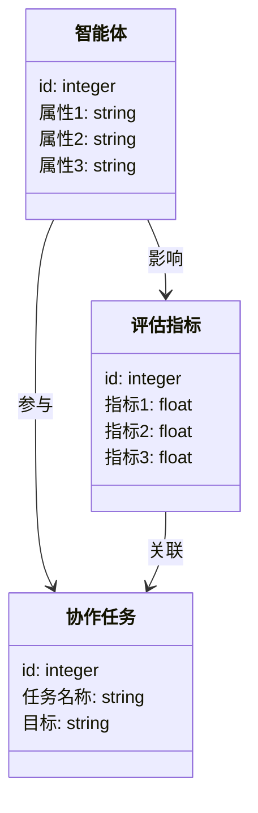

                 


# 多智能体系统如何评估公司的可持续发展能力

> 关键词：多智能体系统, 企业可持续发展, 评估模型, 算法设计, 系统架构

> 摘要：本文详细探讨了多智能体系统在企业可持续发展评估中的应用，从基本概念到算法设计，再到系统架构，逐步展开分析。通过实际案例展示多智能体系统如何助力企业实现可持续发展目标，为企业提供科学的决策支持。

---

## 第1章 多智能体系统与可持续发展概述

### 1.1 多智能体系统的基本概念

#### 1.1.1 多智能体系统的定义
多智能体系统（Multi-Agent System，MAS）是由多个智能体（Agent）组成的分布式系统，这些智能体能够通过协同工作完成复杂的任务。每个智能体都是一个具备感知、决策和执行能力的独立实体，能够与其他智能体进行交互和协作。

#### 1.1.2 多智能体系统的特征
- **分布性**：智能体分布在不同的位置，独立运行。
- **协作性**：智能体之间通过协作完成共同目标。
- **自主性**：智能体能够自主决策，无需外部干预。
- **反应性**：智能体能够实时感知环境变化并做出反应。

#### 1.1.3 多智能体系统与单智能体系统的区别
| 特性                | 单智能体系统                     | 多智能体系统                     |
|---------------------|---------------------------------|---------------------------------|
| 结构                | 单一结构                       | 分布式结构                       |
| 协作方式            | 无协作或简单协作               | 强化协作                         |
| 系统复杂度          | 简单                           | 复杂                           |
| 应用场景            | 单一任务                       | 多任务协同                       |

### 1.2 可持续发展的定义与评估标准

#### 1.2.1 可持续发展的定义
可持续发展是指在满足当前需求的同时，不损害后代满足其需求的能力。它涵盖了经济、社会和环境三个维度。

#### 1.2.2 可持续发展的核心维度
- **经济维度**：企业经济效益的可持续性。
- **社会维度**：企业对社会的贡献，包括员工福利、社会责任等。
- **环境维度**：企业对环境的影响，包括资源消耗、排放等。

#### 1.2.3 可持续发展评估的挑战
- **数据多样性**：涉及经济、社会和环境等多个维度。
- **动态变化**：企业内外部环境不断变化。
- **复杂性**：需要综合考虑多个因素。

---

## 第2章 多智能体系统的核心概念与原理

### 2.1 多智能体系统的组成与关系

#### 2.1.1 多智能体系统的组成要素
- **智能体**：具备感知、决策和执行能力的独立实体。
- **环境**：智能体所处的外部环境，包括物理环境和任务环境。
- **通信机制**：智能体之间进行信息交换的通道。
- **协作机制**：智能体之间协同工作的规则和协议。

#### 2.1.2 多智能体系统的ER实体关系图
```mermaid
erDiagram
    智能体 [N: 1..n] --> 评估指标
    智能体 [N: 1..n] --> 协作任务
    评估指标 [N: 1..n] --> 协作任务
```

---

## 第3章 多智能体系统的算法原理

### 3.1 多智能体系统的算法选择

#### 3.1.1 分布式计算算法
- **分布式计算**：将任务分解到多个智能体上进行计算，提高效率。
- **一致性算法**：确保多个智能体之间的数据一致性。

#### 3.1.2 协同优化算法
- **协同优化**：通过智能体之间的协作，优化整体性能。
- **博弈论算法**：模拟智能体之间的博弈关系，找到最优解。

### 3.2 多智能体系统的数学模型

#### 3.2.1 智能体行为模型
$$f(a) = \begin{cases}
    1 & \text{如果 } a \text{ 满足条件} \\
    0 & \text{否则}
\end{cases}$$

#### 3.2.2 协作优化模型
$$C = \sum_{i=1}^{n} w_i \cdot x_i$$
其中，$w_i$ 是权重，$x_i$ 是指标值。

---

## 第4章 系统分析与架构设计

### 4.1 系统功能设计

#### 4.1.1 领域模型类图


#### 4.1.2 系统架构图


---

## 第5章 项目实战

### 5.1 环境安装

#### 5.1.1 安装Python和相关库
```bash
pip install numpy pandas scikit-learn
```

#### 5.1.2 安装mermaid工具
```bash
npm install -g mermaid-cli
```

### 5.2 核心代码实现

#### 5.2.1 智能体类实现
```python
class Agent:
    def __init__(self, id):
        self.id = id
        self.attributes = {}
    
    def perceive(self, environment):
        # 根据环境感知信息
        pass
    
    def decide(self, information):
        # 根据信息做出决策
        pass
    
    def execute(self, action):
        # 执行动作
        pass
```

#### 5.2.2 评估指标计算
```python
def calculate_score(agent, metrics):
    score = 0
    for metric in metrics:
        score += agent.attributes[metric] * 0.33
    return score
```

---

## 第6章 总结与展望

### 6.1 小结
多智能体系统通过分布式计算和协作优化，能够有效评估企业的可持续发展能力。本文详细介绍了多智能体系统的理论基础、算法设计和系统架构，并通过实际案例展示了其应用价值。

### 6.2 未来展望
- **动态调整机制**：研究如何根据环境变化动态调整智能体的行为。
- **数据隐私保护**：探索在多智能体系统中保护数据隐私的方法。
- **跨领域应用**：进一步拓展多智能体系统在其他领域的应用。

---

## 第7章 最佳实践与注意事项

### 7.1 最佳实践
- **数据质量管理**：确保输入数据的准确性和完整性。
- **模型选择**：根据具体需求选择合适的算法和模型。
- **系统维护**：定期更新和优化系统，确保其高效运行。

### 7.2 注意事项
- **避免过度复杂化**：保持系统设计的简洁性。
- **数据隐私保护**：重视数据安全，防止信息泄露。
- **系统可扩展性**：确保系统能够适应未来的扩展需求。

---

## 作者

作者：AI天才研究院/AI Genius Institute & 禅与计算机程序设计艺术/Zen And The Art of Computer Programming

---

这篇文章从理论到实践，全面介绍了多智能体系统在企业可持续发展评估中的应用，希望对读者有所帮助！

