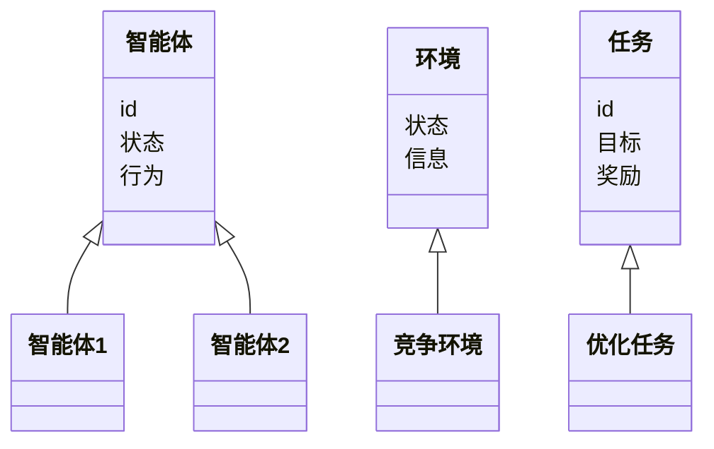
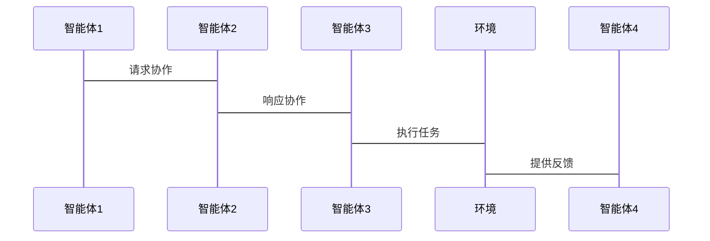

                 


# 多智能体系统如何评估公司的护城河

---

## 关键词

- 多智能体系统
- 公司护城河
- 分布式计算
- 协作与竞争算法
- 护城河评估
- 企业竞争优势

---

## 摘要

在当今竞争激烈的商业环境中，公司护城河是企业维持长期竞争优势的关键。多智能体系统（Multi-Agent Systems, MAS）作为一种新兴的技术手段，能够通过分布式计算、协作与竞争算法等方法，为企业护城河的评估提供全新的视角和解决方案。本文将详细探讨多智能体系统在公司护城河评估中的应用，包括其核心概念、算法原理、系统架构以及实际案例分析，为读者提供一个全面的视角来理解如何利用多智能体系统构建和强化公司的竞争优势。

---

## 第一部分: 多智能体系统与公司护城河的背景介绍

### 第1章: 多智能体系统概述

#### 1.1 多智能体系统的定义与特点

##### 1.1.1 多智能体系统的定义

多智能体系统（Multi-Agent Systems, MAS）是由多个智能体（Agent）组成的分布式系统，这些智能体能够通过感知环境、自主决策并进行协作或竞争，以实现共同目标或个体目标。多智能体系统的核心在于智能体之间的交互与协同，这使得系统能够适应复杂多变的环境。

##### 1.1.2 多智能体系统的核心特点

- **分布式性**：多个智能体独立运行，通过通信和协作完成任务。
- **自主性**：每个智能体都能够自主决策，无需中央控制。
- **协作性**：智能体之间可以通过协作实现共同目标。
- **动态性**：系统能够适应环境的变化，实时调整策略。

##### 1.1.3 多智能体系统与传统单智能体系统的区别

| 特性       | 单智能体系统          | 多智能体系统          |
|------------|-----------------------|-----------------------|
| 结构       | 集中式、单点控制      | 分布式、多点协作      |
| 决策       | 由中央系统统一决策    | 各智能体自主决策      |
| 效率       | 高效但缺乏灵活性      | 较低但更具适应性      |
| 应用场景   | 适合简单任务          | 适合复杂任务          |

#### 1.2 多智能体系统的应用场景

##### 1.2.1 分布式计算中的多智能体协作

在分布式计算环境中，多智能体系统可以通过协作完成复杂的任务。例如，分布式数据库中的多智能体可以协同完成数据同步和一致性维护。

##### 1.2.2 企业级系统中的多智能体应用

在企业级系统中，多智能体系统可以用于供应链管理、资源分配、客户关系管理等场景，通过智能体之间的协作优化企业运营效率。

##### 1.2.3 多智能体系统在商业分析中的潜力

通过多智能体系统的分析能力，企业可以更好地理解市场趋势、竞争对手策略，从而制定更具竞争力的商业策略。

---

### 第2章: 公司护城河的定义与评估

#### 2.1 公司护城河的核心概念

##### 2.1.1 护城河的定义与分类

护城河是企业在市场中形成的竞争优势，能够抵御竞争对手的侵蚀。护城河可以分为技术护城河、品牌护城河、成本护城河等。

##### 2.1.2 护城河的构成要素

- **技术优势**：企业的核心技术竞争力。
- **品牌影响力**：品牌知名度和客户忠诚度。
- **成本优势**：生产成本或运营成本的显著优势。
- **市场准入壁垒**：竞争对手难以进入市场的障碍。

##### 2.1.3 护城河的评估标准

- **可模仿性**：竞争对手是否容易复制企业的优势。
- **持久性**：优势是否能够长期维持。
- **适用性**：优势是否能够在不同市场和环境下发挥作用。

#### 2.2 多智能体系统在护城河评估中的作用

##### 2.2.1 多智能体系统如何分析竞争优势

通过多智能体系统的分析能力，企业可以识别自身的核心竞争优势，并通过智能体之间的协作优化这些优势。

##### 2.2.2 多智能体系统如何识别潜在风险

多智能体系统可以通过实时监测市场变化和竞争对手的动态，识别潜在的市场风险，并制定应对策略。

##### 2.2.3 多智能体系统如何优化资源配置

通过多智能体系统的协作与优化算法，企业可以更有效地配置资源，提升运营效率，从而增强护城河的稳固性。

---

## 第三部分: 多智能体系统与护城河的核心概念与联系

### 第3章: 多智能体系统的数学模型与算法原理

#### 3.1 多智能体系统的数学模型

##### 3.1.1 多智能体系统的基本数学框架

多智能体系统的数学模型通常包括状态、动作、奖励和目标四个部分。每个智能体都有一个状态空间，可以通过动作改变状态，并根据目标函数获得奖励。

##### 3.1.2 多智能体系统中的博弈论模型

在多智能体系统中，博弈论模型可以用来描述智能体之间的协作与竞争关系。每个智能体都是一个参与者，通过策略选择最大化自身的收益。

##### 3.1.3 多智能体系统中的分布式计算模型

分布式计算模型通过将任务分解为多个子任务，分配给不同的智能体完成，从而实现并行计算和资源优化。

#### 3.2 多智能体系统的算法原理

##### 3.2.1 分布式算法在多智能体系统中的应用

分布式算法通过智能体之间的通信和协作，实现任务的分配和执行。例如，分布式共识算法可以用于智能体之间的决策达成。

##### 3.2.2 协作与竞争算法的设计

协作与竞争算法通过智能体之间的协作和竞争，优化系统的整体性能。例如，协作算法可以用于任务分配，竞争算法可以用于资源争夺。

##### 3.2.3 自适应算法在多智能体系统中的实现

自适应算法能够根据环境的变化，动态调整智能体的行为策略，从而提高系统的适应性和鲁棒性。

---

### 第4章: 多智能体系统与护城河的实体关系分析

#### 4.1 多智能体系统中的实体关系

##### 4.1.1 多智能体系统中的实体定义

在多智能体系统中，实体包括智能体、环境、任务和目标。智能体是核心实体，负责感知环境、决策和执行任务。

##### 4.1.2 实体之间的关系分析

- 智能体与环境的关系：智能体通过感知环境获取信息，并通过执行动作改变环境。
- 智能体与任务的关系：智能体通过协作完成任务，任务是智能体行为的驱动力。
- 智能体与目标的关系：智能体通过实现目标获得奖励，目标是智能体行为的最终目的。

##### 4.1.3 实体关系的ER图展示

```mermaid
erd
    entity 智能体 {
        id
        状态
        行为
    }
    entity 环境 {
        状态
        信息
    }
    entity 任务 {
        id
        目标
        奖励
    }
    智能体 --> 环境: 感知
    智能体 --> 任务: 执行
    环境 --> 任务: 提供信息
```

#### 4.2 护城河评估中的实体关系

##### 4.2.1 护城河评估的核心实体

在护城河评估中，核心实体包括企业、市场、竞争对手和资源。企业通过优化资源配置和提升竞争优势，构建护城河。

##### 4.2.2 实体之间的关系分析

- 企业与市场的关系：企业通过市场分析确定竞争优势。
- 企业与竞争对手的关系：通过竞争分析识别竞争对手的劣势。
- 企业与资源的关系：通过资源优化配置提升企业竞争力。

##### 4.2.3 实体关系的ER图展示

```mermaid
erd
    entity 企业 {
        id
        资源
        竞争优势
    }
    entity 市场 {
        id
        竞争状况
        市场趋势
    }
    entity 竞争对手 {
        id
        竞争策略
        资源
    }
    企业 --> 市场: 分析市场趋势
    企业 --> 竞争对手: 分析竞争策略
    市场 --> 企业: 提供市场信息
    竞争对手 --> 企业: 提供竞争信息
```

---

### 第5章: 多智能体系统与护城河的算法流程图

#### 5.1 多智能体系统的算法流程图

##### 5.1.1 分布式计算流程图

```mermaid
graph TD
    A[智能体1] --> B[智能体2]: 通信
    B --> C[智能体3]: 通信
    C --> D[智能体4]: 通信
    D --> E[环境]: 执行任务
```

##### 5.1.2 协作与竞争算法流程图

```mermaid
graph TD
    A[智能体1] --> B[智能体2]: 协作
    B --> C[智能体3]: 协作
    C --> D[智能体4]: 竞争
    D --> E[目标]: 实现
```

---

## 第四部分: 多智能体系统与护城河的系统分析与架构设计

### 第6章: 系统分析与架构设计

#### 6.1 项目介绍

在本项目中，我们将利用多智能体系统评估某企业的护城河。通过分析企业的资源、市场地位和竞争优势，构建一个多智能体系统，帮助企业优化资源配置，提升竞争力。

#### 6.2 系统功能设计

##### 6.2.1 领域模型类图



#### 6.3 系统架构设计

##### 6.3.1 系统架构图


##### 6.3.2 接口设计

- **智能体接口**：定义智能体之间的通信协议。
- **环境接口**：定义智能体与环境的交互方式。
- **任务接口**：定义任务的分配和执行方式。

##### 6.3.3 交互流程图



---

## 第五部分: 多智能体系统与护城河的项目实战

### 第7章: 项目实战

#### 7.1 环境安装

为了运行本项目，需要安装以下工具和库：

- Python 3.8+
- Mermaid图生成工具
- 多智能体系统框架（如基于Python的多智能体库）

#### 7.2 系统核心实现源代码

以下是系统核心实现的Python代码示例：

```python
class Agent:
    def __init__(self, id):
        self.id = id
        self.state = "idle"
    
    def感知环境(self, environment):
        pass
    
    def 行为(self, task):
        pass

class Environment:
    def __init__(self):
        self.state = "normal"
    
    def 提供信息(self):
        return self.state

class Task:
    def __init__(self, id, target):
        self.id = id
        self.target = target
    
    def 完成(self):
        return True

# 示例用法
agent1 = Agent(1)
agent2 = Agent(2)
environment = Environment()
task = Task(1, "优化资源配置")

agent1.感知环境(environment)
agent2.行为(task)
```

#### 7.3 代码应用解读与分析

上述代码定义了一个基本的多智能体系统框架，包括智能体、环境和任务三个核心部分。通过协作与竞争算法，智能体可以感知环境、执行任务，并通过通信实现协作。

#### 7.4 实际案例分析和详细讲解剖析

以某企业为例，通过多智能体系统的分析，识别其技术优势、品牌影响力和成本优势，并制定相应的优化策略。

#### 7.5 项目小结

本项目展示了如何利用多智能体系统评估和优化企业的护城河，通过协作与竞争算法，帮助企业提升竞争力。

---

## 第六部分: 总结与拓展

### 第8章: 总结与拓展

#### 8.1 最佳实践 tips

- 在实际应用中，多智能体系统需要结合企业的具体需求进行定制化设计。
- 智能体之间的通信协议需要清晰定义，确保系统的高效运行。
- 系统的可扩展性和可维护性是关键，需要在设计阶段充分考虑。

#### 8.2 小结

本文详细探讨了多智能体系统在公司护城河评估中的应用，从核心概念到算法实现，再到系统设计和项目实战，为读者提供了一个全面的视角。

#### 8.3 注意事项

- 多智能体系统的复杂性较高，需要专业的技术支持。
- 系统的安全性和隐私保护是需要重点关注的方面。
- 在实际应用中，需要结合企业的实际情况进行调整和优化。

#### 8.4 拓展阅读

- 《Multi-Agent Systems: Algorithmic, Complexity Theoretic, and Game Theoretic Foundations》
- 《Multi-Agent Systems: A Modern Approach》

---

## 作者

作者：AI天才研究院/AI Genius Institute & 禅与计算机程序设计艺术/Zen And The Art of Computer Programming

