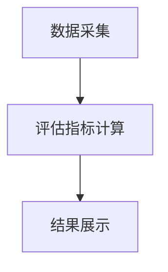
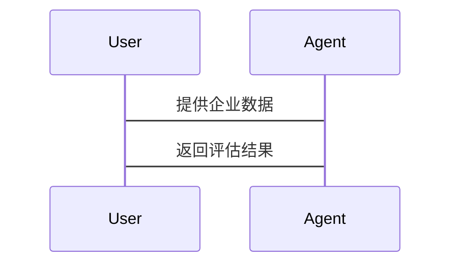

                 


# 多智能体系统如何评估公司的数字化转型能力

## 关键词：多智能体系统, 数字化转型, 评估模型, 人工智能, 系统架构

## 摘要：本文将探讨多智能体系统如何评估公司的数字化转型能力。首先，我们从多智能体系统的基本概念和数字化转型的背景入手，分析两者的关系。接着，我们深入讲解多智能体系统的核心理论和评估模型的构建，包括算法原理和系统架构设计。最后，通过一个具体的项目案例，详细展示如何在实际中应用这些理论和方法，以提升公司的数字化转型能力。

---

# 第一部分: 多智能体系统与数字化转型概述

## # 第1章: 多智能体系统与数字化转型的背景

### 1.1 多智能体系统的基本概念

#### 1.1.1 多智能体系统的定义
多智能体系统（Multi-Agent System, MAS）是指由多个智能体（Agent）组成的系统，这些智能体通过协同工作来完成复杂任务。智能体是具有感知、决策和行动能力的实体，可以是软件程序或物理设备。

#### 1.1.2 多智能体系统的特征
多智能体系统具有以下特征：
- **分布式**：智能体分布在不同的位置，独立运作。
- **协同性**：智能体之间通过通信和协作完成任务。
- **反应性**：智能体能够感知环境并实时响应。
- **自主性**：智能体在没有外部干预的情况下自主决策。

#### 1.1.3 多智能体系统与单智能体系统的区别
单智能体系统由一个中心化的智能体完成任务，而多智能体系统通过多个智能体的协作来完成任务。多智能体系统在复杂环境中更具灵活性和适应性。

### 1.2 数字化转型的定义与背景

#### 1.2.1 数字化转型的定义
数字化转型是指企业利用数字技术（如人工智能、大数据、云计算等）改变业务模式、流程、文化、组织结构和决策方式，以实现业务创新和竞争优势。

#### 1.2.2 数字化转型的背景与趋势
随着信息技术的发展，企业面临数字化转型的压力和机遇。数字化转型不仅是技术的升级，更是管理、文化和业务模式的深刻变革。

#### 1.2.3 数字化转型对企业的影响
数字化转型可以帮助企业提高效率、降低成本、增强客户体验，并开拓新的业务模式。然而，转型过程中也面临技术复杂性、组织变革和数据安全等挑战。

### 1.3 多智能体系统与数字化转型的关系

#### 1.3.1 多智能体系统在数字化转型中的作用
多智能体系统可以用于优化企业的业务流程、提高决策效率和实现智能化管理。例如，在供应链管理中，多个智能体可以协同工作，实时监控和优化库存。

#### 1.3.2 多智能体系统与数字化转型的结合点
多智能体系统可以应用于数字化转型的多个方面，如数据分析、流程自动化、智能决策等。通过多智能体系统的协作，企业可以实现更高效的数字化转型。

#### 1.3.3 多智能体系统如何推动数字化转型
多智能体系统通过分布式的智能体协作，提供实时数据处理和决策支持，推动企业的数字化转型。这种协作方式能够提高企业的灵活性和创新能力。

---

## # 第2章: 多智能体系统的核心概念与理论基础

### 2.1 多智能体系统的理论基础

#### 2.1.1 人工智能与多智能体系统的关系
人工智能是多智能体系统的核心技术，智能体通过人工智能算法实现感知、决策和行动。

#### 2.1.2 多智能体系统的基本原理
多智能体系统通过智能体之间的通信和协作，完成复杂的任务。智能体之间可以通过共享信息和协同决策来实现目标。

#### 2.1.3 多智能体系统的分类与特点
多智能体系统可以分为基于规则的系统和基于学习的系统。基于规则的系统通过预定义规则进行协作，而基于学习的系统通过机器学习算法自主学习和优化。

### 2.2 数字化转型的核心要素

#### 2.2.1 数字化转型的三要素：数据、技术与业务
数据是数字化转型的基础，技术是实现手段，业务是最终目标。

#### 2.2.2 数字化转型的关键成功因素
成功的数字化转型需要企业的战略规划、组织文化、技术能力和数据管理能力。

#### 2.2.3 数字化转型的挑战与机遇
挑战包括技术复杂性、组织变革和数据安全，机遇包括业务创新、效率提升和客户体验优化。

### 2.3 多智能体系统与数字化转型的结合模型

#### 2.3.1 多智能体系统在数字化转型中的核心要素
多智能体系统通过分布式的智能体协作，实现数据的实时处理和决策支持。

#### 2.3.2 多智能体系统与数字化转型的协同机制
智能体之间通过通信和协作，共同完成数据处理、流程优化和决策支持。

#### 2.3.3 多智能体系统如何提升数字化转型能力
多智能体系统通过分布式的智能体协作，提供实时数据处理和决策支持，提升企业的数字化转型能力。

---

## # 第3章: 多智能体系统评估模型的构建

### 3.1 评估模型的基本框架

#### 3.1.1 评估模型的目标与范围
评估模型的目标是衡量企业在数字化转型中的能力，范围包括数据、技术、业务等方面。

#### 3.1.2 评估模型的输入与输出
输入包括企业的数据、技术能力和业务目标，输出包括评估结果和改进建议。

#### 3.1.3 评估模型的构建步骤
1. 确定评估指标
2. 设计评估方法
3. 收集数据
4. 计算评估结果
5. 提出改进建议

### 3.2 多智能体系统评估指标的设计

#### 3.2.1 评估指标的分类与选择
评估指标可以分为数据、技术、业务三类，选择与企业数字化转型相关的指标。

#### 3.2.2 评估指标的权重分配
根据指标的重要性和影响程度，分配相应的权重。

#### 3.2.3 评估指标的计算方法
使用加权平均法计算评估结果。

### 3.3 评估模型的数学表达

#### 3.3.1 数学模型的构建
评估结果 = Σ(指标权重 × 指标得分)

#### 3.3.2 指标权重的计算公式
权重 = (指标的重要性 + 指标的影响程度) / 总分

#### 3.3.3 评估结果的计算公式
评估结果 = Σ(权重_i × 得分_i)

---

## # 第4章: 多智能体系统评估模型的算法实现

### 4.1 算法原理

#### 4.1.1 算法的基本思路
1. 收集数据
2. 特征选择
3. 计算权重
4. 计算评估结果

#### 4.1.2 算法的输入与输出
输入：企业数据、评估指标
输出：评估结果、改进建议

### 4.2 算法实现

#### 4.2.1 数据预处理
```python
import pandas as pd
data = pd.read_csv('input.csv')
data = data.dropna()
```

#### 4.2.2 特征选择
```python
selected_features = ['data', 'technology', 'business']
data = data[selected_features]
```

#### 4.2.3 计算权重
```python
weights = [0.5, 0.3, 0.2]
```

#### 4.2.4 计算评估结果
```python
def calculate_score(data, weights):
    score = 0
    for i in range(len(weights)):
        score += data[i] * weights[i]
    return score
```

---

## # 第5章: 系统架构设计

### 5.1 项目背景与目标
本项目旨在通过多智能体系统评估模型，帮助企业评估数字化转型能力。

### 5.2 系统功能设计

#### 5.2.1 系统功能模块
1. 数据采集模块
2. 评估指标计算模块
3. 结果展示模块

#### 5.2.2 系统功能实现
```python
class Agent:
    def __init__(self, data, weights):
        self.data = data
        self.weights = weights

    def calculate_score(self):
        return sum([self.data[i] * self.weights[i] for i in range(len(self.data))])
```

### 5.3 系统架构设计

#### 5.3.1 系统架构图


### 5.4 系统接口设计

#### 5.4.1 接口描述
- 输入接口：企业数据
- 输出接口：评估结果

### 5.5 系统交互设计

#### 5.5.1 交互流程图


---

## # 第6章: 项目实战

### 6.1 环境安装

#### 6.1.1 环境配置
```bash
pip install pandas
pip install matplotlib
```

### 6.2 系统核心实现

#### 6.2.1 实现代码
```python
import pandas as pd
import matplotlib.pyplot as plt

class Agent:
    def __init__(self, data, weights):
        self.data = data
        self.weights = weights

    def calculate_score(self):
        return sum([self.data[i] * self.weights[i] for i in range(len(self.data))])

data = pd.read_csv('input.csv')
agent = Agent(data, [0.5, 0.3, 0.2])
score = agent.calculate_score()
print(score)
plt.hist(score, bins=10)
plt.show()
```

### 6.3 代码应用解读

#### 6.3.1 代码解读
- 读取输入数据
- 初始化Agent
- 计算评估结果
- 可视化结果

### 6.4 实际案例分析

#### 6.4.1 案例分析
以某公司为例，计算其数字化转型能力评估结果，并提出改进建议。

### 6.5 项目小结
本项目通过多智能体系统评估模型，帮助企业分析数字化转型能力，并提供改进建议。

---

## # 第7章: 最佳实践与小结

### 7.1 小结
多智能体系统通过分布式的智能体协作，提供实时数据处理和决策支持，帮助企业在数字化转型中提升能力。

### 7.2 注意事项
- 数据质量
- 智能体协作效率
- 数据安全

### 7.3 拓展阅读
- 多智能体系统在其他领域的应用
- 数字化转型的最新技术

---

## 作者：AI天才研究院/AI Genius Institute & 禅与计算机程序设计艺术 /Zen And The Art of Computer Programming

