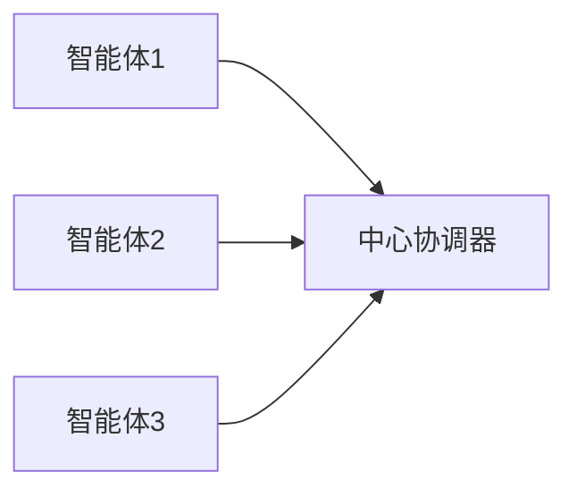
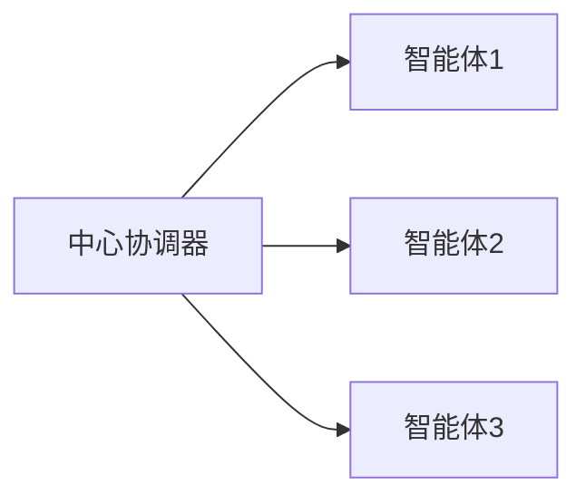
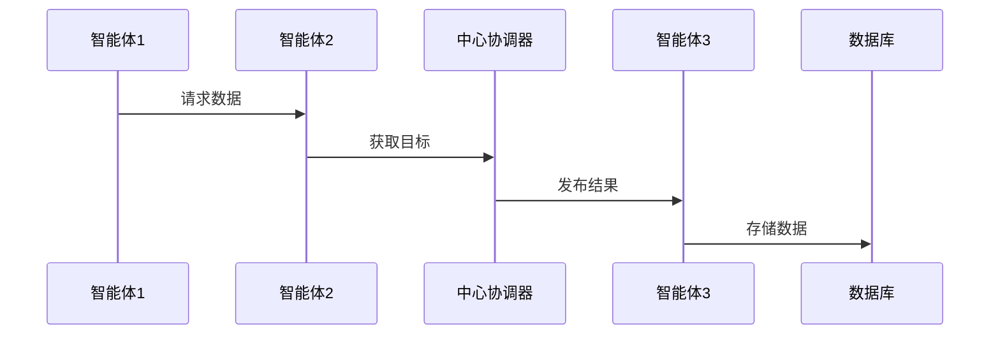

                 


# 多智能体系统如何评估公司的资本配置能力

## 关键词：多智能体系统，资本配置能力，分布式计算，优化算法，系统架构

## 摘要：本文探讨了多智能体系统如何通过分布式计算和优化算法评估和优化公司的资本配置能力。通过详细分析多智能体系统的概念、算法原理和系统架构，本文展示了如何利用多智能体系统来解决资本配置中的复杂问题，从而实现资源的高效利用和最大化价值。

---

## 第1章 多智能体系统与资本配置能力的背景介绍

### 1.1 多智能体系统的基本概念

#### 1.1.1 多智能体系统的定义
多智能体系统（Multi-Agent Systems, MAS）是由多个智能体组成的分布式系统，这些智能体通过通信和协作完成复杂的任务。

#### 1.1.2 多智能体系统的特征
- **分布性**：智能体分布在不同的位置，独立决策。
- **协作性**：智能体之间通过通信和协作完成任务。
- **自治性**：智能体能够自主决策和行动。
- **反应性**：智能体能够实时感知环境变化并做出反应。

#### 1.1.3 多智能体系统与单智能体系统的区别
| 特性         | 多智能体系统                     | 单智能体系统                     |
|--------------|--------------------------------|--------------------------------|
| 结构         | 分布式                         | 集中式                         |
| 交互         | 智能体之间通信                 | 无交互                         |
| 灵活性         | 高                             | 低                             |

### 1.2 资本配置能力的定义与重要性

#### 1.2.1 资本配置能力的定义
资本配置能力是指公司有效地分配和管理资金、资产和其他资源，以实现战略目标和最大化股东价值。

#### 1.2.2 资本配置能力在企业中的作用
- 提高资源利用效率
- 优化投资决策
- 实现风险与收益的平衡

#### 1.2.3 资本配置能力的评估标准
- 资产回报率（ROA）
- 股东权益回报率（ROE）
- 净利润增长率

### 1.3 多智能体系统与资本配置能力的关系

#### 1.3.1 多智能体系统如何影响资本配置
- 提供分布式决策支持
- 实现资源的动态分配
- 优化投资组合

#### 1.3.2 多智能体系统在资本配置中的优势
- **高效性**：通过分布式计算快速响应市场变化
- **协作性**：智能体之间的协作优化资源配置
- **适应性**：系统能够实时调整以应对变化

---

## 第2章 多智能体系统与资本配置能力的核心概念与联系

### 2.1 多智能体系统的模型与架构

#### 2.1.1 分布式多智能体系统模型


#### 2.1.2 集中式多智能体系统模型


#### 2.1.3 混合式多智能体系统模型


### 2.2 资本配置能力的数学模型

#### 2.2.1 资本配置的基本数学公式
$$f(x) = \lambda_1 x_1 + \lambda_2 x_2 + \cdots + \lambda_n x_n$$
其中，$\lambda_i$ 是权重，$x_i$ 是资本分配到第 $i$ 个项目的金额。

#### 2.2.2 资本配置的优化目标
$$\max \sum_{i=1}^{n} \lambda_i x_i$$
$$\text{约束条件：} \sum_{i=1}^{n} x_i = 1$$

#### 2.2.3 资本配置的约束条件
$$x_i \geq 0, \quad \forall i$$

### 2.3 多智能体系统与资本配置能力的实体关系图

#### 2.3.1 实体关系图的定义
展示多智能体系统中各实体之间的关系，包括智能体、资本项目、目标和约束。

#### 2.3.2 实体关系图的绘制
```mermaid
entity 资本配置能力
    资本项目
        智能体
            目标
                约束
```

---

## 第3章 多智能体系统评估资本配置能力的算法原理

### 3.1 多目标优化算法

#### 3.1.1 多目标优化的基本概念
多目标优化是指在多个目标之间寻找平衡点，通常涉及 Pareto 优化。

#### 3.1.2 多目标优化的算法流程


#### 3.1.3 多目标优化的数学模型
$$f_1(x) = x_1 + x_2$$
$$f_2(x) = x_1^2 + x_2^2$$

### 3.2 分布式计算算法

#### 3.2.1 分布式计算的基本原理
通过将问题分解为多个子问题，并行计算以提高效率。

#### 3.2.2 分布式计算的实现步骤


#### 3.2.3 分布式计算的数学模型
$$x_i = \sum_{j=1}^{n} w_{ij}x_j$$

### 3.3 聚类分析算法

#### 3.3.1 聚类分析的基本概念
将资本项目分为若干类别，以便更精准地分配资源。

#### 3.3.2 聚类分析的实现步骤


#### 3.3.3 聚类分析的数学模型
$$d(x_i, x_j) = \sqrt{(x_i - x_j)^2}$$

---

## 第4章 多智能体系统评估资本配置能力的系统分析与架构设计

### 4.1 问题场景介绍

#### 4.1.1 问题背景
公司面临复杂的资本分配问题，需要通过多智能体系统实现高效决策。

#### 4.1.2 问题描述
- 资源分配不均
- 市场变化响应慢
- 投资组合风险高

#### 4.1.3 问题解决
利用多智能体系统优化资本分配，降低风险，提高收益。

### 4.2 系统功能设计

#### 4.2.1 领域模型类图


#### 4.2.2 系统架构设计


#### 4.2.3 系统接口设计
- 智能体与协调器之间的通信接口
- 数据库的存储与查询接口
- 用户界面的交互接口

#### 4.2.4 系统交互序列图


---

## 第5章 多智能体系统评估资本配置能力的项目实战

### 5.1 项目介绍

#### 5.1.1 需求分析
- 实现多智能体系统的资本配置功能
- 优化投资组合
- 实时监控资本分配

#### 5.1.2 系统实现
- 安装必要的库和工具
- 编写智能体之间的通信代码
- 实现优化算法

### 5.2 核心代码实现

#### 5.2.1 智能体通信代码
```python
class Agent:
    def __init__(self, id):
        self.id = id
        self.state = None

    def send_message(self, message, recipient):
        recipient.receive_message(message)

    def receive_message(self, message):
        self.state = message
```

#### 5.2.2 优化算法实现
```python
def multi_objective_optimization():
    # 初始化种群
    population = [ ... ]
    # 计算适应度
    for individual in population:
        fitness = calculate_fitness(individual)
    # 选择 Pareto 最优解
    pareto_front = select_pareto_front(population, fitness)
    return pareto_front
```

### 5.3 实际案例分析

#### 5.3.1 案例背景
某公司需要优化其资本分配，涉及多个项目和风险因素。

#### 5.3.2 案例分析
- 使用多智能体系统进行资本分配
- 实时监控市场变化
- 调整投资组合

#### 5.3.3 案例结果
- 资本分配效率提高
- 投资组合风险降低
- 净利润增长显著

---

## 第6章 多智能体系统评估资本配置能力的最佳实践和小结

### 6.1 总结
多智能体系统通过分布式计算和优化算法，能够有效评估和优化公司的资本配置能力。其分布式架构和协作机制为资本分配提供了新的思路。

### 6.2 注意事项
- 确保智能体之间的通信效率
- 处理好智能体之间的冲突和协调问题
- 定期更新系统以适应市场变化

### 6.3 未来研究方向
- 研究多智能体系统的自适应优化算法
- 探讨多智能体系统在更复杂资本配置问题中的应用
- 结合人工智能技术进一步提升系统性能

---

## 作者：AI天才研究院 & 禅与计算机程序设计艺术

---

本文通过详细分析多智能体系统的概念、算法原理和系统架构，展示了如何利用多智能体系统评估和优化公司的资本配置能力。从理论到实践，本文为读者提供了全面的指导和深入的见解。

