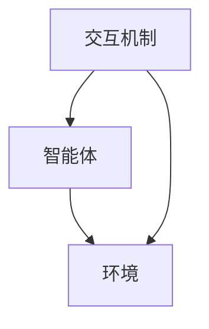
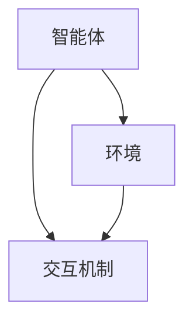
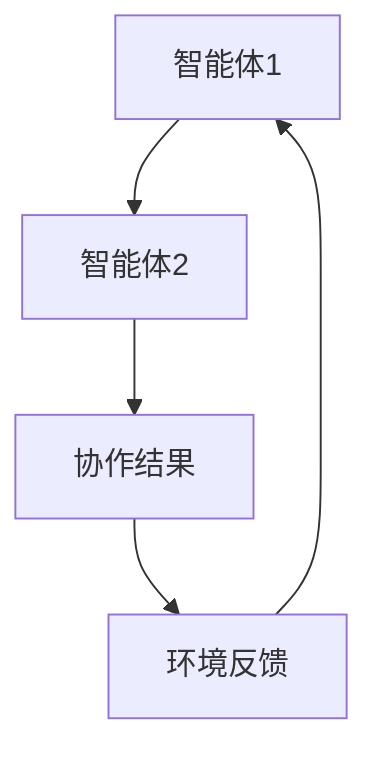
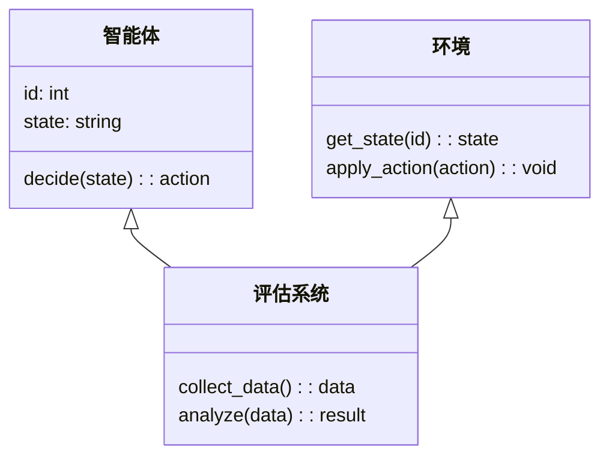
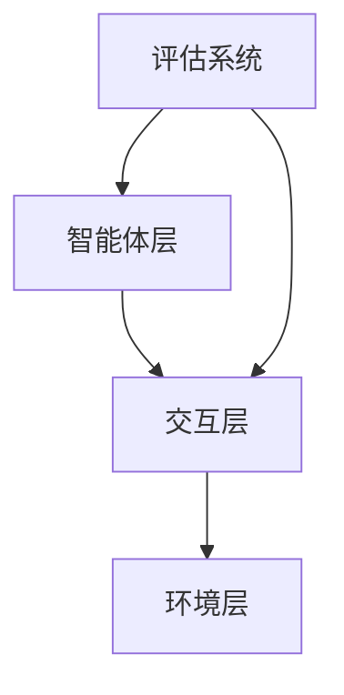
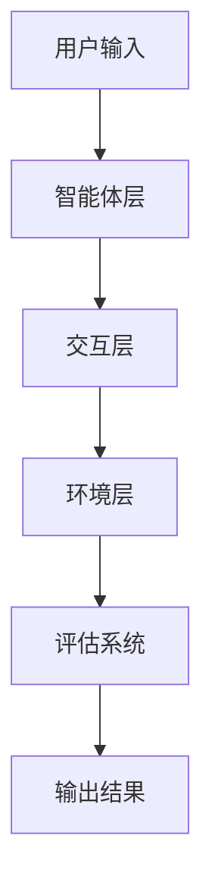

                 


# 多智能体系统如何评估公司的长期增长潜力

## 关键词：多智能体系统，公司增长潜力，算法原理，系统架构，项目实战

## 摘要：多智能体系统通过协作和动态适应性，为企业评估长期增长潜力提供了新的方法。本文详细探讨了多智能体系统的概念、算法、架构设计及其在企业增长潜力评估中的应用，结合实际案例和代码实现，帮助读者理解如何利用多智能体系统优化公司评估过程。

---

# 第一部分: 多智能体系统与公司增长潜力评估的背景

## 第1章: 多智能体系统与公司增长潜力评估的背景

### 1.1 多智能体系统的基本概念

#### 1.1.1 多智能体系统的定义与特点

多智能体系统（Multi-Agent System, MAS）是由多个相互作用的智能体组成的系统，每个智能体能够感知环境、自主决策并执行任务。其特点包括分布性、协作性、反应性和适应性。

#### 1.1.2 多智能体系统的组成与结构

多智能体系统由智能体、环境和交互机制组成。智能体是具有感知和行动能力的主体；环境是智能体所处的外部世界；交互机制定义了智能体之间的通信和协作规则。

#### 1.1.3 多智能体系统在企业分析中的应用价值

多智能体系统能够模拟企业内部和外部的复杂关系，帮助分析公司在市场中的协作与竞争，优化资源配置，预测市场变化，从而提升长期增长潜力评估的准确性。

#### 图1.1：多智能体系统组成结构图（Mermaid）



### 1.2 公司长期增长潜力评估的必要性

#### 1.2.1 传统公司评估方法的局限性

传统评估方法通常依赖静态数据和单一维度分析，难以捕捉市场动态和复杂环境下的变化。

#### 1.2.2 长期增长潜力评估的核心要素

包括市场需求、竞争环境、技术创新、资源分配和组织能力等方面。

#### 1.2.3 多智能体系统在增长潜力评估中的优势

多智能体系统能够模拟复杂环境和多方互动，提供动态、全面的评估视角，帮助识别潜在风险和机会。

### 1.3 本章小结

本章介绍了多智能体系统的概念和结构，并分析了其在公司长期增长潜力评估中的优势。

---

# 第二部分: 多智能体系统的核心概念与原理

## 第2章: 多智能体系统的核心概念

### 2.1 多智能体系统的组成要素

#### 2.1.1 智能体的定义与属性

智能体是具有目标、知识、推理能力和自主决策能力的实体。其属性包括目标、知识、推理、规划和行动能力。

#### 2.1.2 环境的定义与分类

环境是智能体所处的外部世界，可以是静态或动态、确定或不确定的。分类包括物理环境、社会环境和任务环境。

#### 2.1.3 交互机制的核心要素

交互机制定义了智能体之间的通信和协作规则，包括信息交换、任务分配和冲突解决。

#### 表2.1：多智能体系统核心要素对比

| 要素       | 属性               |
|------------|--------------------|
| 智能体     | 目标、知识、推理能力 |
| 环境       | 静态/动态、确定/不确定 |
| 交互机制   | 信息交换、任务分配 |

#### 图2.1：多智能体系统实体关系图（Mermaid）



### 2.2 多智能体系统的关键特性

#### 2.2.1 分布式智能的实现方式

通过分布式计算和协作算法实现智能体的自主决策和协作。

#### 2.2.2 协作与竞争的平衡机制

智能体在协作中寻求共赢，在竞争中保持优势。

#### 2.2.3 动态环境下的适应性

智能体能够根据环境变化调整策略和行为。

### 2.3 多智能体系统与公司增长潜力的关联

#### 2.3.1 智能体的决策逻辑与公司战略的关系

智能体的决策模拟公司战略选择，帮助优化资源配置和市场拓展。

#### 2.3.2 环境变化对公司增长潜力的影响

环境变化（如市场需求波动）通过智能体的感知和响应，影响公司的增长潜力。

#### 2.3.3 多智能体协作对公司长期发展的促进作用

多智能体协作模拟公司与合作伙伴的关系，优化协作效率，提升长期增长潜力。

### 2.4 本章小结

本章详细讲解了多智能体系统的组成要素和关键特性，并分析了其在公司增长潜力评估中的应用。

---

# 第三部分: 多智能体系统的算法原理与数学模型

## 第3章: 多智能体系统的算法原理

### 3.1 多智能体协作算法

#### 3.1.1 分布式协作算法的基本原理

通过分布式计算和通信协议实现智能体之间的协作。

#### 3.1.2 协作中的博弈论模型

利用博弈论分析智能体的策略选择和收益分配。

#### 3.1.3 基于强化学习的协作机制

智能体通过强化学习不断优化协作策略。

#### 图3.1：多智能体协作流程图（Mermaid）



### 3.2 多智能体系统中的数学模型

#### 3.2.1 智能体决策的数学表达

$$ u_i = \arg\max_{u \in U} \sum_{j=1}^{n} v_j(u_i) $$

其中，\( u_i \) 表示智能体i的选择，\( U \) 是可能的决策集合，\( v_j \) 是各智能体的收益函数。

#### 3.2.2 协作收益的数学公式

$$ R = \sum_{i=1}^{m} r_i $$

其中，\( R \) 是总收益，\( r_i \) 是智能体i的收益。

#### 3.2.3 动态环境下的优化模型

$$ \max_{x \in X} f(x) \quad \text{subject to} \quad g(x) \leq 0 $$

其中，\( x \) 是决策变量，\( f(x) \) 是目标函数，\( g(x) \) 是约束条件。

### 3.3 算法实现与案例分析

#### 3.3.1 算法实现的代码框架

```python
class Agent:
    def __init__(self, id):
        self.id = id
        self.state = None

    def decide(self, state):
        # 具体决策逻辑
        pass

# 协作算法实现
def collaborate_agents(agents, environment):
    for agent in agents:
        state = environment.get_state(agent.id)
        action = agent.decide(state)
        environment.apply_action(action)
```

#### 3.3.2 案例分析：多智能体协作优化问题

假设一个公司有三个部门，每个部门作为一个智能体，协作优化公司资源分配。通过协作算法实现资源的最优分配，提升整体收益。

#### 3.3.3 算法性能的评估与优化

通过实验分析算法的收敛速度、稳定性及收益最大化能力，进行优化调整。

### 3.4 本章小结

本章介绍了多智能体系统的协作算法及其数学模型，并通过案例分析展示了算法的应用。

---

# 第四部分: 多智能体系统的系统分析与架构设计

## 第4章: 系统分析与架构设计

### 4.1 问题场景介绍

#### 4.1.1 多智能体系统在公司增长潜力评估中的应用场景

模拟公司内部协作和外部市场环境，评估公司长期增长潜力。

#### 4.1.2 问题分析与需求定义

分析公司内外部环境，明确评估需求。

#### 4.1.3 系统目标与功能需求

目标是建立一个动态的评估模型，需求包括数据采集、智能体协作和结果分析。

#### 图4.1：系统功能需求类图（Mermaid）



### 4.2 系统功能设计

#### 4.2.1 领域模型设计

定义智能体、环境和交互机制的模型，确保各部分协同工作。

#### 4.2.2 系统架构设计

采用分层架构，包括智能体层、交互层和环境层。

#### 4.2.3 系统接口设计

定义智能体与环境、评估系统之间的接口和通信协议。

#### 图4.2：系统架构图（Mermaid）



### 4.3 系统交互设计

#### 4.3.1 系统交互流程图（Mermaid）



### 4.4 本章小结

本章详细设计了多智能体系统的架构和交互流程，为实际应用提供了指导。

---

# 第五部分: 多智能体系统的项目实战

## 第5章: 项目实战

### 5.1 环境安装与配置

安装Python和相关库，如`networkx`和`numpy`。

### 5.2 核心代码实现

实现智能体类和协作算法，定义环境和评估系统。

#### 代码示例：

```python
import numpy as np

class Agent:
    def __init__(self, id):
        self.id = id
        self.state = None

    def decide(self, state):
        # 示例决策逻辑
        if state > 0.5:
            return 'collaborate'
        else:
            return 'compete'

# 环境模拟
class Environment:
    def __init__(self):
        self.agents = []
        self.state = 0.5

    def get_state(self, id):
        return self.state

    def apply_action(self, action):
        if action == 'collaborate':
            self.state += 0.1
        else:
            self.state -= 0.1

# 评估系统
class GrowthPotentialAssessment:
    def __init__(self, agents, environment):
        self.agents = agents
        self.environment = environment

    def assess(self):
        for agent in self.agents:
            state = self.environment.get_state(agent.id)
            action = agent.decide(state)
            self.environment.apply_action(action)
        return self.environment.state
```

### 5.3 案例分析与结果解读

通过具体案例分析，展示多智能体系统在公司增长潜力评估中的应用效果。

#### 图5.1：评估结果示例


### 5.4 项目总结与经验分享

总结项目实施过程中的经验和教训，优化系统设计和算法性能。

### 5.5 本章小结

本章通过项目实战展示了多智能体系统的实现过程和应用效果。

---

# 第六部分: 总结与展望

## 第6章: 总结与展望

### 6.1 本研究的主要结论

多智能体系统为公司增长潜力评估提供了新的方法，能够模拟复杂环境和多方协作。

### 6.2 当前研究的不足与挑战

包括计算复杂度、通信开销和模型优化等问题。

### 6.3 未来研究方向

进一步优化算法，扩展应用领域，结合其他技术提升系统性能。

### 6.4 本章小结

总结研究成果，并展望未来的发展方向。

---

# 作者：AI天才研究院/AI Genius Institute & 禅与计算机程序设计艺术 /Zen And The Art of Computer Programming

