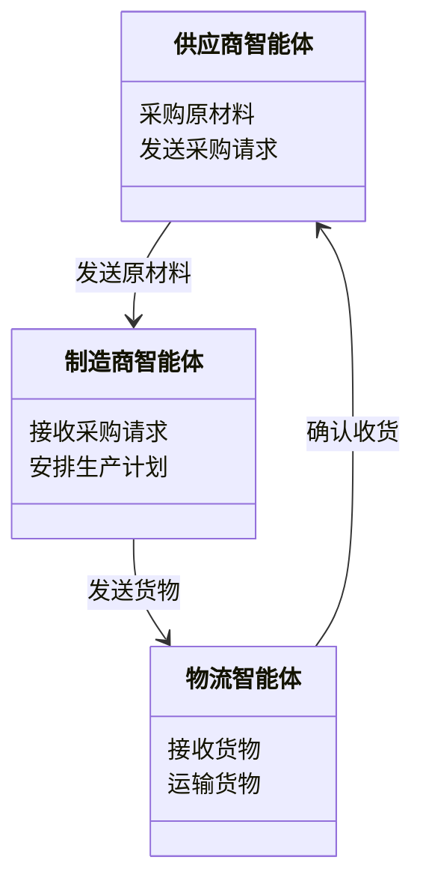
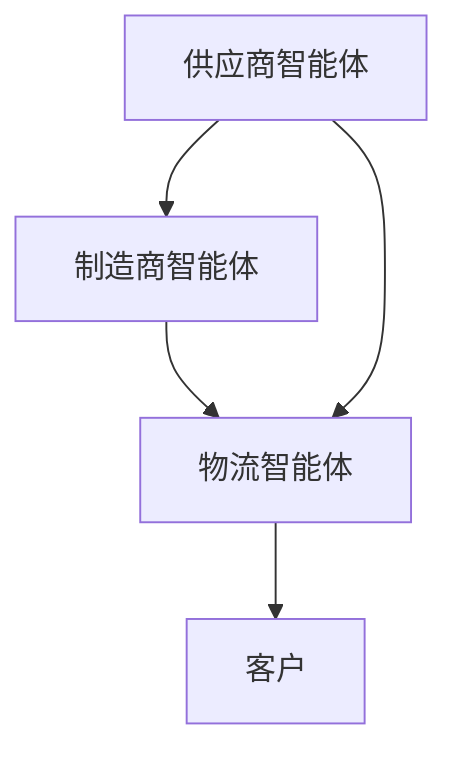
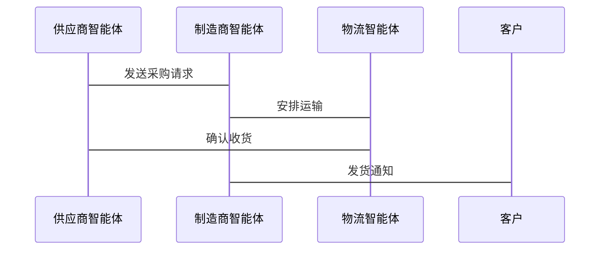

                 


# 多智能体系统如何评估公司的长期竞争优势

> 关键词：多智能体系统，公司竞争优势，博弈论，优化算法，分布式计算，通信协议

> 摘要：本文通过分析多智能体系统的概念、核心原理和实际应用，探讨如何利用多智能体系统评估公司的长期竞争优势。文章从多智能体系统的定义和结构入手，结合博弈论和优化算法，详细阐述了多智能体系统在商业决策中的应用价值，并通过实际案例展示了如何利用多智能体系统来优化公司战略，提升长期竞争优势。

---

## 第一部分：多智能体系统与公司竞争优势背景

### 第1章：多智能体系统与公司竞争优势背景

#### 1.1 多智能体系统的基本概念

##### 1.1.1 多智能体系统的定义
多智能体系统（Multi-Agent System, MAS）是由多个智能体（Agent）组成的分布式系统，这些智能体能够通过协作完成复杂的任务。每个智能体都有自己的目标、知识、推理能力以及与环境和其他智能体交互的能力。

##### 1.1.2 多智能体系统的核心特征
- **自主性**：智能体能够自主决策，无需外部干预。
- **反应性**：智能体能够感知环境并实时调整行为。
- **协作性**：多个智能体通过协作完成共同目标。
- **分布式性**：智能体分布在网络中，通过通信协议进行交互。

##### 1.1.3 多智能体系统与传统单智能体系统的区别
传统的单智能体系统（如单机程序）依赖中央控制，而多智能体系统通过分布式计算和协作完成任务，具有更高的灵活性和容错性。

#### 1.2 公司竞争优势的定义与分类

##### 1.2.1 什么是公司竞争优势
竞争优势是指公司在市场中相对于竞争对手的有利条件，包括资源、技术、管理、品牌等方面的优势。

##### 1.2.2 竞争优势的分类
- **成本优势**：公司以更低的成本生产产品或服务。
- **差异化优势**：公司提供独特的产品或服务，区别于竞争对手。
- **速度优势**：公司能够更快地响应市场变化和客户需求。

##### 1.2.3 长期竞争优势的重要性
长期竞争优势是公司持续发展的关键，能够帮助公司在激烈的市场竞争中立于不败之地。

#### 1.3 多智能体系统在商业中的应用前景

##### 1.3.1 多智能体系统在商业决策中的作用
多智能体系统可以帮助公司优化资源配置、提高决策效率、增强市场反应能力。

##### 1.3.2 多智能体系统与公司竞争优势的关系
通过多智能体系统的协作和优化能力，公司可以更好地实现资源优化和战略协同，从而增强竞争优势。

##### 1.3.3 多智能体系统在企业战略中的潜在价值
多智能体系统可以模拟市场环境、分析竞争态势，为公司制定战略提供数据支持。

#### 1.4 本章小结
本章介绍了多智能体系统的定义、核心特征以及在商业中的应用前景，强调了多智能体系统在公司竞争优势评估中的重要性。

---

## 第二部分：多智能体系统的核心概念与联系

### 第2章：多智能体系统的核心概念原理

#### 2.1 多智能体系统的结构与组成

##### 2.1.1 多智能体系统的组成要素
- **智能体**：系统的最基本单元，具有自主性和反应性。
- **环境**：智能体所处的外部环境，包括物理环境和信息环境。
- **通信协议**：智能体之间交互的规则和标准。

##### 2.1.2 智能体的定义与属性
智能体是具有目标、知识、推理能力和自主决策能力的实体。其属性包括：
- **目标**：智能体的行为动机。
- **知识**：智能体对环境和任务的认知。
- **推理**：智能体根据知识做出决策的能力。
- **通信**：智能体与其他智能体或环境交互的能力。

##### 2.1.3 多智能体系统的层次结构
多智能体系统的层次结构包括：
1. **智能体层**：具体实现智能体的功能。
2. **协作层**：协调多个智能体的协作。
3. **通信层**：实现智能体之间的信息交互。

#### 2.2 多智能体系统的协作机制

##### 2.2.1 协作的基本概念
协作是指多个智能体为了共同目标而协同工作。

##### 2.2.2 协作的实现方式
- **任务分配**：将任务分解为多个子任务，分配给不同的智能体。
- **协调协议**：制定协作规则，确保智能体之间的协调一致。

##### 2.2.3 协作中的协调问题
协作中的协调问题包括：
- **冲突解决**：智能体之间出现目标或资源冲突时的解决方案。
- **同步问题**：智能体之间的行为同步。

#### 2.3 多智能体系统的通信协议

##### 2.3.1 通信的基本概念
通信是智能体之间通过信息交换实现协作的基础。

##### 2.3.2 通信协议的分类
- **基于消息的通信**：通过消息传递实现智能体之间的信息交换。
- **基于状态的通信**：通过共享状态实现智能体之间的协作。

##### 2.3.3 常见的通信协议实现
- **FIPA（Foundation for Intelligent Physical Agents）**：一种标准化的多智能体通信协议。

#### 2.4 本章小结
本章详细讲解了多智能体系统的结构、协作机制和通信协议，为后续分析奠定了基础。

---

## 第三部分：多智能体系统的算法原理与数学模型

### 第3章：多智能体系统的算法原理

#### 3.1 分布式计算与协调算法

##### 3.1.1 分布式计算的基本概念
分布式计算是指多个计算节点通过网络协作完成任务。

##### 3.1.2 协调算法的分类
- **同步算法**：确保所有智能体在某个时间点上同步。
- **异步算法**：智能体在不同时间点上协作。

##### 3.1.3 常见的协调算法实现
- **Consensus算法**：用于分布式系统中达成一致。
- **RAFT算法**：一种一致性算法，用于分布式系统中的领导者选举。

#### 3.2 多智能体系统的博弈论模型

##### 3.2.1 博弈论的基本概念
博弈论是研究理性决策者之间策略互动的数学理论。

##### 3.2.2 多智能体系统的博弈模型
多智能体系统的博弈模型包括：
- **纳什均衡**：一种稳定的博弈状态，使得每个智能体都无法通过单方面改变策略而提高收益。

##### 3.2.3 博弈论在多智能体系统中的应用
- **市场竞争分析**：通过博弈论模型分析市场竞争态势。
- **资源分配优化**：通过博弈论模型优化资源分配。

#### 3.3 多智能体系统的优化算法

##### 3.3.1 优化算法的基本概念
优化算法是用于寻找问题最优解的数学方法。

##### 3.3.2 常见的优化算法
- **遗传算法**：模拟生物进化过程，用于寻找最优解。
- **模拟退火算法**：通过模拟金属退火过程，寻找全局最优解。

##### 3.3.3 优化算法在多智能体系统中的应用
- **任务分配优化**：通过优化算法实现任务的最优分配。
- **资源分配优化**：通过优化算法实现资源的最优分配。

#### 3.4 本章小结
本章分析了分布式计算、博弈论和优化算法在多智能体系统中的应用，为后续的数学模型分析奠定了基础。

---

## 第四部分：多智能体系统的数学模型与公式

### 第4章：多智能体系统的数学模型

#### 4.1 博弈论模型

##### 4.1.1 博弈论的基本公式
博弈论的基本公式包括：
- **收益矩阵**：描述每个策略组合下的收益。
- **纳什均衡**：描述博弈的稳定状态。

##### 4.1.2 多智能体系统的博弈模型
多智能体系统的博弈模型可以用收益矩阵表示：

$$
R = \begin{bmatrix}
R_{11} & R_{12} \\
R_{21} & R_{22}
\end{bmatrix}
$$

其中，$R_{ij}$ 表示智能体$i$选择策略$j$时的收益。

##### 4.1.3 博弈模型的应用实例
以供应链管理为例，多个供应商和制造商通过博弈论模型优化生产计划和库存管理。

#### 4.2 优化模型

##### 4.2.1 优化问题的数学表达
优化问题的数学表达包括：
- **目标函数**：$f(x)$，需要优化的目标。
- **约束条件**：$g(x) \leq 0$，约束条件。

##### 4.2.2 多智能体系统的优化模型
多智能体系统的优化模型可以用拉格朗日乘数法表示：

$$
\mathcal{L}(x, \lambda) = f(x) + \sum_{i=1}^{m} \lambda_i g_i(x)
$$

其中，$\lambda_i$ 是拉格朗日乘子。

##### 4.2.3 优化模型的求解方法
- **梯度下降法**：通过计算目标函数的梯度，逐步调整参数，找到最优解。
- **牛顿法**：通过二阶导数加速优化过程。

#### 4.3 网络模型

##### 4.3.1 网络模型的基本概念
网络模型描述智能体之间的通信和协作关系。

##### 4.3.2 多智能体系统的网络模型
多智能体系统的网络模型可以用图论表示：

$$
G = (V, E)
$$

其中，$V$ 是智能体集合，$E$ 是智能体之间的通信边。

##### 4.3.3 网络模型的数学表达
以供应链为例，节点表示供应商和制造商，边表示供应链关系。

#### 4.4 本章小结
本章通过数学模型和公式，详细分析了多智能体系统中的博弈论和优化算法，为实际应用提供了理论基础。

---

## 第五部分：多智能体系统的系统分析与架构设计

### 第5章：多智能体系统的系统分析

#### 5.1 问题场景介绍

##### 5.1.1 问题背景
以某公司为例，公司需要优化供应链管理，提高生产效率和降低成本。

##### 5.1.2 问题描述
公司面临供应链中的资源浪费、协作效率低下等问题。

##### 5.1.3 问题解决目标
通过多智能体系统优化供应链管理，实现资源优化和协作效率提升。

#### 5.2 系统功能设计

##### 5.2.1 领域模型设计
领域模型设计包括：
- **供应商智能体**：负责原材料采购和供应。
- **制造商智能体**：负责生产计划和订单管理。
- **物流智能体**：负责货物运输和配送。

##### 5.2.2 功能模块划分
功能模块包括：
- **任务分配模块**：分配任务给不同的智能体。
- **协作协调模块**：确保智能体之间的协作协调。
- **通信模块**：实现智能体之间的信息交互。

##### 5.2.3 功能模块实现
通过Mermaid图展示领域模型：



#### 5.3 系统架构设计

##### 5.3.1 系统架构图
通过Mermaid图展示系统架构：



##### 5.3.2 系统交互序列图
通过Mermaid图展示系统交互：



#### 5.4 本章小结
本章通过系统分析和架构设计，详细阐述了多智能体系统在供应链管理中的应用。

---

## 第六部分：项目实战与应用案例

### 第6章：项目实战与应用案例

#### 6.1 项目介绍

##### 6.1.1 项目背景
以某公司为例，优化供应链管理，提升生产效率和降低成本。

##### 6.1.2 项目目标
通过多智能体系统实现供应链的优化管理。

#### 6.2 环境安装

##### 6.2.1 系统环境
- 操作系统：Linux
- 语言：Python
- 开发工具：PyCharm

##### 6.2.2 第三方库
- `networkx`：用于网络分析和图论。
- `matplotlib`：用于数据可视化。

#### 6.3 核心实现

##### 6.3.1 供应商智能体实现
```python
class SupplierAgent:
    def __init__(self):
        self.supply = 0
```

##### 6.3.2 制造商智能体实现
```python
class ManufacturerAgent:
    def __init__(self):
        self.produce = 0
```

##### 6.3.3 物流智能体实现
```python
class LogisticsAgent:
    def __init__(self):
        self.delivery = 0
```

##### 6.3.4 通信协议实现
```python
import json
import zmq

context = zmq.Context()
socket = context.socket(zmq.PAIR)
socket.bind("tcp://*:5555")

while True:
    message = socket.recv()
    print(f"Received: {message}")
    socket.send(json.dumps({"status": "received"}))
```

#### 6.4 代码应用解读与分析

##### 6.4.1 代码功能解读
- 供应商智能体负责采购原材料。
- 制造商智能体负责安排生产计划。
- 物流智能体负责货物运输和配送。

##### 6.4.2 代码实现分析
通过多线程或分布式计算实现智能体之间的协作。

#### 6.5 实际案例分析

##### 6.5.1 案例背景
某公司供应链中存在原材料供应不及时、生产计划混乱等问题。

##### 6.5.2 应用分析
通过多智能体系统实现供应商、制造商和物流公司的协作，优化供应链管理。

#### 6.6 本章小结
本章通过项目实战，详细展示了多智能体系统在供应链管理中的应用，验证了其在公司竞争优势评估中的价值。

---

## 第七部分：总结与展望

### 第7章：总结与展望

#### 7.1 本章总结
本文详细分析了多智能体系统的概念、核心原理和实际应用，探讨了其在公司竞争优势评估中的价值。

#### 7.2 未来展望
随着人工智能和分布式计算技术的不断发展，多智能体系统将在商业应用中发挥更大的作用，成为公司优化资源配置、提升竞争优势的重要工具。

---

## 作者信息

作者：AI天才研究院/AI Genius Institute & 禅与计算机程序设计艺术/Zen And The Art of Computer Programming

---

**本文由AI天才研究院撰写，转载请注明出处。**

