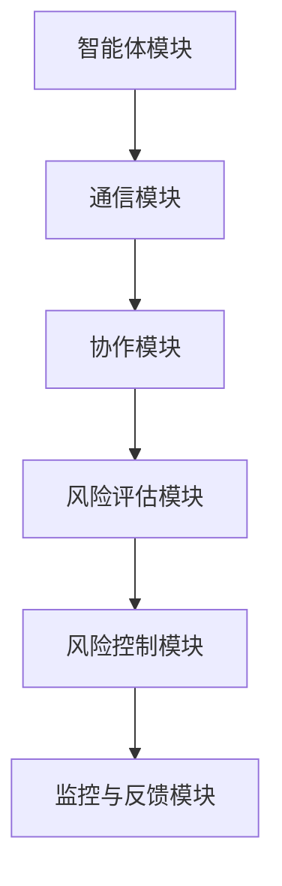

                 


# 多智能体系统实现全方位风险评估

> 关键词：多智能体系统，风险评估，系统架构，分布式计算，协同算法，风险管理

> 摘要：本文详细探讨了多智能体系统在实现全方位风险评估中的关键技术和方法。通过分析多智能体系统的通信与协作机制、风险建模与分析、分布式计算与协同算法等核心内容，结合实际案例和系统架构设计，为读者提供了一套全面的风险评估解决方案。

---

# 第一部分: 多智能体系统实现全方位风险评估概述

## 第1章: 多智能体系统与风险评估概述

### 1.1 多智能体系统的基本概念

#### 1.1.1 多智能体系统的定义与特点

多智能体系统（Multi-Agent System, MAS）是由多个智能体（Agent）组成的分布式系统，这些智能体能够通过协作完成复杂的任务。与单智能体系统相比，多智能体系统具有以下特点：

- **分布性**：智能体分布在网络中的不同节点上，各自独立运行。
- **协作性**：智能体之间通过通信和协作完成共同目标。
- **自治性**：每个智能体都具有自主决策的能力，能够根据环境变化调整行为。
- **动态性**：系统中的智能体和环境都是动态变化的，需要实时响应。

#### 1.1.2 多智能体系统的组成与结构

多智能体系统通常由以下部分组成：

1. **智能体**：能够感知环境并采取行动的实体。
2. **通信机制**：智能体之间交换信息的通道。
3. **协作机制**：智能体之间协同完成任务的规则和协议。
4. **环境**：智能体所处的外部世界，可能包含其他智能体或其他实体。

#### 1.1.3 多智能体系统与单智能体系统的区别

| 属性 | 单智能体系统 | 多智能体系统 |
|------|--------------|--------------|
| 结构 | 单一中心节点 | 分布式结构 |
| 通信 | 内部处理 | 需要与其他智能体通信 |
| 协作 | 无需协作 | 需要协作完成任务 |
| 可扩展性 | 有限 | 高度可扩展 |

### 1.2 风险评估的基本概念

#### 1.2.1 风险评估的定义与作用

风险评估是通过对潜在风险的识别、分析和量化，评估这些风险对系统或组织可能造成的影响。其作用包括：

- **预防风险**：通过提前识别潜在风险，采取措施降低风险发生的概率。
- **优化决策**：基于风险评估结果，制定最优的决策策略。
- **提高系统鲁棒性**：通过评估系统在不同风险情况下的表现，增强系统的抗干扰能力。

#### 1.2.2 风险评估的分类与方法

风险评估可以根据不同的标准进行分类：

1. **按风险类型**：
   - 信用风险
   - 市场风险
   - 操作风险
   - 信息风险

2. **按评估方法**：
   - 定性评估
   - 定量评估

3. **按时间范围**：
   - 短期风险评估
   - 长期风险评估

#### 1.2.3 风险评估在多智能体系统中的重要性

在多智能体系统中，风险评估尤为重要，因为系统的复杂性和动态性使得潜在风险更加多样和难以预测。通过有效的风险评估，可以：

- **确保系统稳定性**：及时发现和处理潜在风险，避免系统崩溃。
- **提高系统效率**：通过优化协作机制，减少不必要的资源浪费。
- **增强系统适应性**：在风险发生时，快速调整系统行为以应对变化。

### 1.3 本章小结

本章主要介绍了多智能体系统的基本概念和风险评估的重要性。通过对比单智能体系统和多智能体系统的区别，强调了多智能体系统在现代分布式系统中的广泛应用。同时，详细阐述了风险评估的定义、分类和方法，为后续章节的分析奠定了基础。

---

# 第二部分: 多智能体系统的核心概念与原理

## 第2章: 多智能体系统的通信与协作机制

### 2.1 多智能体系统中的通信机制

#### 2.1.1 通信协议的选择与设计

在多智能体系统中，通信协议的选择和设计至关重要。常用的通信协议包括：

- **HTTP/HTTPS**：适用于简单的请求-响应模式。
- **MQTT**：适用于低带宽、高延迟的物联网环境。
- **WebSocket**：适用于实时通信场景。

选择通信协议时，需要考虑系统的实时性、可靠性和可扩展性。

#### 2.1.2 消息传递的实现方式

消息传递的实现方式可以分为同步和异步两种：

- **同步通信**：发送方等待接收方的确认后再继续执行。
- **异步通信**：发送方不需要等待接收方的确认，可以立即返回。

#### 2.1.3 通信中的同步与异步问题

在多智能体系统中，同步和异步通信各有优缺点。同步通信可以确保消息的准确传递，但可能造成系统阻塞；异步通信可以提高系统的响应速度，但可能导致消息丢失或延迟。

### 2.2 多智能体系统的协作机制

#### 2.2.1 协作协议的设计原则

协作协议的设计需要遵循以下原则：

1. **明确性**：协议的规则和流程必须清晰明了。
2. **可扩展性**：协议应能够适应系统规模的变化。
3. **健壮性**：协议应具备容错能力，能够在部分智能体失效的情况下继续运行。

#### 2.2.2 协作中的任务分配与资源分配

任务分配和资源分配是协作机制中的关键问题。常用的方法包括：

- **基于角色的分配**：根据智能体的角色分配任务。
- **基于能力的分配**：根据智能体的能力分配任务。
- **基于优先级的分配**：根据任务的优先级分配资源。

#### 2.2.3 协作中的冲突解决与协调

在多智能体系统中，冲突是不可避免的。常见的冲突解决方法包括：

- **协商机制**：智能体之间通过协商解决冲突。
- **仲裁机制**：由第三方仲裁机构解决冲突。
- **优先级机制**：根据任务的优先级自动解决冲突。

### 2.3 本章小结

本章详细探讨了多智能体系统的通信与协作机制。通过分析通信协议的选择与设计、消息传递的实现方式，以及协作协议的设计原则，为后续章节的风险评估分析奠定了基础。同时，讨论了任务分配与资源分配的方法，以及冲突解决与协调的策略，为系统的实际应用提供了参考。

---

## 第3章: 多智能体系统中的风险建模与分析

### 3.1 风险建模的基本方法

#### 3.1.1 风险源的识别与分析

风险源的识别与分析是风险建模的第一步。常见的风险源包括：

- **外部攻击**：如网络攻击、数据泄露等。
- **内部错误**：如系统故障、人为错误等。
- **环境变化**：如自然灾害、政策变化等。

#### 3.1.2 风险影响的评估方法

风险影响的评估方法通常包括：

- **概率分析**：评估风险发生的概率。
- **影响分析**：评估风险发生后可能造成的损失。
- **综合评估**：结合概率和影响进行综合评估。

#### 3.1.3 风险模型的构建与验证

风险模型的构建需要结合具体应用场景，选择合适的数学模型进行建模。验证模型的准确性是关键，可以通过历史数据和实际案例进行验证。

### 3.2 多智能体系统中的风险传播与扩散

#### 3.2.1 风险传播的路径分析

风险传播的路径分析需要考虑智能体之间的通信和协作关系。通过分析智能体之间的依赖关系，可以识别出潜在的风险传播路径。

#### 3.2.2 风险扩散的数学模型

风险扩散的数学模型可以采用概率传播模型，例如：

$$ P(i,j) = \frac{P(i)}{1 + P(i) \cdot t} $$

其中，\( P(i,j) \) 表示智能体 \( i \) 对智能体 \( j \) 的风险传播概率，\( P(i) \) 是智能体 \( i \) 的初始风险概率，\( t \) 是时间因子。

#### 3.2.3 风险传播的控制策略

为了控制风险的传播，可以采取以下策略：

- **隔离风险源**：通过断开高风险智能体的连接，防止风险扩散。
- **限制传播范围**：通过设置防火墙或访问控制，限制风险传播的范围。
- **动态调整策略**：根据实时风险情况，动态调整协作协议，减少风险传播的影响。

### 3.3 本章小结

本章重点讨论了多智能体系统中的风险建模与分析方法。通过分析风险源的识别与风险影响的评估方法，构建了风险模型，并通过数学模型描述了风险传播的路径和扩散过程。同时，提出了多种控制策略，为后续的风险评估算法设计提供了理论基础。

---

# 第三部分: 多智能体系统风险评估的算法与实现

## 第4章: 多智能体系统中的分布式计算与协同算法

### 4.1 分布式计算的基本原理

#### 4.1.1 分布式计算的定义与特点

分布式计算是将计算任务分散到多个计算节点上，通过协作完成大规模的计算任务。其特点包括：

- **高可扩展性**：可以通过增加节点来提高计算能力。
- **高可靠性**：单个节点故障不会导致整个系统崩溃。
- **低延迟**：通过并行计算可以降低任务完成时间。

#### 4.1.2 分布式计算中的任务分配与负载均衡

任务分配和负载均衡是分布式计算中的关键问题。常用的方法包括：

- **静态分配**：在系统启动时预先分配任务。
- **动态分配**：根据系统负载实时调整任务分配。
- **混合分配**：结合静态和动态分配的优点。

#### 4.1.3 分布式计算中的通信与同步问题

在分布式计算中，通信和同步问题直接影响系统的性能。常见的同步方法包括：

- **两阶段提交**：确保所有节点一致。
- ** optimistic concurrency**：通过版本控制避免冲突。
- **时间戳法**：通过记录操作时间戳保证一致性。

### 4.2 协同算法的设计与实现

#### 4.2.1 协同算法的基本原理

协同算法是多智能体系统中实现协作的核心算法。其基本原理包括：

1. **信息共享**：智能体之间共享信息。
2. **任务分配**：根据智能体的能力分配任务。
3. **协作执行**：智能体协同完成任务。

#### 4.2.2 协同算法的实现步骤

协同算法的实现步骤通常包括：

1. **初始化**：设置初始状态和参数。
2. **信息共享**：智能体之间交换信息。
3. **任务分配**：根据信息共享结果分配任务。
4. **协作执行**：智能体协同完成任务。
5. **反馈与优化**：根据执行结果优化协作策略。

#### 4.2.3 协同算法的优化与改进

为了提高协同算法的效率，可以采取以下优化措施：

- **局部优化**：优化单个智能体的行为。
- **全局优化**：优化整个系统的行为。
- **自适应优化**：根据环境变化动态调整协作策略。

### 4.3 本章小结

本章详细探讨了多智能体系统中的分布式计算与协同算法。通过分析分布式计算的基本原理和任务分配方法，提出了协同算法的设计与实现步骤，并讨论了算法的优化与改进策略。

---

## 第5章: 多智能体系统中的风险评估算法

### 5.1 风险评估算法的基本原理

#### 5.1.1 基于概率的风险评估方法

基于概率的风险评估方法通过计算风险发生的概率和影响，评估风险的总体水平。常用的概率模型包括：

- **贝叶斯网络**：通过概率推理评估风险。
- **马尔可夫链**：通过状态转移概率评估风险。

#### 5.1.2 基于规则的风险评估方法

基于规则的风险评估方法通过预定义的规则和阈值，评估风险的严重程度。这种方法适用于规则明确的场景。

#### 5.1.3 基于机器学习的风险评估方法

基于机器学习的风险评估方法通过训练模型，学习风险的特征和模式，实现风险的自动识别和评估。常用的机器学习算法包括：

- **支持向量机（SVM）**
- **随机森林（Random Forest）**
- **深度学习（Deep Learning）**

### 5.2 多智能体系统中的分布式风险评估算法

#### 5.2.1 分布式风险评估算法的设计思路

分布式风险评估算法的设计思路包括：

1. **本地评估**：每个智能体对自身面临的风险进行评估。
2. **信息共享**：智能体之间共享风险评估信息。
3. **全局评估**：根据共享信息，综合评估整个系统的风险水平。

#### 5.2.2 分布式风险评估算法的实现步骤

分布式风险评估算法的实现步骤通常包括：

1. **初始化**：设置初始参数和状态。
2. **本地评估**：每个智能体评估自身风险。
3. **信息共享**：智能体之间共享风险评估信息。
4. **全局评估**：综合评估整个系统的风险水平。
5. **反馈与优化**：根据评估结果优化风险控制策略。

#### 5.2.3 分布式风险评估算法的性能优化

为了提高分布式风险评估算法的性能，可以采取以下优化措施：

- **减少通信开销**：通过压缩和加密信息，减少通信成本。
- **提高计算效率**：通过并行计算和负载均衡，提高计算效率。
- **动态调整策略**：根据系统负载和风险水平动态调整评估算法。

### 5.3 本章小结

本章重点讨论了多智能体系统中的风险评估算法。通过分析基于概率、基于规则和基于机器学习的风险评估方法，提出了分布式风险评估算法的设计思路和实现步骤，并讨论了算法的性能优化策略。

---

# 第四部分: 系统架构与项目实战

## 第6章: 多智能体系统风险评估的系统架构设计

### 6.1 系统架构设计概述

#### 6.1.1 系统架构设计的原则与方法

系统架构设计的原则包括：

1. **模块化设计**：将系统划分为独立的模块，便于开发和维护。
2. **可扩展性设计**：确保系统能够适应未来的需求变化。
3. **高可用性设计**：确保系统在部分节点故障时仍能正常运行。

#### 6.1.2 系统架构的组成与功能划分

多智能体系统风险评估系统的架构通常包括以下模块：

1. **智能体模块**：负责感知环境和执行任务。
2. **通信模块**：负责智能体之间的信息传递。
3. **协作模块**：负责任务分配和协同执行。
4. **风险评估模块**：负责风险的识别、评估和控制。

#### 6.1.3 系统架构的可扩展性与可维护性

为了提高系统的可扩展性和可维护性，可以采用模块化设计和接口标准化。通过定义清晰的接口，确保模块之间的独立性和互操作性。

### 6.2 系统功能设计

#### 6.2.1 系统功能模块划分

多智能体系统风险评估系统的功能模块包括：

1. **风险识别模块**：识别潜在风险源。
2. **风险评估模块**：评估风险的影响和概率。
3. **风险控制模块**：制定和执行风险控制策略。
4. **监控与反馈模块**：实时监控系统状态并反馈信息。

#### 6.2.2 系统功能流程设计

系统功能流程设计可以通过以下步骤实现：

1. **风险识别**：通过传感器或日志系统识别潜在风险。
2. **风险评估**：对识别的风险进行量化评估。
3. **风险控制**：根据评估结果制定和执行风险控制策略。
4. **监控与反馈**：实时监控系统状态，并根据反馈信息调整风险控制策略。

### 6.3 系统架构图



### 6.4 本章小结

本章详细探讨了多智能体系统风险评估系统的架构设计。通过分析系统架构的原则与方法，设计了系统的功能模块和流程，并通过架构图展示了模块之间的关系和交互。

---

## 第7章: 项目实战——多智能体系统风险评估的实现

### 7.1 项目背景与目标

#### 7.1.1 项目背景

随着多智能体系统的广泛应用，风险评估问题日益重要。本项目旨在开发一个基于多智能体系统的风险评估平台，实现全方位风险评估。

#### 7.1.2 项目目标

- **实现多智能体系统的通信与协作机制**
- **构建风险评估模型**
- **开发风险控制策略**
- **实现系统监控与反馈功能**

### 7.2 项目实现

#### 7.2.1 环境安装与配置

项目需要以下环境和工具：

- **Python 3.8+**
- **Flask框架**
- **Django框架**
- **Docker容器**

安装步骤：

1. 安装Python和pip。
2. 安装Flask和Django框架。
3. 安装Docker并配置环境。

#### 7.2.2 核心代码实现

以下是核心代码实现：

```python
import socket
import threading

class Agent:
    def __init__(self, name, port):
        self.name = name
        self.port = port
        self.socket = socket.socket(socket.AF_INET, socket.SOCK_STREAM)
        self.socket.bind(('localhost', port))
        self.socket.listen(1)
        self.clients = []

    def accept_client(self):
        while True:
            client, addr = self.socket.accept()
            self.clients.append(client)
            threading.Thread(target=self.handle_client, args=(client,)).start()

    def handle_client(self, client):
        while True:
            data = client.recv(1024)
            if not data:
                break
            # 处理数据
            response = self.process_data(data)
            client.send(response)
        client.close()

    def process_data(self, data):
        # 具体数据处理逻辑
        return data

    def start(self):
        self.accept_client()

# 示例用法
agent1 = Agent('Agent1', 5000)
agent1.start()
```

#### 7.2.3 代码解读与分析

上述代码实现了多智能体系统中的基本通信功能。通过`Agent`类，每个智能体可以监听特定端口，接受客户端连接，并处理接收到的数据。`accept_client`方法负责接受新客户端连接，`handle_client`方法负责处理客户端请求，`process_data`方法是具体的数据处理逻辑。

### 7.3 实际案例分析

#### 7.3.1 案例背景

假设我们开发了一个多智能体系统，用于监测和管理一个大型网络中的设备状态。每个智能体负责监测特定设备的状态，并通过通信模块将数据发送到其他智能体。

#### 7.3.2 案例分析

在实际应用中，智能体需要实时监测设备状态，并在发现异常时及时通知其他智能体。通过风险评估模块，系统可以评估异常的影响程度，并制定相应的风险控制策略。

### 7.4 本章小结

本章通过实际项目实战，详细展示了多智能体系统风险评估的实现过程。从环境安装到核心代码实现，再到实际案例分析，为读者提供了一套完整的实现方案。

---

# 第五部分: 总结与展望

## 第8章: 总结与展望

### 8.1 本章总结

本文详细探讨了多智能体系统实现全方位风险评估的关键技术和方法。通过分析多智能体系统的通信与协作机制、风险建模与分析、分布式计算与协同算法等核心内容，结合实际案例和系统架构设计，为读者提供了一套全面的风险评估解决方案。

### 8.2 未来展望

随着人工智能和分布式系统的不断发展，多智能体系统将在更多领域得到广泛应用。未来的研究方向包括：

1. **智能化风险评估**：结合机器学习和深度学习，提高风险评估的准确性和实时性。
2. **自适应协作机制**：通过动态调整协作策略，提高系统的适应性和鲁棒性。
3. **跨平台兼容性**：实现多智能体系统的跨平台兼容，支持更多应用场景。

### 8.3 小结

本文通过系统化的分析和实践，为多智能体系统的风险评估提供了理论支持和实践指导。未来的研究将进一步完善系统的智能化和自适应能力，推动多智能体系统在更多领域的应用。

---

# 作者：AI天才研究院/AI Genius Institute & 禅与计算机程序设计艺术 /Zen And The Art of Computer Programming

---

### 总结

本文系统地探讨了多智能体系统实现全方位风险评估的关键技术和方法，从理论分析到实际应用，为读者提供了一套完整的解决方案。通过本文的学习，读者可以深入了解多智能体系统的通信与协作机制，掌握风险建模与分析的方法，熟悉分布式计算与协同算法的实现，最终能够独立完成多智能体系统风险评估的系统设计与实现。

