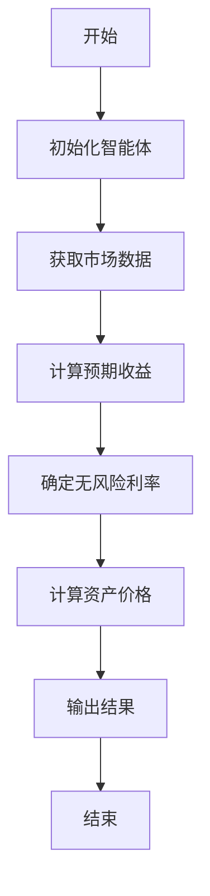
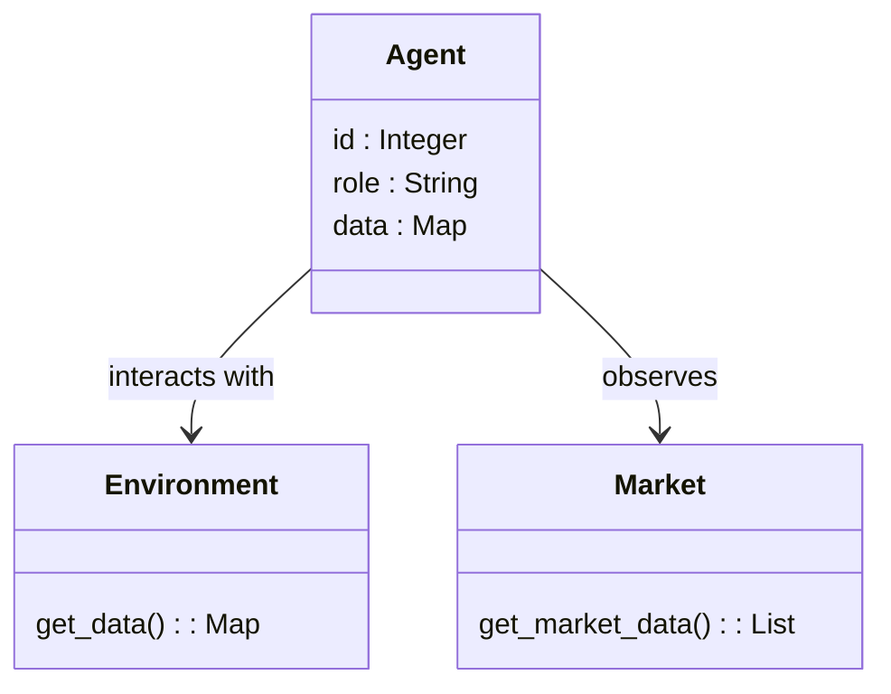
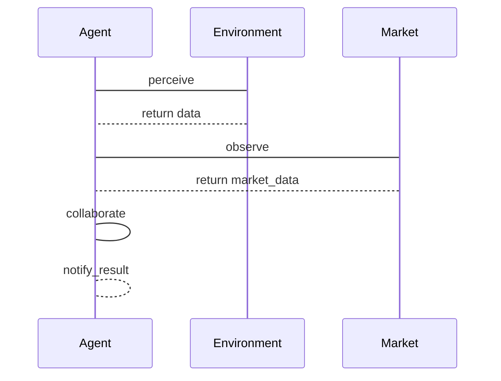

                 


# 多智能体系统实现全球资产定价

> 关键词：多智能体系统, 资产定价, 分布式算法, 系统架构, 金融应用

> 摘要：本文详细探讨了多智能体系统在全球资产定价中的应用，从系统架构、算法原理到实际案例，全面解析了如何利用多智能体系统实现高效、精准的资产定价。通过理论分析和实践结合，本文为读者提供了从概念到实现的完整指南。

---

## 第1章: 多智能体系统概述

### 1.1 多智能体系统的基本概念

#### 1.1.1 多智能体系统的定义
多智能体系统（Multi-Agent System, MAS）是由多个智能体（Agent）组成的分布式系统，这些智能体通过协作完成特定任务。每个智能体都是一个能够感知环境、自主决策的实体。

#### 1.1.2 多智能体系统的特征
- **分布式性**：智能体分布在不同的位置，通过通信协作完成任务。
- **自主性**：每个智能体都能自主决策，无需中央控制。
- **反应性**：智能体能够实时感知环境并做出反应。
- **协作性**：智能体之间通过协作实现整体目标。

#### 1.1.3 多智能体系统与传统单智能体系统的区别
传统的单智能体系统依赖中央控制，而多智能体系统通过分布式协作实现目标。多智能体系统更具灵活性和容错性，适用于复杂任务。

### 1.2 多智能体系统在金融领域的应用

#### 1.2.1 金融领域中的多智能体系统
金融市场的复杂性要求系统能够实时处理大量数据，多智能体系统在资产定价、风险管理等领域具有重要应用。

#### 1.2.2 资产定价的基本概念与挑战
资产定价是根据资产的风险和回报确定其价值的过程。传统模型如CAPM和APT存在局限性，难以应对市场的动态变化。

#### 1.2.3 多智能体系统在资产定价中的优势
多智能体系统能够实时处理市场数据，模拟市场参与者的决策，提供更精准的定价模型。

### 1.3 全球资产定价的背景与现状

#### 1.3.1 全球资产市场的复杂性
全球市场受多种因素影响，如经济指标、政策变化和突发事件，传统的定价模型难以应对。

#### 1.3.2 传统资产定价模型的局限性
传统模型假设市场参与者理性且信息对称，难以反映实际市场的复杂性。

#### 1.3.3 多智能体系统在现代资产定价中的应用前景
多智能体系统能够模拟市场参与者的互动，提供更动态和精确的定价方法。

---

## 第2章: 多智能体系统的核心概念与联系

### 2.1 多智能体系统的组成与功能

#### 2.1.1 多智能体系统的组成要素
- **智能体**：独立决策的实体。
- **环境**：智能体所处的外部世界。
- **通信机制**：智能体之间的交互方式。

#### 2.1.2 各个组件的功能与相互作用
智能体通过通信机制交互，共同完成复杂任务。环境为智能体提供数据和反馈。

#### 2.1.3 实体关系图（ER图）分析
使用Mermaid绘制ER图，展示智能体、环境和通信机制的关系。

```mermaid
erDiagram
    customer[投资者] {
        name : String
        id : Integer
    }
    asset[资产] {
        id : Integer
        name : String
        price : Float
    }
    agent[智能体] {
        id : Integer
        role : String
    }
    customer --> asset : 投资
    agent --> asset : 监测
    agent --> customer : 通知
```

---

### 2.2 多智能体系统的通信机制

#### 2.2.1 智能体之间的通信方式
- **直接通信**：智能体之间直接交换信息。
- **间接通信**：通过中间媒介传递信息。

#### 2.2.2 通信协议与数据格式
- **协议**：定义通信规则。
- **数据格式**：如JSON、XML，用于数据交换。

#### 2.2.3 通信过程中的安全问题
- **加密**：确保数据安全。
- **认证**：验证通信双方身份。

---

### 2.3 多智能体系统的协作与协调

#### 2.3.1 协作机制的定义与实现
协作机制确保智能体协同工作，完成共同目标。

#### 2.3.2 协调过程中的冲突解决
- **协商**：智能体之间通过协商解决冲突。
- **仲裁**：由第三方仲裁机构解决。

#### 2.3.3 协作与协调的数学模型
使用数学模型描述协作过程，如图所示：

$$
\text{协作度} = \sum_{i=1}^{n} w_i \cdot a_i
$$

其中，$w_i$ 是权重，$a_i$ 是智能体的贡献。

---

## 第3章: 多智能体系统中的算法原理

### 3.1 多智能体系统中的分布式算法

#### 3.1.1 分布式算法的基本概念
分布式算法用于协调多个智能体的行为，确保系统目标的实现。

#### 3.1.2 分布式算法的实现步骤
1. 初始化智能体。
2. 智能体感知环境。
3. 智能体做出决策。
4. 智能体之间通信协作。
5. 更新系统状态。

#### 3.1.3 分布式算法的优缺点
- **优点**：高可用性、容错性。
- **缺点**：复杂性高、通信开销大。

---

### 3.2 资产定价的数学模型与公式

#### 3.2.1 资产定价的基本公式
$$
\text{资产价格} = \frac{\text{预期收益}}{\text{无风险利率}}
$$

#### 3.2.2 多智能体系统中的定价模型
$$
P_i = \alpha \cdot R_i + \beta \cdot Z_i
$$

其中，$P_i$ 是资产价格，$R_i$ 是风险，$Z_i$ 是市场因子。

#### 3.2.3 模型的数学推导与验证
通过统计方法验证模型的有效性，如回归分析。

---

### 3.3 基于多智能体的资产定价算法

#### 3.3.1 算法的流程图（Mermaid）


#### 3.3.2 算法的Python实现代码
```python
class Agent:
    def __init__(self, id):
        self.id = id
        self.data = None

    def perceive(self, environment):
        self.data = environment.get_data()

    def decide(self):
        # 简单示例：基于数据做出决策
        pass

# 初始化智能体
agents = [Agent(i) for i in range(5)]

# 初始化环境
class Environment:
    def get_data(self):
        return {"market": "bull", "interest_rate": 0.05}

env = Environment()

# 智能体感知环境
for agent in agents:
    agent.perceive(env)

# 智能体做出决策
for agent in agents:
    agent.decide()
```

#### 3.3.3 算法的数学模型与公式
$$
P = \frac{E[R_i - R_f]}{1 + R_f}
$$

其中，$P$ 是资产价格，$E[R_i]$ 是预期收益，$R_f$ 是无风险利率。

---

## 第4章: 系统分析与架构设计方案

### 4.1 问题场景介绍

#### 4.1.1 全球资产定价的复杂性
全球市场受多种因素影响，传统模型难以应对。

#### 4.1.2 多智能体系统在其中的角色
多智能体系统能够实时处理数据，模拟市场参与者的行为。

#### 4.1.3 系统的目标与范围
目标是实现高效、准确的资产定价，范围包括全球主要金融市场。

---

### 4.2 系统功能设计

#### 4.2.1 领域模型（Mermaid 类图）


#### 4.2.2 系统架构设计（Mermaid 架构图）


#### 4.2.3 系统接口设计
- **输入接口**：接收市场数据。
- **输出接口**：输出定价结果。

#### 4.2.4 系统交互设计（Mermaid 序列图）


---

## 第5章: 项目实战

### 5.1 环境安装

#### 5.1.1 安装Python
```bash
python --version
pip install --upgrade pip
```

#### 5.1.2 安装依赖库
```bash
pip install numpy pandas matplotlib
```

### 5.2 系统核心实现源代码

#### 5.2.1 智能体类实现
```python
class Agent:
    def __init__(self, id, role):
        self.id = id
        self.role = role
        self.data = {}

    def perceive(self, environment):
        self.data = environment.get_data()

    def decide(self):
        if self.role == "buyer":
            self.bid()
        elif self.role == "seller":
            self.ask()

    def bid(self):
        # 示例：买入操作
        pass

    def ask(self):
        # 示例：卖出操作
        pass
```

#### 5.2.2 环境类实现
```python
class Environment:
    def __init__(self):
        self.market_data = {}

    def get_data(self):
        return self.market_data

    def update_data(self, data):
        self.market_data.update(data)
```

#### 5.2.3 系统主程序
```python
def main():
    # 初始化环境
    env = Environment()
    agents = [
        Agent(1, "buyer"),
        Agent(2, "seller"),
        Agent(3, "market_maker")
    ]

    # 智能体感知环境
    for agent in agents:
        agent.perceive(env)

    # 智能体做出决策
    for agent in agents:
        agent.decide()

    # 更新环境数据
    env.update_data({"price": 100})

if __name__ == "__main__":
    main()
```

### 5.3 代码应用解读与分析

#### 5.3.1 系统运行流程
1. 初始化环境和智能体。
2. 智能体感知环境数据。
3. 智能体做出决策。
4. 更新环境数据。

#### 5.3.2 系统功能扩展
- **实时数据处理**：增加数据流处理功能。
- **风险管理**：增加风险评估模块。

### 5.4 实际案例分析和详细讲解剖析

#### 5.4.1 案例背景
假设一个股票市场，有多家机构投资者参与交易。

#### 5.4.2 系统实现
使用多智能体系统模拟投资者行为，计算股票价格。

#### 5.4.3 案例结果
通过模拟得出股票价格的变化趋势。

### 5.5 项目小结

#### 5.5.1 项目总结
本项目展示了如何使用多智能体系统实现资产定价。

#### 5.5.2 经验总结
- **优点**：系统灵活性高，适应性强。
- **不足**：通信开销大，实现复杂。

#### 5.5.3 改进建议
- **优化通信机制**：减少数据传输延迟。
- **增强容错性**：提高系统的鲁棒性。

---

## 第6章: 优化与扩展

### 6.1 性能优化

#### 6.1.1 算法优化
- **并行计算**：提高处理速度。
- **分布式计算**：降低单点故障风险。

#### 6.1.2 系统优化
- **负载均衡**：优化资源分配。
- **缓存机制**：减少重复计算。

### 6.2 模型扩展

#### 6.2.1 模型的扩展方向
- **加入更多市场因素**：如情绪分析、新闻事件。
- **增强智能体决策能力**：使用强化学习优化决策。

#### 6.2.2 实际应用案例
- **新闻驱动的定价模型**：基于新闻情绪进行定价。

---

## 第7章: 总结与展望

### 7.1 总结

#### 7.1.1 核心内容回顾
本文详细讲解了多智能体系统在资产定价中的应用，从系统架构到算法实现，再到项目实战，为读者提供了完整的解决方案。

#### 7.1.2 系统特点总结
- **高效性**：实时处理市场数据。
- **准确性**：基于多智能体协作实现精准定价。

### 7.2 未来展望

#### 7.2.1 多智能体系统的发展趋势
- **智能化**：结合AI技术，提高决策能力。
- **分布式计算**：进一步提升系统的扩展性。

#### 7.2.2 资产定价领域的未来方向
- **实时定价**：基于实时数据实现动态定价。
- **智能化投资**：利用多智能体系统进行智能投资决策。

---

## 作者

作者：AI天才研究院/AI Genius Institute & 禅与计算机程序设计艺术 /Zen And The Art of Computer Programming

---

感谢您的阅读！希望这篇文章能够为您提供有价值的信息和启发！

