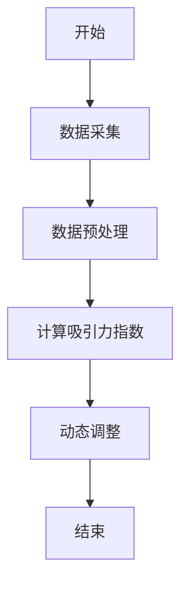
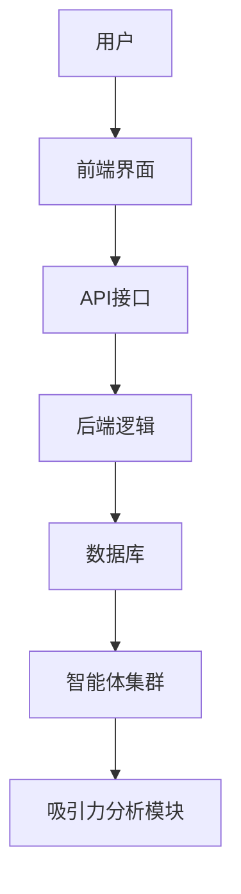
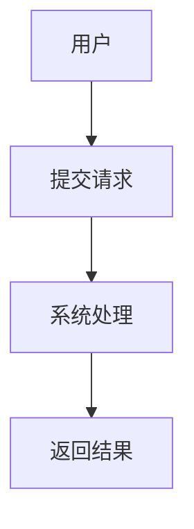

                 


# 多智能体系统实现动态行业吸引力分析

## 关键词：多智能体系统、动态行业、吸引力分析、分布式计算、博弈论模型、系统架构设计

## 摘要：  
本文深入探讨了多智能体系统（MAS）在动态行业吸引力分析中的应用。通过分析多智能体系统的概念、算法原理及系统架构设计，结合实际案例，展示了如何利用MAS实现动态行业的吸引力评估。文章内容涵盖背景介绍、核心概念、算法实现、系统设计及项目实战，旨在为相关领域研究者和实践者提供理论支持和实践指导。

---

## 第一部分: 多智能体系统与动态行业吸引力分析基础

### 第1章: 多智能体系统概述

#### 1.1 多智能体系统的基本概念

##### 1.1.1 多智能体系统的定义
多智能体系统（Multi-Agent System, MAS）是由多个智能体（Agent）组成的分布式系统，这些智能体通过交互协作完成特定目标。智能体具有自主性、反应性、社会性和学习性等特征，能够独立决策并与其他智能体或环境进行交互。

##### 1.1.2 多智能体系统的分类
- **简单智能体**：基于规则的反应式智能体，仅响应当前环境状态。
- **复杂智能体**：具有规划、推理和学习能力，能够处理复杂任务。
- **协作型智能体**：通过协作完成共同目标，如分布式任务处理。
- **竞争型智能体**：在竞争环境中优化自身策略。

##### 1.1.3 多智能体系统的特征
- **分布式性**：智能体独立运行，无中央控制。
- **协作性**：智能体之间通过通信协作完成任务。
- **动态性**：系统环境和智能体状态实时变化。
- **适应性**：智能体能够自适应环境变化。

#### 1.2 动态行业的定义与特点

##### 1.2.1 行业动态性的定义
动态行业指市场环境、消费者需求、竞争态势等不断变化的行业，如互联网、金融和科技行业。

##### 1.2.2 行业吸引力的构成要素
- **市场潜力**：市场规模、增长速度。
- **竞争强度**：行业内竞争程度。
- **技术门槛**：行业技术复杂度。
- **政策环境**：政策法规对行业的影响。

##### 1.2.3 动态行业与多智能体系统的关联
动态行业环境的复杂性和不确定性使得多智能体系统成为理想的解决方案，其分布式协作和自适应能力能够有效应对动态变化。

#### 1.3 吸引力分析的背景与意义

##### 1.3.1 行业吸引力分析的重要性
准确的吸引力分析帮助企业制定战略决策，优化资源配置，抓住市场机会。

##### 1.3.2 多智能体系统在吸引力分析中的作用
MAS通过分布式计算和协作学习，实时分析行业动态，提供精准的吸引力评估。

##### 1.3.3 动态行业吸引力分析的挑战
- 数据实时性要求高。
- 智能体协作复杂，难以协调。
- 系统设计需考虑动态变化带来的不确定性。

---

### 第2章: 多智能体系统的核心概念与联系

#### 2.1 多智能体系统的核心概念

##### 2.1.1 智能体的定义与属性
智能体是一个能够感知环境、自主决策、执行动作的实体，具备以下属性：
- **自主性**：无需外部干预，自主决策。
- **反应性**：实时感知环境变化并响应。
- **社会性**：与其他智能体或人类交互协作。
- **学习性**：通过经验改进性能。

##### 2.1.2 多智能体系统的组成要素
- **智能体**：系统的基本单元。
- **环境**：智能体所处的外部世界。
- **通信机制**：智能体之间的信息交换方式。
- **协调机制**：确保智能体协作的规则或协议。

##### 2.1.3 智能体之间的交互关系
- **协作关系**：智能体协同完成任务。
- **竞争关系**：智能体之间存在竞争，优化自身策略。
- **中立关系**：智能体之间无直接互动。

#### 2.2 动态行业吸引力分析的模型构建

##### 2.2.1 吸引力分析的指标体系
吸引力分析指标包括：
- **市场吸引力指数**：反映市场的潜力和竞争程度。
- **企业竞争力指数**：评估企业在市场中的竞争优势。
- **政策影响指数**：政策环境对行业的影响程度。

##### 2.2.2 行业动态性与吸引力的关系
行业动态性越高，吸引力分析的复杂性越大，但 MAS 能够通过实时数据处理和协作学习，有效应对这种复杂性。

##### 2.2.3 多智能体系统在吸引力分析中的应用
MAS通过分布式计算和协作学习，实时分析行业动态，提供精准的吸引力评估。

#### 2.3 概念属性对比表

| 对比维度 | 单智能体系统 | 多智能体系统 |
|----------|--------------|--------------|
| 系统结构 | 单一控制中心 | 分布式结构    |
| 智能体数量 | 单个智能体    | 多个智能体    |
| 交互方式 | 无或有限     | 丰富多样     |
| 适应性   | 较低         | 较高         |

#### 2.4 ER实体关系图

```mermaid
erd
  title 吸引力分析的ER图
  行业 (id, name, description)
  智能体 (agent_id, name, type)
  吸引力指标 (index_id, name, value)
  行业与智能体的关系： industry_agent (id, agent_id, interaction_type)
  智能体与吸引力指标的关系： agent_index (agent_id, index_id, score)
```

#### 2.5 本章小结

---

## 第二部分: 多智能体系统的算法原理

### 第3章: 多智能体系统的算法原理

#### 3.1 多智能体系统的分布式计算

##### 3.1.1 分布式计算的基本原理
分布式计算将任务分解为多个子任务，由不同的智能体独立完成，通过通信机制汇总结果。

##### 3.1.2 分布式算法在多智能体系统中的应用
- **分布式搜索算法**：如A*算法，用于路径规划。
- **分布式优化算法**：如分布式线性规划，用于资源分配。

##### 3.1.3 分布式计算的优缺点
- 优点：高并行性、容错性。
- 缺点：通信开销大、协调困难。

#### 3.2 动态行业吸引力分析的算法实现

##### 3.2.1 吸引力分析的数学模型
吸引力指数计算公式：
$$ A_i = \alpha \cdot M_i + \beta \cdot C_i + \gamma \cdot P_i $$
其中：
- $A_i$：行业i的吸引力指数。
- $M_i$：市场潜力。
- $C_i$：竞争程度。
- $P_i$：政策影响。
- $\alpha, \beta, \gamma$：权重系数。

##### 3.2.2 基于博弈论的吸引力计算
使用纳什均衡模型，分析企业在市场中的策略选择，计算吸引力指数。

##### 3.2.3 动态调整算法的实现步骤
1. 数据采集：获取行业动态数据。
2. 数据预处理：清洗和特征提取。
3. 吸引力计算：应用数学模型计算吸引力指数。
4. 动态调整：根据实时数据更新吸引力指数。

#### 3.3 算法流程图



#### 3.4 本章小结

---

### 第4章: 多智能体系统与吸引力分析的结合

#### 4.1 吸引力分析的博弈论模型

##### 4.1.1 博弈论的基本概念
- **参与者**：市场中的企业和消费者。
- **策略**：企业采取的市场行为。
- **收益**：企业的利润或消费者的满意度。

##### 4.1.2 吸引力分析的博弈模型
构建博弈模型，分析企业在市场中的最优策略，计算吸引力指数。

#### 4.2 吸引力分析的数学模型

##### 4.2.1 吸引力指数公式
吸引力指数公式：
$$ A = \sum_{i=1}^{n} w_i \cdot x_i $$
其中：
- $w_i$：指标权重。
- $x_i$：指标值。

##### 4.2.2 动态调整公式
$$ A_{new} = A_{old} + \delta \cdot (D_{new} - D_{old}) $$
其中：
- $D_{new}$：新动态数据。
- $D_{old}$：旧动态数据。
- $\delta$：调整系数。

#### 4.3 算法实现

##### 4.3.1 Python代码实现

```python
def calculate吸引力指数(D_new, D_old, delta):
    A_old = sum(w_i * x_i for i in range(n))
    A_new = A_old + delta * (D_new - D_old)
    return A_new

# 示例数据
D_old = 0.8
D_new = 0.9
delta = 0.1

A_new = calculate吸引力指数(D_new, D_old, delta)
print(A_new)  # 输出结果
```

#### 4.4 本章小结

---

## 第三部分: 系统分析与架构设计

### 第5章: 系统分析与架构设计

#### 5.1 问题场景介绍

##### 5.1.1 行业动态性
市场环境和竞争态势的实时变化。

##### 5.1.2 吸引力分析需求
企业需要实时了解市场吸引力，优化战略决策。

#### 5.2 系统功能设计

##### 5.2.1 领域模型设计
领域模型类图：

```mermaid
classDiagram
    class 行业 {
        id: int
        name: string
        description: string
    }
    class 智能体 {
        agent_id: int
        name: string
        type: string
    }
    class 吸引力指标 {
        index_id: int
        name: string
        value: float
    }
    行业 --> 行业与智能体关系： industry_agent
    智能体 --> 吸引力指标关系： agent_index
```

##### 5.2.2 系统架构设计
系统架构设计图：



##### 5.2.3 系统接口设计
主要接口包括：
- 数据采集接口：获取行业动态数据。
- 计算接口：计算吸引力指数。
- 查询接口：查询吸引力分析结果。

#### 5.3 系统交互设计

##### 5.3.1 交互流程图
用户与系统交互流程图：



#### 5.4 本章小结

---

## 第四部分: 项目实战

### 第6章: 项目实战

#### 6.1 环境安装

##### 6.1.1 系统需求
- 操作系统：Windows/Mac/Linux。
- Python版本：3.8及以上。
- 额外依赖：Mermaid、matplotlib、numpy。

##### 6.1.2 安装步骤
1. 安装Python。
2. 安装依赖库：
   ```bash
   pip install mermaid matplotlib numpy
   ```

#### 6.2 系统核心实现

##### 6.2.1 吸引力分析模块实现

```python
import numpy as np
import matplotlib.pyplot as plt

def calculate吸引力指数(D_new, D_old, delta):
    return D_old + delta * (D_new - D_old)

# 示例数据
D_old = np.array([0.8, 0.7, 0.9])
D_new = np.array([0.9, 0.8, 0.8])
delta = 0.1

A_new = calculate吸引力指数(D_new, D_old, delta)
print(A_new)  # 输出结果

# 绘制图形
plt.plot(A_new, label='吸引力指数')
plt.xlabel('行业')
plt.ylabel('吸引力指数')
plt.legend()
plt.show()
```

##### 6.2.2 代码应用解读
上述代码实现了一个简单的吸引力指数计算模块，可以实时更新吸引力指数并绘制图形。

#### 6.3 案例分析

##### 6.3.1 案例背景
假设我们分析三个互联网行业，数据如下：
- 行业1：D_old=0.8，D_new=0.9。
- 行业2：D_old=0.7，D_new=0.8。
- 行业3：D_old=0.9，D_new=0.8。

##### 6.3.2 案例分析
计算吸引力指数：
- 行业1：0.8 + 0.1*(0.9-0.8) = 0.9。
- 行业2：0.7 + 0.1*(0.8-0.7) = 0.8。
- 行业3：0.9 + 0.1*(0.8-0.9) = 0.89。

##### 6.3.3 图形展示
绘制吸引力指数变化图，直观展示各行业的吸引力变化趋势。

#### 6.4 本章小结

---

## 第五部分: 总结与展望

### 第7章: 总结与展望

#### 7.1 全文总结
本文系统地探讨了多智能体系统在动态行业吸引力分析中的应用，提出了基于博弈论的吸引力分析模型，设计了分布式计算架构，并通过实际案例验证了模型的有效性。

#### 7.2 最佳实践 tips
- 在MAS设计中，需合理分配智能体权限，避免冲突。
- 数据实时性是关键，需优化通信机制。
- 系统设计时，需考虑动态变化带来的不确定性。

#### 7.3 展望
未来研究可进一步优化MAS的协作机制，探索更高效的算法，以应对更复杂的动态环境。

---

## 作者：AI天才研究院/AI Genius Institute & 禅与计算机程序设计艺术 /Zen And The Art of Computer Programming

