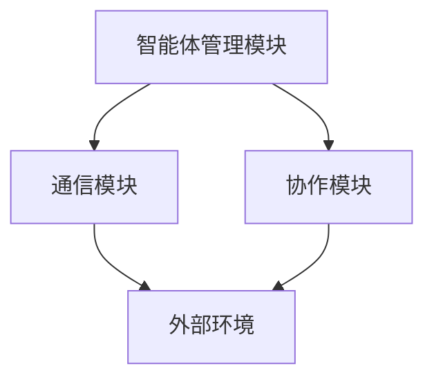
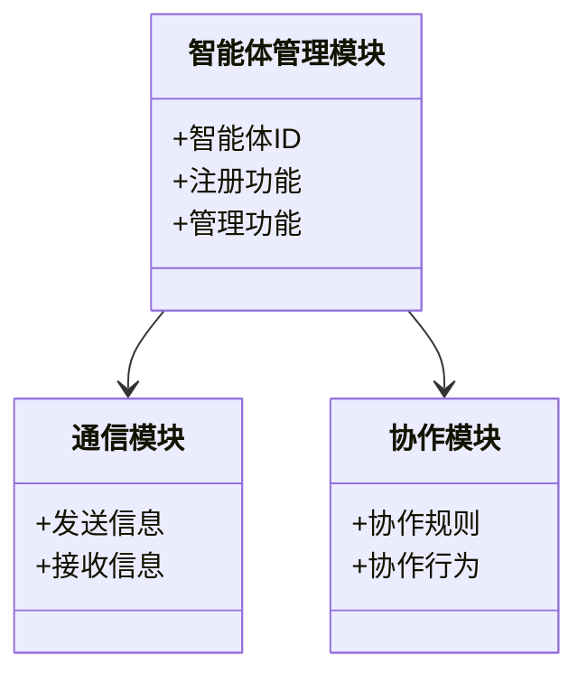

                 


---

# 多智能体系统实现智能化产业链分析

> 关键词：多智能体系统，智能化产业链，分布式计算，博弈论算法，系统架构设计

> 摘要：本文深入探讨了多智能体系统（MAS）在实现智能化产业链中的应用与价值。通过分析MAS的核心概念、算法原理、系统架构设计以及实际项目案例，本文为读者提供了一种系统化的视角，帮助理解如何利用MAS技术优化产业链的智能化水平。文章从背景介绍、核心概念、算法实现、系统架构、项目实战等多方面展开，结合理论与实践，为相关领域的研究者和实践者提供了丰富的参考。

---

# 第1章: 多智能体系统与智能化产业链背景

## 1.1 多智能体系统（MAS）概述

### 1.1.1 多智能体系统的定义
多智能体系统（Multi-Agent System，MAS）是由多个智能体（Agent）组成的分布式系统，这些智能体能够通过协作完成复杂的任务。智能体是指具有感知环境、自主决策和行动能力的实体。

### 1.1.2 多智能体系统的特征
- **自主性**：智能体能够自主决策。
- **反应性**：能够实时感知环境并做出反应。
- **协作性**：多个智能体能够协同工作。
- **分布式性**：系统由多个智能体分布构成，不存在单一的控制中心。

### 1.1.3 多智能体系统的分类
- **简单反射型智能体**：基于当前状态做出反应。
- **基于模型的反射型智能体**：利用内部模型进行决策。
- **目标驱动型智能体**：根据目标驱动行为。
- **效用驱动型智能体**：通过效用函数优化决策。

## 1.2 智能化产业链的背景与意义

### 1.2.1 产业链智能化的定义
产业链智能化是指通过引入人工智能、大数据、物联网等技术，优化产业链的各个环节，提升效率、降低成本、增强竞争力。

### 1.2.2 产业链智能化的驱动因素
- **技术进步**：人工智能、大数据等技术的发展为产业链智能化提供了技术基础。
- **市场需求**：消费者对个性化、高效服务的需求推动产业链优化。
- **成本压力**：企业通过智能化手段降低成本压力。

### 1.2.3 产业链智能化的目标与价值
- **目标**：实现产业链各环节的高效协同。
- **价值**：提升效率、降低成本、增强竞争力。

## 1.3 多智能体系统在产业链中的作用

### 1.3.1 多智能体系统与产业链的关系
多智能体系统能够模拟产业链中的各个参与方（如供应商、制造商、分销商等），通过协作实现资源优化配置。

### 1.3.2 多智能体系统在产业链中的应用场景
- **供应链管理**：优化库存管理、物流调度。
- **生产过程优化**：实现生产设备的协同工作。
- **市场需求预测**：通过智能体协作进行精准预测。

### 1.3.3 多智能体系统的优势与挑战
- **优势**：提高效率、降低成本、增强灵活性。
- **挑战**：智能体之间的协作复杂性、系统的可扩展性、安全性问题。

## 1.4 本章小结
本章介绍了多智能体系统的基本概念、特征、分类，以及其在智能化产业链中的作用和应用场景。接下来将从核心概念和算法原理的角度深入探讨MAS在产业链中的具体实现。

---

# 第2章: 多智能体系统的核心概念与联系

## 2.1 多智能体系统的核心概念

### 2.1.1 智能体的定义与属性
智能体（Agent）是一个能够感知环境、自主决策并采取行动的实体。其主要属性包括：
- **自主性**：能够自主决策。
- **反应性**：能够实时感知环境并做出反应。
- **协作性**：能够与其他智能体协作完成任务。
- **学习能力**：能够通过经验优化决策。

### 2.1.2 多智能体系统的组成要素
- **智能体**：系统的基本单元。
- **环境**：智能体所处的外部环境。
- **通信机制**：智能体之间的信息交互方式。
- **协作机制**：智能体之间的协作规则。

### 2.1.3 多智能体系统的通信机制
- **直接通信**：智能体之间直接交换信息。
- **间接通信**：通过中间媒介传递信息。

## 2.2 多智能体系统的协作机制

### 2.2.1 协作的基本原理
协作机制是多个智能体通过协调行动实现共同目标的机制。其核心在于如何实现智能体之间的信息共享与决策同步。

### 2.2.2 协作的实现方式
- **基于协议的协作**：通过预定义的协议进行协作。
- **基于博弈论的协作**：通过博弈论模型优化协作策略。

### 2.2.3 协作的评价指标
- **效率**：协作完成任务的速度。
- **效果**：协作完成任务的质量。
- **公平性**：协作中各方的利益分配是否合理。

## 2.3 多智能体系统的建模与分析

### 2.3.1 多智能体系统建模方法
- **基于状态空间的建模**：将系统状态化为状态空间，分析智能体的行动。
- **基于规则的建模**：通过预定义规则描述智能体的行为。

### 2.3.2 多智能体系统的分析框架
- **智能体行为分析**：分析每个智能体的行为模式。
- **系统整体分析**：从系统整体角度分析协作效果。

### 2.3.3 多智能体系统的优化策略
- **局部优化**：优化单个智能体的行为。
- **全局优化**：优化整个系统的协作效果。

## 2.4 本章小结
本章详细介绍了多智能体系统的核心概念、协作机制和建模方法。接下来将从算法原理的角度探讨MAS在产业链中的具体实现。

---

# 第3章: 多智能体系统的算法原理

## 3.1 多智能体系统的分布式计算

### 3.1.1 分布式计算的基本原理
分布式计算是指将计算任务分散到多个计算节点上，通过协作完成任务。

### 3.1.2 分布式计算的实现方法
- **任务分配**：将任务分解为多个子任务，分配给不同的智能体。
- **任务调度**：通过调度算法优化任务执行顺序。

### 3.1.3 分布式计算的优缺点
- **优点**：提高计算效率、增强系统的容错性。
- **缺点**：需要复杂的通信机制，增加系统复杂性。

## 3.2 多智能体系统的博弈论算法

### 3.2.1 博弈论的基本概念
博弈论是研究多个决策主体在策略互动中如何优化自身利益的理论。

### 3.2.2 博弈论在多智能体系统中的应用
- **纳什均衡**：多个智能体在策略选择上达到的一种稳定状态。
- **极大极小算法**：用于智能体的最优决策。

### 3.2.3 博弈论算法的实现步骤
1. **定义博弈模型**：明确智能体的策略空间和收益函数。
2. **计算纳什均衡**：找到所有智能体策略的稳定状态。
3. **优化协作策略**：通过博弈论算法优化智能体的协作行为。

## 3.3 多智能体系统的路径规划算法

### 3.3.1 路径规划的基本原理
路径规划是指智能体在复杂环境中找到一条从起点到终点的最优路径。

### 3.3.2 路径规划的实现方法
- **A*算法**：基于启发式搜索的路径规划算法。
- **Dijkstra算法**：用于寻找最短路径的算法。

### 3.3.3 路径规划的优化策略
- **动态路径规划**：根据环境变化实时调整路径。
- **多目标优化**：综合考虑路径长度、安全性等多个因素。

## 3.4 本章小结
本章介绍了多智能体系统中的分布式计算、博弈论算法和路径规划算法。接下来将从系统架构设计的角度探讨MAS在产业链中的具体实现。

---

# 第4章: 多智能体系统的数学模型与公式

## 4.1 多智能体系统的数学模型

### 4.1.1 系统状态空间模型
系统状态空间模型通过数学公式描述系统中各个智能体的状态。

$$
S = \{s_1, s_2, \dots, s_n\}
$$

其中，$s_i$ 表示第 $i$ 个智能体的状态。

### 4.1.2 系统行为模型
系统行为模型通过数学公式描述智能体的行为模式。

$$
A = \{a_1, a_2, \dots, a_m\}
$$

其中，$a_i$ 表示第 $i$ 个智能体的行为。

### 4.1.3 系统协作模型
系统协作模型通过数学公式描述智能体之间的协作关系。

$$
C = \{c_1, c_2, \dots, c_k\}
$$

其中，$c_i$ 表示第 $i$ 个协作关系。

## 4.2 博弈论模型的数学公式

### 4.2.1 纳什均衡
纳什均衡是指在博弈中，每个智能体的策略选择都达到最优状态。

$$
\text{纳什均衡} \iff \forall i, u_i(a_i, a_{-i}) \geq u_i(a_i', a_{-i})
$$

其中，$u_i(a_i, a_{-i})$ 表示智能体 $i$ 在策略 $a_i$ 下的收益。

### 4.2.2 极大极小算法
极大极小算法用于智能体的决策优化。

$$
\text{极大极小值} = \max_{a_i} \min_{a_{-i}} u_i(a_i, a_{-i})
$$

## 4.3 本章小结
本章通过数学公式详细描述了多智能体系统的数学模型和博弈论模型。接下来将从系统架构设计的角度探讨MAS在产业链中的具体实现。

---

# 第5章: 多智能体系统的系统架构设计

## 5.1 系统架构设计概述

### 5.1.1 系统架构设计的目标
系统架构设计的目标是优化系统的功能、性能和可扩展性。

### 5.1.2 系统架构设计的方法
- **分层设计**：将系统划分为多个层次，每个层次负责不同的功能。
- **模块化设计**：将系统功能分解为多个模块，模块之间通过接口通信。

## 5.2 系统功能设计

### 5.2.1 系统功能模块划分
- **智能体管理模块**：负责智能体的注册、管理。
- **通信模块**：负责智能体之间的信息交互。
- **协作模块**：负责智能体之间的协作行为。

### 5.2.2 系统功能流程
1. **智能体注册**：智能体向系统注册，获得唯一的标识。
2. **任务分配**：系统根据任务需求分配智能体。
3. **信息交互**：智能体之间通过通信模块交换信息。
4. **协作行为**：智能体根据协作规则进行协作。

## 5.3 系统架构设计

### 5.3.1 系统架构图


### 5.3.2 系统功能模块图


## 5.4 本章小结
本章详细介绍了多智能体系统的系统架构设计，包括功能模块划分和架构图。接下来将从项目实战的角度探讨MAS在产业链中的具体实现。

---

# 第6章: 多智能体系统的项目实战

## 6.1 项目背景与需求分析

### 6.1.1 项目背景
本项目旨在通过多智能体系统优化某企业的供应链管理。

### 6.1.2 项目需求
- **需求1**：优化供应链中的库存管理。
- **需求2**：实现供应商与制造商的高效协作。

## 6.2 环境搭建与工具选择

### 6.2.1 环境搭建
- **操作系统**：Windows 10
- **编程语言**：Python 3.8
- **开发工具**：PyCharm

### 6.2.2 工具选择
- **智能体框架**：使用Multi-Agent Framework（MAF）框架。
- **通信协议**：使用MQTT协议实现智能体之间的通信。

## 6.3 系统核心实现

### 6.3.1 智能体管理模块实现
```python
class AgentManager:
    def __init__(self):
        self.agents = {}

    def register_agent(self, agent_id):
        self.agents[agent_id] = {'id': agent_id, 'status': 'idle'}

    def get_agent_status(self, agent_id):
        return self.agents.get(agent_id, {}).get('status', 'offline')
```

### 6.3.2 通信模块实现
```python
import paho.mqtt.client as mqtt

class Communicator:
    def __init__(self, broker='localhost', port=1883):
        self.client = mqtt.Client()
        self.broker = broker
        self.port = port

    def connect(self):
        self.client.connect(self.broker, self.port)

    def publish(self, topic, payload):
        self.client.publish(topic, payload)

    def subscribe(self, topic):
        self.client.subscribe(topic)
```

### 6.3.3 协作模块实现
```python
class Collaborator:
    def __init__(self):
        self.collaborators = []

    def add_collaborator(self, collaborator):
        self.collaborators.append(collaborator)

    def execute_collaboration(self):
        for collaborator in self.collaborators:
            collaborator.collaborate()
```

## 6.4 项目实现与测试

### 6.4.1 系统实现
1. **智能体注册**：通过`AgentManager`注册智能体。
2. **通信模块测试**：通过`Communicator`实现智能体之间的信息交互。
3. **协作模块测试**：通过`Collaborator`实现智能体之间的协作行为。

### 6.4.2 系统测试
- **功能测试**：测试系统各模块的功能是否正常。
- **性能测试**：测试系统的处理能力和扩展性。
- **安全性测试**：测试系统的安全性，防止信息泄露。

## 6.5 项目总结与经验分享

### 6.5.1 项目总结
通过本项目，我们成功实现了多智能体系统的供应链管理优化，提高了企业的运营效率。

### 6.5.2 经验分享
- **模块化设计**：系统功能模块化设计，便于后续扩展。
- **通信协议选择**：选择合适的通信协议，确保系统的高效性。
- **协作机制优化**：通过博弈论算法优化智能体之间的协作策略。

## 6.6 本章小结
本章通过一个实际项目案例，详细介绍了多智能体系统的实现过程，包括环境搭建、核心代码实现和系统测试。接下来将从总结与展望的角度进行最后的总结。

---

# 第7章: 总结与展望

## 7.1 总结
本文深入探讨了多智能体系统在实现智能化产业链中的应用与价值。通过分析MAS的核心概念、算法原理、系统架构设计以及实际项目案例，本文为读者提供了一种系统化的视角，帮助理解如何利用MAS技术优化产业链的智能化水平。

## 7.2 展望
未来，随着人工智能技术的不断发展，多智能体系统将在更多领域得到广泛应用。同时，如何进一步优化多智能体系统的协作机制和通信效率，仍是一个值得深入研究的方向。

## 7.3 最佳实践 Tips
- **模块化设计**：系统功能模块化设计，便于后续扩展。
- **通信协议选择**：选择合适的通信协议，确保系统的高效性。
- **协作机制优化**：通过博弈论算法优化智能体之间的协作策略。

## 7.4 本章小结
本章对全文进行了总结，并对MAS技术的未来发展进行了展望。本文为读者提供了一个全面的视角，帮助其更好地理解和应用MAS技术。

---

# 作者：AI天才研究院 & 禅与计算机程序设计艺术

---

**温馨提示：如果需要进一步的技术支持或深度分析，请随时联系我！**

