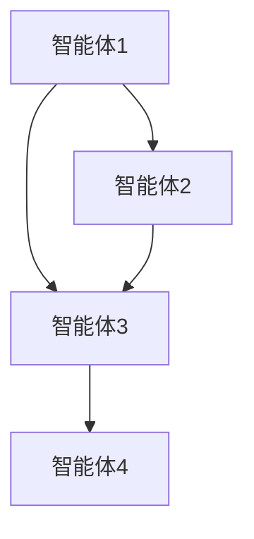
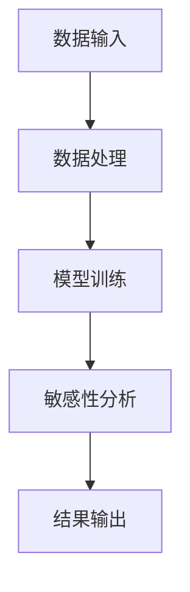
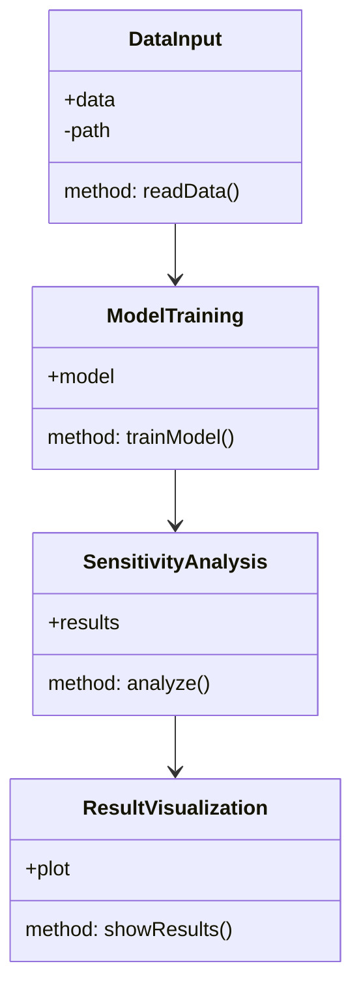
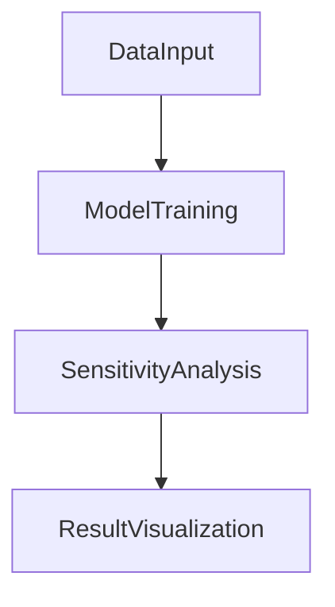

                 


# 多智能体系统实现智能化公司估值敏感性分析

> 关键词：多智能体系统, 公司估值, 敏感性分析, 算法原理, 系统架构

> 摘要：本文深入探讨了多智能体系统在公司估值敏感性分析中的应用。通过分析多智能体系统的协作机制、敏感性分析的数学模型以及系统的架构设计，展示了如何利用多智能体系统提升公司估值的准确性和效率。文章内容涵盖背景介绍、核心概念、算法原理、系统架构、项目实战以及最佳实践，为读者提供全面的技术指导。

---

## 第一部分: 多智能体系统与公司估值敏感性分析概述

### 第1章: 多智能体系统与公司估值敏感性分析概述

#### 1.1 多智能体系统的基本概念
多智能体系统（Multi-Agent System, MAS）是由多个智能体（Agent）组成的分布式系统，这些智能体能够通过协作完成复杂任务。智能体具有自主性、反应性、主动性和社会性等特征，能够感知环境、做出决策并执行操作。

#### 1.2 公司估值敏感性分析的背景与意义
公司估值是企业管理和投资决策中的核心问题。敏感性分析通过评估关键因素的变化对估值的影响，帮助投资者识别风险和不确定性。多智能体系统在其中的作用在于通过分布式计算和协作优化，提高分析的效率和准确性。

#### 1.3 多智能体系统在公司估值中的应用价值
多智能体系统能够模拟市场行为、优化资源配置，并通过协作完成复杂的估值任务。其分布式架构能够处理大规模数据，同时支持实时反馈和动态调整。

#### 图1.1: 多智能体系统的协作机制


---

### 第2章: 多智能体系统与公司估值的结合

#### 2.1 多智能体系统的协作机制
多智能体系统的通信与协作机制是其核心。智能体之间通过消息传递进行交互，共同完成任务。任务分配与协调算法确保系统的高效运行。

#### 2.2 公司估值敏感性分析的核心问题
公司估值的关键因素包括收入、成本、市场风险等。敏感性分析需要评估这些因素的变化对估值的影响。多智能体系统能够同时处理多个因素，提供全面的分析结果。

#### 2.3 多智能体系统在敏感性分析中的应用价值
通过多智能体系统的协作，可以实时更新分析结果，提高敏感性分析的效率和准确性。

---

## 第二部分: 多智能体系统敏感性分析的算法原理

### 第3章: 敏感性分析的数学模型与算法

#### 3.1 敏感性分析的数学模型
敏感性分析的数学模型包括线性回归模型和蒙特卡洛模拟方法。线性回归模型用于分析变量之间的线性关系，而蒙特卡洛模拟则适用于复杂的非线性场景。

#### 3.2 多智能体系统敏感性分析的算法实现
算法步骤如下：
1. 数据预处理
2. 模型训练
3. 敏感性分析
4. 结果可视化

#### 图3.1: 敏感性分析算法流程


#### 代码示例
```python
import numpy as np

def sensitivity_analysis(data):
    # 数据处理
    X = data[:, :-1]
    y = data[:, -1]
    
    # 线性回归模型
    model = np.linalg.inv(X.T.dot(X)).dot(X.T).dot(y)
    
    return model
```

---

### 第4章: 敏感性分析的数学公式与实例

#### 4.1 敏感性分析的数学公式
线性回归模型的公式为：
$$ y = \beta_0 + \beta_1 x_1 + \beta_2 x_2 + \dots + \beta_n x_n + \epsilon $$

其中，$\beta_i$ 是变量 $x_i$ 的回归系数，$\epsilon$ 是误差项。

#### 4.2 实例分析
假设我们有三个变量 $x_1, x_2, x_3$，通过回归分析得到系数 $\beta_1 = 0.5$, $\beta_2 = -0.3$, $\beta_3 = 0.8$。这表明 $x_1$ 和 $x_3$ 对结果有正向影响，而 $x_2$ 有负向影响。

---

## 第三部分: 系统分析与架构设计方案

### 第5章: 系统架构设计

#### 5.1 问题场景介绍
公司估值系统需要处理大量的市场数据和财务指标，通过多智能体系统的协作，实现敏感性分析的实时更新。

#### 5.2 系统功能设计
系统功能包括数据输入、模型训练、敏感性分析和结果可视化。

#### 图5.1: 系统类图


#### 图5.2: 系统架构图


---

## 第四部分: 项目实战

### 第6章: 项目实战

#### 6.1 环境安装
需要安装Python、NumPy、Matplotlib和Scikit-learn库。

#### 6.2 核心实现代码
```python
import numpy as np
import matplotlib.pyplot as plt

def sensitivity_analysis(data):
    X = data[:, :-1]
    y = data[:, -1]
    
    # 计算系数
    beta = np.linalg.inv(X.T.dot(X)).dot(X.T).dot(y)
    
    return beta

# 示例数据
data = np.random.rand(100, 4)
beta = sensitivity_analysis(data)
print(beta)

# 可视化结果
plt.bar(range(len(beta)), beta)
plt.show()
```

#### 6.3 实际案例分析
通过分析公司财务数据，使用多智能体系统进行敏感性分析，识别关键因素对估值的影响。

---

## 第五部分: 最佳实践

### 第7章: 最佳实践

#### 7.1 小结
多智能体系统在公司估值敏感性分析中的应用能够提高效率和准确性。通过协作机制和分布式计算，系统能够处理复杂问题。

#### 7.2 注意事项
在实际应用中，需要注意数据质量、模型选择和系统优化。同时，要定期更新模型以适应市场变化。

#### 7.3 拓展阅读
建议深入学习多智能体系统的协作算法和敏感性分析的高级方法。

---

## 结语

多智能体系统为公司估值敏感性分析提供了新的思路和方法。通过分布式计算和协作机制，系统能够高效地处理复杂问题。未来的研究可以进一步优化算法和提升系统的实时性。

---

作者：AI天才研究院 & 禅与计算机程序设计艺术

