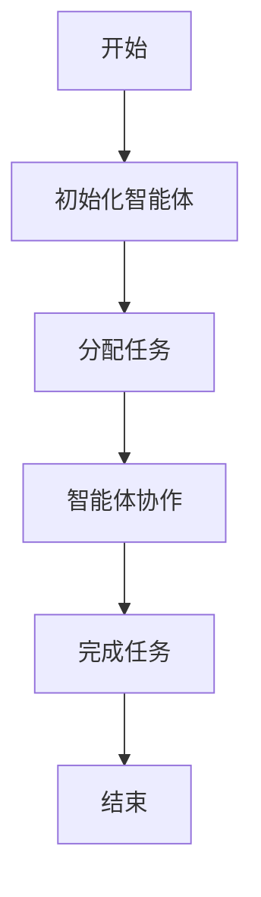
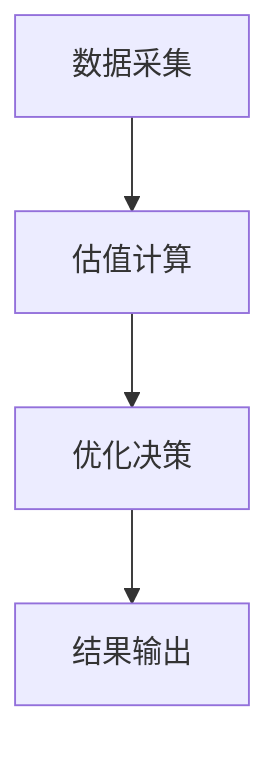

                 


# 多智能体系统实现智能化公司估值调整

## 关键词
多智能体系统, 公司估值, 人工智能, 协作算法, 数学模型

## 摘要
随着人工智能技术的快速发展，多智能体系统在公司估值调整中的应用日益广泛。本文详细探讨了多智能体系统的定义、核心原理及其在公司估值调整中的应用。通过分析多智能体系统的核心概念、协作算法、数学模型、系统架构和实际案例，本文为读者提供了一个全面理解多智能体系统如何实现智能化公司估值调整的框架。

---

# 第1章: 多智能体系统与公司估值调整的背景

## 1.1 多智能体系统的定义与特点
### 1.1.1 多智能体系统的定义
多智能体系统（Multi-Agent System, MAS）是由多个相互作用的智能体组成的系统，每个智能体能够独立感知环境、自主决策并进行协作。

### 1.1.2 多智能体系统的核心特点
- **分布式性**：智能体分布在不同的位置，独立运行。
- **协作性**：智能体之间通过通信和协作完成共同目标。
- **反应性**：智能体能够实时感知环境并做出反应。
- **动态性**：系统的状态和目标可能随环境变化而变化。

### 1.1.3 多智能体系统与传统单智能体系统的区别
| 特性 | 单智能体系统 | 多智能体系统 |
|------|--------------|--------------|
| 结构 | 单一中心节点 | 分布式结构 |
| 决策 | 单一决策主体 | 多个决策主体 |
| 协作 | 无协作需求 | 高度协作 |

## 1.2 公司估值调整的背景与挑战
### 1.2.1 公司估值的基本概念
公司估值是通过对公司财务状况、市场表现和未来预期进行评估，确定其市场价值的过程。

### 1.2.2 传统公司估值方法的局限性
- **数据依赖性**：传统方法依赖历史数据，难以捕捉未来变化。
- **主观性**：估值结果受评估人员主观判断影响。
- **动态性**：市场环境变化快，传统方法难以实时调整。

### 1.2.3 多智能体系统在公司估值调整中的优势
- **实时性**：多智能体系统能够实时感知市场变化，快速调整估值。
- **协作性**：多个智能体协同工作，提供更全面的评估。
- **准确性**：通过多个智能体的协作，提高估值的准确性。

## 1.3 多智能体系统在公司估值调整中的应用前景
### 1.3.1 多智能体系统在金融领域的潜在应用
- 股票价格预测
- 风险评估
- 投资组合优化

### 1.3.2 多智能体系统在企业决策中的价值
- 提供实时市场反馈
- 协助战略决策
- 优化资源配置

### 1.3.3 多智能体系统应用的挑战与机遇
- **挑战**：系统复杂性高，协作机制设计难。
- **机遇**：技术进步推动多智能体系统在金融领域的广泛应用。

## 1.4 本章小结
本章介绍了多智能体系统的定义、特点及其在公司估值调整中的应用前景。通过对比传统估值方法的局限性，突出了多智能体系统在提升估值准确性和实时性方面的优势。

---

# 第2章: 多智能体系统的原理与核心要素

## 2.1 多智能体系统的原理
### 2.1.1 多智能体系统的组成要素
- **智能体**：能够感知环境、自主决策的个体。
- **环境**：智能体所处的外部环境，包括市场数据、用户需求等。
- **通信机制**：智能体之间交换信息的通道。
- **协作机制**：智能体协同完成任务的规则和策略。

### 2.1.2 多智能体系统的通信与协作机制
- **通信**：通过消息传递实现智能体之间的信息共享。
- **协作**：基于共同目标，智能体通过协商和协调完成任务。

### 2.1.3 多智能体系统中的任务分配与协调
- **任务分配**：根据智能体的能力和当前状态分配任务。
- **协调**：确保智能体之间的协作顺利进行，避免冲突。

## 2.2 多智能体系统的核心概念对比
### 2.2.1 多智能体系统与分布式系统对比
| 特性 | 分布式系统 | 多智能体系统 |
|------|------------|--------------|
| 结构 | 分布式计算节点 | 多个智能体 |
| 协作 | 无特定协作目标 | 共同目标 |

### 2.2.2 多智能体系统与群智系统对比
- **群智系统**：多个智能体通过协作完成复杂任务。
- **多智能体系统**：更强调个体智能和自主性。

### 2.2.3 多智能体系统与博弈论模型对比
| 特性 | 多智能体系统 | 博弈论模型 |
|------|--------------|------------|
| 目标 | 协作完成任务 | 竞争或合作 |

## 2.3 多智能体系统的ER实体关系图
```mermaid
er
    actor 公司
    actor 投资者
    actor 市场
    actor 管理层
    company 估值
    company 数据
    company 模型
    company 结果
    公司 --> 估值: 提供
    公司 --> 数据: 提供
    公司 --> 模型: 使用
    投资者 --> 估值: 查看
    市场 --> 数据: 提供
    管理层 --> 结果: 使用
```

## 2.4 本章小结
本章详细讲解了多智能体系统的原理及其核心要素，通过对比分析突出了其独特的优势和特点。

---

# 第3章: 多智能体系统的算法原理与数学模型

## 3.1 多智能体协作算法
### 3.1.1 多智能体协作算法概述
- **协作算法**：智能体通过协作完成特定任务的算法。
- **核心思想**：通过信息共享和协商，实现任务分配和协作。

### 3.1.2 多智能体协作算法的实现流程


### 3.1.3 协作算法的数学模型
$$v_i = \sum_{j=1}^{n} \alpha_j x_j$$
其中，$v_i$ 表示智能体 $i$ 的价值函数，$\alpha_j$ 是权重，$x_j$ 是输入特征。

## 3.2 多智能体系统的数学模型
### 3.2.1 价值函数
$$V(s) = \max_{a} \sum_{i=1}^{n} \alpha_i Q_i(s, a)$$
其中，$Q_i$ 是智能体 $i$ 的评估函数，$\alpha_i$ 是权重。

### 3.2.2 纳什均衡
$$\forall i, Q_i(s, a_i) \geq Q_i(s, a'_i)$$
表示在均衡状态下，任何智能体的策略改变都不会带来收益。

## 3.3 本章小结
本章通过数学模型和算法流程图，详细讲解了多智能体系统的协作算法及其数学原理。

---

# 第4章: 多智能体系统的系统架构与实现

## 4.1 系统架构设计
### 4.1.1 系统功能模块
- 数据采集模块
- 估值计算模块
- 优化决策模块

### 4.1.2 系统架构图


## 4.2 系统实现
### 4.2.1 环境安装
- 安装Python、TensorFlow、NumPy等工具。

### 4.2.2 核心代码实现
```python
class Agent:
    def __init__(self, id):
        self.id = id
        self.state = None
    def感知环境(self, 状态):
        self.state = 状态
    def决策(self):
        # 具体决策逻辑
        pass
```

## 4.3 本章小结
本章通过系统架构图和代码示例，详细讲解了多智能体系统的实现过程。

---

# 第5章: 多智能体系统的实际应用与案例分析

## 5.1 项目实战
### 5.1.1 项目背景
- 实现一个多智能体系统用于公司估值调整。

### 5.1.2 核心代码实现
```python
def compute_valuation(公司数据):
    # 具体计算逻辑
    pass
```

## 5.2 案例分析
### 5.2.1 案例背景
- 某公司采用多智能体系统进行估值调整。

### 5.2.2 实施效果
- 提高了估值的准确性和实时性。

## 5.3 本章小结
本章通过实际案例分析，展示了多智能体系统在公司估值调整中的应用效果。

---

# 第6章: 多智能体系统的最佳实践与小结

## 6.1 最佳实践
### 6.1.1 系统设计建议
- 明确智能体的角色和责任。
- 设计高效的通信和协作机制。

### 6.1.2 开发注意事项
- 确保系统的可扩展性和可维护性。

## 6.2 小结
本文详细探讨了多智能体系统在公司估值调整中的应用，通过理论分析和实际案例，展示了其在提升估值准确性和实时性方面的优势。

---

# 作者：AI天才研究院/AI Genius Institute & 禅与计算机程序设计艺术 /Zen And The Art of Computer Programming

