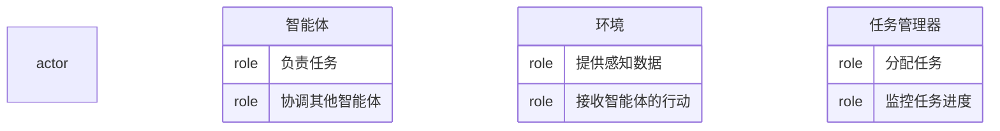
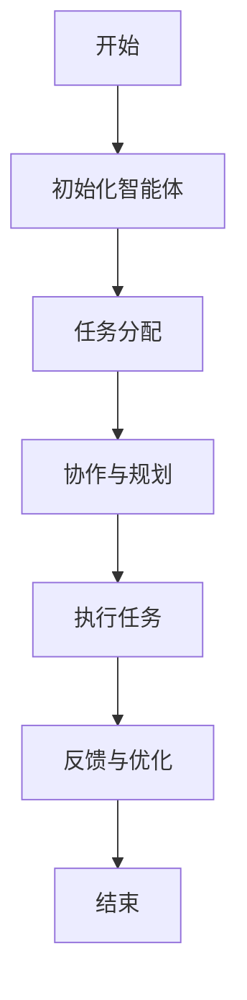
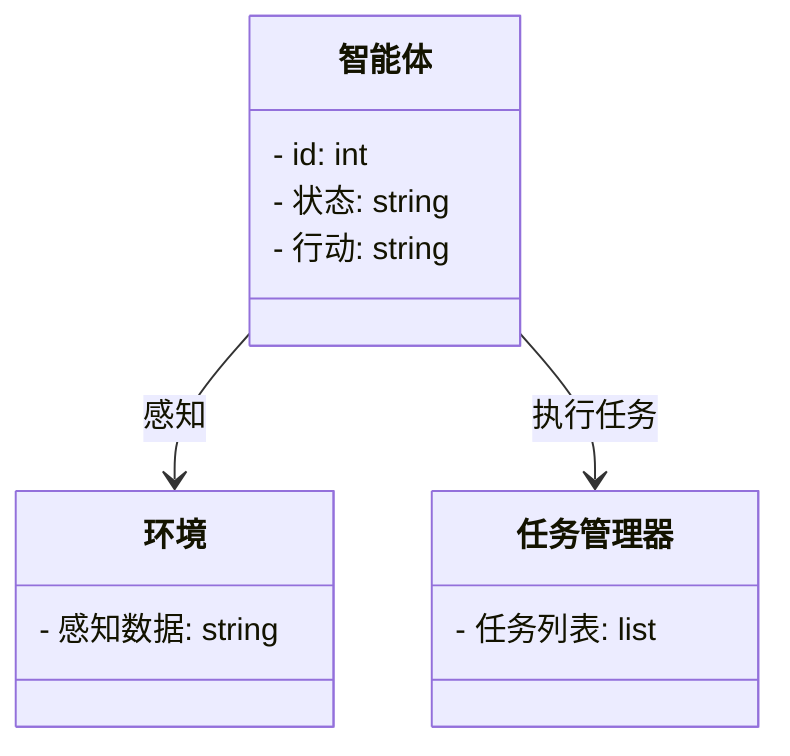
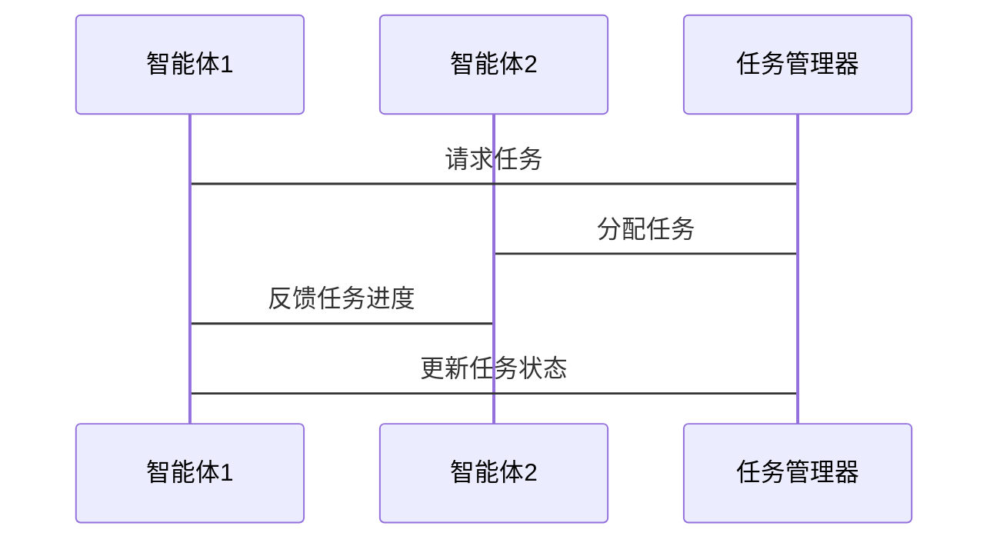

                 


# 多智能体系统实现智能化行业比较分析

## 关键词：多智能体系统、智能化行业、系统架构、算法原理、项目实战

## 摘要：  
本文旨在通过详细分析多智能体系统的实现与应用，探讨其在不同智能化行业中的比较与差异。从核心概念到算法原理，再到系统架构设计和项目实战，本文将逐步深入，帮助读者全面理解多智能体系统的运作机制及其在现实中的应用价值。

---

# 第一部分: 多智能体系统实现智能化行业的背景与核心概念

## 第1章: 多智能体系统概述

### 1.1 多智能体系统的基本概念

#### 1.1.1 多智能体系统的定义  
多智能体系统（Multi-Agent System, MAS）是指由多个相互作用的智能体组成的系统，这些智能体通过协作完成特定任务或目标。每个智能体都具有一定的自主性、反应性和社会性。

#### 1.1.2 多智能体系统的特征  
- **自主性**：智能体能够自主决策和行动。  
- **反应性**：能够感知环境并实时响应。  
- **协作性**：多个智能体之间能够协同工作，实现共同目标。  
- **分布式性**：系统中的智能体分布于不同的节点或位置。  

#### 1.1.3 多智能体系统与单智能体系统的区别  
单智能体系统由单一的智能体完成任务，而多智能体系统通过多个智能体的协作来实现复杂任务。多智能体系统的优势在于能够处理更大规模和更复杂的任务，但实现起来更具挑战性。

### 1.2 多智能体系统的应用场景

#### 1.2.1 智能制造中的多智能体系统  
在智能制造中，多智能体系统可以用于协调机器人、传感器和生产设备，实现高效的生产流程优化。

#### 1.2.2 智慧交通中的多智能体系统  
在智慧交通中，多智能体系统可以用于交通流量管理、自动驾驶车辆的协同决策等。

#### 1.2.3 智能医疗中的多智能体系统  
在智能医疗中，多智能体系统可以用于病患数据管理、医疗资源优化分配等。

### 1.3 多智能体系统的优缺点

#### 1.3.1 优势分析  
- **分布式计算**：能够处理大规模数据和复杂任务。  
- **高可用性**：即使部分智能体失效，系统仍能正常运行。  
- **灵活性**：能够快速适应环境变化。  

#### 1.3.2 挑战与限制  
- **智能体之间的通信**：需要高效且可靠的通信机制。  
- **协调与冲突解决**：多个智能体之间需要解决任务分配和冲突问题。  
- **系统复杂性**：系统的实现和维护相对复杂。  

### 1.4 本章小结  
本章介绍了多智能体系统的定义、特征及其应用场景，并分析了其优缺点。通过这些内容，读者可以对多智能体系统有一个初步的了解。

---

# 第二部分: 多智能体系统的核心概念与联系

## 第2章: 多智能体系统的组成与核心要素

### 2.1 多智能体系统的组成结构

#### 2.1.1 智能体的定义与分类  
智能体是一种能够感知环境并采取行动以实现目标的实体。根据智能体的智能水平，可以将其分为反应式智能体、基于模型的智能体和混合智能体。

#### 2.1.2 多智能体系统的层次结构  
多智能体系统的层次结构通常包括感知层、决策层、执行层和协同层。每个层次负责不同的功能，如感知环境、制定决策、执行任务和协调智能体之间的协作。

#### 2.1.3 系统中各智能体的交互方式  
智能体之间的交互可以通过通信协议、消息传递和分布式计算实现。不同的交互方式会影响系统的性能和效率。

### 2.2 多智能体系统的实体关系分析

#### 2.2.1 实体关系图（ER图）
以下是一个简单的ER图，展示了多智能体系统中的实体关系：


#### 2.2.2 实体间的关系类型  
- **关联关系**：智能体与任务管理器之间的关联。  
- **依赖关系**：智能体依赖环境提供的感知数据。  
- **协作关系**：多个智能体之间需要协作完成任务。  

#### 2.2.3 实体关系的动态变化  
在多智能体系统中，实体之间的关系可能会随着任务的变化而动态调整。例如，当任务优先级变化时，智能体之间的协作关系也需要相应调整。

### 2.3 多智能体系统的概念属性对比

#### 2.3.1 核心概念对比表  
| 比较项       | 单智能体系统       | 多智能体系统       |
|--------------|--------------------|--------------------|
| 系统复杂性   | 较低               | 较高               |
| 可扩展性     | 有限               | 较高               |
| 协作能力     | 无                 | 强                 |

#### 2.3.2 属性特征分析  
- **自主性**：多智能体系统中的每个智能体都具有一定的自主性，能够独立决策。  
- **协作性**：智能体之间需要通过协作来完成共同的任务。  
- **分布式性**：系统中的智能体分布于不同的节点，通过通信网络进行交互。  

#### 2.3.3 对比表的详细解读  
通过对比表可以看出，多智能体系统在复杂性和扩展性方面具有明显优势，但实现起来也更具挑战性。

### 2.4 本章小结  
本章详细分析了多智能体系统的组成结构和核心要素，并通过ER图和对比表展示了实体之间的关系和属性特征。

---

# 第三部分: 多智能体系统的算法原理与数学模型

## 第3章: 多智能体系统的算法原理

### 3.1 多智能体系统的核心算法

#### 3.1.1 分布式计算算法  
分布式计算算法用于在多智能体系统中实现任务的分配和执行。常见的分布式计算算法包括分布式一致性算法和分布式任务分配算法。

#### 3.1.2 一致性算法  
一致性算法用于确保系统中所有智能体的状态一致。例如，使用Paxos算法或Raft算法来实现分布式一致性。

#### 3.1.3 协作与规划算法  
协作与规划算法用于智能体之间的协作和任务规划。例如，使用多智能体强化学习算法来优化智能体的协作策略。

### 3.2 多智能体系统的数学模型

#### 3.2.1 系统状态表示  
系统状态可以用向量表示，例如：
$$
s = [s_1, s_2, \ldots, s_n]
$$
其中，$s_i$ 表示第 $i$ 个智能体的状态。

#### 3.2.2 行为决策模型  
行为决策模型可以表示为：
$$
a_i = f(s_i, s_{-i})
$$
其中，$a_i$ 是第 $i$ 个智能体的行动，$s_{-i}$ 是其他智能体的状态。

#### 3.2.3 目标优化函数  
目标优化函数可以表示为：
$$
\max_{a} \sum_{i=1}^{n} u_i(a_i)
$$
其中，$u_i(a_i)$ 是第 $i$ 个智能体的效用函数。

### 3.3 算法流程图



### 3.4 本章小结  
本章介绍了多智能体系统的核心算法和数学模型，包括分布式计算算法、一致性算法和协作与规划算法，并通过流程图展示了算法的整体流程。

---

# 第四部分: 多智能体系统的系统分析与架构设计

## 第4章: 多智能体系统的系统分析

### 4.1 系统应用场景介绍

#### 4.1.1 智能制造场景  
在智能制造中，多智能体系统可以用于协调机器人、传感器和生产设备，实现高效的生产流程优化。

#### 4.1.2 智慧交通场景  
在智慧交通中，多智能体系统可以用于交通流量管理、自动驾驶车辆的协同决策等。

#### 4.1.3 智能医疗场景  
在智能医疗中，多智能体系统可以用于病患数据管理、医疗资源优化分配等。

### 4.2 系统功能设计

#### 4.2.1 领域模型类图  
以下是一个简单的领域模型类图：


#### 4.2.2 系统架构图  
以下是一个多智能体系统的系统架构图：


#### 4.2.3 系统交互序列图  
以下是一个系统交互的序列图：


### 4.3 本章小结  
本章通过系统应用场景、领域模型类图和系统架构图，详细分析了多智能体系统的功能设计和系统架构。

---

# 第五部分: 多智能体系统的项目实战

## 第5章: 多智能体系统的项目实战

### 5.1 环境安装

#### 5.1.1 安装Python环境  
需要安装Python 3.8或更高版本。

#### 5.1.2 安装依赖库  
安装必要的依赖库，例如：
```
pip install numpy
pip install matplotlib
pip install scikit-learn
```

### 5.2 系统核心实现源代码

#### 5.2.1 智能体类  
```python
class Agent:
    def __init__(self, id):
        self.id = id
        self.state = "idle"
        self.action = None
```

#### 5.2.2 任务管理器类  
```python
class TaskManager:
    def __init__(self):
        self.task_list = []
```

#### 5.2.3 环境类  
```python
class Environment:
    def __init__(self):
        self.sensors = []
```

#### 5.2.4 多智能体系统主程序  
```python
def main():
    agent1 = Agent(1)
    agent2 = Agent(2)
    task_manager = TaskManager()
    environment = Environment()
    
    # 初始化任务
    task_manager.task_list.append("完成生产任务")
    
    # 分配任务
    agent1.state = "busy"
    agent1.action = "执行任务"
    
    # 执行任务
    while agent1.state == "busy":
        print(f"Agent {agent1.id}正在执行任务...")
    
    # 更新任务状态
    task_manager.task_list.remove("完成生产任务")
    
    # 反馈结果
    print("任务完成！")

if __name__ == "__main__":
    main()
```

### 5.3 代码应用解读与分析

#### 5.3.1 代码结构分析  
- `Agent` 类表示智能体，具有 `id`、`state` 和 `action` 属性。  
- `TaskManager` 类表示任务管理器，维护一个任务列表。  
- `Environment` 类表示环境，维护传感器数据。  
- `main()` 函数是主程序，负责初始化智能体、任务管理器和环境，并分配和执行任务。

#### 5.3.2 代码实现细节  
- 智能体通过 `state` 属性表示当前状态，`action` 属性表示当前行动。  
- 任务管理器通过 `task_list` 属性维护任务列表。  
- 环境类目前未实现具体功能，可以根据需要扩展。

### 5.4 实际案例分析

#### 5.4.1 案例背景  
以智能制造场景为例，我们需要实现一个简单的多智能体系统，用于协调机器人和传感器完成生产任务。

#### 5.4.2 系统实现  
在上述代码的基础上，可以进一步扩展，例如增加传感器数据的采集和处理功能。

### 5.5 项目小结  
本章通过一个简单的项目实战，展示了多智能体系统的实现过程，包括环境安装、代码实现和案例分析。

---

# 第六部分: 总结与展望

## 第6章: 总结与展望

### 6.1 全文总结  
本文从多智能体系统的背景、核心概念、算法原理、系统架构设计到项目实战，全面介绍了多智能体系统的实现与应用。通过具体案例分析，展示了多智能体系统在不同智能化行业中的应用价值。

### 6.2 最佳实践 tips  
- 在设计多智能体系统时，需要充分考虑智能体之间的通信和协作问题。  
- 系统的实现需要结合具体的行业需求，选择合适的算法和架构。  
- 系统的维护和优化需要持续关注智能体的性能和系统的稳定性。

### 6.3 展望  
随着人工智能技术的不断发展，多智能体系统将在更多领域得到广泛应用。未来的研究方向可以包括更高效的协作算法、更智能的决策模型以及更 robust 的系统架构设计。

### 6.4 本章小结  
本章总结了全文内容，并对未来的研究方向进行了展望。

---

# 作者：AI天才研究院/AI Genius Institute & 禅与计算机程序设计艺术 /Zen And The Art of Computer Programming

