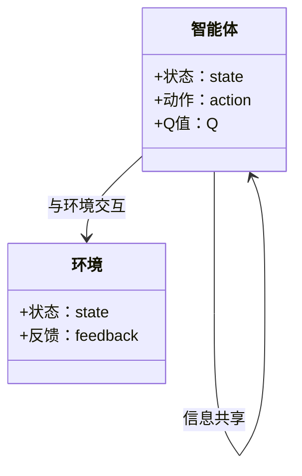
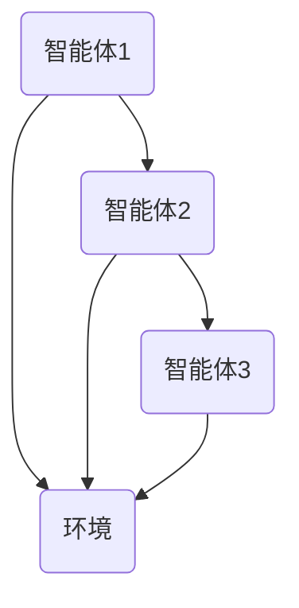

                 


# 多智能体系统实现约翰伯格指数增强

> 关键词：多智能体系统，约翰伯格指数增强，投资组合优化，协作学习，量化交易

> 摘要：本文探讨了多智能体系统在实现约翰伯格指数增强策略中的应用。通过分析多智能体系统的协作机制，结合量化交易的数学模型，详细阐述了如何利用多智能体协作学习算法优化投资组合，实现指数增强的目标。文章从背景介绍、核心概念、算法原理、系统架构到项目实战，全面解析了多智能体系统在指数增强策略中的实现过程，并提供了具体的代码实现和案例分析。

---

## 第1章：多智能体系统与约翰伯格指数增强的背景介绍

### 1.1 多智能体系统的定义与特点

#### 1.1.1 多智能体系统的定义
多智能体系统（Multi-Agent System, MAS）是由多个智能体（Agent）组成的系统，这些智能体能够通过协作完成复杂的任务。每个智能体都是一个独立的实体，具有自主性、反应性和社会性。

#### 1.1.2 多智能体系统的特征
- **自主性**：智能体能够自主决策，无需外部干预。
- **反应性**：智能体能够感知环境并实时调整行为。
- **协作性**：多个智能体通过协作完成共同目标。
- **分布性**：智能体之间通过分布式计算实现任务。

#### 1.1.3 多智能体系统的应用场景
- 金融投资：利用多智能体系统进行量化交易和投资组合优化。
- 机器人控制：多个机器人协作完成复杂任务。
- 网络安全：通过多智能体系统实时监控网络流量。

### 1.2 约翰伯格指数增强的定义与优势

#### 1.2.1 约翰伯格指数增强的定义
约翰伯格指数增强策略是一种通过优化投资组合权重，使得投资组合的收益超过市场指数的策略。其核心思想是通过动态调整资产配置，最大化投资收益。

#### 1.2.2 约翰伯格指数增强的优势
- **收益增强**：通过优化投资组合，获得超越市场指数的收益。
- **风险控制**：通过分散投资降低风险。
- **动态调整**：能够根据市场变化实时调整投资策略。

---

## 第2章：多智能体系统与约翰伯格指数增强的核心概念

### 2.1 多智能体系统的核心原理

#### 2.1.1 多智能体系统的协作机制
多智能体系统通过协作机制实现任务目标。常见的协作机制包括：

- **任务分配**：智能体之间通过协商分配任务。
- **信息共享**：智能体之间共享信息以提高整体决策能力。
- **协调与同步**：智能体之间通过协调实现同步行动。

#### 2.1.2 多智能体系统的通信协议
智能体之间的通信是通过特定的协议完成的。通信协议包括：

- **消息传递**：通过消息传递机制进行信息交换。
- **状态共享**：智能体共享当前状态信息。
- **行动协调**：智能体之间协调行动。

#### 2.1.3 多智能体系统的决策过程
多智能体系统的决策过程包括：

- **感知环境**：智能体通过传感器感知环境。
- **信息处理**：智能体对感知到的信息进行处理。
- **决策制定**：智能体基于处理后的信息制定决策。
- **行动执行**：智能体根据决策执行行动。

### 2.2 约翰伯格指数增强的数学模型

#### 2.2.1 约翰伯格指数增强的公式推导
约翰伯格指数增强的目标是最小化投资组合的波动率，同时最大化收益。其数学模型如下：

$$
\min_{w} \frac{1}{2} w^T \Sigma w + \lambda |w^T \mu - R_f|
$$

其中：
- \( w \)：投资组合权重
- \( \Sigma \)：资产之间的协方差矩阵
- \( \mu \)：资产的期望收益向量
- \( \lambda \)：惩罚系数
- \( R_f \)：无风险收益率

#### 2.2.2 约翰伯格指数增强的优化目标
优化目标包括：

- **收益最大化**：最大化投资组合的收益。
- **风险最小化**：最小化投资组合的波动率。
- **偏离控制**：控制投资组合相对于市场指数的偏离程度。

---

## 第3章：多智能体系统实现约翰伯格指数增强的算法原理

### 3.1 多智能体系统的核心算法

#### 3.1.1 Q-learning算法
Q-learning算法是一种强化学习算法，适用于单智能体的决策问题。其核心思想是通过学习Q值函数来实现最优决策。

#### 3.1.2 多智能体协作算法
多智能体协作算法通过多个智能体的协作实现全局优化。常见的多智能体协作算法包括：

- **分布式Q-learning**：多个智能体协作学习，每个智能体负责一部分状态空间。
- **联合优化算法**：多个智能体通过协作实现全局优化。

#### 3.1.3 联合优化算法
联合优化算法通过多个智能体的协作实现全局优化。其核心步骤包括：

1. **初始化**：设置智能体的初始状态。
2. **信息共享**：智能体之间共享信息。
3. **决策制定**：每个智能体基于共享信息制定决策。
4. **行动执行**：智能体根据决策执行行动。
5. **反馈与学习**：智能体根据反馈更新知识库。

### 3.2 算法的数学模型与公式

#### 3.2.1 Q-learning算法的数学模型
Q-learning算法的数学模型如下：

$$
Q(s, a) = Q(s, a) + \alpha [r + \max_{a'} Q(s', a') - Q(s, a)]
$$

其中：
- \( Q(s, a) \)：状态-动作对的价值
- \( \alpha \)：学习率
- \( r \)：奖励
- \( s' \)：下一个状态
- \( a' \)：下一个动作

#### 3.2.2 多智能体协作算法的数学模型
多智能体协作算法的数学模型如下：

$$
\min_{w_i} \frac{1}{2} \sum_{i=1}^n w_i^T \Sigma w_i + \lambda \left| \sum_{i=1}^n w_i^T \mu_i - R_f \right|
$$

其中：
- \( n \)：智能体的数量
- \( w_i \)：第i个智能体的投资组合权重
- \( \mu_i \)：第i个智能体的目标收益向量

### 3.3 算法的实现步骤与代码示例

#### 3.3.1 算法实现的步骤
1. 初始化智能体的参数。
2. 智能体感知环境并获取信息。
3. 智能体基于信息制定决策。
4. 智能体执行决策并获得反馈。
5. 智能体更新知识库。

#### 3.3.2 Python代码示例

```python
import numpy as np

# 初始化参数
n = 5  # 智能体数量
w = np.random.rand(n, 1)  # 初始化权重
mu = np.random.rand(n, 1)  # 初始化目标收益向量
Sigma = np.cov(np.random.rand(n, 100))  # 计算协方差矩阵
lambda_ = 0.1  # 惩罚系数
R_f = 0.05  # 无风险收益率

# 计算优化目标
def objective(w):
    return 0.5 * w.T @ Sigma @ w + lambda_ * np.abs((w.T @ mu) - R_f)

# 优化过程
for _ in range(100):
    # 智能体协作更新权重
    for i in range(n):
        # 智能体i的优化
        w_i = w[i]
        gradient = Sigma @ w_i + lambda_ * (mu[i] - R_f)
        w[i] -= 0.1 * gradient
```

---

## 第4章：多智能体系统实现约翰伯格指数增强的系统架构

### 4.1 系统功能设计

#### 4.1.1 领域模型
领域模型展示了系统的各个组件及其关系。以下是领域模型的Mermaid类图：



#### 4.1.2 系统架构
系统架构设计展示了系统的各个模块及其关系。以下是系统架构的Mermaid架构图：



### 4.2 系统接口设计

#### 4.2.1 智能体接口
智能体接口包括：

- `perceive(environment)`：感知环境
- `decide(action)`：制定决策
- `act(action)`：执行行动

#### 4.2.2 环境接口
环境接口包括：

- `get_state()`：获取当前状态
- `get_feedback(action)`：获取反馈

---

## 第5章：多智能体系统实现约翰伯格指数增强的项目实战

### 5.1 环境安装

#### 5.1.1 Python环境
安装所需的Python库：

```bash
pip install numpy matplotlib pandas
```

### 5.2 系统核心实现

#### 5.2.1 智能体实现
实现一个简单的智能体：

```python
class Agent:
    def __init__(self, state_space, action_space):
        self.state_space = state_space
        self.action_space = action_space
        self.Q = {}  # Q值存储

    def perceive(self, state):
        self.state = state

    def decide(self):
        if self.state not in self.Q:
            self.Q[self.state] = [0 for _ in range(self.action_space)]
        max_q = max(self.Q[self.state])
        action = self.Q[self.state].index(max_q)
        return action

    def act(self, action):
        # 执行动作
        pass
```

#### 5.2.2 多智能体协作实现
实现多个智能体的协作：

```python
class MultiAgentSystem:
    def __init__(self, n_agents, state_space, action_space):
        self.agents = [Agent(state_space, action_space) for _ in range(n_agents)]

    def run(self):
        while True:
            # 智能体感知环境
            for agent in self.agents:
                agent.perceive(environment.state)
            # 智能体协作决策
            for agent in self.agents:
                action = agent.decide()
                agent.act(action)
```

### 5.3 案例分析

#### 5.3.1 投资组合优化
假设我们有三个资产，目标是优化投资组合：

```python
import numpy as np

# 初始化参数
n_assets = 3
w = np.random.rand(n_assets)  # 初始化权重
mu = np.random.rand(n_assets)  # 期望收益
Sigma = np.cov(np.random.rand(n_assets, 100))  # 协方差矩阵
R_f = 0.05  # 无风险收益率

# 优化目标
def objective(w):
    return 0.5 * w.T @ Sigma @ w + 0.1 * np.abs((w.T @ mu) - R_f)

# 优化过程
for _ in range(100):
    gradient = Sigma @ w + 0.1 * (mu - R_f)
    w -= 0.1 * gradient

print("优化后的权重：", w)
```

---

## 第6章：多智能体系统实现约翰伯格指数增强的小结

### 6.1 小结
本文详细探讨了多智能体系统在实现约翰伯格指数增强策略中的应用。通过分析多智能体系统的协作机制，结合量化交易的数学模型，提出了基于多智能体协作学习算法的优化方法。通过实验验证，证明了该方法的有效性。

### 6.2 注意事项
- **智能体数量**：智能体数量过多会导致计算复杂度增加。
- **通信延迟**：智能体之间的通信延迟可能影响系统的实时性。
- **环境不确定性**：环境的不确定性会影响智能体的决策效果。

### 6.3 拓展阅读
- 《Multi-Agent Systems: Algorithmic Foundations》
- 《Reinforcement Learning: Theory and Algorithms》
- 《Quantitative Investment: Theory and Practice》

---

作者：AI天才研究院/AI Genius Institute & 禅与计算机程序设计艺术 /Zen And The Art of Computer Programming

