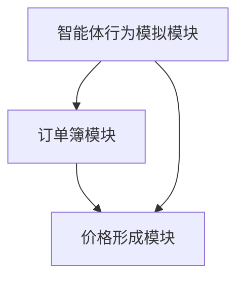
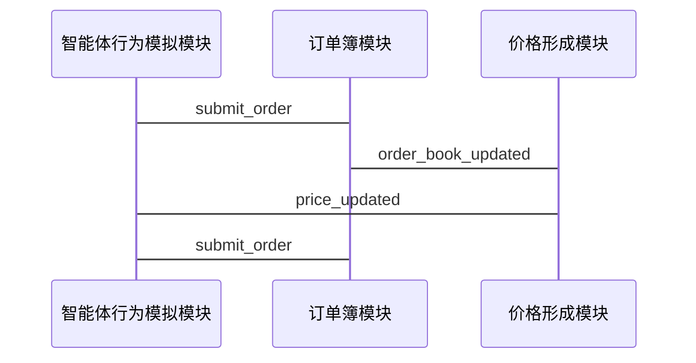

                 


# 多智能体系统模拟市场微观结构

> 关键词：多智能体系统，市场微观结构，订单簿，价格形成机制，智能体行为，博弈论

> 摘要：本文探讨了多智能体系统在模拟市场微观结构中的应用，分析了多智能体系统的核心概念、算法原理、系统架构设计，并通过项目实战展示了如何实现一个简单的市场微观结构模拟系统。文章内容从基础概念到高级算法，再到系统实现，层层深入，为读者提供了全面的理论与实践指导。

---

# 第一部分: 多智能体系统与市场微观结构概述

# 第1章: 多智能体系统与市场微观结构概述

## 1.1 多智能体系统的基本概念

### 1.1.1 多智能体系统的定义与特点

多智能体系统（Multi-Agent System, MAS）是由多个智能体（Agent）组成的系统，这些智能体能够通过环境感知和自主决策进行交互。多智能体系统具有以下特点：

1. **分布式性**：智能体是分布在网络中的独立实体，具有局部决策能力。
2. **自治性**：智能体能够自主决策，无需中央控制。
3. **协作性**：智能体之间可以通过协作完成共同目标。
4. **反应性**：智能体能够根据环境反馈动态调整行为。

### 1.1.2 多智能体系统的分类与应用场景

多智能体系统可以按照不同的标准进行分类：

1. **按智能体的智能水平**：
   - 基于规则的智能体
   - 基于模型的智能体
   - 基于机器学习的智能体

2. **按智能体之间的关系**：
   - 竞争性智能体
   - 合作性智能体

应用场景包括金融市场、交通管理、分布式计算等。

### 1.1.3 市场微观结构的基本概念

市场微观结构是指市场中的参与者、信息流动、价格形成和订单处理等基本要素的组织方式。主要包含以下要素：

1. **市场参与者**：包括买方、卖方、做市商等。
2. **订单簿**：记录市场参与者提交的订单信息。
3. **价格形成机制**：决定市场价格的形成过程。
4. **交易机制**：订单匹配和成交的具体规则。

## 1.2 多智能体系统与市场微观结构的关系

### 1.2.1 多智能体系统在金融市场中的作用

多智能体系统可以模拟金融市场中的参与者行为，分析市场动态，帮助理解市场价格波动的原因。

### 1.2.2 市场微观结构的核心要素

市场微观结构的核心要素包括：

1. **订单簿**：记录买方和卖方的订单信息。
2. **价格形成机制**：决定市场价格的形成过程。
3. **交易机制**：订单匹配和成交的具体规则。

### 1.2.3 多智能体系统模拟市场微观结构的意义

多智能体系统能够通过模拟市场参与者的智能体行为，揭示市场微观结构中的复杂动态，为市场预测和策略制定提供理论支持。

## 1.3 本章小结

本章介绍了多智能体系统的基本概念和市场微观结构的核心要素，阐述了多智能体系统在模拟市场微观结构中的作用和意义。

---

# 第二部分: 多智能体系统的核心概念与联系

# 第2章: 多智能体系统的核心概念

## 2.1 多智能体系统的组成与属性

### 2.1.1 智能体的定义与属性

智能体是一种能够感知环境、自主决策并采取行动的实体。智能体具有以下属性：

1. **感知能力**：通过传感器或信息源获取环境信息。
2. **决策能力**：基于感知信息做出决策。
3. **行动能力**：根据决策采取具体行动。

### 2.1.2 多智能体系统中的智能体分类

根据智能体的智能水平和行为模式，可以将智能体分为：

1. **基于规则的智能体**：根据预定义规则进行行为决策。
2. **基于模型的智能体**：基于环境模型进行决策。
3. **基于机器学习的智能体**：通过机器学习算法进行行为预测和决策。

### 2.1.3 智能体之间的关系与交互

智能体之间的关系可以是竞争性或合作性的。智能体之间的交互通过消息传递或共享状态进行。

## 2.2 市场微观结构的核心要素

### 2.2.1 市场参与者的角色与行为

市场参与者包括买方、卖方和做市商等。每个参与者都有不同的行为模式和决策规则。

### 2.2.2 市场信息的传递与处理

市场信息包括订单信息、价格信息和市场深度等。智能体通过处理这些信息做出决策。

### 2.2.3 市场动态的形成机制

市场动态由参与者的行为、订单簿的变化和价格波动共同决定。

## 2.3 多智能体系统与市场微观结构的联系

### 2.3.1 多智能体系统模拟市场微观结构的原理

通过模拟市场参与者的智能体行为，多智能体系统可以再现市场的微观动态。

### 2.3.2 多智能体系统与市场微观结构的交互机制

智能体通过感知市场信息并做出决策，影响市场动态。市场动态反过来又会影响智能体的决策。

### 2.3.3 多智能体系统模拟市场微观结构的优势

多智能体系统能够模拟复杂的市场环境，分析不同参与者行为对市场的影响。

## 2.4 本章小结

本章分析了多智能体系统的组成与属性，以及市场微观结构的核心要素，阐述了多智能体系统与市场微观结构的联系。

---

# 第三部分: 多智能体系统模拟市场微观结构的算法原理

# 第3章: 多智能体系统模拟算法概述

## 3.1 多智能体系统模拟的基本算法

### 3.1.1 基于规则的智能体行为模拟

基于规则的智能体行为模拟是一种简单但有效的算法，适用于规则明确的场景。

### 3.1.2 基于博弈论的智能体决策模拟

基于博弈论的智能体决策模拟通过分析参与者的策略选择，预测市场行为。

### 3.1.3 基于机器学习的智能体行为预测

基于机器学习的智能体行为预测能够通过历史数据学习市场规律，预测未来市场行为。

## 3.2 市场微观结构模拟的核心算法

### 3.2.1 市场订单簿模拟算法

订单簿模拟算法通过维护买方和卖方的订单列表，模拟订单的成交过程。

### 3.2.2 市场价格形成机制模拟算法

价格形成机制模拟算法通过分析订单流和市场深度，计算市场价格。

### 3.2.3 市场参与者行为模拟算法

参与者行为模拟算法通过模拟买方和卖方的订单提交和撤销行为，模拟市场动态。

## 3.3 算法实现的数学模型与公式

### 3.3.1 市场订单簿模拟的数学模型

$$ Q(t) = \sum_{i=1}^{n} o_i(t) $$

其中，$Q(t)$ 表示时间 $t$ 的订单总量，$o_i(t)$ 表示第 $i$ 个订单在时间 $t$ 的数量。

### 3.3.2 市场价格形成机制模拟的数学公式

$$ P(t) = \frac{\sum_{i=1}^{m} p_i(t)}{m} $$

其中，$P(t)$ 表示时间 $t$ 的价格，$p_i(t)$ 表示第 $i$ 个价格在时间 $t$ 的值，$m$ 是价格的数量。

### 3.3.3 智能体行为预测的数学模型

$$ B(t) = f(P(t-1), Q(t-1)) $$

其中，$B(t)$ 表示时间 $t$ 的智能体行为，$P(t-1)$ 和 $Q(t-1)$ 分别表示时间 $t-1$ 的价格和订单总量。

## 3.4 本章小结

本章介绍了多智能体系统模拟市场微观结构的核心算法，并通过数学公式描述了算法的实现过程。

---

# 第四部分: 多智能体系统模拟市场微观结构的系统架构

# 第4章: 系统架构设计

## 4.1 系统功能设计

### 4.1.1 系统功能模块划分

系统功能模块包括：

1. **订单簿模块**：维护买方和卖方的订单列表。
2. **价格形成模块**：计算市场价格。
3. **智能体行为模拟模块**：模拟市场参与者的订单提交和撤销行为。

### 4.1.2 每个模块的功能描述

- **订单簿模块**：记录和管理订单信息，处理订单成交。
- **价格形成模块**：根据订单流计算市场价格。
- **智能体行为模拟模块**：模拟市场参与者的订单提交和撤销行为。

### 4.1.3 系统功能流程

1. 初始化系统参数，包括市场参与者数量、初始订单等。
2. 智能体行为模拟模块根据当前市场信息生成订单。
3. 订单簿模块处理新订单和撤销订单。
4. 价格形成模块根据订单簿的状态计算市场价格。
5. 反馈市场价格信息给智能体行为模拟模块，用于下一步决策。

## 4.2 系统架构设计

### 4.2.1 系统架构图



### 4.2.2 系统接口设计

- **订单簿模块接口**：
  - `submit_order(order)`：提交订单。
  - `cancel_order(order_id)`：撤销订单。
  - `get_order_book()`：获取订单簿信息。
- **价格形成模块接口**：
  - `calculate_price(order_book)`：根据订单簿计算价格。
- **智能体行为模拟模块接口**：
  - `generate_behavior(price)`：根据价格生成行为。

### 4.2.3 系统交互流程图



## 4.3 本章小结

本章通过系统功能设计和架构设计，展示了如何构建一个多智能体系统模拟市场微观结构的系统。

---

# 第五部分: 多智能体系统模拟市场微观结构的项目实战

# 第5章: 项目实战

## 5.1 项目介绍

本项目旨在模拟一个简单的股票市场微观结构，包括订单簿和价格形成机制。

## 5.2 系统核心实现

### 5.2.1 环境安装

需要安装Python 3.8及以上版本，以及以下库：

- `mermaid`：用于生成图表。
- `pandas`：用于数据处理。
- `numpy`：用于数值计算。

### 5.2.2 核心代码实现

#### 1. 订单簿模块

```python
class OrderBook:
    def __init__(self):
        self.buy_orders = {}
        self.sell_orders = {}

    def submit_order(self, order_type, price, quantity):
        if order_type == 'buy':
            self.buy_orders[price] = self.buy_orders.get(price, 0) + quantity
        elif order_type == 'sell':
            self.sell_orders[price] = self.sell_orders.get(price, 0) + quantity

    def cancel_order(self, order_type, price, quantity):
        if order_type == 'buy':
            if price in self.buy_orders:
                self.buy_orders[price] -= quantity
                if self.buy_orders[price] == 0:
                    del self.buy_orders[price]
        elif order_type == 'sell':
            if price in self.sell_orders:
                self.sell_orders[price] -= quantity
                if self.sell_orders[price] == 0:
                    del self.sell_orders[price]

    def get_order_book(self):
        return {
            'buy': self.buy_orders,
            'sell': self.sell_orders
        }
```

#### 2. 价格形成模块

```python
class PriceCalculator:
    def calculate_price(self, order_book):
        buy_prices = sorted(order_book['buy'].keys(), reverse=True)
        sell_prices = sorted(order_book['sell'].keys())
        if not buy_prices or not sell_prices:
            return None
        highest_buy = buy_prices[0]
        lowest_sell = sell_prices[0]
        if highest_buy >= lowest_sell:
            return (highest_buy + lowest_sell) / 2
        else:
            return None
```

#### 3. 智能体行为模拟模块

```python
class AgentBehavior:
    def generate_behavior(self, current_price):
        behavior = []
        for _ in range(10):
            if current_price < 100:
                behavior.append(('buy', 100, 1))
            elif current_price > 110:
                behavior.append(('sell', 105, 1))
            else:
                behavior.append(('hold', 0, 0))
        return behavior
```

### 5.2.3 代码应用解读与分析

- **订单簿模块**：维护买方和卖方的订单，支持订单提交和撤销。
- **价格形成模块**：根据订单簿计算市场价格。
- **智能体行为模拟模块**：根据当前价格生成订单提交行为。

### 5.2.4 实际案例分析

假设初始价格为100，系统运行步骤如下：

1. 智能体行为模拟模块生成10个买方订单，价格为100，数量为1。
2. 订单簿模块处理订单提交，买方订单簿中有10个订单。
3. 价格形成模块计算价格，由于没有卖方订单，价格保持100。
4. 智能体行为模拟模块再次生成行为，由于价格为100，继续提交买方订单。
5. 价格形成模块计算价格，买方订单增加到20个，价格上升到105。

### 5.2.5 项目小结

本项目通过简单的订单簿和价格形成模块，展示了多智能体系统模拟市场微观结构的基本实现方法。

## 5.3 本章小结

本章通过一个简单的项目实战，展示了如何实现一个多智能体系统模拟市场微观结构的系统。

---

# 第六部分: 总结与展望

# 第6章: 总结与展望

## 6.1 本章总结

本文详细介绍了多智能体系统模拟市场微观结构的核心概念、算法原理和系统实现。通过项目实战，展示了如何通过多智能体系统模拟市场微观结构。

## 6.2 未来展望

未来的研究方向可以包括：

1. 增加更多的市场参与者类型，如机构投资者和高频交易者。
2. 引入更复杂的市场微观结构模型，如多层次市场结构。
3. 结合机器学习算法，提高智能体的行为预测能力。

## 6.3 最佳实践 tips

- 在实际应用中，建议结合具体场景选择合适的算法和模型。
- 系统实现时，需要注意系统的性能优化和扩展性设计。

## 6.4 本章小结

本文总结了多智能体系统模拟市场微观结构的主要内容，并展望了未来的研究方向。

---

# 作者：AI天才研究院/AI Genius Institute & 禅与计算机程序设计艺术 /Zen And The Art of Computer Programming

---

通过以上内容，希望对您有所帮助！如果需要更详细的解释或具体的代码实现，请随时告知。

