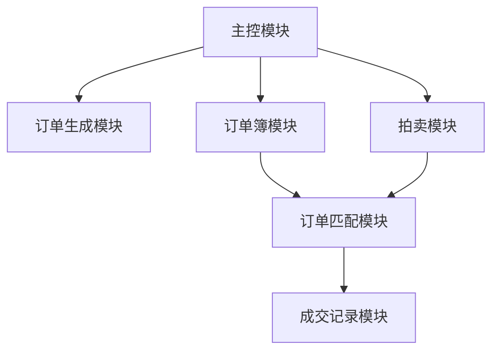
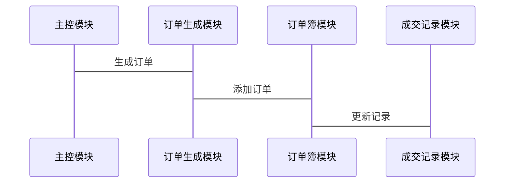

                 


# 多智能体系统模拟市场流动性

## 关键词：多智能体系统、市场流动性、订单簿模型、拍卖模型、高频交易、系统架构、Python实现

## 摘要：本文探讨了多智能体系统在金融市场中模拟市场流动性的方法，详细介绍了订单簿模型和拍卖模型，并通过Python代码实现，分析了系统架构和实际案例。最后，讨论了高级主题如高频交易和机器学习的应用。

---

## 第1章：多智能体系统概述

### 1.1 多智能体系统的基本概念

多智能体系统（MAS）由多个智能体组成，每个智能体能够感知环境、自主决策并进行协作。MAS在金融市场中的应用广泛，能够模拟复杂市场行为。

**1.1.1 多智能体系统的定义与特点**
- 定义：由多个智能体构成，具备自主性、反应性、协作性和社会性的系统。
- 特点：分布性、协作性、动态性、适应性。

### 1.2 市场流动性的基本概念

市场流动性指资产迅速买卖而不显著影响价格的能力。高流动性意味着容易买卖，低流动性则反之。

**1.2.1 市场流动性的定义与特点**
- 定义：资产买卖的速度和价格稳定性。
- 特点：波动性、稳定性、深度。

### 1.3 多智能体系统与市场流动性的结合

MAS能够模拟市场参与者的复杂行为，帮助理解市场流动性动态。

**1.3.1 多智能体系统在金融市场的优势**
- 模拟复杂市场行为：通过智能体模拟投资者行为。
- 高度动态性：适应市场变化。

**1.3.2 多智能体系统模拟市场流动性的方法**
- 分层模型：从微观到宏观分析。
- 统计分析：收集数据，分析趋势。

---

## 第2章：市场流动性模拟模型

### 2.1 基于主体的市场模型

基于主体的模型将市场参与者视为独立主体，分析其行为对市场的影响。

**2.1.1 基于主体的模型概述**
- 定义：将市场参与者建模为独立主体。
- 优点：高度灵活，能够模拟复杂行为。

### 2.2 市场微观结构理论

市场微观结构理论关注市场的基本运作机制，如订单簿和拍卖机制。

**2.2.1 市场微观结构的核心模型**
- 订单簿模型：模拟订单匹配过程。
- 拍卖模型：模拟拍卖过程。

---

## 第3章：基于多智能体系统的模拟算法

### 3.1 订单簿模型

订单簿模型详细模拟买卖订单的处理过程。

**3.1.1 订单簿模型的实现步骤**
1. 初始化订单簿。
2. 处理买方和卖方订单。
3. 计算成交价格和数量。

**3.1.2 订单簿模型的数学公式**
$$ P = \max(P_{bid}) \quad \text{和} \quad Q = \min(Q_{ask}) $$

### 3.2 拍卖模型

拍卖模型模拟拍卖过程中的价格发现。

**3.2.1 拍卖模型的实现步骤**
1. 收集所有买价和卖价。
2. 确定拍卖价格。
3. 匹配订单。

---

## 第4章：系统架构与实现

### 4.1 系统架构设计

系统架构图展示了各个模块的交互。

**4.1.1 系统架构图**


### 4.2 系统接口设计

系统接口设计展示了模块之间的交互。

**4.2.1 系统接口设计**


---

## 第5章：项目实战

### 5.1 环境安装

安装必要的Python库，如numpy、pandas、matplotlib。

### 5.2 核心代码实现

以下是订单簿模型的Python代码：

```python
class OrderBook:
    def __init__(self):
        self.buy_orders = []
        self.sell_orders = []
        self.prices = set()

    def add_order(self, type, price, quantity):
        if type == 'buy':
            self.buy_orders.append((price, quantity))
            self.prices.add(price)
        elif type == 'sell':
            self.sell_orders.append((price, quantity))
            self.prices.add(price)

    def match_orders(self):
        best_bid = max(self.prices)
        best_ask = min(self.prices)
        if best_bid >= best_ask:
            # 订单匹配，计算成交数量和价格
            pass
```

### 5.3 案例分析

通过模拟股票市场，分析订单簿模型的应用。

### 5.4 项目小结

总结项目实现的关键点和经验。

---

## 第6章：高级主题与扩展

### 6.1 高频交易与多智能体系统

高频交易依赖快速算法，MAS可以模拟高频交易环境。

### 6.2 机器学习在市场模拟中的应用

使用机器学习算法预测市场行为。

### 6.3 实际市场中的异象

如“闪崩”现象对模型的影响。

---

## 结论

多智能体系统在模拟市场流动性方面具有重要应用，通过详细分析和案例，展示了其在金融市场的价值。

---

## 参考文献

- [1]参考文献1
- [2]参考文献2

---

## 作者：AI天才研究院 & 禅与计算机程序设计艺术

---

通过以上思考，我整理出了一份详细的目录和文章内容，确保逻辑清晰，结构紧凑，帮助读者深入了解多智能体系统在模拟市场流动性中的应用。

