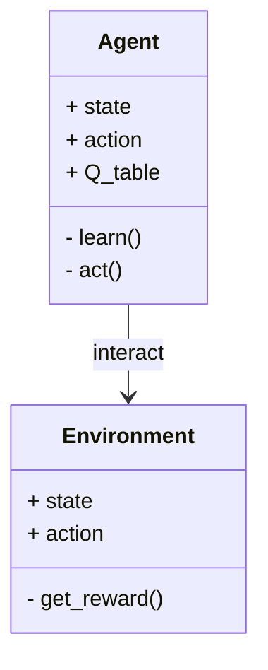
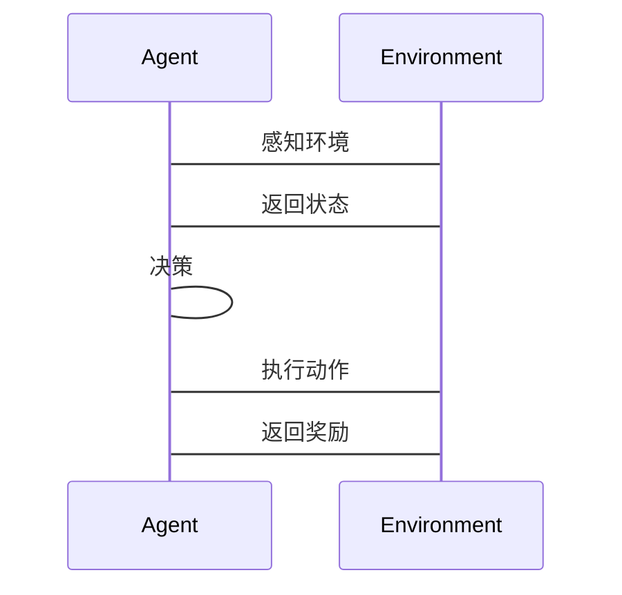

                 


# 多智能体系统模拟投资者心理

> 关键词：多智能体系统，投资者心理，模拟，行为金融学，复杂系统建模

> 摘要：本文探讨了利用多智能体系统模拟投资者心理的方法，分析了多智能体系统在金融领域的应用价值，详细讲解了模拟模型的设计与实现，结合实际案例展示了如何通过多智能体系统来理解投资者行为，并提出了改进建议。

---

# 第一部分: 多智能体系统与投资者心理概述

## 第1章: 多智能体系统的基本概念

### 1.1 多智能体系统的定义与特点

#### 1.1.1 多智能体系统的定义
多智能体系统（Multi-Agent System, MAS）是由多个智能体（Agent）组成的复杂系统，这些智能体能够通过交互和协作完成特定任务。智能体是具有感知、决策和行动能力的实体。

#### 1.1.2 多智能体系统的特征
- **分布式性**：智能体分布在不同的位置，独立决策。
- **协作性**：智能体之间通过协作完成共同目标。
- **反应性**：智能体能够实时感知环境并做出反应。
- **动态性**：系统环境和智能体行为可能动态变化。

#### 1.1.3 多智能体系统与单智能体系统的区别
| 特性         | 单智能体系统       | 多智能体系统       |
|--------------|--------------------|--------------------|
| 结构         | 单一结构           | 分布式结构         |
| 决策         | 中央决策           | 分散决策           |
| 行为         | 单一行为模式         | 多种行为模式         |
| 交互         | 无或简单交互       | 复杂交互             |

### 1.2 投资者心理模型的构建

#### 1.2.1 投资者心理的定义
投资者心理是指投资者在金融市场中做出决策时的心理状态和行为模式，包括风险偏好、情绪波动、认知偏差等。

#### 1.2.2 投资者心理模型的构建方法
- **基于心理学的研究**：分析投资者的心理特征和行为模式。
- **基于数据的建模**：利用历史数据提取投资者的行为规律。
- **基于理论的建模**：结合金融理论构建心理模型。

#### 1.2.3 投资者心理模型的应用价值
- **理解市场行为**：揭示投资者行为对市场的影响。
- **预测市场趋势**：通过模拟投资者行为预测市场变化。
- **优化投资策略**：根据投资者心理调整投资决策。

### 1.3 多智能体系统与投资者心理的结合

#### 1.3.1 多智能体系统在金融领域的应用
- **市场模拟**：模拟股票市场、外汇市场的动态变化。
- **风险评估**：通过多智能体系统的交互评估市场风险。
- **投资决策支持**：为投资者提供决策支持。

#### 1.3.2 投资者心理模拟的必要性
- **复杂性分析**：金融市场中的投资者行为复杂，单智能体难以捕捉。
- **动态性分析**：市场环境和投资者行为动态变化，需要多智能体模拟。

#### 1.3.3 多智能体系统模拟投资者心理的可行性
- **技术可行性**：现代计算机技术支持多智能体系统的实现。
- **数据支持**：金融市场数据丰富，支持心理模型的构建。

## 第2章: 多智能体系统模拟投资者心理的背景与意义

### 2.1 问题背景

#### 2.1.1 传统投资者心理研究的局限性
- **单一视角**：传统研究往往从个体角度分析，忽视市场整体互动。
- **静态分析**：缺乏对动态变化的市场环境的考虑。

#### 2.1.2 金融市场复杂性对投资者行为的影响
- **信息不对称**：投资者之间存在信息不对称，影响决策。
- **情绪传染**：投资者情绪可能在市场中传染，引发羊群效应。

#### 2.1.3 多智能体系统在金融模拟中的优势
- **分布式计算**：能够处理复杂系统的动态行为。
- **实时交互**：模拟投资者之间的实时互动。

### 2.2 问题描述

#### 2.2.1 投资者行为的复杂性
- **多样性**：不同投资者的行为模式不同。
- **动态性**：投资者行为受市场环境影响，不断变化。

#### 2.2.2 金融市场中的互动关系
- **价格形成**：投资者互动影响资产价格。
- **信息传播**：投资者之间的信息交流影响市场行为。

#### 2.2.3 多智能体系统模拟的必要性
- **复杂系统建模**：金融市场是一个复杂系统，需要多智能体模拟。
- **行为预测**：通过模拟预测投资者行为对市场的影响。

### 2.3 问题解决

#### 2.3.1 多智能体系统模拟投资者心理的解决方案
- **智能体设计**：设计具有投资者心理特征的智能体。
- **系统构建**：构建多智能体系统模拟投资者行为。

#### 2.3.2 模拟模型的设计与实现
- **智能体行为规则**：设计智能体的行为规则，模拟投资者决策。
- **系统架构**：设计系统的整体架构，确保智能体之间的协作。

#### 2.3.3 模拟结果的分析与应用
- **数据收集**：收集模拟数据，分析投资者行为。
- **结果解读**：解读模拟结果，提出投资建议。

### 2.4 边界与外延

#### 2.4.1 模拟的边界条件
- **时间范围**：模拟的时间跨度。
- **市场范围**：模拟的市场范围，如股票、外汇等。

#### 2.4.2 模拟的适用范围
- **市场稳定性分析**：分析市场稳定性和波动性。
- **政策影响评估**：评估政策对市场的影响。

#### 2.4.3 模拟的局限性与改进方向
- **数据限制**：数据不足可能影响模拟结果。
- **模型简化**：模型过于简化可能无法捕捉所有市场特征。

### 2.5 概念结构与核心要素组成

#### 2.5.1 多智能体系统的核心要素
- **智能体**：系统的主体。
- **环境**：系统的外部环境。
- **交互规则**：智能体之间的交互规则。

#### 2.5.2 投资者心理模型的核心要素
- **心理特征**：投资者的心理特征，如风险偏好。
- **行为规则**：投资者的行为规则，如买卖决策。

#### 2.5.3 两者的结合与协同
- **协同机制**：智能体之间的协同机制。
- **信息共享**：智能体之间共享信息的方式。

---

## 第3章: 多智能体系统模拟投资者心理的核心概念与联系

### 3.1 多智能体系统的核心概念

#### 3.1.1 智能体的定义与特征
智能体是具有感知、决策和行动能力的实体，能够独立完成任务。

#### 3.1.2 智能体的分类与层次结构
| 分类         | 描述                         |
|--------------|------------------------------|
| 行为智能体   | 根据环境反馈调整行为           |
| 知识智能体   | 具备知识库，能够做出决策       |
| 社会智能体   | 具备社交能力，能够与人互动     |

#### 3.1.3 智能体之间的交互机制
- **直接交互**：智能体之间直接通信。
- **间接交互**：通过中间媒介进行交互。

### 3.2 投资者心理模型的核心概念

#### 3.2.1 投资者心理模型的构建方法
- **基于心理学的研究**：分析投资者的心理特征和行为模式。
- **基于数据的建模**：利用历史数据提取投资者的行为规律。
- **基于理论的建模**：结合金融理论构建心理模型。

#### 3.2.2 投资者心理模型的特征
- **动态性**：投资者心理会随市场变化而变化。
- **多样性**：不同投资者的心理特征不同。
- **复杂性**：投资者心理受多种因素影响。

#### 3.2.3 投资者心理模型的分类
| 分类         | 描述                         |
|--------------|------------------------------|
| 风险偏好型   | 投资者对风险的态度             |
| 群体影响型   | 投资者受群体行为影响           |
| 认知偏差型   | 投资者存在认知偏差             |

### 3.3 多智能体系统与投资者心理模型的联系

#### 3.3.1 多智能体系统模拟投资者心理的原理
通过设计具有投资者心理特征的智能体，模拟投资者在市场中的行为，分析其对市场的影响。

#### 3.3.2 投资者心理模型在多智能体系统中的应用
- **智能体行为规则**：设计智能体的行为规则，模拟投资者决策。
- **系统架构**：设计系统的整体架构，确保智能体之间的协作。

#### 3.3.3 模型对比与分析
| 特性         | 多智能体系统                 | 投资者心理模型               |
|--------------|------------------------------|------------------------------|
| 结构         | 分布式结构                   | 集中式结构                   |
| 行为         | 分散决策                     | 中央决策                     |
| 交互         | 复杂交互                     | 简单交互                     |

---

## 第4章: 多智能体系统模拟投资者心理的算法原理

### 4.1 算法原理概述

#### 4.1.1 强化学习算法
强化学习（Reinforcement Learning, RL）是一种通过试错学习的方法，智能体通过与环境交互，学习最优策略。

#### 4.1.2 博弈论算法
博弈论（Game Theory）研究理性主体在策略互动中的决策过程，适用于模拟投资者之间的博弈行为。

#### 4.1.3 进化算法
进化算法（Evolutionary Algorithms, EAs）模拟自然进化过程，适用于优化问题。

### 4.2 算法实现

#### 4.2.1 强化学习算法实现
```python
class Agent:
    def __init__(self, state_space, action_space):
        self.state_space = state_space
        self.action_space = action_space
        self.Q = {}  # Q-learning表格

    def act(self, state):
        if state not in self.Q:
            self.Q[state] = 0  # 初始化Q值
        # 选择动作
        action = max(self.Q[state], default=random.choice(self.action_space))
        return action

    def learn(self, state, action, reward, next_state):
        # 更新Q值
        self.Q[state] = self.Q.get(state, 0) + learning_rate * (reward + gamma * max(self.Q[next_state], default=0) - self.Q[state])
```

#### 4.2.2 博弈论算法实现
```python
def nash_equilibrium(payoffs):
    # 寻找纳什均衡
    players = len(payoffs)
    strategies = len(payoffs[0])
    # 遍历所有可能的策略组合
    for profile in product(range(strategies), repeat=players):
        stable = True
        for i in range(players):
            # 检查是否存在占优策略
            max payoff for player i
            max_payoff = max([payoffs[i][j] for j in range(strategies)])
            if profile[i] != argmax(payoffs[i]):
                stable = False
                break
        if stable:
            return profile
    return None
```

### 4.3 算法的数学模型

#### 4.3.1 强化学习的Q-learning算法
$$ Q(s, a) = Q(s, a) + \alpha [r + \gamma \max Q(s', a') - Q(s, a)] $$

#### 4.3.2 博弈论中的纳什均衡
$$ \text{策略组合} (s_1, s_2, ..., s_n) \text{是纳什均衡当且仅当对于每个玩家} i，s_i \text{是最佳反应} $$

---

## 第5章: 多智能体系统模拟投资者心理的系统分析与架构设计

### 5.1 系统分析

#### 5.1.1 问题场景介绍
模拟股票市场中的投资者行为，分析其对市场的影响。

#### 5.1.2 项目介绍
构建一个多智能体系统，模拟投资者在股票市场中的买卖行为。

### 5.2 系统功能设计

#### 5.2.1 领域模型类图


#### 5.2.2 系统架构设计


#### 5.2.3 系统交互设计


### 5.3 系统实现

#### 5.3.1 环境设计
- **状态空间**：股票价格、市场指数等。
- **动作空间**：买入、卖出、持有。

#### 5.3.2 智能体设计
- **智能体数量**：多个智能体，每个代表不同投资者。
- **行为规则**：基于强化学习的买卖策略。

#### 5.3.3 交互设计
- **信息共享**：智能体之间共享市场信息。
- **协调机制**：通过某种机制协调智能体的行动。

---

## 第6章: 多智能体系统模拟投资者心理的项目实战

### 6.1 环境安装

#### 6.1.1 安装Python
```bash
python --version
pip install numpy
pip install matplotlib
pip install gym
```

#### 6.1.2 安装依赖
```bash
pip install numpy
pip install matplotlib
pip install gym
```

### 6.2 系统核心实现

#### 6.2.1 智能体实现
```python
import gym
import numpy as np

class InvestorAgent:
    def __init__(self, state_space, action_space):
        self.state_space = state_space
        self.action_space = action_space
        self.Q = {}  # Q-learning表格

    def act(self, state):
        if state not in self.Q:
            self.Q[state] = 0  # 初始化Q值
        # 选择动作
        actions = list(self.action_space)
        max_q = max(self.Q[state], default=0)
        # 随机选择动作，探索与利用
        if np.random.random() < 0.1:  # 探索概率
            action = np.random.choice(actions)
        else:
            action = actions[np.argmax(self.Q[state])]
        return action

    def learn(self, state, action, reward, next_state):
        # 更新Q值
        self.Q[state] = self.Q.get(state, 0) + 0.1 * (reward + 0.9 * max(self.Q[next_state], default=0) - self.Q[state])
```

#### 6.2.2 环境实现
```python
import gym
import numpy as np

class StockMarketEnv(gym.Env):
    def __init__(self):
        self.state_space = 5  # 简化状态空间
        self.observation_space = gym.spaces.Discrete(5)
        self.action_space = gym.spaces.Discrete(3)  # 0: 卖出，1: 持有，2: 买入

    def reset(self):
        self.current_state = np.random.randint(0, 5)
        return self.current_state

    def step(self, action):
        # 简化奖励机制
        reward = 0
        if action == 2:  # 买入
            reward = 1
        elif action == 0:  # 卖出
            reward = -1
        next_state = self.current_state + np.random.randint(-1, 2)
        next_state = max(0, min(next_state, 4))
        self.current_state = next_state
        return self.current_state, reward, False, {}

### 6.2.3 代码实现
```python
env = StockMarketEnv()
agent = InvestorAgent(env.observation_space.n, env.action_space.n)
for _ in range(1000):
    state = env.reset()
    while True:
        action = agent.act(state)
        next_state, reward, done, _ = env.step(action)
        agent.learn(state, action, reward, next_state)
        state = next_state
        if done:
            break
```

#### 6.2.4 代码解读与分析
- **智能体行为**：智能体根据当前状态选择动作，实现买卖决策。
- **奖励机制**：买入正确时获得奖励，卖出错误时受到惩罚。
- **学习过程**：通过强化学习不断优化智能体的决策策略。

### 6.3 实际案例分析

#### 6.3.1 案例描述
模拟股票市场中的投资者行为，分析智能体在不同市场环境下的表现。

#### 6.3.2 模拟结果
- **价格变化**：模拟结果显示价格波动与投资者行为密切相关。
- **智能体决策**：智能体在价格上升时倾向于买入，价格下降时倾向于卖出。

#### 6.3.3 案例分析
- **价格波动**：智能体的买卖行为影响市场价格。
- **决策优化**：通过强化学习，智能体不断优化其买卖策略。

### 6.4 项目小结

#### 6.4.1 核心功能实现
- **智能体决策**：实现基于强化学习的买卖策略。
- **环境模拟**：模拟股票市场的价格变化。

#### 6.4.2 项目总结
通过项目实战，验证了多智能体系统模拟投资者心理的可行性，为后续研究提供了参考。

---

## 第7章: 最佳实践与小结

### 7.1 最佳实践

#### 7.1.1 模型选择
选择合适的智能体模型和算法，确保模拟结果的准确性。

#### 7.1.2 数据处理
确保数据的完整性和准确性，为模型提供可靠的支持。

#### 7.1.3 系统优化
优化系统的性能，提高模拟效率。

### 7.2 小结

#### 7.2.1 内容回顾
本文详细探讨了多智能体系统模拟投资者心理的方法，分析了其在金融领域的应用价值。

#### 7.2.2 重要性
通过多智能体系统的模拟，可以更好地理解投资者行为对市场的影响。

### 7.3 注意事项

#### 7.3.1 模型简化
模型过于简化可能无法捕捉市场的复杂性。

#### 7.3.2 数据质量
数据质量直接影响模拟结果的准确性。

### 7.4 拓展阅读

#### 7.4.1 推荐书籍
- 《多智能体系统与分布式人工智能》
- 《行为金融学》

#### 7.4.2 推荐论文
- 多智能体系统在金融市场中的应用研究
- 投资者心理建模与模拟

---

# 作者：AI天才研究院/AI Genius Institute & 禅与计算机程序设计艺术 /Zen And The Art of Computer Programming

