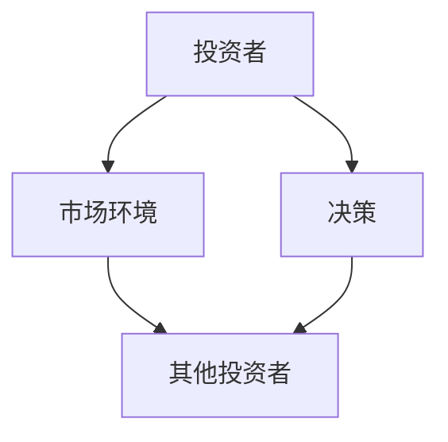
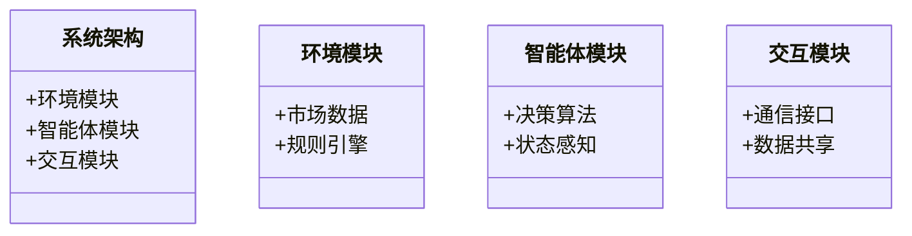
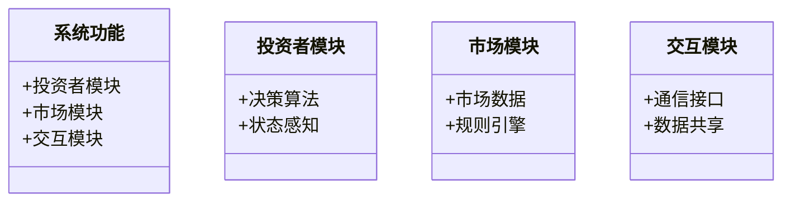
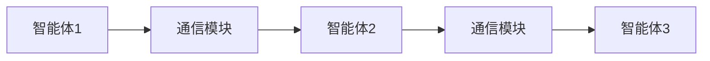
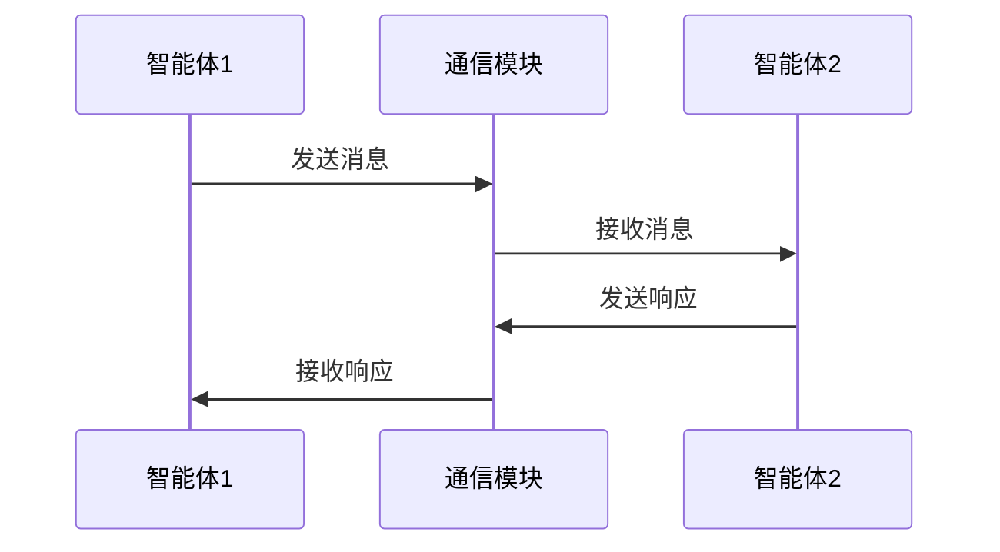

                 


# 多智能体系统模拟投资者行为

> **关键词**: 多智能体系统, 投资者行为模拟, 强化学习, 金融市场, 分布式系统

> **摘要**: 本文探讨了多智能体系统在模拟投资者行为中的应用，分析了其核心概念、算法原理、系统架构，并通过实际案例展示了如何构建和优化投资者行为模拟系统。文章还总结了最佳实践和未来研究方向，为理解和应用多智能体系统提供了全面的指导。

---

# 第一部分: 多智能体系统与投资者行为模拟基础

## 第1章: 多智能体系统概述

### 1.1 多智能体系统的定义与特点

多智能体系统（Multi-Agent System, MAS）是由多个智能体（Agent）组成的系统，这些智能体能够自主决策、协作或竞争以完成特定任务。与单智能体系统相比，MAS具有以下特点：

- **自主性**: 每个智能体都能独立决策。
- **反应性**: 能够感知环境并实时响应。
- **协作性**: 智能体之间可以协作完成任务。
- **分布性**: 智能体分布于不同位置，通过通信协作。

### 1.2 投资者行为模拟的背景与意义

投资者行为模拟研究投资者在金融市场中的决策过程，旨在理解其行为模式。然而，金融市场复杂，投资者决策受多种因素影响，如情绪、信息等。多智能体系统能模拟多个投资者的行为，提供更真实的市场模拟。

---

## 第2章: 多智能体系统的核心概念

### 2.1 多智能体系统的组成与结构

智能体是MAS的核心，具有以下属性：

- **智能体**: 具有感知和行动能力，能与环境和其他智能体交互。

#### 多智能体系统与单智能体系统的对比

| 属性         | 单智能体系统       | 多智能体系统       |
|--------------|--------------------|--------------------|
| 智能体数量   | 单个              | 多个              |
| 交互方式     | 无或有限          | 高度交互          |
| 任务处理     | 独立完成          | 协作完成          |

### 2.2 投资者行为模拟的核心要素

投资者行为模拟涉及以下要素：

- **投资者决策模型**: 描述投资者如何做出决策。
- **市场环境建模**: 模拟金融市场环境。
- **智能体交互**: 模拟投资者之间的互动。

#### 投资者行为与市场环境的关系



---

## 第3章: 多智能体系统与投资者行为模拟的关系

### 3.1 多智能体系统在投资者行为模拟中的作用

多智能体系统能模拟多个投资者的行为，帮助理解市场动态。其优势包括：

- **复杂性处理**: 能处理多智能体之间的复杂互动。
- **实时性**: 能实时模拟市场变化。

### 3.2 投资者行为模拟的数学模型

投资者决策可建模为：

$$ Q(s, a) = r + \gamma \max_{a'} Q(s', a') $$

其中，$Q$ 是价值函数，$s$ 是状态，$a$ 是动作，$r$ 是奖励，$\gamma$ 是折扣因子。

---

## 第4章: 多智能体系统模拟投资者行为的算法原理

### 4.1 多智能体协作算法

协作算法通过智能体间的通信实现协作。基于强化学习的协作算法如下：


### 4.2 多智能体系统中的决策算法

基于Q-learning的决策算法：

1. 智能体感知环境。
2. 选择动作。
3. 与环境交互。
4. 更新Q值。

数学公式：

$$ Q(s, a) = Q(s, a) + \alpha (r + \gamma \max Q(s', a') - Q(s, a)) $$

---

## 第5章: 投资者行为模拟的系统架构设计

### 5.1 系统功能设计

系统功能包括：

- **环境建模**: 模拟金融市场。
- **智能体行为**: 模拟投资者决策。
- **交互设计**: 智能体间通信。

#### 系统功能模块



---

# 第二部分: 系统分析与架构设计方案

## 第6章: 系统分析与架构设计方案

### 6.1 系统功能设计

系统功能包括：

- **投资者建模**: 描述投资者行为。
- **市场模拟**: 模拟市场环境。
- **互动设计**: 模拟投资者互动。

#### 系统功能模块



---

## 第7章: 系统架构设计

### 7.1 系统架构设计

系统架构采用分布式架构，智能体分布在不同节点，通过通信模块交互。

#### 系统架构图



---

## 第8章: 系统接口设计

### 8.1 系统接口设计

系统接口包括：

- **通信接口**: 智能体间通信。
- **数据接口**: 数据共享接口。

---

## 第9章: 系统交互设计

### 9.1 系统交互设计

系统交互通过通信模块实现，智能体间通过消息传递信息。

#### 系统交互图



---

# 第三部分: 项目实战

## 第10章: 项目实战

### 10.1 项目介绍

项目目标是模拟股票市场中的投资者行为。

#### 项目环境搭建

安装Python和相关库：

```bash
pip install numpy matplotlib
```

---

### 10.2 核心实现

实现投资者决策算法：

```python
import numpy as np

class Investor:
    def __init__(self, id):
        self.id = id
        self.state = 0
        self.Q = np.zeros((4, 2))

    def act(self):
        action = np.argmax(self.Q[self.state])
        return action

    def update(self, state, action, reward, next_state):
        self.Q[state][action] = reward + 0.5 * (max(self.Q[next_state]) - self.Q[state][action])
```

---

### 10.3 实际案例分析

模拟股票市场中的投资者行为，分析结果。

#### 案例分析

运行代码，观察投资者决策和市场变化。

---

### 10.4 结果解读

分析结果，优化系统设计。

---

## 第11章: 最佳实践

### 11.1 小结

多智能体系统能有效模拟投资者行为，帮助理解市场动态。

### 11.2 注意事项

- 确保智能体协作算法的有效性。
- 定期更新市场环境模型。

### 11.3 未来研究方向

- 研究更复杂的市场环境。
- 探索更高效的协作算法。

---

# 结语

通过本文的分析，我们了解了多智能体系统在模拟投资者行为中的应用，掌握了其核心概念、算法原理和系统架构设计。未来，随着技术的发展，多智能体系统将在金融领域发挥更大的作用。

---

# 作者

**作者：AI天才研究院/AI Genius Institute & 禅与计算机程序设计艺术 /Zen And The Art of Computer Programming**

