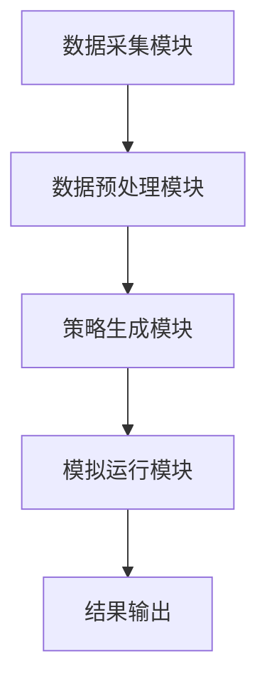
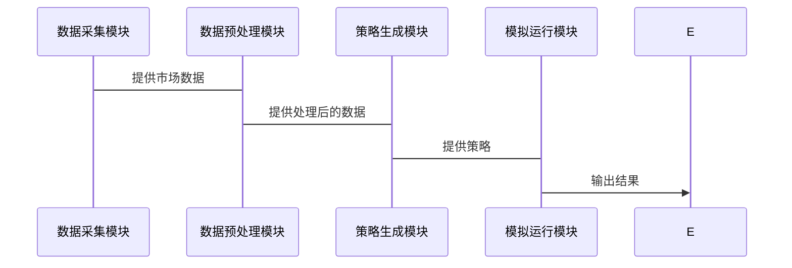
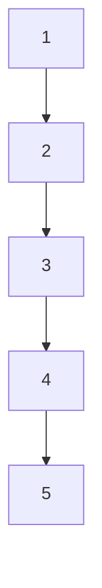

                 


# 多智能体系统模拟机构投资行为

> **关键词**：多智能体系统、机构投资行为、博弈论、算法、系统架构设计  
> **摘要**：本文探讨了如何利用多智能体系统模拟机构投资者在金融市场中的行为。通过分析多智能体系统的核心概念、算法原理和系统架构设计，详细阐述了如何构建一个能够模拟机构投资行为的多智能体系统，并通过实际案例展示了系统的实现与应用。

---

## 第1章: 多智能体系统的概念与特点

### 1.1 多智能体系统的定义

#### 1.1.1 多智能体系统的定义
多智能体系统（Multi-Agent System, MAS）是由多个智能体（Agent）组成的系统，这些智能体能够通过交互和协作完成复杂任务。与单智能体系统相比，多智能体系统具有更高的灵活性和适应性。

#### 1.1.2 多智能体系统与传统单智能体系统的区别
- **单智能体系统**：由单一智能体完成任务，结构简单但适应性差。
- **多智能体系统**：多个智能体协作完成任务，具有更强的并行性和分布式特性。

#### 1.1.3 多智能体系统的应用场景
- 智能交通管理
- 金融市场模拟
- 分布式计算
- 游戏AI

### 1.2 机构投资行为的特点

#### 1.2.1 机构投资者的定义与类型
- **机构投资者**：指以机构形式存在的投资者，如基金公司、保险公司、银行等。
- **类型**：
  - 主动管理型基金
  - 被动管理型基金
  - 对冲基金

#### 1.2.2 机构投资行为的特点与规律
- **理性与非理性**：机构投资者的决策基于理性分析，但也受市场情绪影响。
- **多样性**：不同机构投资者的投资策略和风险偏好不同。
- **动态性**：市场环境变化会导致投资行为的调整。

#### 1.2.3 机构投资行为的复杂性与挑战
- 市场参与者的多样性
- 信息不对称
- 群体行为的影响

### 1.3 多智能体系统模拟机构投资行为的必要性

#### 1.3.1 机构投资行为的复杂性与多智能体系统的匹配
- 多智能体系统能够模拟多个机构投资者的决策过程。
- 每个智能体可以代表一个机构投资者，具有独立的决策能力和策略。

#### 1.3.2 多智能体系统在模拟机构投资行为中的优势
- **分布式计算**：多个智能体可以同时处理大量数据。
- **动态适应**：智能体能够根据市场变化实时调整策略。
- **复杂性管理**：通过分解任务，简化复杂问题。

#### 1.3.3 模拟机构投资行为的实际应用价值
- **金融市场预测**：通过模拟机构投资者的行为，预测市场趋势。
- **投资策略优化**：通过模拟不同策略的效果，优化投资决策。
- **风险管理**：通过模拟极端市场情况，评估投资组合的风险。

---

## 第2章: 多智能体系统的核心概念与联系

### 2.1 多智能体系统的核心概念

#### 2.1.1 智能体的定义与属性
- **智能体**：能够感知环境并采取行动的实体。
- **属性**：
  - 知识表示：智能体的知识表示方式。
  - 行为决策：智能体的决策机制。
  - 通信能力：智能体之间的通信方式。

#### 2.1.2 多智能体系统中的角色与关系
- **角色**：
  - 主体：主动决策的智能体。
  - 客体：被动接受决策影响的环境或智能体。
- **关系**：
  - 合作关系：智能体之间协作完成任务。
  - 竞争关系：智能体之间竞争资源。

#### 2.1.3 多智能体系统的整体架构
- **层次结构**：
  - 顶层：全局决策层。
  - 中层：协作决策层。
  - 底层：执行层。

### 2.2 机构投资行为的核心要素

#### 2.2.1 机构投资者的决策机制
- **信息处理**：机构投资者通过分析市场数据做出决策。
- **策略制定**：基于市场分析制定投资策略。
- **执行决策**：通过交易系统执行投资决策。

#### 2.2.2 机构投资行为的理性与非理性
- **理性行为**：基于理性分析做出决策。
- **非理性行为**：受市场情绪影响的决策。

#### 2.2.3 机构投资行为的动态变化
- **市场波动**：影响机构投资者的决策。
- **政策变化**：影响投资策略。
- **行业趋势**：影响投资方向。

### 2.3 多智能体系统与机构投资行为的关系

#### 2.3.1 多智能体系统模拟机构投资行为的逻辑
- 每个智能体代表一个机构投资者。
- 智能体根据市场信息做出决策。
- 多个智能体的决策影响市场整体趋势。

#### 2.3.2 多智能体系统与机构投资行为的交互
- 智能体与市场环境的交互。
- 智能体之间的交互。

#### 2.3.3 多智能体系统模拟机构投资行为的数学模型
- **数学模型**：
  - $$ P_i(t) = \alpha \cdot S_i(t) + \beta \cdot M_i(t) $$
  - 其中，$P_i(t)$ 表示智能体 $i$ 在时间 $t$ 的决策，$S_i(t)$ 表示智能体 $i$ 的知识，$M_i(t)$ 表示市场信息。

---

## 第3章: 多智能体系统模拟机构投资行为的算法原理

### 3.1 基于博弈论的多智能体算法

#### 3.1.1 博弈论的基本概念与原理
- **博弈论**：研究理性决策者在策略互动中的行为。
- **纳什均衡**：博弈中的一种稳定状态。

#### 3.1.2 基于博弈论的多智能体算法设计
- **步骤**：
  1. 定义博弈空间。
  2. 确定每个智能体的策略。
  3. 计算纳什均衡。

#### 3.1.3 代码实现与分析
```python
def nash_equilibrium(players, strategies):
    # 简单实现纳什均衡判断
    for strategy_profile in product(strategies, repeat=len(players)):
        is_nash = True
        for i in range(len(players)):
            player = players[i]
            current_strategy = strategy_profile[i]
            # 计算其他玩家策略不变时，当前玩家的收益
            payoff = calculate_payoff(player, strategy_profile)
            # 计算当前玩家改策略后的收益
            new_payoff = calculate_payoff(player, *strategy_profile[:i] + (new_strategy,) + strategy_profile[i+1:])
            if new_payoff > payoff:
                is_nash = False
                break
        if is_nash:
            return strategy_profile
    return None
```

#### 3.1.4 实际案例分析
- **案例**：两个机构投资者在股票市场上的博弈。
- **分析**：通过纳什均衡分析，确定双方的最佳策略。

### 3.2 基于强化学习的多智能体算法

#### 3.2.1 强化学习的基本原理
- **强化学习**：智能体通过与环境互动，学习策略以最大化累计奖励。

#### 3.2.2 基于强化学习的多智能体算法设计
- **算法选择**：使用分布式强化学习（如Distributed Reinforcement Learning）。
- **步骤**：
  1. 初始化多个智能体。
  2. 智能体与环境互动，学习策略。
  3. 更新智能体的策略参数。

#### 3.2.3 代码实现与分析
```python
import numpy as np

class Agent:
    def __init__(self, state_space, action_space):
        self.state_space = state_space
        self.action_space = action_space
        self.theta = np.random.randn(2, 1)

    def act(self, state):
        return np.argmax(state.dot(self.theta))

    def update(self, state, action, reward):
        # 简单的梯度更新
        self.theta += 0.1 * (reward * state).reshape(-1, 1)

# 初始化多智能体系统
agents = [Agent(state_space, action_space) for _ in range(5)]
```

#### 3.2.4 实际案例分析
- **案例**：多个智能体在金融市场中学习最优投资策略。
- **分析**：通过强化学习，智能体能够逐步优化投资策略。

### 3.3 基于社会网络的多智能体算法

#### 3.3.1 社会网络的基本概念
- **社会网络**：描述个体之间关系的网络。

#### 3.3.2 基于社会网络的多智能体算法设计
- **算法选择**：使用社会网络分析方法。
- **步骤**：
  1. 建立机构投资者之间的社会网络。
  2. 分析网络结构，确定信息传播路径。

#### 3.3.3 代码实现与分析
```python
import networkx as nx

# 创建社会网络图
G = nx.Graph()
G.add_edges_from([(1, 2), (2, 3), (3, 4), (4, 5)])

# 分析网络结构
print(nx.degree_centrality(G))
```

#### 3.3.4 实际案例分析
- **案例**：分析机构投资者之间的信息传播路径。
- **分析**：通过社会网络分析，确定哪些机构投资者对市场影响最大。

---

## 第4章: 多智能体系统模拟机构投资行为的系统分析与架构设计

### 4.1 系统分析与需求设计

#### 4.1.1 系统背景与目标
- **背景**：金融市场中机构投资者的行为复杂，需要通过多智能体系统进行模拟。
- **目标**：构建一个能够模拟机构投资者行为的多智能体系统。

#### 4.1.2 系统功能需求
- **数据采集**：收集市场数据和机构投资者行为数据。
- **策略生成**：生成机构投资者的策略。
- **模拟运行**：模拟机构投资者行为对市场的影响。

### 4.2 系统架构设计

#### 4.2.1 系统功能模块
- **数据采集模块**：负责数据的采集和预处理。
- **策略生成模块**：根据数据生成机构投资者的策略。
- **模拟运行模块**：模拟机构投资者行为，输出结果。

#### 4.2.2 系统架构图


### 4.3 系统接口设计

#### 4.3.1 系统接口设计
- **输入接口**：市场数据输入。
- **输出接口**：模拟结果输出。

#### 4.3.2 系统交互流程


---

## 第5章: 多智能体系统模拟机构投资行为的项目实战

### 5.1 环境安装与配置

#### 5.1.1 环境要求
- **Python**：3.8+
- **依赖库**：networkx, numpy, matplotlib

#### 5.1.2 安装依赖
```bash
pip install networkx numpy matplotlib
```

### 5.2 系统核心实现

#### 5.2.1 核心代码实现
```python
import numpy as np
import networkx as nx
import matplotlib.pyplot as plt

class Agent:
    def __init__(self, id):
        self.id = id
        self.strategy = 'buy'  # 可能的策略：buy, sell, hold

    def update_strategy(self, market_info):
        # 根据市场信息更新策略
        if market_info['price'] > market_info['moving_average']:
            self.strategy = 'sell'
        elif market_info['price'] < market_info['moving_average']:
            self.strategy = 'buy'
        else:
            self.strategy = 'hold'

def simulate_market(agents, steps=100):
    market_info = {'price': 100, 'moving_average': 95}
    for _ in range(steps):
        for agent in agents:
            agent.update_strategy(market_info)
        # 更新市场信息
        market_info['price'] = np.mean([agent.strategy == 'buy' for agent in agents]) * 10 + \
                                 np.mean([agent.strategy == 'sell' for agent in agents]) * (-10) + \
                                 market_info['price']
        market_info['moving_average'] = (market_info['price'] + market_info['moving_average']) / 2
    return market_info['price']

# 初始化多个智能体
agents = [Agent(i) for i in range(5)]
# 模拟市场
final_price = simulate_market(agents)
print(f"最终价格：{final_price}")
```

#### 5.2.2 代码解读与分析
- **代码解读**：
  - 每个智能体根据市场信息更新策略。
  - 市场价格根据智能体的策略进行调整。
- **运行结果**：输出最终的市场价格。

#### 5.2.3 实际案例分析
- **案例**：五个机构投资者在股票市场上的行为模拟。
- **分析**：通过代码模拟，观察机构投资者行为对市场价格的影响。

### 5.3 项目小结

#### 5.3.1 项目实现的关键点
- 多智能体系统的构建。
- 机构投资者行为的模拟。
- 系统的运行与结果分析。

#### 5.3.2 项目实现的经验与教训
- **经验**：多智能体系统的构建需要考虑智能体之间的交互。
- **教训**：模型的复杂性可能会影响系统的性能。

---

## 第6章: 多智能体系统模拟机构投资行为的最佳实践

### 6.1 小结

#### 6.1.1 系统设计的总结
- 多智能体系统能够有效模拟机构投资者行为。
- 系统的构建需要考虑多个方面，包括算法设计、系统架构等。

### 6.2 注意事项

#### 6.2.1 系统设计中的注意事项
- 确保智能体之间的通信顺畅。
- 处理好智能体之间的竞争与合作关系。

#### 6.2.2 系统实现中的注意事项
- 确保算法的高效性。
- 处理好系统的扩展性。

### 6.3 拓展阅读

#### 6.3.1 相关领域知识
- 多智能体系统的最新研究。
- 机构投资者行为的最新研究。

#### 6.3.2 推荐书籍与论文
- 《Multi-Agent Systems: Algorithmic, Complexity, and Theory》
- 《Behavioral Finance》

---

## 作者

**作者**：AI天才研究院/AI Genius Institute & 禅与计算机程序设计艺术/Zen And The Art of Computer Programming

---

**附录**

### 附录A: 数学公式

#### 1. 纳什均衡的数学表示
$$ \text{Nash Equilibrium} = \{s_i^* \} \in S \times S \times \dots \times S \mid \forall i, u_i(s_i^*, s_{-i}^*) \geq u_i(s_i, s_{-i}^*) \forall s_i \in S_i $$

#### 2. 强化学习的奖励函数
$$ R(s, a) = r(s, a) + \gamma R(s', a') $$

### 附录B: 图表

#### 图表1: 多智能体系统架构图


#### 图表2: 机构投资者社会网络图


---

**注**：本文为技术博客文章，转载请注明出处。

