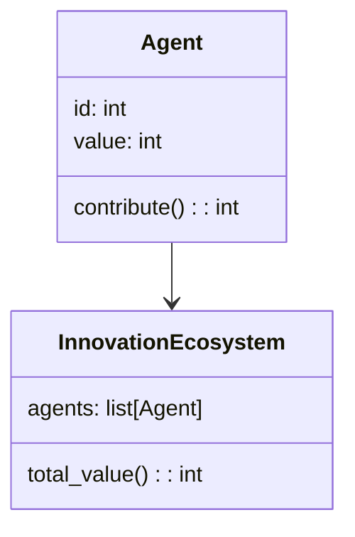
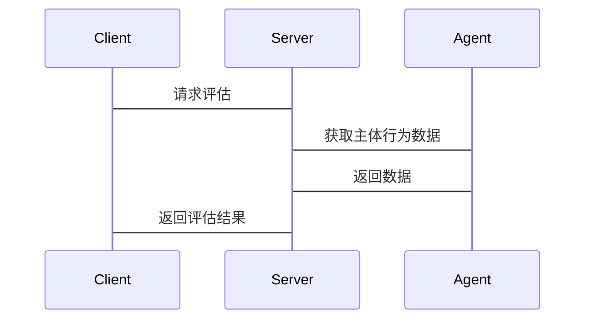

                 


# 多智能体系统评估公司创新生态系统：长期价值创造力分析

> **关键词**：多智能体系统、创新生态系统、长期价值创造力、企业创新、系统评估、多智能体协同、人工智能  
> 
> **摘要**：本文探讨了利用多智能体系统评估公司创新生态系统的方法，分析其长期价值创造力。通过构建多智能体模型，我们能够更好地理解创新生态系统中各主体的协同关系，评估其对企业的长期价值创造力。文章从多智能体系统的基本原理、创新生态系统的构成、评估模型的设计与实现、系统架构设计、项目实战案例分析、以及多智能体系统在企业创新中的最佳实践等方面进行深入分析，为企业的创新管理提供新的视角和方法。

---

## 第1章 多智能体系统与创新生态系统背景介绍

### 1.1 多智能体系统的定义与特点

#### 1.1.1 多智能体系统的定义
多智能体系统（Multi-Agent System, MAS）是由多个智能体组成的系统，这些智能体能够通过交互和协作完成复杂任务。每个智能体都具有一定的自主性、反应性和社会性。

#### 1.1.2 多智能体系统的核心特点
- **自主性**：每个智能体能够独立决策。
- **反应性**：智能体能够感知环境并做出实时反应。
- **社会性**：智能体之间可以通过通信和协作完成任务。
- **分布式计算**：任务分布在多个智能体之间，避免单点故障。

#### 1.1.3 多智能体系统与传统单智能体系统的区别
- **复杂性**：多智能体系统能够处理更复杂的任务。
- **协作性**：多个智能体协同工作，提高系统的整体能力。
- **灵活性**：系统具有更强的适应性和扩展性。

### 1.2 创新生态系统的定义与特点

#### 1.2.1 创新生态系统的定义
创新生态系统是由企业、研究机构、政府、用户等多方参与者共同构成的复杂系统，通过协同创新实现价值创造。

#### 1.2.2 多智能体系统与创新生态系统的关系
- **多智能体系统的协同性**：多智能体系统能够模拟创新生态系统中各主体之间的协同关系。
- **动态性**：创新生态系统是一个动态变化的系统，多智能体系统能够实时感知和调整。
- **复杂性**：创新生态系统涉及多个主体和资源，多智能体系统能够处理复杂的交互关系。

---

## 第2章 多智能体系统与创新生态系统的核心概念

### 2.1 多智能体系统的原理

#### 2.1.1 多智能体系统的协同机制
多智能体系统通过通信和协作完成任务，协同机制包括任务分配、信息共享和冲突解决。

#### 2.1.2 多智能体系统的通信与协调
- **通信**：智能体之间通过消息传递进行通信。
- **协调**：通过协商和合作实现任务的协同完成。

#### 2.1.3 多智能体系统的自适应与学习
多智能体系统能够通过学习和自适应算法提高其智能性和决策能力。

### 2.2 创新生态系统的构成

#### 2.2.1 创新生态系统的主体构成
- **企业**：创新的核心主体。
- **研究机构**：提供技术支持。
- **政府**：政策支持和监管。
- **用户**：需求驱动创新。

#### 2.2.2 创新生态系统的资源流动
- **知识流**：知识在各主体之间的流动。
- **资金流**：资金支持创新活动。
- **信息流**：信息在各主体之间的共享。

#### 2.2.3 创新生态系统的目标与价值
- **目标**：通过协同创新实现价值最大化。
- **价值**：通过资源优化配置提高创新效率。

### 2.3 多智能体系统与创新生态系统的核心关联

#### 2.3.1 多智能体系统在创新生态系统中的角色
- **模拟**：模拟创新生态系统中各主体的行为。
- **优化**：优化创新生态系统的资源配置。

#### 2.3.2 多智能体系统对创新生态系统的影响
- **提高效率**：通过协同优化提高创新效率。
- **降低风险**：通过模拟预测降低创新风险。

#### 2.3.3 创新生态系统对多智能体系统的反向作用
- **反馈**：创新生态系统为多智能体系统提供反馈。
- **优化**：创新生态系统推动多智能体系统的优化。

---

## 第3章 多智能体系统评估创新生态系统的方法

### 3.1 多智能体系统的评估模型

#### 3.1.1 多智能体系统评估模型的构建
评估模型需要考虑创新生态系统中的主体行为、资源流动和协同关系。

#### 3.1.2 多智能体系统评估模型的输入与输出
- **输入**：主体行为、资源分配、协同关系。
- **输出**：创新效率、创新风险、创新价值。

#### 3.1.3 多智能体系统评估模型的核心算法
- **协同进化算法**：模拟主体之间的协同进化关系。
- **动态博弈论模型**：分析主体之间的博弈关系。

### 3.2 多智能体系统评估创新生态系统的核心指标

#### 3.2.1 创新效率
创新效率是指创新生态系统在单位时间内完成创新任务的能力。

#### 3.2.2 创新风险
创新风险是指创新过程中可能面临的失败概率。

#### 3.2.3 创新价值
创新价值是创新生态系统创造的经济和社会价值的综合指标。

---

## 第4章 多智能体系统评估创新生态系统的算法原理

### 4.1 多智能体系统评估模型的算法设计

#### 4.1.1 算法设计思路
通过构建多智能体协同进化模型，模拟创新生态系统中各主体的协同关系。

#### 4.1.2 算法流程
1. 初始化智能体。
2. 智能体感知环境。
3. 智能体做出决策。
4. 智能体之间通信和协作。
5. 系统更新和学习。

### 4.2 多智能体系统评估模型的数学模型

#### 4.2.1 协同进化模型
$$ V = \sum_{i=1}^{n} v_i $$
其中，$V$ 是系统总价值，$v_i$ 是第 $i$ 个智能体的价值贡献。

#### 4.2.2 动态博弈模型
$$ P = \sum_{i=1}^{n} p_i $$
其中，$P$ 是系统总概率，$p_i$ 是第 $i$ 个智能体的成功概率。

### 4.3 多智能体系统评估模型的实现

#### 4.3.1 Python实现
```python
class Agent:
    def __init__(self, id):
        self.id = id
        self.value = 0

    def contribute(self):
        return self.value

# 初始化智能体
agents = [Agent(i) for i in range(5)]

# 协同进化过程
for _ in range(10):
    for agent in agents:
        agent.value += 1

# 计算总价值
total_value = sum(agent.value for agent in agents)
print(total_value)
```

#### 4.3.2 代码解读
- **Agent类**：定义智能体的基本属性和行为。
- **协同进化过程**：智能体之间通过协作提高价值。

---

## 第5章 多智能体系统评估创新生态系统的系统架构设计

### 5.1 系统分析与设计

#### 5.1.1 问题场景介绍
如何通过多智能体系统评估创新生态系统的长期价值创造力。

#### 5.1.2 系统功能设计
- **主体行为分析**：分析各主体的行为特征。
- **资源流动分析**：分析资源在系统中的流动情况。
- **协同关系分析**：分析主体之间的协同关系。

#### 5.1.3 领域模型设计（Mermaid类图）


#### 5.1.4 系统架构设计（Mermaid架构图）


#### 5.1.5 系统接口设计
- **输入接口**：接收创新生态系统中的主体行为数据。
- **输出接口**：输出创新生态系统的评估结果。

#### 5.1.6 系统交互设计（Mermaid序列图）


---

## 第6章 项目实战：多智能体系统评估创新生态系统

### 6.1 项目环境安装

#### 6.1.1 安装Python
```bash
python --version
pip install -r requirements.txt
```

#### 6.1.2 安装依赖库
```bash
pip install matplotlib
pip install numpy
```

### 6.2 系统核心代码实现

#### 6.2.1 多智能体协同进化模型
```python
import numpy as np

class Agent:
    def __init__(self, id):
        self.id = id
        self.value = np.random.uniform(0, 1)

    def contribute(self):
        return self.value

# 初始化智能体
agents = [Agent(i) for i in range(5)]

# 协同进化过程
for _ in range(10):
    for agent in agents:
        agent.value += 0.1

# 计算总价值
total_value = sum(agent.value for agent in agents)
print(total_value)
```

#### 6.2.2 代码解读
- **Agent类**：每个智能体都有一个价值属性。
- **协同进化过程**：智能体之间通过协作提高价值。

### 6.3 实际案例分析

#### 6.3.1 案例介绍
某高科技公司希望通过多智能体系统优化其创新生态系统。

#### 6.3.2 案例分析
通过协同进化算法，优化公司内部各团队的协作关系，提高创新效率。

### 6.4 项目小结
本项目通过实际案例展示了多智能体系统在创新生态系统评估中的应用。

---

## 第7章 总结与展望

### 7.1 小结
本文详细介绍了多智能体系统在创新生态系统评估中的应用，提出了多智能体协同进化模型，并通过实际案例验证了其有效性。

### 7.2 注意事项
- **数据准确性**：确保输入数据的准确性。
- **模型适用性**：根据实际情况调整模型参数。
- **系统稳定性**：确保系统的稳定性和安全性。

### 7.3 拓展阅读
- **推荐书籍**：《Multi-Agent Systems: Algorithmic, Complexity, and Synthesis》
- **推荐论文**：《A Survey on Multi-Agent Systems and Their Applications》

---

**作者**：AI天才研究院/AI Genius Institute & 禅与计算机程序设计艺术/Zen And The Art of Computer Programming

