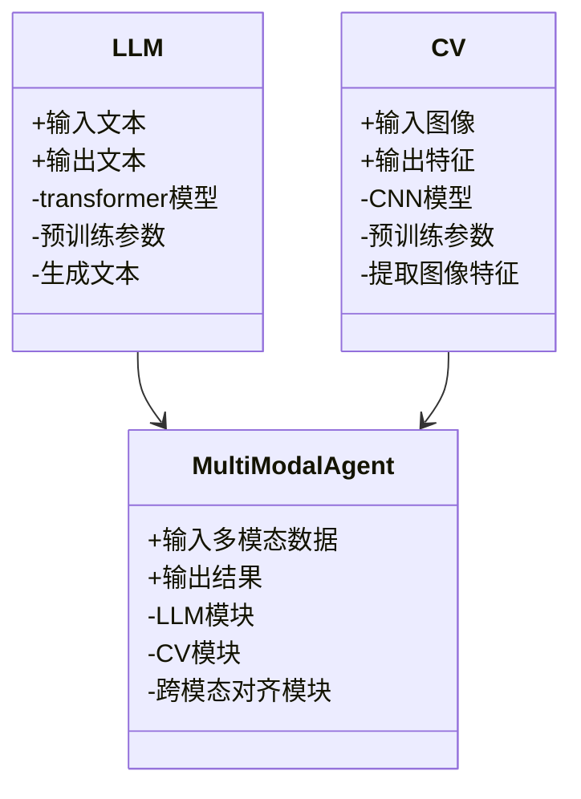
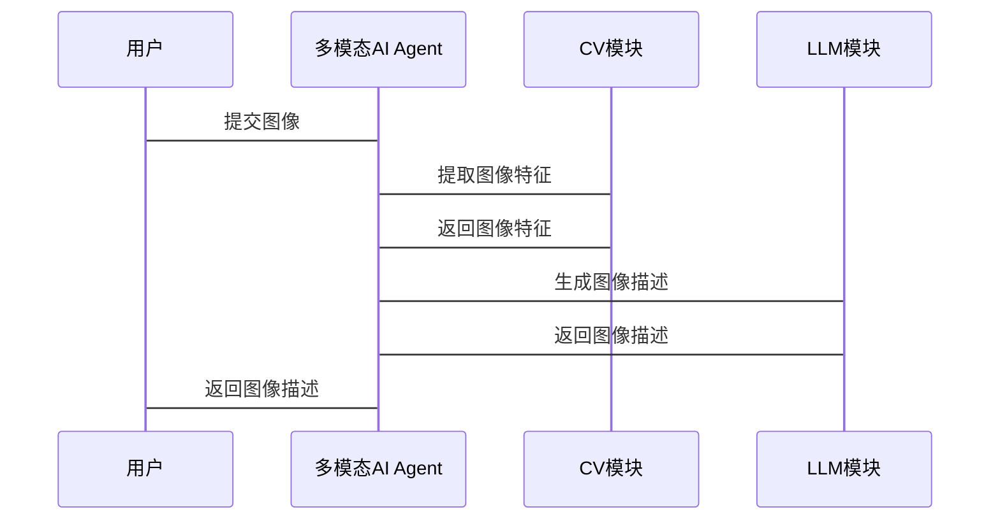

                 


# 多模态 AI Agent 开发：整合 LLM 与计算机视觉

**关键词**：多模态 AI Agent, 大语言模型 (LLM), 计算机视觉, 跨模态对齐, 多任务学习, Transformer 模型

**摘要**：  
多模态 AI Agent 的开发是当前人工智能领域的研究热点，其核心在于整合大语言模型 (LLM) 与计算机视觉技术，实现对多种数据类型的感知、理解和协同工作。本文将从多模态 AI Agent 的背景与概念出发，逐步分析其核心算法、数学模型、系统架构设计，并通过项目实战展示如何将 LLM 与计算机视觉技术整合到实际应用中。文章还探讨了多模态 AI Agent 的应用场景、开发中的注意事项以及未来的发展方向。

---

## 第1章: 多模态 AI Agent 的背景与概念

### 1.1 多模态 AI Agent 的定义与特点

#### 1.1.1 多模态数据的定义  
多模态数据指的是多种数据类型的集合，例如文本、图像、语音、视频等。与单模态数据相比，多模态数据能够提供更全面的信息，使 AI 系统能够更好地理解和处理复杂的现实场景。

#### 1.1.2 多模态 AI Agent 的核心特点  
- **多感官输入**：能够处理多种数据类型的输入，如文本、图像、语音等。
- **跨模态理解**：能够理解不同数据类型之间的关联和上下文关系。
- **协同工作**：LLM 和计算机视觉技术的协同优化，使系统能够更高效地完成任务。

#### 1.1.3 多模态与单模态的对比分析  
| 特性          | 单模态                | 多模态                |
|---------------|----------------------|----------------------|
| 数据类型      | 单一类型（如文本）    | 多种类型（如文本+图像）|
| 信息量        | 较少                 | 更多                 |
| 任务复杂度    | 较低                 | 较高                 |
| 应用场景      | 简单任务（如文本分类）| 复杂任务（如图像描述）|

### 1.2 LLM 与计算机视觉的结合

#### 1.2.1 大语言模型（LLM）的概述  
LLM 是基于Transformer架构的大语言模型，具有强大的文本生成和理解能力。其核心在于其自注意力机制和大规模预训练能力。

#### 1.2.2 计算机视觉的核心技术  
计算机视觉主要涉及图像识别、目标检测、图像分割等技术，其核心算法包括CNN、RCNN、YOLO等。

#### 1.2.3 LLM 与计算机视觉的整合意义  
通过整合 LLM 和计算机视觉技术，AI Agent 可以实现对图像的描述生成、图像分类、图像问答等功能，极大地提升了系统的智能化水平。

### 1.3 多模态 AI Agent 的应用场景

#### 1.3.1 智能助手与人机交互  
通过整合语音识别和自然语言处理技术，多模态 AI Agent 可以实现更自然的人机交互。

#### 1.3.2 图像理解与文本生成  
AI Agent 可以通过图像分析生成描述性文本，例如为图像添加标签或生成配文。

#### 1.3.3 多模态任务的典型案例  
- 图像描述生成  
- 视频摘要生成  
- 跨模态检索（如根据文本检索图像）

---

## 第2章: 多模态 AI Agent 的核心概念与联系

### 2.1 多模态数据的处理流程

#### 2.1.1 数据采集与预处理  
数据采集包括图像采集、文本获取等，预处理包括归一化、降噪等步骤。

#### 2.1.2 数据融合与特征提取  
通过融合不同数据类型的特征，提取更具代表性的信息，例如将图像特征与文本特征进行对齐。

#### 2.1.3 数据表示与模型输入  
将多模态数据转换为模型可接受的输入格式，例如将图像特征和文本向量拼接。

### 2.2 LLM 与计算机视觉的协同工作

#### 2.2.1 LLM 的文本处理能力  
LLM 可以对文本进行生成、理解、翻译等操作，为多模态任务提供文本处理能力。

#### 2.2.2 计算机视觉的图像理解能力  
计算机视觉技术可以对图像进行分类、检测、分割等操作，为多模态任务提供图像理解能力。

#### 2.2.3 两者结合的协同机制  
通过将 LLM 的文本处理能力和计算机视觉的图像理解能力结合，AI Agent 可以实现更复杂的任务。

### 2.3 多模态模型的架构设计

#### 2.3.1 多模态模型的输入输出结构  
输入：多模态数据（如图像+文本）  
输出：任务结果（如图像描述）

#### 2.3.2 模型的模块化设计  
- 文本处理模块：基于 LLM 的文本生成和理解。
- 图像处理模块：基于 CNN 的图像分类和检测。
- 跨模态对齐模块：将文本和图像特征对齐，实现协同优化。

#### 2.3.3 模型的训练与优化  
通过联合优化目标函数，训练多模态模型，使其在不同任务上表现优异。

---

## 第3章: 多模态 AI Agent 的算法原理

### 3.1 大语言模型（LLM）的核心算法

#### 3.1.1 Transformer 模型的结构  
Transformer 模型由编码器和解码器组成，通过自注意力机制实现全局信息捕捉。

#### 3.1.2 注意力机制的原理  
通过计算输入序列中每个位置的注意力权重，模型可以聚焦于重要的信息。

#### 3.1.3 LLM 的训练与推理流程  
训练：基于大规模文本数据进行预训练，优化模型参数。  
推理：输入文本，生成输出。

### 3.2 计算机视觉的核心算法

#### 3.2.1 卷积神经网络（CNN）的结构  
CNN 通过卷积操作提取图像特征， pooling 层降低计算复杂度。

#### 3.2.2 图像分类与目标检测算法  
图像分类：基于 CNN 的分类模型，如 ResNet、VGG。  
目标检测：基于区域建议网络（RPN）的检测模型，如 Faster R-CNN。

#### 3.2.3 图像生成与编辑技术  
图像生成：基于 GAN（生成对抗网络）的技术，如 StyleGAN。  
图像编辑：基于图像分割和变形的技术，如图像修复。

### 3.3 多模态模型的联合学习算法

#### 3.3.1 多任务学习的原理  
通过共享某些参数，模型可以在多个任务上同时进行优化。

#### 3.3.2 跨模态对齐的算法  
通过计算不同模态特征之间的相似性，对齐模态间的语义信息。

#### 3.3.3 联合优化的目标函数设计  
$$ \mathcal{L} = \alpha \mathcal{L}_\text{LLM} + (1-\alpha) \mathcal{L}_\text{CV} $$  
其中，$\alpha$ 是权重系数，$\mathcal{L}_\text{LLM}$ 和 $\mathcal{L}_\text{CV}$ 分别是 LLM 和计算机视觉任务的损失函数。

---

## 第4章: 多模态 AI Agent 的数学模型与公式

### 4.1 LLM 的数学模型

#### 4.1.1 Transformer 模型的数学公式  
自注意力机制的计算公式：  
$$ \text{Attention}(Q, K, V) = \text{softmax}\left(\frac{QK^T}{\sqrt{d_k}}\right)V $$  

#### 4.1.2 注意力机制的计算公式  
$$ \text{softmax}(x) = \frac{e^x}{\sum_{i} e^{x_i}} $$  

#### 4.1.3 模型的损失函数与优化目标  
交叉熵损失函数：  
$$ \mathcal{L} = -\sum_{i=1}^{n} y_i \log p(y_i|x) $$  

### 4.2 计算机视觉的数学模型

#### 4.2.1 CNN 的卷积操作公式  
$$ f(x) = \sum_{i=1}^{k} w_i \ast x_i + b $$  
其中，$w_i$ 是卷积核，$x_i$ 是输入图像的像素值。

#### 4.2.2 图像分类的损失函数  
交叉熵损失函数：  
$$ \mathcal{L} = -\sum_{i=1}^{n} y_i \log p(y_i|x) $$  

#### 4.2.3 图像生成的数学模型  
生成对抗网络（GAN）的损失函数：  
$$ \mathcal{L}_\text{GAN} = \mathbb{E}_{x \sim p_\text{data}}[\log D(x)] + \mathbb{E}_{z \sim p_z}[ \log (1 - D(G(z)))] $$  

### 4.3 多模态模型的联合学习公式

#### 4.3.1 跨模态对齐的数学表达  
$$ \text{sim}(f_\text{LLM}(x), f_\text{CV}(x)) = \text{cos}(\text{f}_\text{LLM}(x), \text{f}_\text{CV}(x)) $$  
其中，$\text{cos}$ 表示余弦相似度。

#### 4.3.2 联合优化的目标函数  
$$ \mathcal{L} = \lambda \mathcal{L}_\text{LLM} + (1-\lambda) \mathcal{L}_\text{CV} + \gamma \mathcal{L}_\text{align} $$  
其中，$\lambda$ 和 $\gamma$ 是超参数，$\mathcal{L}_\text{align}$ 是跨模态对齐的损失。

---

## 第5章: 多模态 AI Agent 的系统分析与架构设计

### 5.1 项目场景介绍

#### 5.1.1 项目目标与范围  
开发一个支持图像描述生成的多模态 AI Agent，整合 LLM 和计算机视觉技术。

#### 5.1.2 项目需求分析  
- 支持图像输入和文本输出  
- 提供图像描述生成功能  
- 实现高效的模型训练与推理

#### 5.1.3 项目的关键成功因素  
- 模型的准确性和效率  
- 模型的可扩展性和可维护性  

### 5.2 系统功能设计

#### 5.2.1 领域模型（类图）  


#### 5.2.2 系统架构设计（架构图）  
```mermaid
rectangle 多模态AI Agent {
    LLM模块
    CV模块
    跨模态对齐模块
}
```

#### 5.2.3 系统接口设计  
- 输入接口：支持图像和文本的输入  
- 输出接口：生成文本描述  
- 接口交互：通过 RESTful API 实现  

#### 5.2.4 系统交互（序列图）  


---

## 第6章: 项目实战

### 6.1 环境安装

#### 6.1.1 安装依赖  
```bash
pip install numpy
pip install tensorflow
pip install keras
pip install matplotlib
pip install cv2
```

#### 6.1.2 安装 LLM 模型  
```bash
pip install transformers
```

### 6.2 系统核心实现源代码

#### 6.2.1 LLM 模块实现  
```python
from transformers import AutoTokenizer, AutoModelForCausalLM
import torch

class LLMModule:
    def __init__(self, model_name="gpt2"):
        self.tokenizer = AutoTokenizer.from_pretrained(model_name)
        self.model = AutoModelForCausalLM.from_pretrained(model_name)
    
    def generate_text(self, input_text):
        inputs = self.tokenizer(input_text, return_tensors="pt")
        outputs = self.model.generate(**inputs, max_length=50)
        return self.tokenizer.decode(outputs[0], skip_special_tokens=True)
```

#### 6.2.2 CV 模块实现  
```python
import cv2
import numpy as np

class CVModule:
    def __init__(self, model_name="resnet50"):
        self.model = ResNet50(weights="IMAGENET1K_V2")
    
    def extract_feature(self, image_path):
        image = cv2.imread(image_path)
        feature = self.model(image)
        return feature
```

#### 6.2.3 多模态模型实现  
```python
class MultiModalAgent:
    def __init__(self, llm_model, cv_model):
        self.llm = llm_model
        self.cv = cv_model
    
    def process(self, input_image, input_text):
        # 提取图像特征
        cv_feature = self.cv.extract_feature(input_image)
        # 生成文本描述
        text_description = self.llm.generate_text(input_text)
        return text_description
```

### 6.3 代码解读与分析

#### 6.3.1 LLM模块解读  
- 使用 Hugging Face 的 transformers 库加载 LLM 模型  
- 通过 tokenize 和 generate 方法生成文本描述  

#### 6.3.2 CV模块解读  
- 使用预训练的 ResNet50 模型提取图像特征  
- 返回特征向量供多模态模型使用  

### 6.4 实际案例分析

#### 6.4.1 案例一：图像描述生成  
输入：一张猫的图像  
输出：生成的图像描述：“一只橘猫正在窗台上睡觉。”

#### 6.4.2 案例二：图像问答  
输入：一张交通灯的图像，问题：“交通灯是什么颜色？”  
输出：生成的回答：“交通灯是红色的。”

### 6.5 项目小结

---

## 第7章: 最佳实践与未来展望

### 7.1 最佳实践 tips

#### 7.1.1 模型选择  
- 根据任务需求选择合适的 LLM 和 CV 模型  
- 使用预训练模型可以减少训练时间  

#### 7.1.2 数据处理  
- 对数据进行充分的清洗和预处理  
- 确保数据的多样性和平衡性  

#### 7.1.3 超参数调优  
- 使用交叉验证和网格搜索优化超参数  
- 调整学习率、批量大小等参数  

### 7.2 小结

### 7.3 注意事项

#### 7.3.1 模型的泛化能力  
- 多模态模型需要在不同场景下保持良好的泛化能力  
- 需要进行充分的测试和验证  

#### 7.3.2 计算资源  
- 训练多模态模型需要大量的计算资源  
- 使用 GPU 加速训练  

### 7.4 拓展阅读

#### 7.4.1 推荐书籍  
- 《Deep Learning》  
- 《Effective Computation in Bayesian Problem Solving》  

#### 7.4.2 推荐论文  
- “Attention Is All You Need”  
- “ImageNet Classification with Deep Convolutional Neural Networks”  

---

## 作者：AI天才研究院 / AI Genius Institute & 禅与计算机程序设计艺术 / Zen And The Art of Computer Programming

