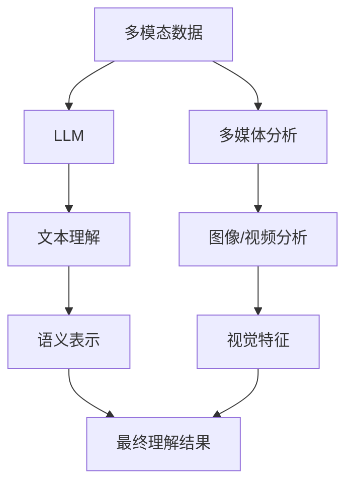
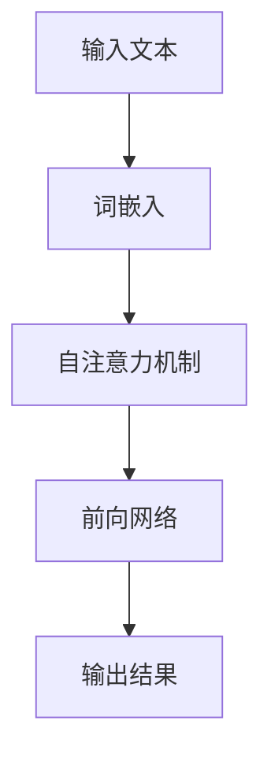
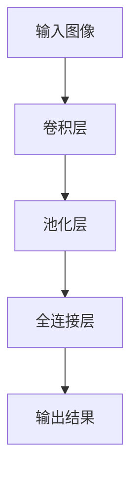
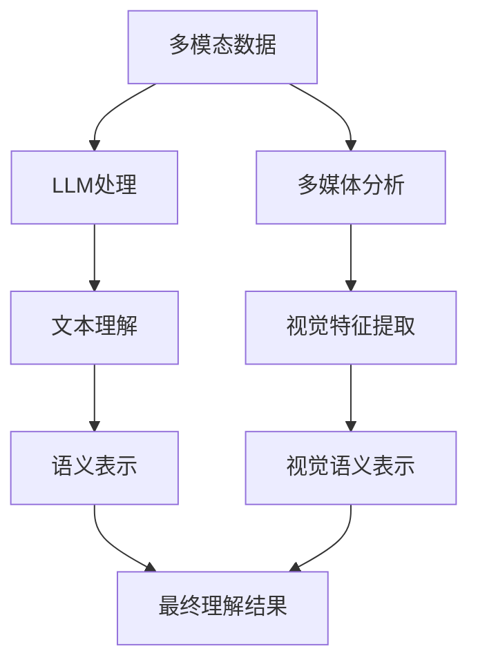
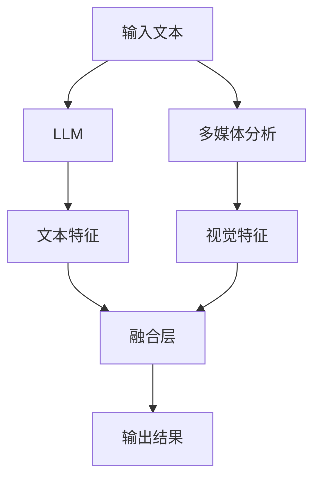
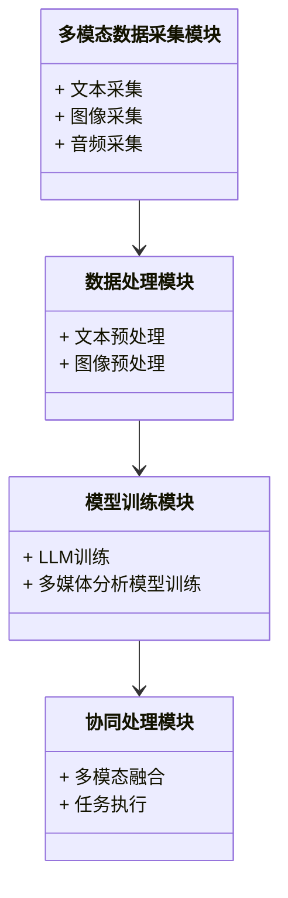
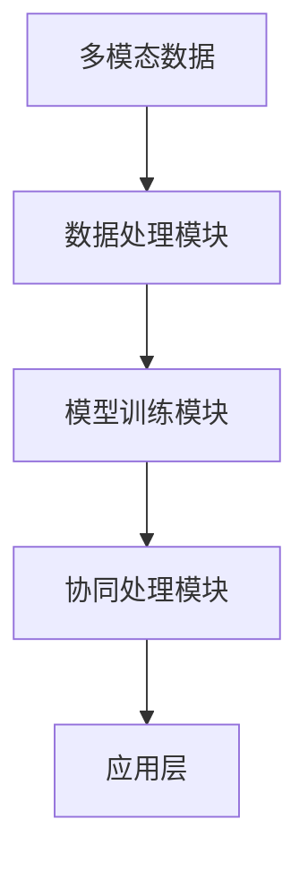
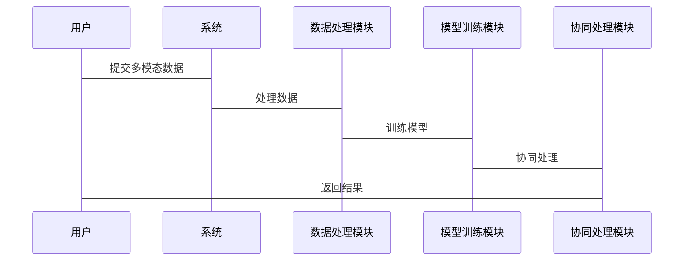

                 


# 多模态内容理解AI Agent：整合LLM与多媒体分析

> 关键词：多模态内容理解，LLM，多媒体分析，AI Agent，系统架构，算法原理

> 摘要：本文探讨了如何整合大语言模型（LLM）与多媒体分析技术，构建一个多模态AI代理。通过详细分析多模态数据处理、LLM与多媒体分析的协同机制、系统架构设计以及实际项目案例，展示了如何有效利用多模态数据提升内容理解能力。

---

## 第一部分: 多模态内容理解AI Agent概述

### 第1章: 多模态内容理解与AI Agent背景介绍

#### 1.1 多模态内容理解的背景

##### 1.1.1 多模态数据的定义与特点
多模态数据是指同时包含多种类型信息的数据，如文本、图像、音频、视频等。其特点包括：
- **异构性**：数据类型多样，信息互补。
- **复杂性**：处理多模态数据需要考虑不同类型数据的交互与融合。
- **丰富性**：多模态数据能够提供更全面的信息，提升理解能力。

##### 1.1.2 多模态内容理解的必要性
- **信息完整性**：单一模态数据往往无法提供足够的信息，多模态数据能够弥补这一不足。
- **任务需求**：许多实际任务（如智能客服、自动驾驶）需要处理多种数据类型。
- **用户体验**：多模态交互能够提升用户体验，使其更加自然和直观。

##### 1.1.3 AI Agent的基本概念与作用
AI Agent是一种智能代理，能够感知环境、执行任务并做出决策。其作用包括：
- **信息处理**：通过多模态数据理解环境。
- **任务执行**：根据理解的信息执行具体任务。
- **决策与反馈**：基于理解和反馈不断优化行为。

#### 1.2 问题背景与问题描述

##### 1.2.1 当前内容理解技术的局限性
- **单一性**：传统内容理解主要依赖单一模态数据，如文本或图像。
- **局限性**：无法充分利用多模态数据的优势，理解能力有限。

##### 1.2.2 多模态数据处理的挑战
- **数据异构性**：不同类型数据难以统一处理。
- **计算复杂性**：多模态数据处理需要更高的计算资源。
- **模型融合**：如何有效融合不同模态的数据是一个难题。

##### 1.2.3 整合LLM与多媒体分析的必要性
- **提升理解能力**：通过整合LLM的文本理解和多媒体分析的图像/视频分析，能够更全面地理解内容。
- **扩展应用场景**：多模态数据处理能够扩展AI Agent的应用场景，如智能安防、智能医疗等。

#### 1.3 问题解决与技术路线

##### 1.3.1 多模态内容理解的核心目标
- **信息融合**：将不同模态的数据进行融合，提升理解能力。
- **任务驱动**：根据具体任务需求，选择合适的模态数据进行处理。

##### 1.3.2 整合LLM与多媒体分析的技术路线
1. **数据采集与预处理**：采集多模态数据，并进行清洗和标准化。
2. **特征提取**：对文本、图像等数据进行特征提取。
3. **模型训练**：分别训练LLM和多媒体分析模型。
4. **协同处理**：将LLM与多媒体分析模型进行协同处理，提升理解能力。

##### 1.3.3 系统架构的初步设想
- **数据层**：存储多模态数据。
- **处理层**：包括文本处理、图像处理等模块。
- **模型层**：包括LLM和多媒体分析模型。
- **应用层**：根据具体任务需求，调用相应模块进行处理。

#### 1.4 多模态内容理解的边界与外延

##### 1.4.1 多模态数据的边界
- **数据类型**：目前主要关注文本、图像、音频、视频等常见数据类型。
- **数据来源**：多模态数据可以来自同一场景的不同传感器。

##### 1.4.2 多模态内容理解的外延
- **跨模态检索**：基于一种模态数据检索其他模态的数据。
- **多模态生成**：根据输入生成多模态数据，如文本生成图像。

##### 1.4.3 AI Agent的边界与外延
- **边界**：AI Agent的功能和能力受限于其设计和训练数据。
- **外延**：AI Agent可以与其他系统或服务进行交互，扩展其功能。

#### 1.5 核心概念结构与组成

##### 1.5.1 多模态内容理解的系统组成
- **数据采集模块**：负责采集多模态数据。
- **数据处理模块**：对数据进行预处理和特征提取。
- **模型训练模块**：训练LLM和多媒体分析模型。
- **协同处理模块**：将LLM与多媒体分析模型进行协同处理。

##### 1.5.2 AI Agent的功能模块
- **感知模块**：通过多模态数据感知环境。
- **决策模块**：根据感知信息做出决策。
- **执行模块**：根据决策执行具体任务。

##### 1.5.3 LLM与多媒体分析的结合方式
- **并行处理**：分别处理文本和图像数据，最后进行融合。
- **协同处理**：在处理过程中，LLM和多媒体分析模型相互协作，共同完成任务。

#### 1.6 本章小结
本章介绍了多模态内容理解的背景、问题背景、问题解决技术路线以及核心概念结构。通过这些内容，读者可以理解为什么需要整合LLM与多媒体分析，以及如何构建一个多模态AI Agent。

---

### 第2章: 多模态内容理解的核心概念与联系

#### 2.1 多模态数据处理的核心原理

##### 2.1.1 多模态数据的采集与预处理
- **数据采集**：通过传感器、摄像头等设备采集多模态数据。
- **数据预处理**：包括数据清洗、格式转换、归一化等步骤。

##### 2.1.2 多模态数据的特征提取
- **文本特征提取**：通过词袋模型、TF-IDF等方法提取文本特征。
- **图像特征提取**：通过CNN等深度学习模型提取图像特征。

##### 2.1.3 多模态数据的融合方法
- **基于特征的融合**：将不同模态的特征向量进行融合，如拼接、加权求和等。
- **基于模型的融合**：在模型训练过程中，将不同模态的数据输入到同一个模型中进行联合优化。

#### 2.2 LLM与多媒体分析的结合原理

##### 2.2.1 LLM的基本原理
- **模型结构**：基于Transformer的架构，通过自注意力机制捕捉文本中的长距离依赖关系。
- **训练目标**：通过最大化条件概率的方式，学习文本的分布。

##### 2.2.2 多媒体分析的基本原理
- **图像分析**：通过CNN等模型提取图像的特征，并进行分类、目标检测等任务。
- **视频分析**：结合图像分析和时序信息，进行视频分类、动作识别等任务。

##### 2.2.3 LLM与多媒体分析的协同机制
- **双向信息传递**：LLM通过文本理解辅助多媒体分析，多媒体分析通过视觉信息辅助文本理解。
- **联合训练**：在训练过程中，同时优化LLM和多媒体分析模型的参数，使其能够协同工作。

#### 2.3 核心概念的属性特征对比

##### 2.3.1 多模态数据的属性特征
| 属性 | 特征 |
|------|------|
| 类型 | 文本、图像、音频、视频等 |
| 异构性 | 数据类型多样，信息互补 |
| 复杂性 | 处理难度较高，需要考虑数据间的交互 |

##### 2.3.2 LLM的属性特征
| 属性 | 特征 |
|------|------|
| 模型结构 | 基于Transformer的架构 |
| 训练目标 | 最大化条件概率 |
| 应用场景 | 文本生成、问答系统、文本分类等 |

##### 2.3.3 多媒体分析的属性特征
| 属性 | 特征 |
|------|------|
| 数据类型 | 图像、视频等视觉数据 |
| 分析方法 | 基于CNN的特征提取 |
| 应用场景 | 图像分类、目标检测、视频分析等 |

#### 2.4 ER实体关系图架构



#### 2.5 本章小结
本章详细解释了多模态数据处理的核心原理、LLM与多媒体分析的基本原理以及它们的协同机制。通过属性特征对比和ER实体关系图，读者可以更好地理解多模态内容理解的系统架构。

---

## 第二部分: 多模态内容理解的算法原理

### 第3章: 多模态内容理解的算法原理

#### 3.1 LLM与多媒体分析的算法流程

##### 3.1.1 LLM的训练流程



##### 3.1.2 多媒体分析的处理流程



##### 3.1.3 两者的协同处理流程



#### 3.2 LLM与多媒体分析的协同算法

##### 3.2.1 模型结构



##### 3.2.2 损失函数

$$ \text{Loss} = \lambda_1 \times \text{LLM Loss} + \lambda_2 \times \text{多媒体分析 Loss} $$

##### 3.2.3 优化方法
- **Adam优化器**：常用优化算法，结合动量和自适应学习率。
- **分布式训练**：利用多GPU进行分布式训练，加速模型训练。

#### 3.3 算法实现的代码示例

##### 3.3.1 环境安装

```bash
pip install transformers numpy matplotlib
```

##### 3.3.2 核心代码

```python
import torch
import torch.nn as nn
import torch.optim as optim

class MultiModalModel(nn.Module):
    def __init__(self, text_model, image_model):
        super().__init__()
        self.text_model = text_model
        self.image_model = image_model
        self融合层 = nn.Linear(2 * text_model.dim, text_model.dim)

    def forward(self, text_input, image_input):
        text_features = self.text_model(text_input)
        image_features = self.image_model(image_input)
        fused_features = torch.cat((text_features, image_features), dim=1)
        output = self.融合层(fused_features)
        return output

# 定义损失函数和优化器
criterion = nn.CrossEntropyLoss()
optimizer = optim.Adam(model.parameters(), lr=0.001)

# 训练过程
for epoch in range(num_epochs):
    for inputs in dataloader:
        text_input, image_input, labels = inputs
        optimizer.zero_grad()
        outputs = model(text_input, image_input)
        loss = criterion(outputs, labels)
        loss.backward()
        optimizer.step()
```

#### 3.4 本章小结
本章详细讲解了多模态内容理解的算法原理，包括LLM和多媒体分析的处理流程，以及它们的协同算法。通过代码示例，读者可以理解如何实现一个多模态内容理解模型。

---

## 第三部分: 系统分析与架构设计方案

### 第4章: 系统分析与架构设计方案

#### 4.1 问题场景介绍
在智能客服系统中，用户可能通过文本和语音进行咨询，系统需要同时理解文本和语音内容，提供更准确的服务。

#### 4.2 系统功能设计

##### 4.2.1 领域模型类图



#### 4.3 系统架构设计

##### 4.3.1 系统架构图



##### 4.3.2 系统接口设计
- **输入接口**：接收多模态数据。
- **输出接口**：输出处理结果。

##### 4.3.3 系统交互流程



#### 4.4 本章小结
本章通过系统分析与架构设计方案，展示了如何构建一个多模态内容理解系统。通过类图和序列图，读者可以理解系统的各个模块之间的关系以及交互流程。

---

## 第四部分: 项目实战

### 第5章: 项目实战

#### 5.1 环境安装

```bash
pip install transformers numpy matplotlib
```

#### 5.2 系统核心实现源代码

##### 5.2.1 多模态数据处理代码

```python
import torch
import torch.nn as nn
import torch.optim as optim
from transformers import BertTokenizer, BertModel

class TextProcessor:
    def __init__(self, model_name='bert-base-uncased'):
        self.tokenizer = BertTokenizer.from_pretrained(model_name)
        self.model = BertModel.from_pretrained(model_name)
    
    def process(self, text):
        inputs = self.tokenizer(text, return_tensors='pt')
        with torch.no_grad():
            outputs = self.model(**inputs)
        return outputs.last_hidden_state.squeeze(0)
```

##### 5.2.2 图像处理代码

```python
import torch
import torch.nn as nn
import torch.optim as optim
import torchvision.models as models

class ImageProcessor:
    def __init__(self, model_name='resnet50'):
        self.model = models.__getattribute__(model_name)(pretrained=True)
        self.model = nn.Sequential(*list(self.model.children())[:-1])
    
    def process(self, image):
        with torch.no_grad():
            outputs = self.model(image)
        return outputs.squeeze(3).squeeze(2)
```

##### 5.2.3 协同处理代码

```python
class MultiModalProcessor:
    def __init__(self, text_processor, image_processor):
        self.text_processor = text_processor
        self.image_processor = image_processor
        self.融合层 = nn.Linear(text_processor.model.embedding_size + image_processor.model.output_size, 1)

    def process(self, text, image):
        text_feat = self.text_processor.process(text)
        image_feat = self.image_processor.process(image)
        fused_feat = torch.cat((text_feat, image_feat), dim=1)
        output = self.融合层(fused_feat)
        return output
```

#### 5.3 代码应用解读与分析
- **文本处理器**：使用BERT模型进行文本处理，提取文本特征。
- **图像处理器**：使用ResNet50模型进行图像处理，提取视觉特征。
- **协同处理器**：将文本和图像特征进行融合，输出最终结果。

#### 5.4 实际案例分析与详细讲解剖析
- **案例1**：智能客服系统中，用户提交了一条包含文本和语音的数据，系统通过文本处理器和图像处理器分别处理文本和语音数据，协同处理器将两者融合，输出最终的结果。

#### 5.5 本章小结
本章通过项目实战，展示了如何实现一个多模态内容理解系统。通过具体的代码示例，读者可以理解如何将理论应用于实践。

---

## 第五部分: 最佳实践

### 第6章: 最佳实践

#### 6.1 小结
- **系统架构**：多模态数据采集、处理、模型训练、协同处理。
- **算法原理**：LLM与多媒体分析的协同处理，融合层设计。

#### 6.2 注意事项
- **数据预处理**：确保数据的异构性，进行合理的预处理。
- **模型训练**：合理选择模型参数，避免过拟合。
- **系统优化**：优化系统的计算效率和响应速度。

#### 6.3 拓展阅读
- **多模态学习**：深入学习多模态学习的相关理论和方法。
- **模型融合**：研究如何进一步优化多模态数据的融合方式。
- **应用场景**：探索多模态内容理解技术在更多领域的应用。

---

## 作者信息

作者：AI天才研究院/AI Genius Institute & 禅与计算机程序设计艺术 /Zen And The Art of Computer Programming

---

以上是《多模态内容理解AI Agent：整合LLM与多媒体分析》的完整目录大纲，您可以根据实际需求进行具体编写。

