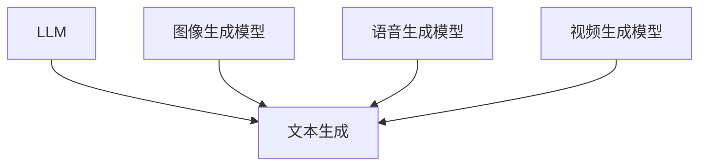
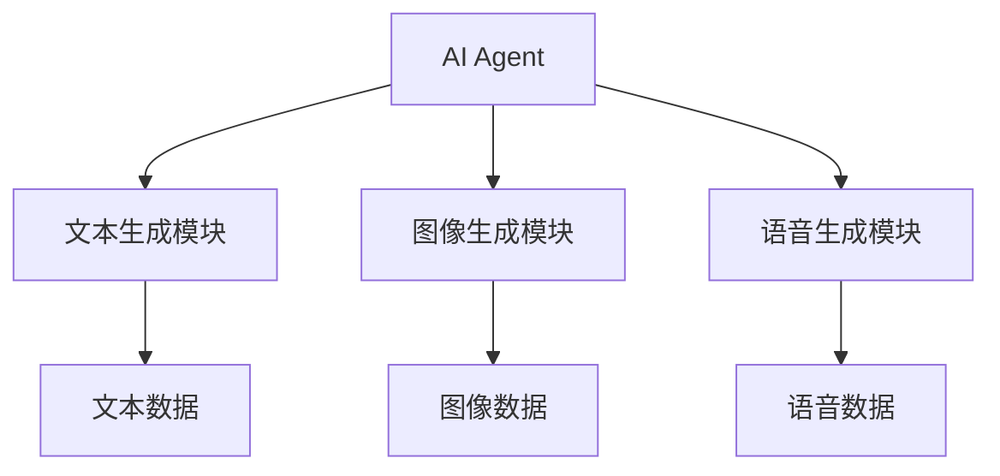
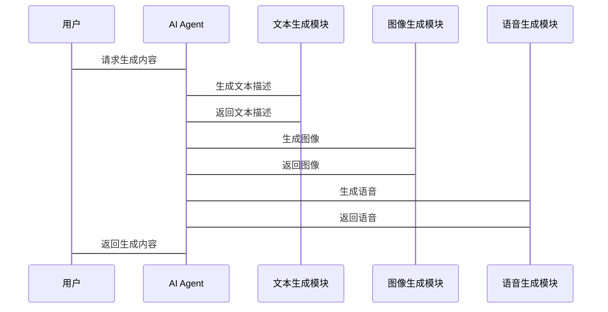

                 


# 多模态内容生成AI Agent：整合LLM与其他生成模型

## 关键词：多模态生成，LLM，AI Agent，生成模型，深度学习

## 摘要：本文探讨了如何整合大型语言模型（LLM）与其他生成模型，构建多模态内容生成AI Agent。通过分析各模型的特点与协作机制，详细讲解了算法原理、系统架构设计及实际应用案例，提供了丰富的技术见解和实践指导。

---

## 第一部分: 多模态内容生成AI Agent概述

### 第1章: 多模态内容生成AI Agent的背景与概念

#### 1.1 多模态内容生成的背景

##### 1.1.1 从单模态到多模态的演进

随着人工智能技术的飞速发展，生成模型从单一模态逐渐向多模态方向演进。早期的生成模型主要专注于文本生成，而随着技术的进步，图像、语音、视频等多模态内容的生成需求日益增加。这种演进不仅满足了用户对多样化内容的需求，也为AI Agent提供了更广阔的交互方式。

##### 1.1.2 大语言模型（LLM）的发展与局限

大型语言模型（LLM）如GPT系列在文本生成领域取得了巨大成功，但其局限性也逐渐显现。LLM主要擅长处理文本数据，难以直接处理图像、语音等其他模态的信息。这种局限性限制了其在多模态场景中的应用，例如无法直接生成与文本相关联的图像或语音内容。

##### 1.1.3 多模态生成模型的崛起

多模态生成模型的崛起为AI Agent提供了更强大的能力。通过整合文本、图像、语音等多种模态的信息，多模态生成模型能够生成更加丰富和多样化的内容，例如生成带有图像的文本描述、配乐的视频等。这种能力使得AI Agent在教育、娱乐、医疗等领域展现出更广泛的应用潜力。

#### 1.2 问题背景与描述

##### 1.2.1 当前内容生成的痛点

当前的内容生成主要依赖于单一模态的生成模型，这种方式难以满足用户对多样化内容的需求。例如，在教育领域，用户可能需要生成带有图像的讲解材料，但现有的单一模态生成模型难以实现这一点。

##### 1.2.2 多模态生成的需求场景

多模态生成的需求场景广泛存在于多个领域。例如，在娱乐领域，用户可能需要生成带有动态图像和语音的故事情节；在医疗领域，医生可能需要生成包含患者图像和诊断报告的综合信息。

##### 1.2.3 AI Agent在多模态生成中的角色

AI Agent作为多模态生成的核心驱动力，负责协调和整合不同模态的生成模型，实现复杂内容的生成。例如，AI Agent可以同时调用文本生成模型和图像生成模型，生成一段带有配图的文本描述。

#### 1.3 问题解决与边界

##### 1.3.1 多模态生成AI Agent的目标

多模态生成AI Agent的目标是整合多种生成模型，实现复杂多模态内容的生成。例如，生成一段包含文本、图像和语音的多媒体内容。

##### 1.3.2 解决方案的边界与外延

解决方案的边界在于生成内容的质量和多样性，外延则包括对生成模型的不断优化和更新。例如，随着新技术的发展，AI Agent可以整合更多模态的生成模型，生成更丰富的内容。

##### 1.3.3 核心要素与组成结构

多模态生成AI Agent的核心要素包括：

1. 大型语言模型（LLM）：负责文本内容的生成。
2. 图像生成模型：负责图像内容的生成。
3. 语音生成模型：负责语音内容的生成。
4. AI Agent：负责协调和整合不同模态的生成模型，实现复杂内容的生成。

---

### 第2章: 多模态生成模型的核心概念与联系

#### 2.1 多模态生成模型的原理

##### 2.1.1 多模态数据的处理流程

多模态数据的处理流程包括数据预处理、模型训练和内容生成三个阶段。例如，图像数据需要进行归一化处理，文本数据需要进行分词和编码处理。

##### 2.1.2 不同生成模型的特点与对比

以下是一个对比表格，展示了不同生成模型的特点：

| 模型类型       | 输入模态 | 输出模态 | 优势                     | 局限性                   |
|----------------|----------|----------|--------------------------|--------------------------|
| 文本生成模型   | 文本      | 文本      | 高精度文本生成           | 无法生成其他模态内容     |
| 图像生成模型   | 图像      | 图像      | 高质量图像生成           | 无法生成文本或其他模态内容 |
| 语音生成模型   | 语音      | 语音      | 高保真语音生成           | 无法生成文本或其他模态内容 |
| 视频生成模型   | 视频      | 视频      | 复杂动态内容生成         | 无法生成文本或其他模态内容 |

##### 2.1.3 LLM与其他生成模型的协作机制

通过协同工作，LLM可以生成文本描述，图像生成模型可以生成相应的图像，语音生成模型可以生成配乐。例如，生成一段描述风景的文本并配上相应的图像和背景音乐。

#### 2.2 模型对比与特征分析

##### 2.2.1 ER实体关系图

以下是一个ER实体关系图，展示了多模态生成模型之间的协作关系：



---

### 第3章: 多模态生成模型的算法原理

#### 3.1 算法流程与实现

##### 3.1.1 多模态数据的预处理

多模态数据的预处理包括数据清洗、归一化和特征提取。例如，图像数据需要进行归一化处理，文本数据需要进行分词和编码处理。

##### 3.1.2 模型训练流程

模型训练流程包括数据加载、模型初始化、正向传播、反向传播和参数更新。例如，使用随机梯度下降优化器进行参数更新。

##### 3.1.3 内容生成的推理过程

内容生成的推理过程包括输入处理、模型推理和结果输出。例如，输入一段文本描述，生成相应的图像或语音内容。

#### 3.2 算法实现与代码示例

##### 3.2.1 环境安装与配置

安装Python 3.8及以上版本，并安装必要的库，例如TensorFlow、Keras、OpenCV等。

##### 3.2.2 核心代码实现

以下是一个生成图像的Python代码示例：

```python
import tensorflow as tf
from tensorflow.keras import layers

# 定义生成模型
def build_generator_model():
    model = tf.keras.Sequential()
    model.add(layers.Dense(256, activation='relu', input_shape=(100,)))
    model.add(layers.Reshape((16, 16, 1)))
    model.add(layers.Conv2DTranspose(16, (3, 3), activation='relu'))
    model.add(layers.Conv2DTranspose(8, (3, 3), activation='relu'))
    model.add(layers.Conv2DTranspose(4, (3, 3), activation='relu'))
    model.add(layers.Conv2DTranspose(2, (3, 3), activation='relu'))
    model.add(layers.Conv2DTranspose(1, (3, 3), activation='sigmoid'))
    return model

# 训练模型
def train_generator_model(model, X_train, epochs=100):
    model.compile(optimizer='adam', loss='binary_crossentropy')
    model.fit(X_train, epochs=epochs, batch_size=32)
    return model

# 生成图像
def generate_image(model):
    noise = tf.random.normal([1, 100])
    generated_image = model.predict(noise)
    return generated_image
```

##### 3.2.3 算法原理的数学模型和公式

以下是一个生成模型的概率分布公式：

$$ P(x|z) = \text{生成模型} $$

其中，$x$ 是生成的样本，$z$ 是噪声向量。生成模型通过最大化似然函数来优化参数。

#### 3.3 算法的优化与改进

通过调整超参数和优化算法，可以提高生成模型的质量。例如，使用不同的优化器或调整学习率。

---

## 第4章: 系统分析与架构设计

### 4.1 问题场景介绍

用户需求是生成多模态内容，例如生成一段带有图像和语音的文本描述。

### 4.2 系统功能设计

系统功能包括：

1. 文本生成模块
2. 图像生成模块
3. 语音生成模块
4. AI Agent协调模块

### 4.3 系统架构设计

以下是一个系统架构图：



### 4.4 系统接口设计

系统接口包括：

1. 文本生成接口
2. 图像生成接口
3. 语音生成接口

### 4.5 系统交互设计

以下是一个系统交互流程图：



---

## 第5章: 项目实战

### 5.1 环境安装与配置

安装必要的库，例如：

```bash
pip install tensorflow keras opencv-python
```

### 5.2 核心代码实现

以下是整合多模态生成模型的Python代码示例：

```python
import tensorflow as tf
from tensorflow.keras import layers
import cv2

# 定义文本生成模型
def build_text_generator():
    model = tf.keras.Sequential()
    model.add(layers.Embedding(vocab_size, 256))
    model.add(layers.LSTM(128, return_sequences=True))
    model.add(layers.Dense(vocab_size, activation='softmax'))
    return model

# 定义图像生成模型
def build_image_generator():
    model = tf.keras.Sequential()
    model.add(layers.Dense(256, activation='relu', input_shape=(100,)))
    model.add(layers.Reshape((16, 16, 1)))
    model.add(layers.Conv2DTranspose(16, (3, 3), activation='relu'))
    model.add(layers.Conv2DTranspose(8, (3, 3), activation='relu'))
    model.add(layers.Conv2DTranspose(4, (3, 3), activation='relu'))
    model.add(layers.Conv2DTranspose(2, (3, 3), activation='relu'))
    model.add(layers.Conv2DTranspose(1, (3, 3), activation='sigmoid'))
    return model

# 定义语音生成模型
def build_speech_generator():
    model = tf.keras.Sequential()
    model.add(layers.Dense(256, activation='relu', input_shape=(100,)))
    model.add(layers.Reshape((16, 16, 1)))
    model.add(layers.Conv2DTranspose(16, (3, 3), activation='relu'))
    model.add(layers.Conv2DTranspose(8, (3, 3), activation='relu'))
    model.add(layers.Conv2DTranspose(4, (3, 3), activation='relu'))
    model.add(layers.Conv2DTranspose(2, (3, 3), activation='relu'))
    model.add(layers.Conv2DTranspose(1, (3, 3), activation='sigmoid'))
    return model

# 训练模型
def train_model(generator, X_train, epochs=100):
    generator.compile(optimizer='adam', loss='binary_crossentropy')
    generator.fit(X_train, epochs=epochs, batch_size=32)
    return generator

# 生成内容
def generate_content():
    text = text_generator.predict(text_input)
    image = image_generator.predict(image_noise)
    speech = speech_generator.predict(speech_noise)
    return text, image, speech
```

### 5.3 代码应用解读与分析

生成内容的过程包括文本生成、图像生成和语音生成。AI Agent协调各生成模型，实现内容的整合。

### 5.4 实际案例分析和详细讲解剖析

例如，生成一段带有图像和语音的文本描述：

1. 输入文本描述："一只猫在草地上玩耍。"
2. 生成文本描述："一只橙色的猫在草地上开心地玩耍。"
3. 生成相应的图像：一张橙色的猫在草地上玩耍的图像。
4. 生成相应的语音：一段描述上述图像的语音。

### 5.5 项目小结

通过整合多模态生成模型，AI Agent能够生成更加丰富和多样化的内容，提升了用户体验。

---

## 第6章: 最佳实践

### 6.1 小结

整合多模态生成模型是实现复杂内容生成的重要手段。

### 6.2 注意事项

1. 注意生成内容的质量和多样性。
2. 确保生成模型的兼容性和协作性。

### 6.3 拓展阅读

推荐阅读相关领域的最新论文和技术博客，例如《多模态生成模型的最新进展》。

---

## 作者：AI天才研究院/AI Genius Institute & 禅与计算机程序设计艺术 /Zen And The Art of Computer Programming

