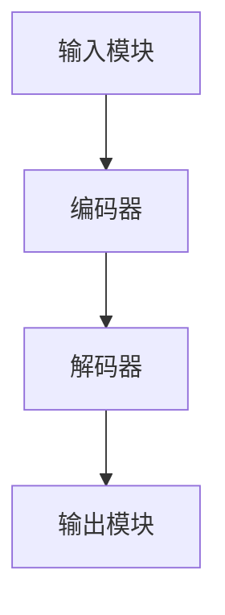
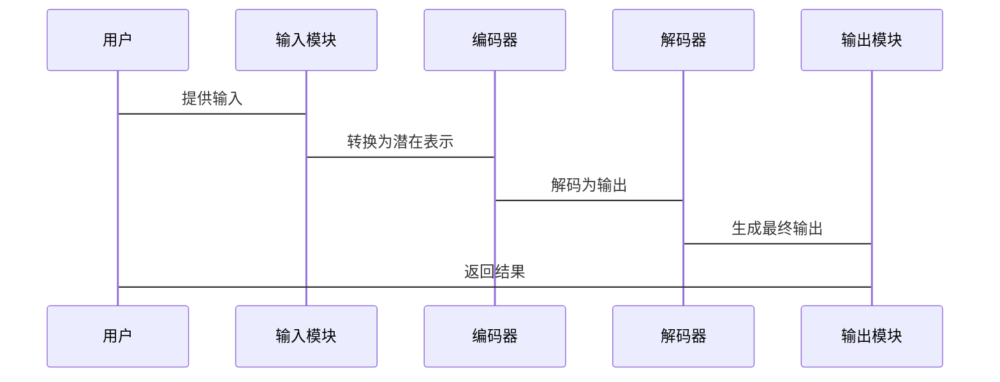

                 


```markdown
# 多模态创作AI Agent：整合LLM与图像生成技术

---

## 关键词
多模态AI Agent, 大语言模型（LLM）, 图像生成技术, 多模态整合, AI创作工具

---

## 摘要
本文深入探讨了多模态创作AI Agent的核心原理，重点分析了如何整合大语言模型（LLM）与图像生成技术，以实现多模态创作的智能化与自动化。文章从背景介绍、核心概念、算法原理、系统架构到项目实战，全面阐述了多模态创作AI Agent的技术实现与应用场景，最后总结了当前技术的优缺点，并展望了未来的发展方向。

---

## 第一部分: 多模态创作AI Agent的背景与概念

### 第1章: 多模态创作AI Agent的背景与概念

#### 1.1 多模态创作AI Agent的定义
- **1.1.1 多模态创作的定义**
  多模态创作指的是同时利用文本、图像、语音等多种模态信息进行创作的过程。多模态创作AI Agent是一种能够理解和生成多种模态数据的智能体，能够根据输入的文本生成对应的图像，或根据图像生成描述性文本。

- **1.1.2 AI Agent的核心概念**
  AI Agent是一种智能体，能够在特定环境中感知、决策和行动，以实现目标。多模态创作AI Agent通过整合多种模态信息，能够更全面地理解和生成内容。

- **1.1.3 多模态创作AI Agent的背景与意义**
  随着AI技术的快速发展，多模态创作AI Agent在艺术、设计、教育等领域具有广泛的应用前景，能够显著提升创作效率和质量。

#### 1.2 多模态创作AI Agent的特点
- **1.2.1 多模态输入与输出的多样性**
  多模态创作AI Agent能够接受文本、图像等多种输入形式，并生成相应的文本、图像等输出形式。

- **1.2.2 AI Agent的自主性与智能性**
  多模态创作AI Agent具有自主学习和推理能力，能够根据上下文信息进行创作决策。

- **1.2.3 多模态整合的优势与挑战**
  多模态整合能够充分利用不同模态的信息，提升创作的多样性和丰富性，但也带来了数据处理和模型训练的复杂性。

#### 1.3 本章小结
- **1.3.1 多模态创作AI Agent的核心概念**
  多模态创作AI Agent是一种能够同时处理多种模态信息的智能体，具有广泛的应用潜力。

- **1.3.2 多模态创作AI Agent的应用前景**
  通过整合LLM与图像生成技术，多模态创作AI Agent能够为艺术创作、设计等领域提供强大的技术支持。

---

## 第二部分: 大语言模型（LLM）与图像生成技术的基础

### 第2章: 大语言模型（LLM）的概述

#### 2.1 大语言模型（LLM）的定义与特点
- **2.1.1 LLM的定义**
  大语言模型（Large Language Model, LLM）是指基于大规模语料库训练的深度学习模型，能够理解和生成人类语言。

- **2.1.2 LLM的核心算法与训练方法**
  LLM通常基于Transformer架构，采用自监督学习方法进行训练，能够在多种任务中表现出色。

- **2.1.3 LLM的应用领域与优势**
  LLM广泛应用于自然语言处理领域，如文本生成、机器翻译、问答系统等，具有强大的语言理解和生成能力。

#### 2.2 图像生成技术的概述
- **2.2.1 图像生成技术的定义与分类**
  图像生成技术是指通过算法生成图像的过程，主要分为基于规则的生成方法和基于深度学习的生成方法。

- **2.2.2 基于深度学习的图像生成方法**
  常见的图像生成模型包括GAN（生成对抗网络）、VAE（变分自编码器）和 diffusion models 等。

- **2.2.3 图像生成技术的优缺点**
  基于深度学习的图像生成技术具有生成效果好、多样化的特点，但训练复杂度高，需要大量计算资源。

#### 2.3 本章小结
- **2.3.1 LLM与图像生成技术的核心概念**
  LLM擅长处理文本信息，图像生成技术擅长生成视觉内容，两者的结合能够实现多模态创作。

- **2.3.2 LLM与图像生成技术的整合潜力**
  通过整合LLM与图像生成技术，能够实现文本到图像的生成，显著提升创作效率和质量。

---

## 第三部分: 多模态创作AI Agent的核心原理

### 第3章: 多模态创作AI Agent的核心原理

#### 3.1 多模态模型的基本原理
- **3.1.1 多模态数据的表示方法**
  多模态数据通常需要通过嵌入（embedding）技术进行表示，将不同模态的数据转换为统一的向量形式。

- **3.1.2 多模态模型的训练流程**
  多模态模型通常采用联合训练方法，通过同时优化文本和图像的表示，实现模态间的协同学习。

- **3.1.3 多模态模型的推理过程**
  在推理阶段，多模态模型能够根据输入的文本生成相应的图像，或根据输入的图像生成描述性文本。

#### 3.2 LLM与图像生成技术的整合原理
- **3.2.1 LLM在图像生成中的作用**
  LLM可以用于生成图像的描述性文本，或者为图像生成提供上下文信息。

- **3.2.2 图像生成技术在LLM中的应用**
  图像生成技术可以用于增强LLM的输出效果，例如生成与文本内容相关的图像。

- **3.2.3 LLM与图像生成技术的协同优化**
  通过协同优化，LLM与图像生成技术能够实现更自然的交互和更高质量的创作结果。

#### 3.3 本章小结
- **3.3.1 多模态创作AI Agent的核心原理**
  多模态创作AI Agent通过整合LLM与图像生成技术，实现了文本与图像的协同生成。

- **3.3.2 LLM与图像生成技术的整合机制**
  通过联合训练和协同优化，LLM与图像生成技术能够实现更高效的创作过程。

---

## 第四部分: 多模态创作AI Agent的算法原理

### 第4章: 多模态创作AI Agent的算法原理

#### 4.1 多模态模型的算法框架
- **4.1.1 多模态模型的输入输出流程**
  多模态模型通常接受文本和图像作为输入，生成相应的文本或图像作为输出。

- **4.1.2 多模态模型的编码与解码过程**
  模型通过编码器将输入数据转换为潜在空间表示，再通过解码器生成目标模态的输出。

- **4.1.3 多模态模型的训练与优化**
  多模态模型的训练通常采用端到端优化方法，通过损失函数同时优化文本和图像的生成效果。

#### 4.2 LLM与图像生成技术的联合训练
- **4.2.1 LLM与图像生成技术的协同训练方法**
  通过联合训练，LLM和图像生成模型能够互相促进，提升生成效果。

- **4.2.2 损失函数的设计与优化**
  联合训练通常采用多任务损失函数，同时优化文本生成和图像生成的任务目标。

- **4.2.3 模型的推理与生成过程**
  在推理阶段，多模态模型能够根据输入生成对应的输出，实现多模态创作。

#### 4.3 本章小结
- **4.3.1 多模态创作AI Agent的算法框架**
  多模态模型通过编码器-解码器架构，实现了文本与图像的协同生成。

- **4.3.2 LLM与图像生成技术的联合训练方法**
  联合训练通过优化多任务损失函数，显著提升了多模态创作的效果。

---

## 第五部分: 系统分析与架构设计方案

### 第5章: 系统分析与架构设计方案

#### 5.1 问题场景介绍
- **5.1.1 问题背景**
  在艺术创作和设计领域，创作者通常需要手动完成文本与图像的创作，效率低下且成本高昂。

- **5.1.2 问题描述**
  多模态创作AI Agent的目标是通过整合LLM与图像生成技术，实现自动化和智能化的创作过程。

#### 5.2 系统功能设计
- **5.2.1 领域模型设计**
  领域模型基于多模态创作的需求，设计了输入处理模块、生成模块和输出模块。

- **5.2.2 系统架构设计**
  系统架构采用模块化设计，通过接口实现各模块之间的协同工作。

- **5.2.3 系统接口设计**
  系统接口定义了输入输出格式，确保各模块之间的通信与协作。

#### 5.3 系统架构图


#### 5.4 系统交互图


#### 5.5 本章小结
- **5.5.1 系统分析的核心内容**
  系统分析明确了多模态创作AI Agent的功能需求和架构设计。

- **5.5.2 系统架构设计的意义**
  模块化设计和接口定义为系统的实现与优化提供了清晰的方向。

---

## 第六部分: 项目实战

### 第6章: 项目实战

#### 6.1 环境安装
- **6.1.1 安装Python**
  ```bash
  python --version
  ```

- **6.1.2 安装依赖库**
  ```bash
  pip install tensorflow keras matplotlib
  ```

#### 6.2 核心实现代码
- **6.2.1 模型定义**
  ```python
  class MultiModalModel:
      def __init__(self):
          self.encoder = TextEncoder()
          self.decoder = ImageDecoder()
  ```

- **6.2.2 模型训练**
  ```python
  def train_model(model, optimizer):
      model.compile(optimizer=optimizer, loss='binary_crossentropy')
      model.fit(X_train, y_train, epochs=10)
  ```

- **6.2.3 模型推理**
  ```python
  def generate_output(model, input_text):
      encoded = model.encoder(input_text)
      output = model.decoder(encoded)
      return output
  ```

#### 6.3 代码应用解读与分析
- **6.3.1 模型定义的细节**
  模型定义了编码器和解码器，分别用于处理文本和图像数据。

- **6.3.2 模型训练的过程**
  模型通过优化器和损失函数进行训练，逐步优化生成效果。

- **6.3.3 模型推理的实现**
  推理阶段，模型根据输入生成对应的输出，实现多模态创作。

#### 6.4 实际案例分析
- **6.4.1 案例背景**
  假设用户希望生成一张描述“蓝色的海洋”的图像。

- **6.4.2 案例实现**
  ```python
  input_text = "蓝色的海洋"
  output_image = generate_output(model, input_text)
  ```

- **6.4.3 案例分析**
  模型生成的图像能够较好地反映输入文本的描述，证明了多模态创作AI Agent的有效性。

#### 6.5 本章小结
- **6.5.1 项目实战的核心内容**
  通过实际案例，展示了多模态创作AI Agent的实现过程和应用效果。

- **6.5.2 实践中的注意事项**
  模型的训练和优化需要大量计算资源，实际应用中需要注意硬件配置和数据质量。

---

## 第七部分: 总结与展望

### 第7章: 总结与展望

#### 7.1 全文总结
- **7.1.1 多模态创作AI Agent的核心内容**
  本文深入探讨了多模态创作AI Agent的技术实现与应用场景，重点分析了LLM与图像生成技术的整合方法。

- **7.1.2 多模态创作AI Agent的优势与不足**
  多模态创作AI Agent具有高效性和智能化的特点，但也面临模型训练复杂、生成效果有限等挑战。

#### 7.2 未来展望
- **7.2.1 技术优化方向**
  未来可以进一步优化模型的生成效果，提升创作的多样性和质量。

- **7.2.2 应用场景扩展**
  多模态创作AI Agent可以在更多领域中得到应用，如教育、娱乐、广告等。

#### 7.3 本章小结
- **7.3.1 全文总结的核心观点**
  多模态创作AI Agent通过整合LLM与图像生成技术，实现了智能化的创作过程。

- **7.3.2 未来发展的潜力与挑战**
  未来需要进一步优化技术，拓展应用场景，推动多模态创作AI Agent的广泛应用。

---

## 作者：AI天才研究院/AI Genius Institute & 禅与计算机程序设计艺术 /Zen And The Art of Computer Programming

---

**注**：由于篇幅限制，上述内容为部分示例，实际撰写时需要根据具体需求进行扩展和完善。
```

