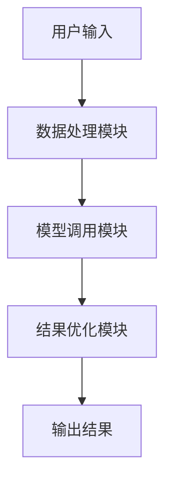
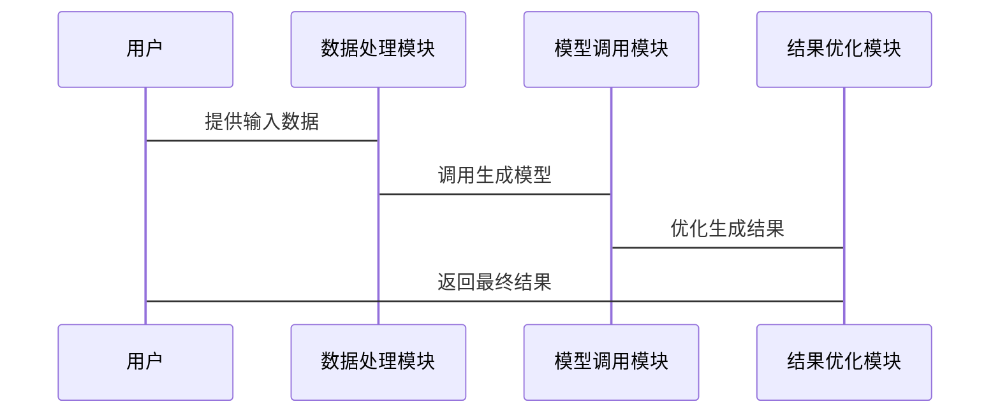

                 


# 多模态创意生成AI Agent：整合LLM与图像、音频生成

## 关键词：多模态生成、LLM、图像生成、音频生成、AI Agent、创意生成

## 摘要：本文深入探讨了多模态创意生成AI Agent的构建与应用，重点介绍了如何将大型语言模型（LLM）与图像、音频生成技术相结合，实现跨模态的创意生成。文章从背景、核心概念、算法原理、系统设计到项目实战，全面解析了多模态创意生成的技术要点，并提供了丰富的案例分析和代码实现，帮助读者理解和掌握多模态创意生成的技术精髓。

---

# 第1章 多模态创意生成AI Agent概述

## 1.1 多模态创意生成的背景与意义

### 1.1.1 多模态数据的定义与特点

多模态数据是指整合了多种数据形式（如文本、图像、音频等）的综合性数据，其核心特点在于信息的丰富性和互补性。通过多模态数据的整合，可以更全面地捕捉和表达信息，从而提升AI Agent的生成能力和用户体验。

### 1.1.2 创意生成的挑战与机遇

创意生成是AI领域的重要任务，其挑战在于如何突破单一模态的限制，实现跨模态的信息融合与协同生成。机遇则体现在多模态数据的广泛应用，尤其是在艺术创作、内容生成等领域，多模态AI Agent展现出巨大的潜力。

### 1.1.3 多模态创意生成AI Agent的定义与目标

多模态创意生成AI Agent是一种能够整合多种数据模态（如文本、图像、音频等）进行创意生成的智能代理。其目标是通过多模态数据的协同处理，生成高质量、多样化的创意内容，满足用户的多样化需求。

---

## 1.2 多模态创意生成的核心概念

### 1.2.1 多模态数据的整合与处理

多模态数据的整合需要考虑数据的异质性，通过统一的表示方法将不同模态的数据进行融合。常见的处理方法包括模态对齐、特征提取和联合学习。

### 1.2.2 LLM与生成模型的协同工作

LLM（Large Language Model）在文本处理方面具有优势，而生成模型（如GAN、VAE）在图像和音频生成方面表现优异。通过LLM与生成模型的协同，可以实现跨模态的创意生成。

### 1.2.3 多模态创意生成的实现流程

多模态创意生成的实现流程包括数据预处理、模型训练、生成控制和结果优化。其中，生成控制是关键，需要根据用户需求调整生成策略，确保输出符合预期。

---

## 1.3 本章小结

本章从背景、概念和实现流程三个方面介绍了多模态创意生成AI Agent的核心内容，为后续章节的深入分析奠定了基础。

---

# 第2章 多模态数据处理与整合

## 2.1 文本数据处理

### 2.1.1 文本预处理与特征提取

文本预处理包括分词、去除停用词、词干提取等步骤，特征提取则采用词袋模型或词嵌模型。

### 2.1.2 文本向量化方法

常用的文本向量化方法包括TF-IDF和Word2Vec，其中Word2Vec更适合语义表达。

### 2.1.3 文本数据的存储与管理

文本数据可以通过数据库或向量索引进行存储和管理，便于后续处理和检索。

## 2.2 图像数据处理

### 2.2.1 图像的获取与预处理

图像获取包括图像采集和数据清洗，预处理步骤包括归一化、标准化等。

### 2.2.2 图像特征提取与表示

图像特征提取采用CNN等深度学习模型，图像表示则通过特征向量实现。

### 2.2.3 图像数据的存储与管理

图像数据可以通过文件系统或数据库进行存储和管理，便于后续处理和检索。

## 2.3 音频数据处理

### 2.3.1 音频的获取与预处理

音频获取包括录音采集和数据清洗，预处理步骤包括降噪、分段等。

### 2.3.2 音频特征提取与表示

音频特征提取采用MFCC等方法，音频表示则通过特征向量实现。

### 2.3.3 音频数据的存储与管理

音频数据可以通过文件系统或数据库进行存储和管理，便于后续处理和检索。

## 2.4 多模态数据的整合与融合

### 2.4.1 数据模态的协同处理

通过模态对齐和特征融合，实现多模态数据的协同处理。

### 2.4.2 多模态数据融合的挑战与解决方案

挑战包括模态异质性和数据不平衡，解决方案包括多模态对齐和联合学习。

## 2.5 本章小结

本章详细介绍了文本、图像和音频数据的处理方法，并探讨了多模态数据融合的关键技术。

---

# 第3章 LLM与生成模型的协同工作

## 3.1 LLM在多模态生成中的角色

### 3.1.1 LLM作为创意生成的文本核心

LLM负责生成高质量的文本内容，是多模态生成的核心驱动力。

### 3.1.2 LLM与图像生成模型的协同

通过LLM生成图像描述，图像生成模型根据描述生成图像。

### 3.1.3 LLM与音频生成模型的协同

通过LLM生成音频描述，音频生成模型根据描述生成音频。

## 3.2 多模态生成模型的选择与训练

### 3.2.1 基于LLM的图像生成模型

选择适合的图像生成模型，如Stable Diffusion，并通过微调进行训练。

### 3.2.2 基于LLM的音频生成模型

选择适合的音频生成模型，如VALL-E，并通过微调进行训练。

### 3.2.3 多模态生成模型的训练策略

采用联合训练或迁移学习策略，提升多模态生成模型的性能。

## 3.3 多模态生成的实现流程

### 3.3.1 输入处理与数据准备

将用户输入的文本、图像或音频进行预处理，准备生成数据。

### 3.3.2 模型调用与生成控制

通过API调用生成模型，根据用户需求调整生成参数。

### 3.3.3 输出结果的整合与优化

将生成的多模态结果进行整合，优化输出质量。

## 3.4 本章小结

本章从LLM的角色、模型选择和训练策略三个方面，详细探讨了多模态生成的技术实现。

---

# 第4章 多模态创意生成的算法原理

## 4.1 多模态模型的训练流程

### 4.1.1 数据预处理

包括数据清洗、归一化和特征提取。

### 4.1.2 模型构建

构建多模态模型，包括编码器和解码器。

### 4.1.3 模型训练

采用反向传播算法，优化模型参数。

## 4.2 多模态生成的实现流程

### 4.2.1 输入处理

将用户输入的文本、图像或音频进行预处理。

### 4.2.2 模型调用

通过API调用生成模型，生成创意内容。

### 4.2.3 结果优化

对生成结果进行优化，提升质量。

---

# 第5章 多模态创意生成的系统设计

## 5.1 系统架构设计

### 5.1.1 系统功能模块

包括数据处理模块、模型调用模块和结果优化模块。

### 5.1.2 系统架构图



### 5.1.3 系统交互流程



## 5.2 系统接口设计

### 5.2.1 API接口设计

定义RESTful API接口，包括输入接口和输出接口。

### 5.2.2 接口文档

提供详细的接口文档，包括请求格式、响应格式和错误处理。

## 5.3 本章小结

本章从系统架构、接口设计和交互流程三个方面，详细介绍了多模态创意生成系统的实现方案。

---

# 第6章 项目实战

## 6.1 环境安装

### 6.1.1 安装Python

安装Python 3.8及以上版本。

### 6.1.2 安装依赖库

安装必要的依赖库，如numpy、torch、transformers等。

## 6.2 系统核心实现

### 6.2.1 文本生成实现

使用LLM生成文本内容。

### 6.2.2 图像生成实现

使用图像生成模型生成图像。

### 6.2.3 音频生成实现

使用音频生成模型生成音频。

## 6.3 代码实现与解读

### 6.3.1 文本生成代码

```python
from transformers import AutoModelForCausalLM, AutoTokenizer

model_name = "gpt2"
tokenizer = AutoTokenizer.from_pretrained(model_name)
model = AutoModelForCausalLM.from_pretrained(model_name)

def generate_text(prompt, max_length=50):
    inputs = tokenizer.encode(prompt, return_tensors="pt")
    outputs = model.generate(inputs, max_length=max_length, do_sample=True)
    return tokenizer.decode(outputs[0], skip_special_tokens=True)
```

### 6.3.2 图像生成代码

```python
import torch
from diffusers import StableDiffusionPipeline

pipe = StableDiffusionPipeline.from_pretrained("stability-ai/sdxl")
def generate_image(prompt):
    return pipe(prompt)
```

### 6.3.3 音频生成代码

```python
import torch
from audio_diffusion_model import AudioDiffusion

model = AudioDiffusion()
def generate_audio(prompt):
    return model.generate_audio(prompt)
```

## 6.4 案例分析与结果展示

### 6.4.1 文本生成案例

输入文本描述，生成相应的文本内容。

### 6.4.2 图像生成案例

输入图像描述，生成相应的图像。

### 6.4.3 音频生成案例

输入音频描述，生成相应的音频。

## 6.5 本章小结

本章通过实际项目案例，详细展示了多模态创意生成系统的实现过程和结果。

---

# 第7章 最佳实践与未来发展

## 7.1 最佳实践

### 7.1.1 数据处理的注意事项

确保数据的多样性和高质量。

### 7.1.2 模型选择的建议

根据任务需求选择合适的生成模型。

### 7.1.3 系统设计的优化

优化系统架构和接口设计，提升性能和用户体验。

## 7.2 未来发展方向

### 7.2.1 多模态生成技术的进一步融合

探索更高效、更自然的多模态生成方法。

### 7.2.2 创意生成的智能化与个性化

推动创意生成的智能化和个性化，满足用户的多样化需求。

### 7.2.3 多模态生成的行业应用

拓展多模态生成技术在更多行业的应用，推动技术的商业化和普及。

## 7.3 本章小结

本章总结了多模态创意生成技术的最佳实践，并展望了未来的发展方向。

---

# 作者信息

作者：AI天才研究院/AI Genius Institute & 禅与计算机程序设计艺术 /Zen And The Art of Computer Programming

---

以上是《多模态创意生成AI Agent：整合LLM与图像、音频生成》的技术博客文章大纲和内容，希望对您有所帮助！

