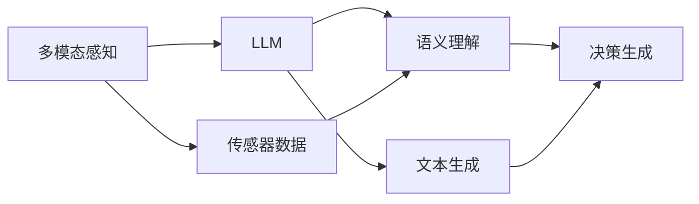
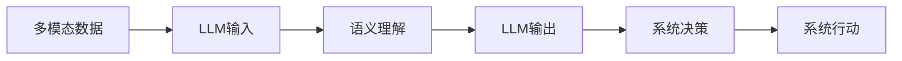
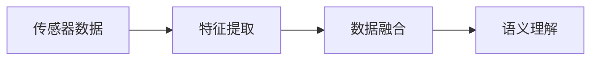
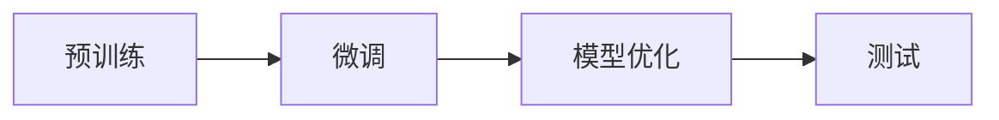
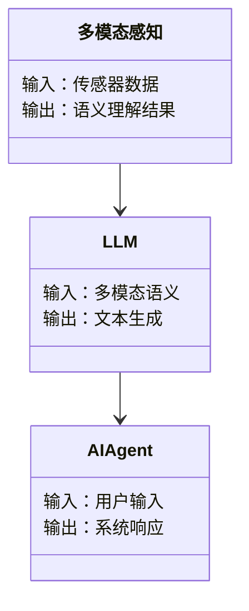
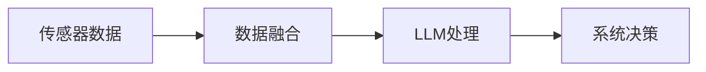
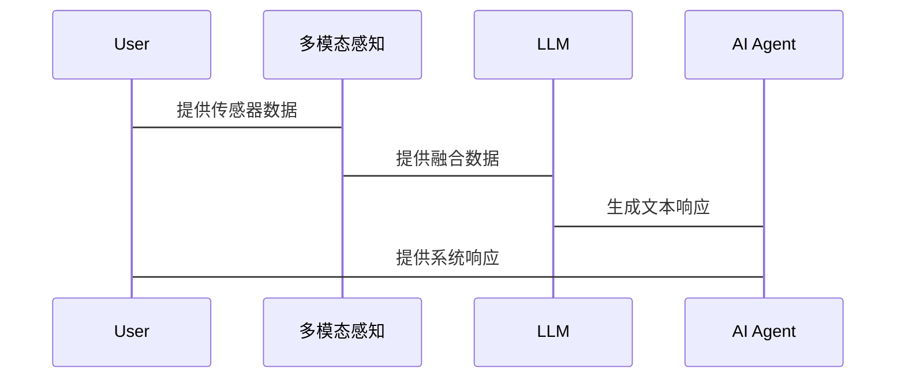

                 


# 多模态感知AI Agent：LLM与多种传感器输入的协同

> 关键词：多模态感知，LLM，传感器输入，协同，AI Agent，深度学习

> 摘要：本文深入探讨了多模态感知AI Agent与大语言模型（LLM）的协同工作原理。通过分析多模态数据处理、LLM的语义理解和协同机制，详细阐述了如何通过多种传感器输入与LLM结合，实现更智能的AI Agent系统。文章从背景介绍、核心概念、算法原理、系统架构到项目实战，全面解析了多模态感知AI Agent的设计与实现，并提供了丰富的图表和代码示例，帮助读者理解与实践。

---

# 第1章: 多模态感知AI Agent的背景与概念

## 1.1 多模态感知的背景与意义

### 1.1.1 多模态感知的定义与特点

多模态感知是指通过多种传感器或数据源（如视觉、听觉、触觉等）获取信息，并将其综合处理以获得更全面的理解。其特点包括：

- **多源性**：整合来自不同传感器的数据。
- **互补性**：不同传感器的数据相互补充，提高感知的准确性。
- **实时性**：能够快速处理和响应动态环境。
- **鲁棒性**：在单一传感器失效时，仍能通过其他传感器数据进行有效感知。

### 1.1.2 多模态感知在AI Agent中的作用

AI Agent需要通过感知环境来做出决策和行动。多模态感知为其提供了更丰富的环境信息，使其能够更好地理解复杂场景。

- **环境理解**：通过多模态数据，AI Agent能够更全面地理解环境。
- **决策优化**：多模态数据的融合能够提高决策的准确性和鲁棒性。
- **人机交互**：多模态感知能够支持更自然的人机交互方式。

### 1.1.3 多模态感知的应用场景与优势

#### 1.1.3.1 应用场景

- **智能机器人**：结合视觉、听觉和触觉等多种传感器，实现更智能的交互。
- **自动驾驶**：融合摄像头、激光雷达、雷达等多种传感器数据，提高行驶安全性。
- **智能安防**：通过视频、音频等多种传感器数据，实现更精准的安防监控。

#### 1.1.3.2 优势

- **提高感知精度**：通过多模态数据的融合，减少单一传感器的局限性。
- **增强系统鲁棒性**：在复杂或不确定的环境中，多模态感知能够提供更可靠的决策依据。
- **支持复杂任务**：多模态感知能够处理复杂场景中的信息，支持更高级的AI Agent任务。

## 1.2 LLM的基本概念与特点

### 1.2.1 LLM的定义

大语言模型（LLM，Large Language Model）是一种基于深度学习的自然语言处理模型，通常使用Transformer架构，能够处理大规模的文本数据，并生成与上下文相关的自然语言文本。

### 1.2.2 LLM的核心技术与优势

- **深度学习技术**：基于神经网络的深度学习模型，能够捕捉复杂的语言模式。
- **大规模训练数据**：通过训练海量文本数据，模型能够理解多种语言和语境。
- **强大的生成能力**：能够生成连贯、自然的文本，支持多种任务，如问答、对话生成等。

### 1.2.3 LLM在AI Agent中的应用潜力

- **自然语言理解**：LLM能够理解用户意图，提供更智能的交互方式。
- **多模态信息处理**：结合多模态数据，LLM能够提供更全面的信息理解和生成能力。
- **动态对话生成**：基于实时感知的多模态数据，生成动态、个性化的对话内容。

## 1.3 多模态感知与LLM的协同意义

### 1.3.1 多模态感知与LLM的协同机制

- **数据协同**：多模态感知提供的数据为LLM的语义理解提供更丰富的上下文信息。
- **任务协同**：通过多模态数据的融合，LLM能够更好地理解任务需求，生成更准确的响应。
- **反馈协同**：通过多模态感知的实时反馈，LLM能够动态调整生成内容，提高交互体验。

### 1.3.2 多模态感知与LLM的协同优势

- **提升语义理解能力**：通过多模态数据的融合，LLM能够更准确地理解用户的意图和需求。
- **增强交互体验**：多模态感知提供了更丰富的交互方式，使得LLM能够支持更自然、更高效的对话。
- **支持复杂任务**：多模态感知与LLM的协同能够处理更复杂、更动态的任务场景。

---

## 1.4 多模态感知与LLM的核心概念对比

### 表1: 多模态感知与LLM的核心概念对比

| **核心概念** | **多模态感知** | **LLM** |
|--------------|----------------|---------|
| 数据来源     | 多种传感器     | 文本数据 |
| 数据类型     | 图像、语音、文本等 | 文本     |
| 处理目标     | 理解环境       | 理解语言 |
| 输出形式     | 行为决策、环境描述 | 文本生成 |
| 技术基础     | 传感器融合技术 | 深度学习 |

---

## 1.5 多模态感知与LLM的协同关系

### 图1: 多模态感知与LLM的协同关系



---

# 第2章: 多模态感知与LLM的核心概念与联系

## 2.1 多模态感知的核心概念

### 2.1.1 多模态数据的定义与分类

多模态数据是指来自不同传感器或数据源的多种类型的数据。常见的多模态数据类型包括：

- **视觉数据**：图像、视频等。
- **听觉数据**：语音、音频等。
- **触觉数据**：力反馈、触感等。
- **嗅觉数据**：气味信息等。

### 2.1.2 多模态数据的特征与处理方法

多模态数据的特征包括异构性、时序性和相关性。处理方法通常包括：

- **数据融合**：将不同模态的数据进行融合，以获得更全面的信息。
- **特征提取**：对不同模态的数据进行特征提取，以降低数据维度。
- **模态对齐**：将不同模态的数据对齐到同一时间或空间参考系。

### 2.1.3 多模态感知的实现方式

多模态感知的实现方式包括：

- **基于规则的方法**：通过预定义的规则对多模态数据进行处理。
- **基于学习的方法**：使用机器学习或深度学习模型对多模态数据进行自动处理。

---

## 2.2 LLM的核心概念

### 2.2.1 LLM的模型结构与训练方法

LLM通常基于Transformer架构，通过自注意力机制和前馈网络进行训练。训练方法包括：

- **预训练**：使用大规模的文本数据进行无监督预训练。
- **微调**：在特定任务上进行有监督微调。

### 2.2.2 LLM的输入输出机制

- **输入**：通常是文本序列。
- **输出**：生成与输入相关的文本序列。

### 2.2.3 LLM的语义理解能力

通过大规模预训练，LLM能够理解上下文，并生成与上下文相关的文本。

---

## 2.3 多模态感知与LLM的协同关系

### 2.3.1 多模态数据与LLM的输入协同

多模态感知提供的数据可以作为LLM的输入，帮助模型更好地理解上下文。

### 2.3.2 多模态感知与LLM的输出协同

LLM的输出可以作为多模态感知系统的决策依据，指导系统的行动。

### 2.3.3 协同过程中的信息流与数据处理

- **信息流**：多模态感知的数据输入LLM，LLM生成文本输出，指导系统的行动。
- **数据处理**：通过多模态数据的融合和处理，提高LLM的语义理解能力。

---

## 2.4 核心概念

### 图2: 多模态感知与LLM的核心概念关系



---

## 第3章: 多模态感知AI Agent的算法原理

### 3.1 多模态数据融合算法

#### 3.1.1 数据融合方法

- **特征级融合**：将不同模态的特征向量进行融合。
- **决策级融合**：将不同模态的决策结果进行融合。

#### 3.1.2 数据融合流程



---

## 3.2 LLM的训练与优化

#### 3.2.1 LLM的训练流程



---

## 3.3 协同算法

### 3.3.1 协同算法的数学模型

$$ P(y|x) = \argmax_{y} P(y|x_{\text{multi}}) $$

其中，$x_{\text{multi}}$表示多模态输入数据。

### 3.3.2 协同算法的实现步骤

1. **多模态数据输入**：将多模态数据输入协同算法。
2. **数据融合**：对多模态数据进行融合，生成统一的输入向量。
3. **LLM处理**：将融合后的数据输入LLM，生成语义理解结果。
4. **输出决策**：根据LLM的输出结果，生成最终的决策。

---

## 4章: 系统分析与架构设计方案

### 4.1 问题场景介绍

考虑一个智能助手AI Agent，需要通过多模态感知（如视觉、听觉）与LLM协同工作，实现智能对话和任务执行。

### 4.2 系统功能设计

#### 4.2.1 领域模型



---

## 4.3 系统架构设计

### 4.3.1 系统架构图



---

## 4.4 系统接口设计

- **输入接口**：多模态传感器数据接口。
- **输出接口**：LLM的文本生成结果接口。

---

## 4.5 系统交互设计

### 4.5.1 序列图



---

## 5章: 项目实战

### 5.1 环境安装

```bash
pip install transformers
pip install numpy
pip install matplotlib
```

### 5.2 系统核心实现

#### 5.2.1 多模态数据融合代码

```python
import numpy as np

def fuse_modalities(modalities):
    return np.mean(modalities, axis=0)
```

#### 5.2.2 LLM处理代码

```python
from transformers import AutoModelForCausalLM, AutoTokenizer

tokenizer = AutoTokenizer.from_pretrained('gpt2')
model = AutoModelForCausalLM.from_pretrained('gpt2')
```

### 5.3 代码应用解读与分析

- **数据融合**：将多模态数据进行融合，生成统一的输入向量。
- **LLM处理**：将融合后的数据输入LLM，生成文本响应。
- **系统决策**：根据生成的文本响应，做出最终的决策。

### 5.4 实际案例分析

#### 5.4.1 案例分析

考虑一个智能助手，用户通过语音和视觉输入指令，AI Agent通过多模态感知和LLM协同处理，生成响应。

### 5.5 项目小结

通过项目实战，我们验证了多模态感知与LLM协同工作的可行性，并展示了其在实际场景中的应用潜力。

---

## 6章: 最佳实践、小结、注意事项、拓展阅读

### 6.1 小结

本文深入探讨了多模态感知AI Agent与LLM的协同工作原理，通过理论分析和实际案例，展示了其在智能系统中的应用价值。

### 6.2 注意事项

- **数据质量**：多模态数据的质量直接影响协同效果。
- **模型训练**：需要大量的数据和计算资源来训练高效的LLM。
- **系统优化**：多模态感知与LLM的协同需要不断优化和调整。

### 6.3 拓展阅读

- **推荐书籍**：《Deep Learning》、《自然语言处理实战》。
- **推荐论文**：《Attention Is All You Need》、《BERT: Pre-training of Deep Bidirectional Transformers for NLP》。

---

作者：AI天才研究院/AI Genius Institute & 禅与计算机程序设计艺术 /Zen And The Art of Computer Programming

