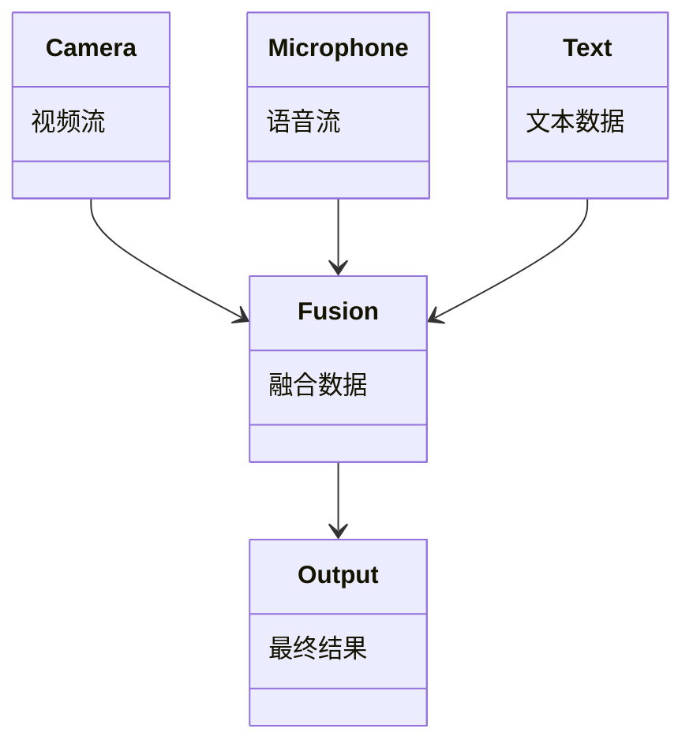
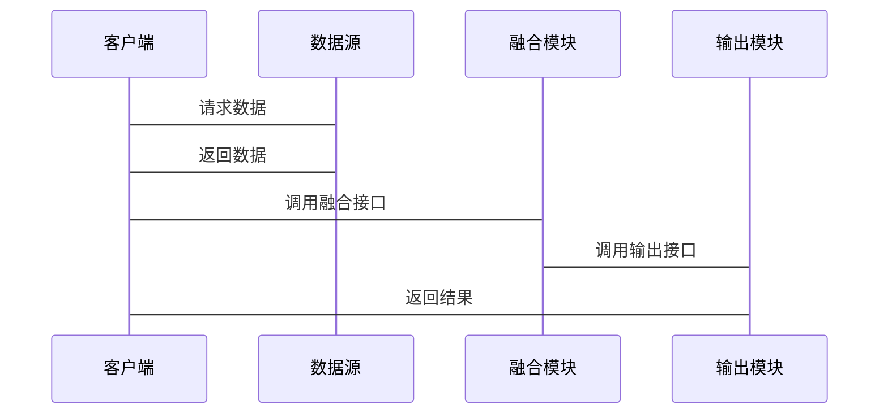

                 


# 多模态融合技术：增强AI Agent的感知与理解能力

---

## 关键词：
多模态融合，AI Agent，感知能力，理解能力，数据融合，跨模态交互

---

## 摘要：
多模态融合技术是提升AI Agent感知与理解能力的核心技术，通过整合多种模态数据（如视觉、听觉、文本等），实现更全面的环境认知与智能决策。本文从多模态融合的背景、核心概念、算法原理、系统架构到实际应用，全面解析其技术细节与实现路径，旨在为AI Agent的开发与优化提供理论支持与实践指导。

---

# 第一部分: 多模态融合技术基础

## 第1章: 多模态融合技术概述

### 1.1 多模态融合的核心概念
多模态融合技术是指将多种数据源（如图像、文本、语音、传感器数据等）进行协同处理，以提升AI Agent对复杂环境的感知与理解能力。其核心在于通过融合不同模态的信息，克服单一模态的局限性，实现更全面的智能推理与决策。

#### 1.1.1 多模态数据的定义与特点
- **定义**：多模态数据是指来自不同感官渠道或数据类型的多样化数据，例如图像、文本、语音、视频等。
- **特点**：
  - **互补性**：不同模态数据能够互相补充，提供更全面的信息。
  - **多样性**：多模态数据能够覆盖更广泛的应用场景。
  - **复杂性**：多模态数据的处理需要复杂的算法与架构支持。

#### 1.1.2 多模态融合的背景与意义
- **背景**：随着AI技术的发展，单一模态的数据处理已难以满足复杂场景的需求，多模态融合成为提升AI Agent智能水平的关键技术。
- **意义**：通过多模态融合，AI Agent能够更准确地理解环境、更高效地完成任务，并在实际应用中展现出更强的适应性。

#### 1.1.3 多模态融合技术的边界与外延
- **边界**：多模态融合的核心在于数据的协同处理，其边界在于如何有效地整合不同模态的数据，并避免信息冗余。
- **外延**：多模态融合技术不仅适用于AI Agent，还可应用于计算机视觉、自然语言处理、机器人控制等领域。

---

### 1.2 多模态融合技术的应用场景
多模态融合技术广泛应用于多个领域，以下是典型应用场景：

#### 1.2.1 计算机视觉中的多模态融合
- **目标检测**：结合图像和红外数据，提升目标检测的准确率。
- **图像分割**：通过多模态数据的融合，提高图像分割的精细度。

#### 1.2.2 自然语言处理中的多模态融合
- **跨模态检索**：结合文本和图像，实现更精准的图像搜索。
- **情感分析**：融合文本和语音数据，提升情感分析的准确性。

#### 1.2.3 跨模态检索与推荐系统
- **推荐系统**：结合用户的行为数据和内容特征，提供个性化推荐。
- **跨模态检索**：通过多模态数据的融合，实现跨模态的高效检索。

---

### 1.3 多模态融合技术的发展历程
多模态融合技术经历了从简单到复杂的演进过程，以下是其发展历程：

#### 1.3.1 多模态融合技术的起源
- 早期研究主要集中在单一模态的数据处理，多模态融合的概念开始萌芽。

#### 1.3.2 多模态融合技术的演进
- 随着深度学习的发展，多模态融合技术逐渐成熟，开始在实际应用中发挥作用。

#### 1.3.3 当前技术趋势与挑战
- **趋势**：多模态融合技术向更高效、更智能的方向发展，应用场景不断扩大。
- **挑战**：如何有效整合多种模态数据，提升融合效果，仍是当前研究的难点。

---

### 1.4 本章小结
本章从多模态融合的核心概念、应用场景和发展历程三个方面，全面介绍了多模态融合技术的基本知识。通过理解这些内容，读者可以对多模态融合技术有一个初步的认识。

---

## 第2章: 多模态融合的核心概念与联系

### 2.1 多模态数据的融合层次
多模态数据的融合可以分为以下三个层次：

#### 2.1.1 模态内部融合
- **定义**：在同一模态内部进行数据的融合，例如图像中的颜色和纹理信息的融合。
- **特点**：处理单一模态内部的信息，提升该模态的表达能力。

#### 2.1.2 模态之间融合
- **定义**：将不同模态的数据进行融合，例如图像和文本的结合。
- **特点**：跨模态的信息协同，能够提供更全面的感知能力。

#### 2.1.3 跨模态联合推理
- **定义**：结合多个模态的数据，进行联合推理和决策。
- **特点**：能够处理复杂的场景，提供更智能的决策支持。

---

### 2.2 多模态数据的融合模式
多模态数据的融合模式可以分为以下三种：

#### 2.2.1 基于特征的融合
- **定义**：通过提取各模态的特征，并将这些特征进行融合。
- **特点**：特征提取简单，但可能丢失部分信息。

#### 2.2.2 基于注意力机制的融合
- **定义**：利用注意力机制，对各模态的重要性进行加权融合。
- **特点**：能够捕捉各模态之间的关联性，提升融合效果。

#### 2.2.3 基于生成模型的融合
- **定义**：通过生成模型，将各模态的数据进行联合生成。
- **特点**：生成能力强，但计算复杂度较高。

---

### 2.3 多模态数据的融合架构
多模态数据的融合架构可以分为以下三种：

#### 2.3.1 分层融合架构
- **定义**：将各模态的数据分别处理后，再进行融合。
- **特点**：处理简单，但可能无法充分利用各模态之间的关联性。

#### 2.3.2 并行融合架构
- **定义**：将各模态的数据并行处理后，进行融合。
- **特点**：能够充分利用各模态的数据，但可能需要较多的计算资源。

#### 2.3.3 串行融合架构
- **定义**：将各模态的数据依次处理后，进行融合。
- **特点**：处理流程清晰，但可能效率较低。

---

### 2.4 多模态数据的融合评估
多模态数据的融合评估可以从以下几个方面进行：

#### 2.4.1 融合效果的评价指标
- **准确率**：融合后模型的分类准确率。
- **召回率**：融合后模型的召回率。
- **F1值**：融合后模型的F1值。

#### 2.4.2 融合性能的对比分析
- **对比分析**：通过不同融合模式的对比，找出最优的融合方式。

#### 2.4.3 融合效果的可视化
- **可视化工具**：使用热力图、混淆矩阵等工具，对融合效果进行可视化分析。

---

### 2.5 本章小结
本章从多模态数据的融合层次、融合模式和融合架构三个方面，详细分析了多模态融合的核心概念与联系。通过理解这些内容，读者可以更好地理解多模态融合的实现机制。

---

## 第3章: 多模态融合技术的算法原理

### 3.1 多模态融合的注意力机制
注意力机制是多模态融合中的关键技术，以下是其实现原理：

#### 3.1.1 注意力机制的基本原理
- **定义**：注意力机制通过计算各模态的重要性权重，对各模态的数据进行加权融合。
- **公式**：$$ \text{Attention}(Q, K, V) = \text{softmax}\left(\frac{QK^T}{\sqrt{d_k}}\right)V $$

#### 3.1.2 多模态注意力模型
- **实现**：通过计算各模态之间的注意力权重，进行融合。
- **特点**：能够捕捉各模态之间的关联性，提升融合效果。

#### 3.1.3 跨模态注意力的实现
- **跨模态注意力**：通过计算不同模态之间的注意力权重，进行融合。
- **应用**：在图像-文本跨模态检索中广泛应用。

---

### 3.2 多模态融合的变换器模型
变换器模型是多模态融合中的另一种关键技术，以下是其实现原理：

#### 3.2.1 变换器的基本结构
- **编码器**：将输入数据进行编码，提取特征。
- **解码器**：将编码后的特征进行解码，生成输出。

#### 3.2.2 多模态变换器的设计
- **多模态编码器**：通过多个模态的编码器，提取各模态的特征。
- **跨模态解码器**：通过解码器，将各模态的特征进行融合，生成最终的输出。

#### 3.2.3 变换器在多模态融合中的应用
- **应用**：在图像-文本跨模态生成中广泛应用。

---

### 3.3 多模态融合的对比学习
对比学习是多模态融合中的另一种关键技术，以下是其实现原理：

#### 3.3.1 对比学习的基本原理
- **定义**：通过对比不同模态的数据，计算其相似性，提升融合效果。
- **公式**：$$ \mathcal{L} = -\log \text{sim}(x_i, y_j) + \log \sum_{k \neq j} \text{sim}(x_i, y_k) $$

#### 3.3.2 多模态对比学习的实现
- **实现**：通过计算不同模态之间的相似性，进行对比学习。
- **特点**：能够提升跨模态数据的相似性，增强融合效果。

#### 3.3.3 对比学习在多模态融合中的优势
- **优势**：能够有效提升跨模态数据的相似性，增强融合效果。

---

### 3.4 多模态融合的图神经网络
图神经网络是多模态融合中的另一种关键技术，以下是其实现原理：

#### 3.4.1 图神经网络的基本原理
- **定义**：通过构建图结构，对数据进行建模，提取特征。
- **公式**：$$ h_i^{(l+1)} = \text{aggregate}(\{h_j^{(l)} | j \in \mathcal{N}(i)\}) $$

#### 3.4.2 多模态图神经网络的设计
- **多模态图构建**：将不同模态的数据构建为图结构。
- **跨模态图传播**：通过图传播，进行多模态数据的融合。

#### 3.4.3 图神经网络在多模态融合中的应用
- **应用**：在社交网络分析、推荐系统等领域广泛应用。

---

### 3.5 本章小结
本章从多模态融合的注意力机制、变换器模型、对比学习和图神经网络四个方面，详细讲解了多模态融合的算法原理。通过理解这些内容，读者可以更好地掌握多模态融合的核心技术。

---

## 第4章: 多模态融合技术的系统架构设计

### 4.1 问题场景介绍
多模态融合技术的应用场景可以是多种多样的，例如智能安防、智能客服、智能医疗等。

---

### 4.2 项目介绍
以智能安防为例，我们需要设计一个多模态融合系统，实现图像、文本、语音等多种数据的融合。

---

### 4.3 系统功能设计
以下是系统的功能模块设计：

#### 4.3.1 领域模型（Mermaid 类图）


#### 4.3.2 系统架构（Mermaid 架构图）


#### 4.3.3 系统接口设计
- **输入接口**：接收多种模态的数据。
- **输出接口**：输出融合后的结果。

#### 4.3.4 系统交互（Mermaid 序列图）


---

### 4.4 本章小结
本章从系统功能设计、架构设计、接口设计和交互设计四个方面，详细讲解了多模态融合技术的系统架构设计。通过理解这些内容，读者可以更好地掌握多模态融合技术的实现方法。

---

## 第5章: 多模态融合技术的项目实战

### 5.1 环境安装
- **工具安装**：安装Python、深度学习框架（如TensorFlow、PyTorch）、多模态数据处理库（如OpenCV、librosa）等。

### 5.2 系统核心实现源代码
以下是一个多模态融合的简单实现示例：

#### 5.2.1 多模态融合的注意力机制实现
```python
import tensorflow as tf

def attention_model():
    input_image = tf.keras.Input(shape=(224, 224, 3))
    input_text = tf.keras.Input(shape=(128,))
    
    # 图像特征提取
    base_cnn = tf.keras.applications.MobileNetV2(weights='imagenet', include_top=False)
    feature_image = base_cnn(input_image)
    
    # 文本特征提取
    feature_text = tf.keras.layers.Dense(256, activation='relu')(input_text)
    
    # 注意力融合
    attention = tf.keras.layers.Attention()([feature_image, feature_text])
    
    # 输出层
    output = tf.keras.layers.Dense(10, activation='softmax')(attention)
    
    model = tf.keras.Model(inputs=[input_image, input_text], outputs=output)
    return model
```

#### 5.2.2 多模态融合的变换器模型实现
```python
import tensorflow as tf

def transformer_model():
    input_image = tf.keras.Input(shape=(224, 224, 3))
    input_text = tf.keras.Input(shape=(128,))
    
    # 图像特征提取
    base_cnn = tf.keras.applications.MobileNetV2(weights='imagenet', include_top=False)
    feature_image = base_cnn(input_image)
    
    # 文本特征提取
    feature_text = tf.keras.layers.Dense(256, activation='relu')(input_text)
    
    # 变换器融合
    encoder = tf.keras.layers.Dense(256, activation='relu')
    decoder = tf.keras.layers.Dense(256, activation='relu')
    
    feature_image = encoder(feature_image)
    feature_text = encoder(feature_text)
    
    # 跨模态融合
    fusion_feature = tf.keras.layers.Add()([feature_image, feature_text])
    
    # 输出层
    output = tf.keras.layers.Dense(10, activation='softmax')(fusion_feature)
    
    model = tf.keras.Model(inputs=[input_image, input_text], outputs=output)
    return model
```

---

### 5.3 代码应用解读与分析
- **代码解读**：上述代码展示了多模态融合的注意力机制和变换器模型的实现方法。
- **代码分析**：通过上述代码，可以理解多模态融合技术的核心实现方法。

---

### 5.4 实际案例分析和详细讲解剖析
以图像-文本跨模态检索为例，详细分析多模态融合技术的实际应用。

---

### 5.5 项目小结
通过上述项目实战，读者可以更好地理解多模态融合技术的实现方法，并能够将其应用于实际项目中。

---

## 第6章: 多模态融合技术的最佳实践

### 6.1 技术选型建议
- **选择合适的融合模式**：根据实际需求，选择合适的融合模式。
- **选择合适的算法框架**：根据实际场景，选择合适的算法框架。

### 6.2 开发注意事项
- **数据预处理**：确保数据的高质量。
- **模型调优**：通过实验，不断优化模型性能。

### 6.3 测试与验证
- **测试方法**：通过实验，验证模型的性能。
- **验证指标**：使用准确率、召回率等指标，评估模型性能。

---

## 第7章: 总结与展望

### 7.1 本章小结
通过本文的介绍，读者可以全面了解多模态融合技术的核心概念、算法原理、系统架构和实际应用。

### 7.2 展望
未来，随着AI技术的不断发展，多模态融合技术将有更广泛的应用场景，并在算法和架构上不断创新。

---

## 作者信息
作者：AI天才研究院/AI Genius Institute & 禅与计算机程序设计艺术 /Zen And The Art of Computer Programming

---

通过以上内容，读者可以系统地了解多模态融合技术的核心概念、算法原理、系统架构和实际应用，从而更好地掌握多模态融合技术的实现方法。

