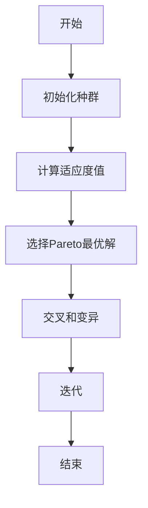
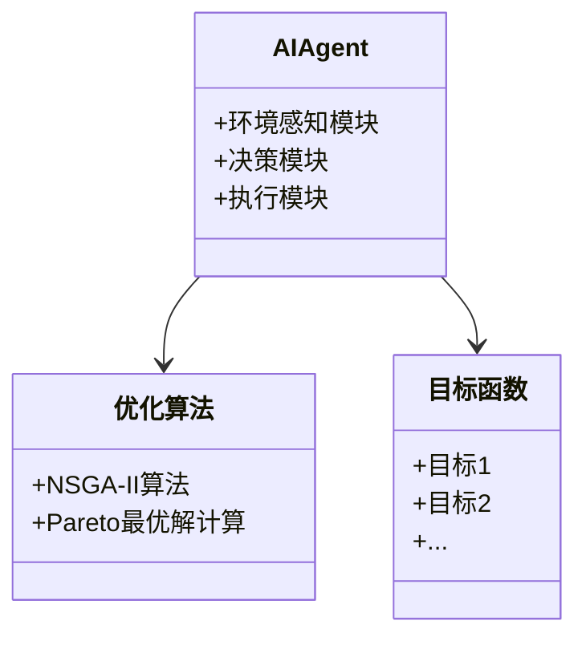
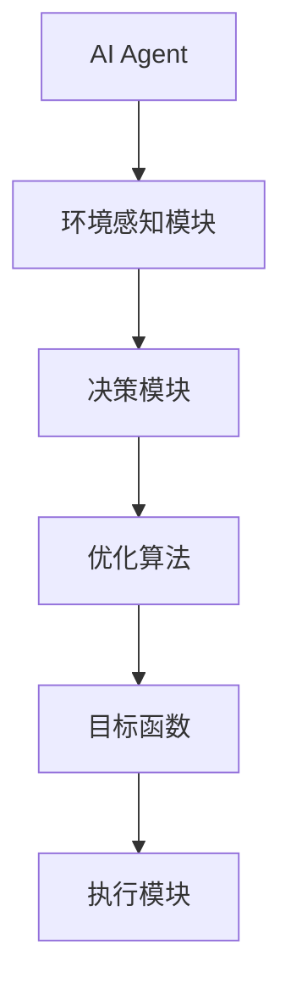
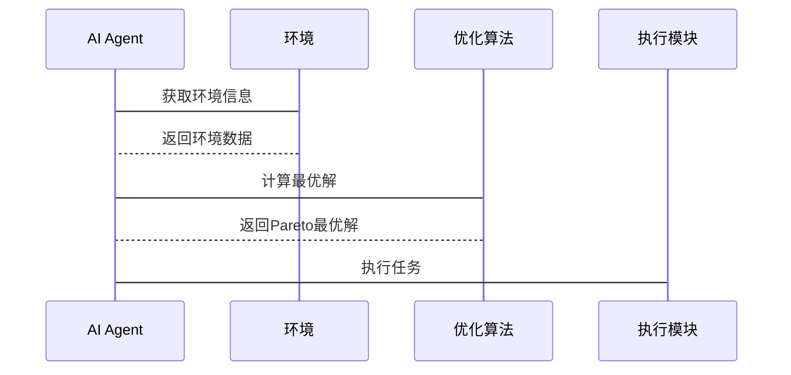

                 


# 多目标优化AI Agent：增强LLM的复杂决策能力

## 关键词：
多目标优化, AI Agent, LLM, 复杂决策, 大语言模型

## 摘要：
本文详细探讨了多目标优化AI Agent如何增强大语言模型（LLM）在复杂决策问题中的能力。通过分析多目标优化的基本原理、AI Agent的决策机制以及它们与LLM的结合，本文为读者提供了一个全面的技术视角。文章从背景介绍、核心概念、算法原理、系统架构到项目实战，逐步深入，帮助读者理解如何通过多目标优化提升AI Agent的决策能力。

---

# 第一部分: 多目标优化AI Agent背景介绍

## 第1章: 多目标优化AI Agent概述

### 1.1 多目标优化AI Agent的定义与特点
#### 1.1.1 多目标优化的基本概念
多目标优化是一种在多个相互冲突的目标之间寻找最优解的方法。与单目标优化不同，多目标优化需要在多个目标之间进行权衡，找到帕累托最优解。

#### 1.1.2 AI Agent的核心属性
AI Agent是一种能够感知环境、自主决策并执行任务的智能实体。它具备学习能力、推理能力和自主决策能力。

#### 1.1.3 多目标优化与AI Agent的结合
通过将多目标优化算法嵌入AI Agent的决策机制中，可以使其在面对多个目标时做出更优的决策。

### 1.2 多目标优化AI Agent的应用场景
#### 1.2.1 复杂决策问题的典型场景
例如，在金融投资中，投资者需要在风险和收益之间找到平衡点。

#### 1.2.2 多目标优化在AI Agent中的作用
通过多目标优化，AI Agent可以在多个目标之间进行权衡，找到最优解决方案。

#### 1.2.3 与传统AI Agent的区别
传统AI Agent通常只能处理单目标优化问题，而多目标优化AI Agent能够处理多个目标的优化问题。

### 1.3 问题背景与挑战
#### 1.3.1 多目标优化的核心问题
在多个目标之间寻找最优解，通常需要权衡不同目标的优先级。

#### 1.3.2 AI Agent在复杂决策中的局限性
传统AI Agent在处理复杂决策问题时，往往只能考虑单一目标，无法在多个目标之间进行权衡。

#### 1.3.3 多目标优化如何解决这些挑战
通过多目标优化算法，AI Agent可以在多个目标之间找到最优解，从而提高决策能力。

## 第2章: 多目标优化AI Agent的核心概念

### 2.1 多目标优化的基本原理
#### 2.1.1 多目标优化的定义
多目标优化是一种在多个目标之间寻找最优解的方法。

#### 2.1.2 多目标优化的数学模型
多目标优化问题可以表示为：
$$
\min f_1(x), f_2(x), \ldots, f_n(x)
$$
其中，$x$是决策变量，$f_i(x)$是目标函数。

#### 2.1.3 Pareto最优解的概念
Pareto最优解是指在不使其他目标变差的情况下，无法进一步优化某个目标的解。

### 2.2 AI Agent的决策机制
#### 2.2.1 基于多目标优化的决策过程
AI Agent通过多目标优化算法，在多个目标之间找到最优解。

#### 2.2.2 多目标优化算法的选择与应用
选择适合的多目标优化算法（如NSGA-II）并将其应用于AI Agent的决策过程。

#### 2.2.3 复杂决策问题的建模方法
将复杂决策问题建模为多目标优化问题，并通过算法找到最优解。

### 2.3 多目标优化与大语言模型的结合
#### 2.3.1 大语言模型的基本原理
大语言模型（LLM）是一种基于深度学习的自然语言处理模型，能够理解和生成人类语言。

#### 2.3.2 多目标优化如何增强LLM的决策能力
通过多目标优化，LLM可以在多个目标之间进行权衡，从而做出更优的决策。

#### 2.3.3 LLM在多目标优化中的角色与作用
LLM可以作为多目标优化问题的目标函数，帮助算法找到最优解。

---

# 第二部分: 多目标优化AI Agent的核心概念与联系

## 第3章: 多目标优化算法原理

### 3.1 基于多目标优化的AI Agent算法
#### 3.1.1 NSGA-II算法概述
NSGA-II是一种经典的多目标优化算法，通过遗传算法的思想找到Pareto最优解。

#### 3.1.2 NSGA-II算法的实现步骤
1. 初始化种群。
2. 计算适应度值。
3. 进行配对和交叉操作。
4. 选择Pareto最优解。
5. 重复迭代直到满足终止条件。

#### 3.1.3 NSGA-II算法的优缺点分析
优点：能够找到Pareto最优解；缺点：计算复杂度较高。

### 3.2 多目标优化算法的数学模型
#### 3.2.1 多目标优化问题的数学表达
$$
\min f_1(x), f_2(x), \ldots, f_n(x)
$$

#### 3.2.2 Pareto前沿的定义与计算
Pareto前沿是所有Pareto最优解的集合。

#### 3.2.3 目标函数的权重分配方法
通过赋予不同目标函数不同的权重，可以在多目标优化中实现目标的优先级。

### 3.3 多目标优化算法的实现
#### 3.3.1 NSGA-II算法的Python实现代码
```python
import random

def crossover(parent1, parent2):
    child1 = []
    child2 = []
    for i in range(len(parent1)):
        if random.random() < 0.5:
            child1.append(parent1[i])
            child2.append(parent2[i])
        else:
            child1.append(parent2[i])
            child2.append(parent1[i])
    return child1, child2

def mutate(individual):
    for i in range(len(individual)):
        if random.random() < 0.1:
            individual[i] = 1 - individual[i]
    return individual

# 更多实现细节略
```

#### 3.3.2 代码功能分析与优化建议
代码实现了NSGA-II算法的交叉和变异操作，通过随机选择父代个体的基因进行操作。

#### 3.3.3 多目标优化算法的性能评估
通过适应度值和收敛速度来评估算法的性能。

## 第4章: 多目标优化与AI Agent的实体关系图

### 4.1 多目标优化AI Agent的实体关系
#### 4.1.1 实体关系图的构建
使用Mermaid图展示多目标优化AI Agent的实体关系。

### 4.2 多目标优化AI Agent的算法流程图
#### 4.2.1 NSGA-II算法的流程图


### 4.3 多目标优化AI Agent的系统架构图
#### 4.3.1 系统架构图


---

# 第三部分: 多目标优化AI Agent的系统分析与架构设计

## 第5章: 系统分析与架构设计

### 5.1 问题场景介绍
#### 5.1.1 项目介绍
本项目旨在通过多目标优化算法增强AI Agent的决策能力。

#### 5.1.2 系统功能设计
AI Agent需要具备感知环境、分析问题、优化决策和执行任务的能力。

#### 5.1.3 系统架构设计


### 5.2 系统架构设计
#### 5.2.1 系统功能模块设计
AI Agent的核心功能模块包括环境感知、决策优化和任务执行。

#### 5.2.2 系统架构图


#### 5.2.3 系统接口设计
AI Agent通过API与外部系统进行交互。

#### 5.2.4 系统交互流程图


---

# 第四部分: 项目实战

## 第6章: 项目实战

### 6.1 环境安装
#### 6.1.1 安装Python
```bash
python --version
```

#### 6.1.2 安装必要的库
```bash
pip install numpy
pip install scikit-learn
pip install pygad
```

### 6.2 系统核心实现源代码
#### 6.2.1 多目标优化算法的实现
```python
import numpy as np
from pygad import modneural_network

def fitness_function(solution, solution_idx):
    # 目标函数的实现
    f1 = solution[0]
    f2 = solution[1]
    return [f1, f2]

ga = modneural_network.NeuralNetwork(
    num_neurons=[2, 2],
    num_parents_mating=5,
    generations=10,
    mutation_rate=0.1,
    fitness_func=fitness_function,
)

ga.run()
```

#### 6.2.2 AI Agent的实现
```python
class AI_Agent:
    def __init__(self):
        self.environment = Environment()
        self.decision_module = DecisionModule()

    def make_decision(self, state):
        # 调用多目标优化算法进行决策
        pass
```

### 6.3 代码应用解读与分析
#### 6.3.1 代码功能分析
代码实现了多目标优化算法，并将其应用于AI Agent的决策过程。

#### 6.3.2 代码优化建议
可以通过增加并行计算来提高算法效率。

### 6.4 实际案例分析和详细讲解剖析
#### 6.4.1 案例背景
在金融投资中，投资者需要在风险和收益之间找到平衡点。

#### 6.4.2 案例分析
通过多目标优化算法，AI Agent可以在风险和收益之间找到最优解。

### 6.5 项目小结
通过本项目，我们成功将多目标优化算法应用于AI Agent的决策过程，提高了其复杂决策能力。

---

# 第五部分: 最佳实践与小结

## 第7章: 最佳实践

### 7.1 小结
通过本文的介绍，读者可以全面了解多目标优化AI Agent的核心概念、算法原理和系统架构设计。

### 7.2 注意事项
在实际应用中，需要注意算法的计算复杂度和目标函数的权重分配。

### 7.3 拓展阅读
推荐阅读相关领域的论文和书籍，深入理解多目标优化和AI Agent的结合。

---

# 作者：AI天才研究院/AI Genius Institute & 禅与计算机程序设计艺术 /Zen And The Art of Computer Programming

