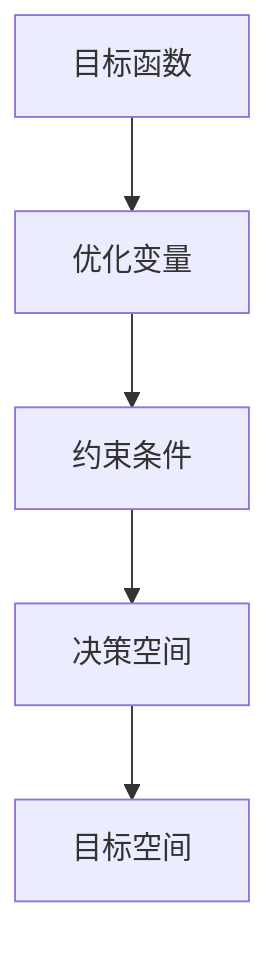
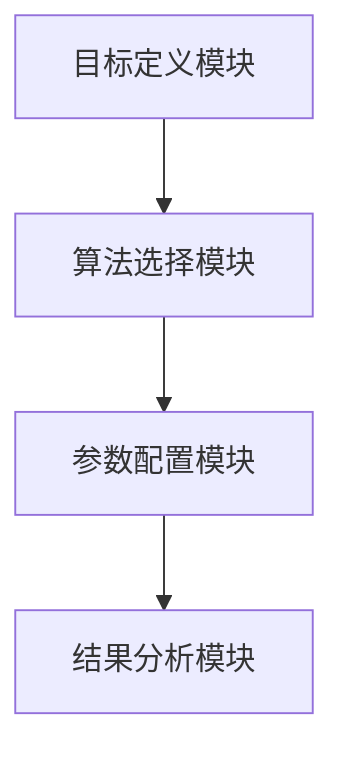
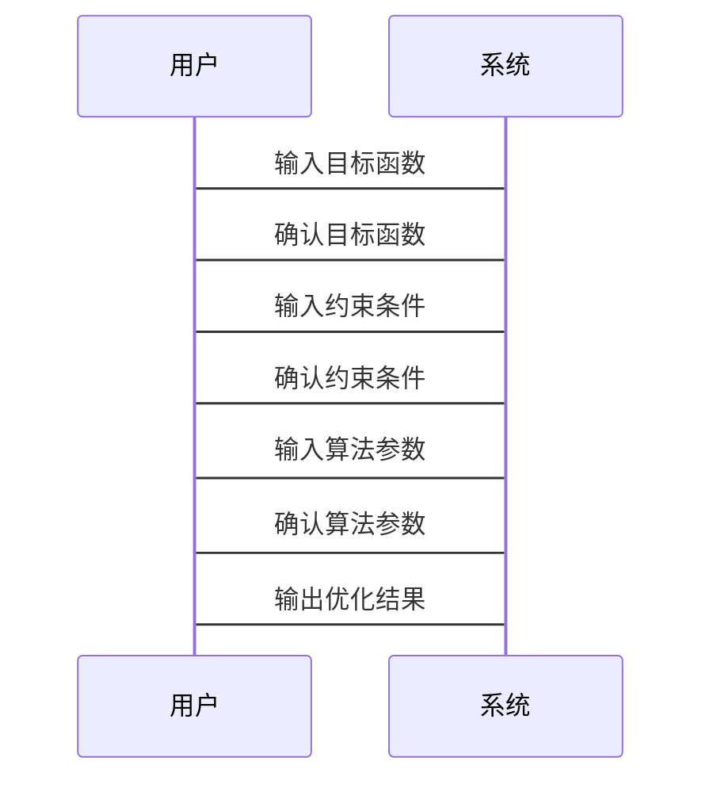

                 


# 多目标优化在AI Agent训练中的实践

> 关键词：多目标优化，AI Agent，机器学习，优化算法，人工智能  
> 摘要：本文深入探讨了多目标优化在AI Agent训练中的应用，从基本概念到算法原理，再到系统设计与实战案例，全面解析多目标优化在AI Agent训练中的实践与挑战。

---

## 第一部分: 多目标优化与AI Agent概述

### 第1章: 多目标优化与AI Agent的背景介绍

#### 1.1 多目标优化的基本概念
##### 1.1.1 问题背景与问题描述
在AI Agent的训练中，我们经常需要同时优化多个目标，例如在智能客服系统中，既要优化客户满意度，又要优化响应时间。这种多目标优化的问题在实际应用中非常常见，但如何在多个目标之间找到平衡点是一个复杂的问题。

##### 1.1.2 多目标优化的核心概念
多目标优化（Multi-Objective Optimization，MOO）是指在多个相互冲突的目标函数中找到最优解的过程。与单目标优化不同，多目标优化需要考虑多个目标之间的权衡，最终找到一组Pareto最优解。

##### 1.1.3 多目标优化的边界与外延
多目标优化的边界在于如何定义“最优”，以及如何处理目标之间的冲突。外延则包括了从理论研究到实际应用的广泛领域，例如机器学习、强化学习、运筹学等。

#### 1.2 多目标优化在AI Agent中的作用
##### 1.2.1 AI Agent的基本概念
AI Agent是一种能够感知环境并采取行动以实现目标的智能实体。AI Agent的核心能力在于其决策能力，而决策往往需要在多个目标之间进行权衡。

##### 1.2.2 多目标优化在AI Agent中的应用
在AI Agent的训练中，多目标优化可以用于任务分配、路径规划、资源分配等多个方面。例如，在自动驾驶中，AI Agent需要同时优化安全性、效率和舒适性。

##### 1.2.3 多目标优化与AI Agent的交互方式
多目标优化算法通常通过定义目标函数和约束条件来指导AI Agent的学习过程。AI Agent通过不断调整参数以优化多个目标函数，最终找到一组最优解。

### 第2章: 多目标优化的核心概念与联系

#### 2.1 多目标优化的原理
##### 2.1.1 多目标优化的数学模型
多目标优化的数学模型通常由目标函数、约束条件和决策变量组成。例如：
$$ \text{minimize } f_1(x) $$
$$ \text{minimize } f_2(x) $$
$$ \text{subject to } g_i(x) \leq 0, i=1,2,...,m $$
$$ \text{subject to } h_j(x) = 0, j=1,2,...,n $$

##### 2.1.2 Pareto前沿的概念
Pareto前沿是指在多目标优化中，一组解使得不存在其他解能够同时在所有目标上优于这些解。Pareto前沿上的解代表了最优的权衡。

##### 2.1.3 目标函数的权重分配
在多目标优化中，目标函数的权重分配是一个关键问题。通常可以通过加权和的方法将多个目标函数合并为一个单一的目标函数，例如：
$$ f(x) = \sum_{i=1}^k w_i f_i(x) $$

#### 2.2 多目标优化与单目标优化的对比
##### 2.2.1 核心原理对比
单目标优化仅优化一个目标函数，而多目标优化需要同时优化多个目标函数，并在多个目标之间进行权衡。

##### 2.2.2 优缺点分析
单目标优化的优点是简单高效，而缺点是无法处理多个目标之间的冲突。多目标优化的优点是可以同时优化多个目标，缺点是计算复杂度较高。

##### 2.2.3 应用场景对比
单目标优化适用于目标单一的场景，而多目标优化适用于目标复杂的场景，例如自动驾驶、智能客服等。

#### 2.3 多目标优化的ER实体关系图


---

## 第二部分: 多目标优化算法原理

### 第3章: 多目标优化算法概述

#### 3.1 常用多目标优化算法
##### 3.1.1 NSGA-II算法
NSGA-II（Non-dominated Sorting Genetic Algorithm II）是一种经典的多目标优化算法，通过非支配排序和拥挤度计算来逐步优化解集。

##### 3.1.2 MOEA/D算法
MOEA/D（Multi-objective Evolutionary Algorithm based on Decomposition）是一种基于分解的多目标优化算法，通过将问题分解为多个子问题来优化。

##### 3.1.3 基于分解的多目标优化算法
基于分解的方法将多目标优化问题分解为多个单目标子问题，通过求解这些子问题来获得Pareto最优解。

#### 3.2 算法选择与适用场景
##### 3.2.1 不同算法的优缺点分析
NSGA-II的优点是计算效率高，MOEA/D的优点是分解能力强，适合处理大规模问题。

##### 3.2.2 算法选择的依据
算法选择主要取决于问题的复杂度、目标数量以及约束条件等因素。

##### 3.2.3 实际应用中的注意事项
在实际应用中，需要注意算法的收敛性和多样性，避免解集过于集中或分散。

### 第4章: 多目标优化算法的数学模型

#### 4.1 基本数学模型
##### 4.1.1 多目标优化的数学表达
$$ \text{minimize } f_1(x) $$
$$ \text{minimize } f_2(x) $$
$$ \text{subject to } g_i(x) \leq 0, i=1,2,...,m $$
$$ \text{subject to } h_j(x) = 0, j=1,2,...,n $$

##### 4.1.2 Pareto最优解的定义
$$ x \in X \text{ 是 Pareto最优解当且仅当不存在 } x' \in X \text{ 使得 } f_i(x') \leq f_i(x) \text{ 对所有 } i \text{ 成立，且至少有一个 } i \text{ 使得 } f_i(x') < f_i(x) $$

#### 4.2 常用算法的数学模型
##### 4.2.1 NSGA-II算法的数学模型
NSGA-II通过非支配排序和拥挤度计算来优化解集，具体步骤如下：
1. 初始化种群。
2. 计算每个个体的适应度。
3. 非支配排序。
4. 计算拥挤度。
5. 选择、交叉和变异。
6. 重复步骤2-5，直到满足终止条件。

---

## 第三部分: 系统分析与架构设计

### 第4章: 系统分析与架构设计

#### 4.1 系统功能设计
##### 4.1.1 系统功能模块
多目标优化系统通常包括目标定义模块、算法选择模块、参数配置模块和结果分析模块。

##### 4.1.2 系统功能流程
1. 定义目标函数和约束条件。
2. 选择合适的多目标优化算法。
3. 配置算法参数。
4. 运行算法并获得Pareto最优解。
5. 分析结果并优化。

#### 4.2 系统架构设计
##### 4.2.1 系统架构图


#### 4.3 系统接口设计
##### 4.3.1 输入接口
多目标优化系统需要输入目标函数、约束条件和算法参数。

##### 4.3.2 输出接口
系统输出Pareto最优解和优化结果。

#### 4.4 系统交互流程
##### 4.4.1 系统交互序列图


---

## 第四部分: 项目实战

### 第5章: 项目实战

#### 5.1 环境配置
##### 5.1.1 环境需求
建议使用Python 3.8及以上版本，安装必要的库，例如numpy、pymoos、scipy等。

##### 5.1.2 环境搭建步骤
1. 安装Python。
2. 安装必要的库。
3. 配置开发环境。

#### 5.2 核心代码实现
##### 5.2.1 NSGA-II算法实现
```python
import numpy as np

def objective_function(x):
    # 定义目标函数
    return (x[0], x[1])

def constraint1(x):
    # 定义约束条件
    return x[0] + x[1] <= 1

def constraint2(x):
    # 定义约束条件
    return x[0] - x[1] >= 0

# 初始化种群
population = np.random.rand(100, 2)
# 计算目标函数值
fitness = np.array([objective_function(x) for x in population])
# 计算约束条件
feasible = np.all([constraint1(x) for x in population], axis=1) & np.all([constraint2(x) for x in population], axis=1)
```

##### 5.2.2 多目标优化算法实现
```python
from pymoo.algorithms.nsga2 import NSGA2
from pymoo.factory import get_problem
from pymoo.optimize import minimize

problem = get_problem("zdt1")
algorithm = NSGA2()
result = minimize(problem, algorithm, seed=1)
```

#### 5.3 实验验证
##### 5.3.1 实验设计
设计不同的实验场景，例如不同的目标函数和约束条件。

##### 5.3.2 实验结果
分析实验结果，验证算法的有效性和收敛性。

##### 5.3.3 实验结论
总结实验结果，提出改进建议。

---

## 第五部分: 总结与展望

### 第6章: 总结与展望

#### 6.1 总结
本文详细探讨了多目标优化在AI Agent训练中的应用，从基本概念到算法原理，再到系统设计与实战案例，全面解析了多目标优化在AI Agent训练中的实践与挑战。

#### 6.2 未来展望
未来的研究方向包括多目标优化算法的改进、多目标优化在复杂场景中的应用，以及多目标优化与机器学习的结合。

---

## 作者

作者：AI天才研究院/AI Genius Institute  
禅与计算机程序设计艺术 /Zen And The Art of Computer Programming

---

以上是《多目标优化在AI Agent训练中的实践》的技术博客文章的完整目录大纲和具体内容。

