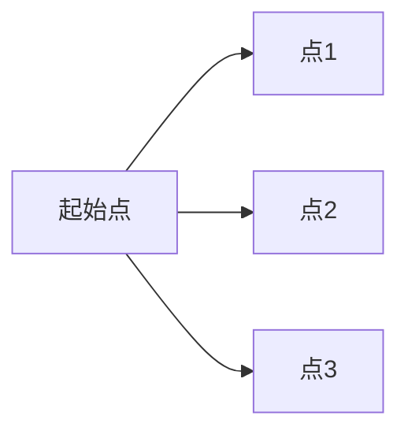
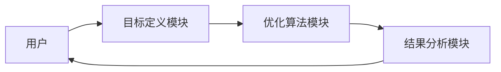

                 


# 多目标优化在AI Agent训练中的应用

> 关键词：多目标优化，AI Agent，优化算法，系统架构，强化学习

> 摘要：本文系统地探讨了多目标优化在AI Agent训练中的应用，从基础概念、算法原理到系统设计和实际案例，全面解析了如何通过多目标优化提升AI Agent的性能和智能水平。通过详细讲解数学模型、优化算法、系统架构设计和项目实战，本文为读者提供了一套完整的理论与实践相结合的方法论，帮助读者在复杂的多目标优化问题中找到最优解决方案。

---

# 第1章: 多目标优化与AI Agent基础

## 1.1 多目标优化的定义与特点
### 1.1.1 多目标优化的基本概念
多目标优化（Multi-objective Optimization，MOO）是指在优化过程中同时考虑多个目标函数的问题。与单目标优化不同，MOO需要在多个相互冲突的目标之间找到平衡点。

### 1.1.2 多目标优化的核心特点
- **目标多样性**：多个目标可能相互冲突，无法同时达到最优。
- **Pareto最优性**：在Pareto前沿上，任何点都无法在所有目标上同时优于另一个点。
- **权重分配**：目标之间的权重需要动态调整，以适应不同场景的需求。

### 1.1.3 多目标优化与单目标优化的对比
| 对比维度 | 单目标优化 | 多目标优化 |
|----------|-------------|-------------|
| 优化目标 | 单一目标函数 | 多个目标函数 |
| 解空间   | 单点解       | 多点解（Pareto前沿） |
| 算法复杂度 | 较低         | 较高         |

## 1.2 AI Agent的基本概念与分类
### 1.2.1 AI Agent的定义
AI Agent是一种智能实体，能够感知环境、自主决策并执行任务。它可以是一个软件程序或物理设备。

### 1.2.2 AI Agent的主要分类
- **简单反射型Agent**：基于当前状态做出反应，不依赖历史信息。
- **基于模型的反射型Agent**：利用内部模型和历史信息进行推理。
- **目标驱动型Agent**：根据目标选择行动。
- **效用驱动型Agent**：通过最大化效用来决策。

### 1.2.3 AI Agent的应用场景
- 智能助手（如Siri、Alexa）
- 自动驾驶系统
- 游戏AI
- 机器人控制

## 1.3 多目标优化在AI Agent中的应用背景
### 1.3.1 AI Agent训练中的多目标问题
AI Agent需要在多个目标之间找到平衡，例如：
- **准确性**：提高预测的准确性。
- **效率**：减少计算资源的消耗。
- **实时性**：保证快速响应。

### 1.3.2 多目标优化在AI Agent中的重要性
在复杂环境中，AI Agent需要同时优化多个目标，例如：
- **路径规划**：既要距离最短，又要避开障碍物。
- **资源分配**：既要最大化收益，又要最小化成本。

### 1.3.3 多目标优化与AI Agent结合的前景
随着AI技术的发展，多目标优化在AI Agent中的应用将更加广泛，特别是在自动驾驶、智能助手等领域。

## 1.4 本章小结
本章介绍了多目标优化的基本概念、特点，以及AI Agent的基本概念和分类。同时，还探讨了多目标优化在AI Agent中的应用背景及其重要性。

---

# 第2章: 多目标优化的核心概念与数学模型

## 2.1 多目标优化的数学模型
### 2.1.1 多目标优化问题的定义
多目标优化问题可以表示为：
$$ \text{minimize } f_1(x), f_2(x), \dots, f_n(x) $$
其中，$x$ 是决策变量，$f_i(x)$ 是目标函数。

### 2.1.2 多目标优化的数学表达式
- **决策变量**：$x = (x_1, x_2, \dots, x_d)$
- **目标函数**：$f_i: \mathbb{R}^d \rightarrow \mathbb{R}$，$i=1,2,\dots,n$
- **约束条件**：$g_j(x) \leq 0$，$j=1,2,\dots,m$

### 2.1.3 目标函数的权重分配
目标函数的权重可以通过以下方式分配：
$$ w_i = \frac{f_i(x)}{\sum_{i=1}^n f_i(x)} $$

## 2.2 多目标优化的 Pareto 前沿
### 2.2.1 Pareto 前沿的定义
Pareto前沿是指在多目标优化问题中，无法在所有目标上同时优于另一个点的解集。

### 2.2.2 Pareto 前沿的可视化
使用mermaid图表示Pareto前沿：


### 2.2.3 Pareto 前沿在AI Agent中的应用
- 在路径规划中，Pareto前沿可以帮助AI Agent找到最优路径。
- 在资源分配中，Pareto前沿可以帮助AI Agent找到最佳分配方案。

## 2.3 多目标优化的算法原理
### 2.3.1 常见多目标优化算法概述
- **NSGA-II**：非支配排序遗传算法
- **MOEA/D**：分解多目标优化算法
- ** SPEA2**：强分式进化算法

### 2.3.2 NSGA-II算法的原理
NSGA-II算法的流程如下：
1. 初始化种群。
2. 计算每个个体的适应度。
3. 进行非支配排序。
4. 执行交叉和变异操作。
5. 选择新种群。

### 2.3.3 多目标优化算法的优缺点对比
| 算法 | 优点 | 缺点 |
|------|------|------|
| NSGA-II | 解集多样性高 | 计算复杂度高 |
| MOEA/D | 计算效率高 | 解集多样性较低 |

## 2.4 本章小结
本章详细讲解了多目标优化的核心概念与数学模型，并介绍了几种常用的多目标优化算法及其原理。

---

# 第3章: 多目标优化在AI Agent训练中的系统分析

## 3.1 系统架构设计
### 3.1.1 系统功能模块
- **目标定义模块**：定义多个目标函数。
- **优化算法模块**：实现多目标优化算法。
- **结果分析模块**：分析Pareto前沿。

### 3.1.2 系统架构图
使用mermaid图表示系统架构：


### 3.1.3 接口设计
- **输入接口**：接收目标函数和约束条件。
- **输出接口**：输出Pareto前沿和最优解。

## 3.2 系统交互流程
### 3.2.1 交互流程图
使用mermaid图表示系统交互流程：


### 3.2.2 交互过程
1. 用户定义目标函数和约束条件。
2. 目标定义模块将目标传递给优化算法模块。
3. 优化算法模块计算Pareto前沿。
4. 结果分析模块将结果反馈给用户。

## 3.3 本章小结
本章详细探讨了多目标优化在AI Agent训练中的系统架构设计和交互流程。

---

# 第4章: 多目标优化在AI Agent训练中的项目实战

## 4.1 环境安装
- **Python版本**：3.8以上
- **依赖库**：numpy、pymoo、matplotlib

## 4.2 核心代码实现
### 4.2.1 定义目标函数
```python
def f1(x):
    return x**2

def f2(x):
    return (x - 2)**2
```

### 4.2.2 实现NSGA-II算法
```python
from pymoo.algorithms.nsga2 import NSGA2
from pymoo.problems import Problem

class MyProblem(Problem):
    def __init__(self):
        super().__init__(n_var=1, n_obj=2, n_constr=0)
    
    def _evaluate(self, x):
        f1 = x**2
        f2 = (x - 2)**2
        return f1, f2

problem = MyProblem()
algorithm = NSGA2()
```

### 4.2.3 分析结果
```python
from pymoo.visualization.pareto import plot

plot(problem, algorithm, show=True)
```

## 4.3 案例分析
### 4.3.1 案例背景
假设我们需要训练一个AI Agent，在路径规划中同时优化距离和时间。

### 4.3.2 实施步骤
1. 定义目标函数。
2. 实现NSGA-II算法。
3. 分析Pareto前沿。

### 4.3.3 分析结果
通过分析Pareto前沿，我们可以找到最优路径。

## 4.4 本章小结
本章通过实际案例，详细讲解了如何将多目标优化应用于AI Agent的训练中。

---

# 第5章: 最佳实践与总结

## 5.1 最佳实践
### 5.1.1 算法选择
- 根据问题规模选择合适的算法。
- NSGA-II适用于大多数场景。

### 5.1.2 系统设计
- 明确目标函数和约束条件。
- 设计合理的系统架构。

## 5.2 小结
通过本文的讲解，读者可以全面了解多目标优化在AI Agent训练中的应用，并能够将其应用于实际项目中。

## 5.3 注意事项
- 多目标优化问题需要动态调整目标权重。
- 在实际应用中，需要考虑计算资源的限制。

## 5.4 拓展阅读
- 《多目标优化算法与应用》
- 《AI Agent设计与实现》

---

# 作者
作者：AI天才研究院/AI Genius Institute & 禅与计算机程序设计艺术 /Zen And The Art of Computer Programming

