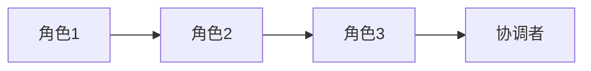
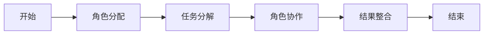
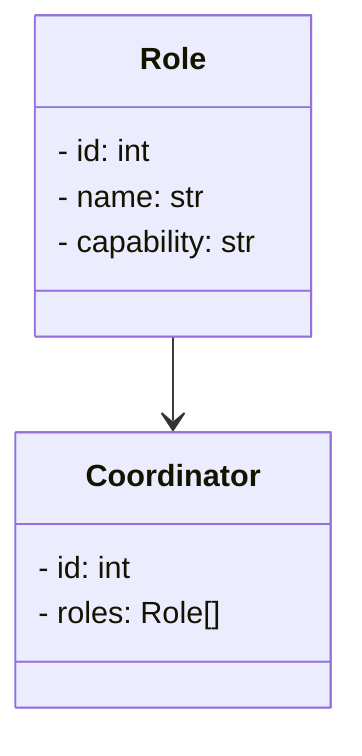
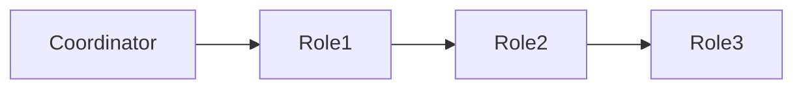
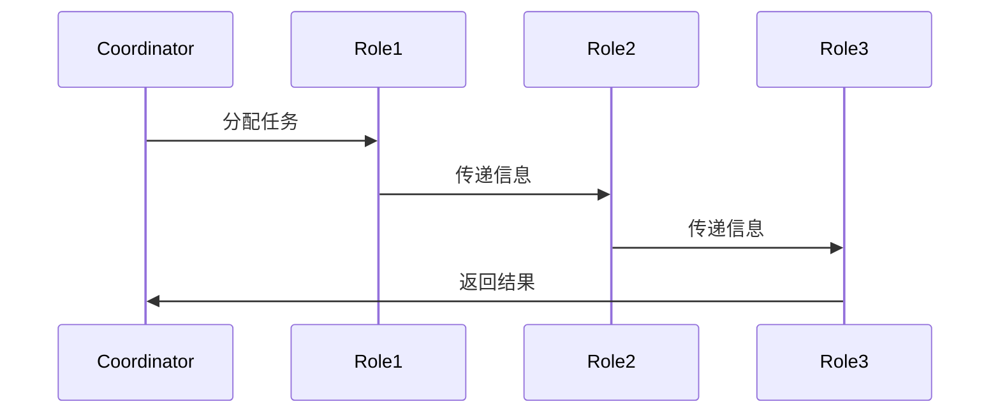

                 


# 多角色扮演AI Agent：基于LLM的复杂场景模拟

## 关键词：多角色扮演、AI Agent、LLM、复杂场景模拟、算法原理、系统架构、项目实战

## 摘要：  
本文深入探讨了多角色扮演AI Agent的实现与应用，基于大语言模型（LLM）的复杂场景模拟技术。文章首先介绍了多角色协作的基本概念与背景，然后详细分析了多角色协作的协议与通信机制，接着讲解了基于LLM的算法原理，包括数学模型与公式。随后，文章从系统分析与架构设计的角度，探讨了问题场景、系统功能设计、架构图与接口设计。最后，通过项目实战部分，展示了环境安装、核心代码实现与实际案例分析。本文旨在为读者提供一个多角色扮演AI Agent的全面技术指南，帮助读者理解其原理、实现与应用。

---

# 第1章: 多角色扮演AI Agent的背景与概念

## 1.1 多角色协作的基本概念  
多角色协作是指在AI Agent之间通过分工合作完成复杂任务的过程。每个角色都有特定的职责和能力，通过协调与配合完成目标。  

### 1.1.1 多角色协作的定义与特点  
- **定义**：多角色协作是指多个AI Agent通过交互与协作完成单一AI Agent无法完成的任务。  
- **特点**：  
  - 分工明确：每个角色专注于特定任务。  
  - 协调性：角色之间通过通信机制实现信息共享与任务分配。  
  - 灵活性：能够根据场景动态调整协作策略。  

### 1.1.2 多角色协作的核心要素  
- **角色分配**：根据任务需求分配角色。  
- **任务分解**：将复杂任务分解为多个子任务。  
- **协作机制**：角色之间的通信与协调方式。  

---

## 1.2 多角色协作的背景与问题背景  

### 1.2.1 多角色协作的背景介绍  
随着AI技术的快速发展，单一AI Agent的能力已无法满足复杂场景的需求。多角色协作通过分工合作，能够更高效地完成复杂任务。  

### 1.2.2 多角色协作的问题背景  
- **问题描述**：单一AI Agent难以应对复杂场景中的多样化需求。  
- **解决方法**：通过多角色协作，提升AI Agent的综合能力。  
- **边界与外延**：多角色协作的边界在于任务的复杂性，外延则包括不同领域与场景的应用。  

---

## 1.3 多角色协作的核心概念与联系  

### 1.3.1 多角色协作的核心概念  
- **角色**：具有特定功能与能力的AI Agent。  
- **协作**：角色之间的交互与合作。  
- **协调者**：负责任务分配与监控的角色。  

### 1.3.2 多角色协作的实体关系图  


### 1.3.3 多角色协作的流程图  


---

# 第2章: 多角色协作的协议与通信机制  

## 2.1 多角色协作的协议设计  

### 2.1.1 协议设计的基本原则  
- **明确性**：协议必须清晰明了。  
- **可扩展性**：能够适应不同场景的需求。  
- **简洁性**：协议设计应尽量简洁。  

### 2.1.2 协议设计的核心要素  
- **任务分配**：确定每个角色的职责。  
- **信息共享**：角色之间共享必要信息。  
- **冲突解决**：处理协作中的冲突与矛盾。  

---

## 2.2 多角色协作的通信机制  

### 2.2.1 通信机制的定义与特点  
- **定义**：角色之间通过某种方式传递信息的过程。  
- **特点**：实时性、可靠性与安全性。  

### 2.2.2 通信机制的设计原则  
- **实时性**：确保信息传递的及时性。  
- **可靠性**：保证信息传递的准确性。  
- **安全性**：防止信息泄露与篡改。  

---

## 2.3 多角色协作的协议与通信的对比分析  

### 2.3.1 协议与通信的异同点  
| 特性 | 协议 | 通信 |
|------|------|------|
| 定义 | 规则与标准 | 信息传递方式 |
| 目标 | 确保协作顺利 | 确保信息准确传递 |
| 依赖 | 协议设计 | 通信机制 |

### 2.3.2 协议与通信的优缺点  
- **协议**：优点是规范性强，缺点是灵活性不足。  
- **通信**：优点是实时性强，缺点是可能受到网络条件限制。  

### 2.3.3 协议与通信的适用场景  
- **协议**：适用于需要严格规范的场景。  
- **通信**：适用于需要快速响应的场景。  

---

# 第3章: 多角色协作的算法原理  

## 3.1 多角色协作的基本算法  

### 3.1.1 基于LLM的多角色协作算法  
- **定义**：利用大语言模型（LLM）进行任务分解与角色分配。  
- **流程**：  
  1. 分析任务需求。  
  2. 分解任务为多个子任务。  
  3. 分配子任务给不同角色。  
  4. 角色协作完成任务。  

### 3.1.2 基于强化学习的多角色协作算法  
- **定义**：通过强化学习训练角色的协作策略。  
- **流程**：  
  1. 初始化角色策略。  
  2. 通过环境反馈优化策略。  
  3. 重复训练直到收敛。  

### 3.1.3 基于图神经网络的多角色协作算法  
- **定义**：利用图神经网络建模角色之间的关系。  
- **流程**：  
  1. 构建角色关系图。  
  2. 通过图神经网络进行信息传播。  
  3. 输出协作结果。  

---

## 3.2 多角色协作的数学模型  

### 3.2.1 基于LLM的数学模型  
$$P(y|x) = \frac{P(y,z|x)}{P(z|x)}$$  

### 3.2.2 基于强化学习的数学模型  
$$R = \sum_{t=1}^{T} r_t$$  

### 3.2.3 基于图神经网络的数学模型  
$$H = G \cdot X$$  

---

## 3.3 多角色协作算法的实现  

### 3.3.1 基于LLM的代码实现  
```python
def decompose_task(task):
    # 分解任务为子任务
    sub_tasks = []
    for role in roles:
        sub_tasks.append(role.specialize(task))
    return sub_tasks
```

### 3.3.2 基于强化学习的代码实现  
```python
def train_agent(agent, env):
    # 强化学习训练过程
    for episode in range(num_episodes):
        state = env.reset()
        while not done:
            action = agent.act(state)
            next_state, reward, done = env.step(action)
            agent.learn(state, action, reward, next_state)
```

---

## 3.3.3 基于图神经网络的代码实现  
```python
def graph_model():
    # 图神经网络模型
    import tensorflow as tf
    from tensorflow.keras import layers
    inputs = layers.Input(shape=(input_dim,))
    hidden = layers.Dense(64, activation='relu')(inputs)
    outputs = layers.Dense(output_dim, activation='softmax')(hidden)
    model = tf.keras.Model(inputs=inputs, outputs=outputs)
    return model
```

---

# 第4章: 多角色协作的系统分析与架构设计  

## 4.1 问题场景介绍  
多角色协作的复杂场景模拟需要解决角色分配、任务分解与协作过程中的通信问题。  

---

## 4.2 系统功能设计  

### 4.2.1 领域模型  


---

## 4.3 系统架构设计  

### 4.3.1 系统架构图  


### 4.3.2 接口设计  
- **输入接口**：接收任务需求。  
- **输出接口**：返回协作结果。  

### 4.3.3 交互流程图  


---

## 4.4 项目实战  

### 4.4.1 环境安装  
- **Python 3.8+**  
- **TensorFlow或PyTorch**  
- **Mermaid图生成工具**  

### 4.4.2 系统核心实现  

#### 4.4.2.1 任务分解代码  
```python
def decompose_task(task):
    sub_tasks = []
    for role in roles:
        sub_tasks.append(role.specialize(task))
    return sub_tasks
```

#### 4.4.2.2 角色协作代码  
```python
def coordinate(roles, task):
    sub_tasks = decompose_task(task)
    results = []
    for role, sub_task in zip(roles, sub_tasks):
        results.append(role.execute(sub_task))
    return combine_results(results)
```

---

## 4.4.3 实际案例分析  
案例：多角色协作完成一个复杂客服任务。  

### 4.4.4 项目小结  
通过实际案例分析，展示了多角色协作在复杂场景中的应用价值。  

---

# 第5章: 总结与展望  

## 5.1 总结  
本文全面探讨了多角色扮演AI Agent的实现与应用，基于LLM的复杂场景模拟技术。通过系统分析与项目实战，展示了多角色协作在实际中的应用价值。  

## 5.2 未来展望  
未来，多角色协作AI Agent将在更多领域得到应用，算法与架构设计也将更加智能化与高效化。  

---

# 作者：AI天才研究院 & 禅与计算机程序设计艺术

